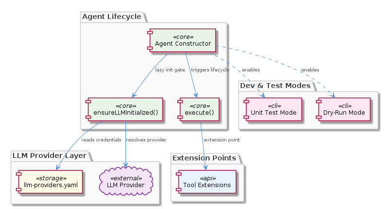
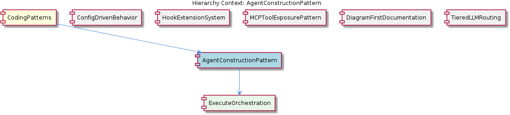

# AgentConstructionPattern

**Type:** SubComponent

integrations/mcp-server-semantic-analysis/docs/configuration.md specifies that LLM provider credentials are resolved inside ensureLLMInitialized() by reading config/llm-providers.yaml, decoupling agent construction from environment state

# AgentConstructionPattern — Technical Insight Document

## What It Is

The `AgentConstructionPattern` is a SubComponent documented primarily in `integrations/mcp-server-semantic-analysis/docs/architecture/agents.md`, with supporting design rationale captured in `integrations/mcp-server-semantic-analysis/docs/architecture/README.md` and `integrations/mcp-server-semantic-analysis/docs/configuration.md`. It defines the canonical three-phase lifecycle that every agent in the semantic analysis MCP server follows: **constructor → lazy-init → execute()**. This pattern deliberately replaces eager initialization at import time, ensuring that constructing an agent is a cheap, side-effect-free operation that does not require an active LLM connection or environment configuration to succeed.

As a child of the broader `CodingPatterns` aggregate, `AgentConstructionPattern` is one of several codified conventions (alongside siblings like `ConfigDrivenBehavior`, `HookExtensionSystem`, `MCPToolExposurePattern`, `DiagramFirstDocumentation`, and `TieredLLMRouting`) that together establish the project's architectural discipline. Where `ConfigDrivenBehavior` externalizes behavioral parameters into JSON/YAML files, this pattern externalizes *initialization timing*, deferring expensive provider setup until the moment it is actually needed.

The pattern's centrality is underscored by `integrations/mcp-server-semantic-analysis/CRITICAL-ARCHITECTURE-ISSUES.md` (now marked RESOLVED), which previously documented that bypassing `ensureLLMInitialized()` caused runtime failures. That history confirms `ensureLLMInitialized()` as the **single gate** through which provider readiness must flow.

## Architecture and Design

The architectural approach is best characterized as a **deferred initialization (lazy) pattern** layered over a **template method lifecycle**. The constructor establishes only the structural identity of an agent — its configuration handles, references to dependencies, and internal state placeholders — without reaching out to external systems. The lazy-init phase, gated by `ensureLLMInitialized()`, performs the heavyweight work of resolving credentials and binding to an LLM provider. Finally, `execute()` represents the actual operational interface, which is documented as the child SubComponent `ExecuteOrchestration` in `integrations/mcp-server-semantic-analysis/docs/architecture/agents.md`.

This separation is more than stylistic: it reflects a deliberate decoupling of *agent identity* from *agent runtime readiness*. Because `ensureLLMInitialized()` reads `config/llm-providers.yaml` only at the moment it is called (as specified in `integrations/mcp-server-semantic-analysis/docs/configuration.md`), construction is fully decoupled from environment state. An agent can therefore be instantiated in environments where no LLM credentials exist — a property that `integrations/mcp-server-semantic-analysis/docs/architecture/README.md` explicitly cites as enabling unit testing and dry-run modes.

The pattern also functions as an **extension contract**. According to `integrations/mcp-server-semantic-analysis/docs/architecture/tools.md`, Tool Extensions plug into the `execute()` phase, which means the lifecycle's third stage is not just a method but a documented integration seam for instrumentation, monitoring, and capability augmentation. This dovetails with the sibling `HookExtensionSystem`, which similarly intercepts tool-call boundaries.

## Implementation Details

The three phases each have distinct responsibilities and constraints:

1. **Constructor** — Performs no I/O, no network calls, and no credential resolution. It accepts configuration references and stores them. This guarantees that instantiating an agent is always safe and predictable, regardless of runtime environment.

2. **Lazy-init via `ensureLLMInitialized()`** — This is the single, authoritative gate for provider readiness. Internally, it reads `config/llm-providers.yaml` to resolve which provider, model tier, and credentials apply. Crucially, the RESOLVED issue in `CRITICAL-ARCHITECTURE-ISSUES.md` establishes that **any code path that bypasses this method will fail at runtime** — there is no fallback initialization. This makes the method both the contract and the enforcement mechanism for LLM readiness.

3. **`execute()`** — The operational entry point, formalized as the `ExecuteOrchestration` child SubComponent. It assumes `ensureLLMInitialized()` has been (or will be) invoked and provides the standard interface that all agents expose for triggering analysis or processing work. It is also the documented hook point for Tool Extensions per `tools.md`.

The pattern intentionally avoids spreading initialization logic across multiple methods or relying on import-time side effects. By concentrating provider resolution in `ensureLLMInitialized()` and treating it as idempotent, the codebase achieves a clean invariant: every agent, regardless of subclass, has exactly the same readiness semantics.

## Integration Points

`AgentConstructionPattern` integrates with several adjacent subsystems. Most directly, it consumes `config/llm-providers.yaml`, which connects it to the sibling `ConfigDrivenBehavior` pattern — the same externalized-configuration philosophy that the parent `CodingPatterns` aggregate enforces project-wide. It also interacts with `TieredLLMRouting` (also a sibling under `CodingPatterns`), because the provider/model selection performed inside `ensureLLMInitialized()` is the point at which tiered routing decisions take effect for a given agent instance.

The `execute()` phase, embodied by the child `ExecuteOrchestration`, is the integration surface for Tool Extensions described in `integrations/mcp-server-semantic-analysis/docs/architecture/tools.md`. This means instrumentation, observability, and capability layers do not modify the agent itself — they attach to the lifecycle's third phase. This is conceptually parallel to how `HookExtensionSystem` (described in `integrations/mcp-constraint-monitor/docs/CLAUDE-CODE-HOOK-FORMAT.md`) intercepts tool-call boundaries via a structured JSON payload contract.

Finally, the pattern enables unit testing and dry-run modes as a first-class integration point. Because construction does not require an LLM connection, test harnesses can instantiate agents directly and either mock `ensureLLMInitialized()` or skip it entirely, depending on whether the test exercises real provider behavior.

## Usage Guidelines

Developers extending or working with agents in `integrations/mcp-server-semantic-analysis/` should observe the following conventions:

- **Never perform I/O in an agent constructor.** Constructors must remain cheap and deterministic. Any code that needs network access, file reads of credentials, or provider connections belongs inside `ensureLLMInitialized()`.
- **Always route provider readiness through `ensureLLMInitialized()`.** As confirmed by the RESOLVED `CRITICAL-ARCHITECTURE-ISSUES.md`, bypassing this gate causes runtime failures. There is no supported alternative path to provider initialization.
- **Treat `ensureLLMInitialized()` as idempotent.** It can be safely called multiple times; the lifecycle does not require callers to track whether initialization has already occurred.
- **Add LLM provider configuration to `config/llm-providers.yaml`, not to source code.** This preserves the decoupling between agent construction and environment state and aligns with the parent `CodingPatterns` philosophy of externalized configuration.
- **Use the constructor + lazy-init split to enable testability.** Instantiate agents directly in unit tests without requiring credentials, and only invoke `ensureLLMInitialized()` when testing provider-dependent behavior.
- **When adding instrumentation or extensions, attach to the `execute()` phase (i.e., `ExecuteOrchestration`).** This is the documented extension seam per `tools.md`; do not splice logic into the constructor or the lazy-init gate.

---

### Summary of Architectural Findings

1. **Architectural patterns identified**: Deferred (lazy) initialization, template method lifecycle (constructor → lazy-init → execute), single-gate enforcement (`ensureLLMInitialized()`), and lifecycle-as-extension-point.

2. **Design decisions and trade-offs**: The decision to defer LLM initialization trades a small amount of runtime branching (checking readiness) for substantial gains in testability, dry-run support, and decoupling from environment state. The single-gate design trades flexibility (no alternative init paths) for a strong correctness invariant.

3. **System structure insights**: The pattern enforces uniform readiness semantics across all agents, making the agent layer predictable and composable. It also creates a clean seam between identity (construction) and capability (execution), with the child `ExecuteOrchestration` serving as the documented integration surface.

4. **Scalability considerations**: Lazy initialization scales well because agent instantiation is cheap — many agents can be constructed without consuming provider connections or credentials. Provider resolution happens just-in-time, allowing tiered routing (via the sibling `TieredLLMRouting`) to make context-aware decisions per instance.

5. **Maintainability assessment**: High. The pattern is documented in multiple architecture files (`agents.md`, `README.md`, `configuration.md`, `tools.md`), enforces a single point of change for provider logic (`ensureLLMInitialized()`), and externalizes provider configuration to `config/llm-providers.yaml`. The RESOLVED status of `CRITICAL-ARCHITECTURE-ISSUES.md` further indicates that the invariants are now actively guarded rather than aspirational.

## Hierarchy Context

### Parent
- [CodingPatterns](./CodingPatterns.md) -- [LLM] **Externalized Configuration as Runtime Behavior Control**: The project enforces a strict separation between behavior and code through a suite of JSON/YAML configuration files under config/. Files such as config/agent-profiles.json, config/health-verification-rules.json, config/llm-providers.yaml, config/knowledge-management.json, and config/hooks-config.json collectively replace what would otherwise be scattered hard-coded logic. A new developer should understand that adding a new agent profile, adjusting an LLM provider's model tier, or modifying a health rule does not require touching TypeScript or Python source files — only the relevant config file. This pattern means that operational changes (e.g., switching a task class from a lightweight to a heavyweight model, or disabling a health rule during an incident) are achievable at runtime or deploy time without code review cycles. The convention also implies that any new subsystem added to the project is expected to declare its configurable parameters in a corresponding config file rather than using environment variables alone or embedding defaults in source.

### Children
- [ExecuteOrchestration](./ExecuteOrchestration.md) -- Documented in integrations/mcp-server-semantic-analysis/docs/architecture/agents.md, `execute()` is the third phase of the agent lifecycle (after constructor and lazy-init), representing the standard interface all agents expose for triggering their analysis or processing work.

### Siblings
- [ConfigDrivenBehavior](./ConfigDrivenBehavior.md) -- config/agent-profiles.json defines per-agent behavioral parameters (e.g., which LLM tier to use, concurrency limits) so adding a new agent type requires only a new JSON entry, not a code change
- [HookExtensionSystem](./HookExtensionSystem.md) -- integrations/mcp-constraint-monitor/docs/CLAUDE-CODE-HOOK-FORMAT.md specifies the exact JSON payload format that hooks emit on each tool call entry and exit, defining the contract between agents and monitors
- [MCPToolExposurePattern](./MCPToolExposurePattern.md) -- integrations/code-graph-rag/README.md describes the code-graph-rag system exposing its graph query capabilities as MCP tools, not as a Python library import or REST API
- [DiagramFirstDocumentation](./DiagramFirstDocumentation.md) -- docs/puml/_standard-style.puml provides shared color palette, font, and stereotype definitions imported by all other diagrams, ensuring visual consistency across subsystem diagrams
- [TieredLLMRouting](./TieredLLMRouting.md) -- integrations/mcp-server-semantic-analysis/docs/TIERED-MODEL-PROPOSAL.md formally proposes and documents the tiered model selection approach, classifying tasks into complexity buckets before provider assignment

---

*Generated from 5 observations*
