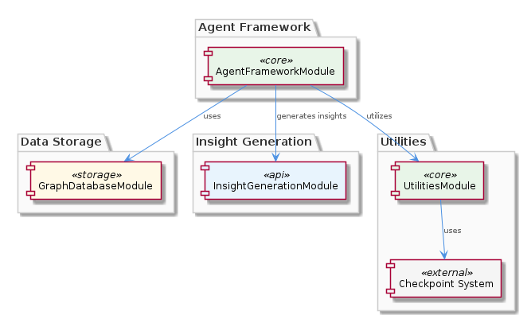
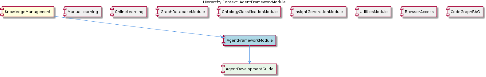

# AgentFrameworkModule

**Type:** SubComponent

AgentFrameworkModule uses the agent development guide in integrations/copi/docs/hooks.md to provide a framework for agent development.

## What It Is  

The **AgentFrameworkModule** lives inside the **KnowledgeManagement** component and is the core sub‑component that supplies a structured framework for building and running autonomous agents. Its primary reference material is the *Agent Development Guide* located at `integrations/copi/docs/hooks.md`, which defines the hook functions agents must implement. By pulling in this guide, the module standardises how agents are authored, how they interact with the underlying knowledge graph, and how they report progress. The framework does not exist in isolation – it leans on the **GraphDatabaseModule** for persistent storage of agent state, calls the **InsightGenerationModule** to turn raw agent data into actionable insights, and re‑uses utility code (including the checkpoint system) from the **UtilitiesModule**. In short, AgentFrameworkModule is the orchestrator that binds together agent‑specific logic, data persistence, insight extraction, and cross‑cutting utilities within the broader KnowledgeManagement ecosystem.

## Architecture and Design  

AgentFrameworkModule follows a **modular component architecture** in which each responsibility is delegated to a dedicated sibling module. The module itself is thin; it primarily coordinates calls between its children (the hook definitions) and its peers. This design is evident from the observation that the framework “relies on the GraphDatabaseModule to store and query agent data” and “interacts with the InsightGenerationModule to generate insights from agent data.” The presence of a dedicated **UtilitiesModule** for shared functions—particularly the checkpoint system—shows a clear separation of cross‑cutting concerns from core agent logic.  

The architecture diagram (shown below) illustrates this layered arrangement: the AgentFrameworkModule sits at the centre of the KnowledgeManagement hierarchy, with direct lines to the GraphDatabaseModule, InsightGenerationModule, and UtilitiesModule.  

The relationship diagram further clarifies the parent‑child and sibling links, highlighting that **AgentDevelopmentGuide** (the hooks file) is a child of the framework, while **KnowledgeManagement** is its parent.  

Because the module does not embed its own persistence layer, it benefits from the **GraphDatabaseAdapter** implementation that lives in the parent component (see the parent description). This delegation reduces duplication and aligns the agent storage format with the rest of the system’s Graphology + LevelDB knowledge graph.

## Implementation Details  

The only concrete artifact referenced for implementation is the **Agent Development Guide** at `integrations/copi/docs/hooks.md`. This markdown file enumerates the hook functions—such as `onStart`, `onStep`, `onComplete`, and `onError`—that every agent must expose. The framework likely loads this guide at runtime (or during a build step) to validate that an agent implements the required signatures.  

When an agent invokes a hook that modifies its internal state, the framework forwards the change to the **GraphDatabaseModule**, which uses the shared **GraphDatabaseAdapter** to persist the update in the central Graphology + LevelDB store. Queries from agents (e.g., fetching related entities or historical actions) are also routed through the same adapter, ensuring a consistent query surface across all components.  

Insight generation is triggered after key checkpoints. The framework calls the **InsightGenerationModule**, which, per the sibling description, consumes the **UKB trace report** from the **UtilitiesModule**. The trace report aggregates execution metadata (timestamps, decision paths, resource usage) that the InsightGenerationModule transforms into higher‑level observations—such as performance bottlenecks or knowledge gaps.  

Finally, the **checkpoint system** from UtilitiesModule is woven into the agent lifecycle. Each checkpoint records the agent’s progress (e.g., step number, success flag) and persists it via the GraphDatabaseModule. This enables resumable execution and auditability, essential for long‑running or iterative agents.

## Integration Points  

AgentFrameworkModule’s integration surface is defined by three explicit dependencies:

1. **GraphDatabaseModule** – Provides the `GraphDatabaseAdapter` interface for all CRUD operations on agent data. The framework does not manage storage directly; it delegates every persistence call to this module, guaranteeing data consistency with the rest of KnowledgeManagement.  

2. **InsightGenerationModule** – Consumes the UKB trace report (produced by UtilitiesModule) to synthesize insights. The framework supplies the raw trace payload whenever an agent reaches a checkpoint or completes a task.  

3. **UtilitiesModule** – Supplies generic helpers, notably the checkpoint system and the UKB trace report generator. These utilities are used by the framework to record progress and to package execution metadata for downstream insight processing.  

Because the module is a child of **KnowledgeManagement**, it also inherits any global configuration (e.g., database connection strings, logging policies) defined at the parent level. Sibling modules such as **OntologyClassificationModule** or **OnlineLearning** do not interact directly with AgentFrameworkModule, but they share the same underlying graph store, meaning that agents can query ontology classifications or learning artefacts without additional integration work.

## Usage Guidelines  

Developers creating new agents should start by consulting the **Agent Development Guide** (`integrations/copi/docs/hooks.md`). All agent classes must implement the prescribed hook functions with the exact signatures; deviations will be flagged during validation.  

When an agent needs to persist state, it should call the framework‑exposed persistence API, which internally forwards the request to the GraphDatabaseModule. Direct use of the GraphDatabaseAdapter is discouraged to keep the coupling loose and to allow future changes to the storage backend without touching agent code.  

For any long‑running process, developers must invoke the checkpoint API supplied by the UtilitiesModule at logical boundaries (e.g., after each major decision). This ensures that the InsightGenerationModule receives a complete trace report and can generate meaningful insights.  

Finally, agents should treat the InsightGenerationModule as a read‑only consumer: they send trace data but do not depend on the insights for core functionality. This separation prevents circular dependencies and keeps the agent’s execution path deterministic.  

---

### Architectural Patterns Identified  

* **Modular Component Architecture** – Clear separation of concerns across sibling modules.  
* **Facade/Orchestration Pattern** – AgentFrameworkModule acts as a façade that coordinates persistence, utilities, and insight generation.  
* **Hook‑Based Extension** – Agents plug into the system via defined hook functions from the Agent Development Guide.  

### Design Decisions and Trade‑offs  

* **Delegating Persistence** to GraphDatabaseModule reduces duplication but adds a runtime dependency; any change in the graph schema requires coordinated updates across agents.  
* **Using a Checkpoint System** provides resumability and auditability at the cost of additional I/O on each checkpoint.  
* **Separating Insight Generation** keeps the agent core lightweight, but it introduces eventual consistency—insights are produced after checkpoints, not in real time.  

### System Structure Insights  

The module sits centrally within KnowledgeManagement, acting as the glue between agent logic, data storage, and insight pipelines. Its child component (AgentDevelopmentGuide) defines the contract, while its siblings provide the concrete services it consumes.  

### Scalability Considerations  

Because all agent state funnels through the shared GraphDatabaseAdapter, the scalability of AgentFrameworkModule is bounded by the performance of the underlying Graphology + LevelDB graph database. Horizontal scaling can be achieved by sharding the graph or by adding read‑replicas, but agents must be aware of potential latency when persisting checkpoints. The checkpoint system’s lightweight JSON payloads help mitigate overhead.  

### Maintainability Assessment  

The strict separation of responsibilities—hooks in a markdown guide, persistence in GraphDatabaseModule, utilities in UtilitiesModule—makes the codebase highly maintainable. Updating the hook contract only requires changes to the guide and corresponding validation logic; storage changes are isolated to the GraphDatabaseAdapter. However, the reliance on external modules means that breaking changes in a sibling (e.g., a new API in InsightGenerationModule) could ripple into the framework, so versioned interfaces and thorough integration tests are essential.

## Hierarchy Context

### Parent
- [KnowledgeManagement](./KnowledgeManagement.md) -- [LLM] The KnowledgeManagement component utilizes a GraphDatabaseAdapter for persistence, which is implemented in the file integrations/mcp-server-semantic-analysis/src/storage/graph-database-adapter.ts. This adapter provides an interface for agents to interact with the central Graphology + LevelDB knowledge graph. The adapter also includes automatic JSON export sync, ensuring that the knowledge graph remains up-to-date. Furthermore, the migrateGraphDatabase script, located in scripts/migrate-graph-db-entity-types.js, is used to update entity types in the live LevelDB/Graphology database, demonstrating a clear focus on data consistency and integrity.

### Children
- [AgentDevelopmentGuide](./AgentDevelopmentGuide.md) -- The integrations/copi/docs/hooks.md file provides a reference for hook functions used in agent development.

### Siblings
- [ManualLearning](./ManualLearning.md) -- ManualLearning relies on the migrateGraphDatabase script in scripts/migrate-graph-db-entity-types.js to update entity types in the live LevelDB/Graphology database.
- [OnlineLearning](./OnlineLearning.md) -- OnlineLearning uses the Code Graph RAG system in integrations/code-graph-rag to extract knowledge from codebases.
- [GraphDatabaseModule](./GraphDatabaseModule.md) -- GraphDatabaseModule uses the GraphDatabaseAdapter to interact with the Graphology + LevelDB knowledge graph.
- [OntologyClassificationModule](./OntologyClassificationModule.md) -- OntologyClassificationModule uses the OntologySystem to classify entities based on their types and properties.
- [InsightGenerationModule](./InsightGenerationModule.md) -- InsightGenerationModule uses the UKB trace report from the UtilitiesModule to generate insights.
- [UtilitiesModule](./UtilitiesModule.md) -- UtilitiesModule uses the checkpoint system to track progress and ensure data consistency.
- [BrowserAccess](./BrowserAccess.md) -- BrowserAccess uses the browser access guide in integrations/browser-access/README.md to provide browser access to the MCP server.
- [CodeGraphRAG](./CodeGraphRAG.md) -- CodeGraphRAG uses the code-graph-rag guide in integrations/code-graph-rag/README.md to provide a graph-based RAG system.

---

*Generated from 5 observations*
