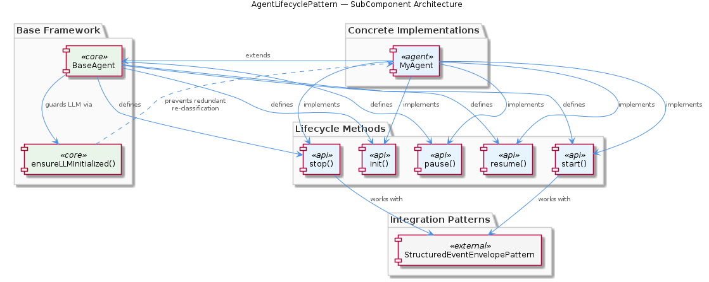
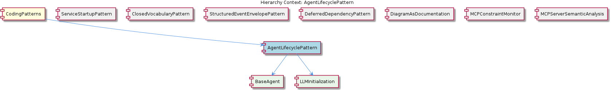

# AgentLifecyclePattern

**Type:** SubComponent

The AgentLifecyclePattern is referenced in integrations/mcp-server-semantic-analysis/docs/architecture/agents.md, highlighting its importance in the overall architecture

# AgentLifecyclePattern — Technical Insight Document

## What It Is

The `AgentLifecyclePattern` is a structural coding pattern implemented primarily in `base-agent.ts`, where the `BaseAgent` class defines a uniform contract for agent lifecycle management. It standardizes how agents in this codebase are constructed, started, suspended, resumed, and torn down by exposing five explicit lifecycle methods: `init()`, `start()`, `stop()`, `pause()`, and `resume()`. Concrete agent implementations — exemplified by `MyAgent.ts` — extend `BaseAgent` and implement these methods to plug their domain-specific behavior into the shared lifecycle framework.

The pattern is formally referenced in the architectural documentation at `integrations/mcp-server-semantic-analysis/docs/architecture/agents.md`, which highlights its central role in the agent subsystem. As a SubComponent under the broader `CodingPatterns` parent, it sits alongside other systemic patterns such as `ServiceStartupPattern`, `ClosedVocabularyPattern`, `StructuredEventEnvelopePattern`, `DeferredDependencyPattern`, and `DiagramAsDocumentation`. Within its own scope, it organizes two child concerns: `BaseAgent` (the lifecycle contract itself) and `LLMInitialization` (a lazy initialization gate for language-model resources).

## Architecture and Design

The architecture follows a **template method** style of design: `BaseAgent` declares the lifecycle phases as an abstract surface, and concrete subclasses fill in the per-agent logic for each phase. This makes the lifecycle contract explicit rather than implicit, partitioning agent behavior into five well-defined phases — `init()` for one-time bootstrap, `start()`/`stop()` for active execution boundaries, and `pause()`/`resume()` for mid-run suspension. By codifying these phases in the base class, the design ensures every agent in the system follows the same shape, which simplifies orchestration code that needs to manage heterogeneous agents uniformly.

A second key design decision is the **lazy initialization gate** embodied by `ensureLLMInitialized()` in `base-agent.ts`. Rather than eagerly constructing language-model resources during `init()`, the gate defers LLM setup until the first call site actually needs it, and then guards subsequent calls to prevent redundant LLM re-classification. This is the responsibility of the `LLMInitialization` child component, which centralizes the deferred setup logic in the base class so that concrete subclasses do not each have to reimplement on-demand construction. This is conceptually aligned with the singleton guard idiom described in the parent `CodingPatterns` documentation (and visualized in `docs/puml/psm-singleton-pattern.puml`), in that it uses a guard-and-return check to avoid duplicate construction of a costly stateful resource.

The lifecycle methods are also designed to interoperate with the sibling `StructuredEventEnvelopePattern`, as documented in `integrations/mcp-constraint-monitor/docs/CLAUDE-CODE-HOOK-FORMAT.md`. This means that lifecycle transitions are expected to emit or consume events in the canonical envelope format, allowing external observers (such as constraint monitors and hooks) to react to agent state changes uniformly.

## Implementation Details

At the implementation core is the `BaseAgent` class in `base-agent.ts`. It exposes five lifecycle hooks that subclasses override:

- **`init()`** — performs one-time bootstrap work; intended for resource registration, configuration loading, and any setup that should occur exactly once before the agent begins executing.
- **`start()`** — marks the boundary at which the agent begins active execution.
- **`stop()`** — terminates active execution; the complementary boundary to `start()`.
- **`pause()`** — suspends a running agent without tearing down state, enabling later resumption.
- **`resume()`** — restores a paused agent to active execution.

Inside `base-agent.ts`, the helper `ensureLLMInitialized()` provides the lazy initialization gate for LLM resources. It functions as a guard: on first invocation it performs the LLM setup, and on subsequent invocations it short-circuits, returning immediately so the LLM is not re-classified or reconstructed. This prevents both wasted compute and inconsistent state that could arise from repeated initialization.

Concrete agents such as `MyAgent.ts` demonstrate the canonical usage: they extend `BaseAgent`, override the lifecycle methods with their domain-specific implementations, and rely on the base class for cross-cutting concerns like LLM initialization. Because the contract is fixed at the base, orchestrators and host environments can drive any agent through the same lifecycle without needing to know its concrete type.

## Integration Points

The most significant integration is with the `StructuredEventEnvelopePattern` sibling. Per `integrations/mcp-constraint-monitor/docs/CLAUDE-CODE-HOOK-FORMAT.md`, the lifecycle methods are designed to work with the structured event envelope format, meaning lifecycle transitions can be surfaced as canonical events consumable by hook-based tooling such as the MCP constraint monitor. This makes lifecycle state changes observable across the system in a uniform way.

The pattern is also referenced from `integrations/mcp-server-semantic-analysis/docs/architecture/agents.md`, which positions `AgentLifecyclePattern` within the broader semantic analysis MCP server architecture, and from `integrations/mcp-server-semantic-analysis/docs/installation/README.md`, which uses the `BaseAgent` contract as a touchstone for explaining how concrete agents are wired into the system. These two documents together establish the pattern as both an architectural primitive and a practical extension point for integrators.

Internally, the pattern depends on its two children: `BaseAgent`, which supplies the lifecycle surface, and `LLMInitialization`, which supplies the deferred LLM bootstrapping mechanic. Externally, any agent module that imports from `base-agent.ts` becomes a participant in the pattern.

## Usage Guidelines

When implementing a new agent, always extend `BaseAgent` from `base-agent.ts` rather than defining a parallel lifecycle ad hoc. Override the five lifecycle methods (`init`, `start`, `stop`, `pause`, `resume`) with your domain-specific logic, and respect the semantic meaning of each phase — bootstrap work belongs in `init()`, not in `start()`; suspension that preserves state belongs in `pause()`, while teardown belongs in `stop()`. This discipline is what allows orchestrators to manage heterogeneous agents uniformly.

For any LLM-related setup, do not roll your own initialization logic in subclasses. Route through `ensureLLMInitialized()` so the lazy gate can do its job of preventing redundant LLM re-classification. This both saves cost and keeps LLM state consistent across the agent's lifetime. This guidance mirrors the broader singleton-guard discipline described at the `CodingPatterns` parent level: stateful, expensive resources should be acquired through guarded accessors, never constructed directly at arbitrary call sites.

When designing lifecycle transitions, remember that they are expected to be observable via the `StructuredEventEnvelopePattern`. Emit or accept events in the canonical envelope format described in `integrations/mcp-constraint-monitor/docs/CLAUDE-CODE-HOOK-FORMAT.md` so downstream monitors and hooks can react consistently. Finally, consult `integrations/mcp-server-semantic-analysis/docs/architecture/agents.md` before introducing structural changes to the pattern — it is the authoritative architectural reference for how agents fit into the wider system.

---

### Summary of Requested Analyses

1. **Architectural patterns identified**: Template method via `BaseAgent` lifecycle hooks; lazy initialization gate via `ensureLLMInitialized()`; alignment with the singleton guard idiom inherited from the `CodingPatterns` parent; event-envelope interop with `StructuredEventEnvelopePattern`.
2. **Design decisions and trade-offs**: Making the lifecycle explicit (five named phases) trades a small amount of subclass boilerplate for uniform orchestration and observability. Deferring LLM initialization trades a one-time first-use latency for avoided redundant re-classification and lower steady-state cost.
3. **System structure insights**: The pattern is composed of two children (`BaseAgent`, `LLMInitialization`) and participates in a sibling ecosystem of patterns under `CodingPatterns`. Concrete agents like `MyAgent.ts` are the leaf consumers.
4. **Scalability considerations**: The lazy initialization gate is the primary scalability lever — it prevents repeated heavy LLM setup. Uniform lifecycle phases also let an orchestrator scale agent counts without per-type special-casing.
5. **Maintainability assessment**: High. Centralizing the lifecycle in `base-agent.ts` and the LLM gate in `ensureLLMInitialized()` keeps cross-cutting concerns out of subclasses, and the explicit phase names make agent code self-documenting. Authoritative documentation in `integrations/mcp-server-semantic-analysis/docs/architecture/agents.md` provides a single point of reference for future contributors.

## Hierarchy Context

### Parent
- [CodingPatterns](./CodingPatterns.md) -- [LLM] The project-wide singleton guard pattern is formally codified in `docs/puml/psm-singleton-pattern.puml` and manifests consistently wherever stateful managers are instantiated. The pattern follows a strict guard-and-return idiom: a module-level variable holds the single instance (initialized to null or undefined), and every access point checks that variable before constructing a new object. If an instance already exists, the existing reference is returned immediately without re-running any constructor or initialization logic. This prevents race conditions in async service environments where multiple subsystems might attempt to spin up the same stateful manager concurrently — a real concern in Node.js applications that use event-driven concurrency without explicit locking primitives. For new developers, the implication is that any class described as a 'manager' or 'session' object in this codebase should be assumed to follow this pattern: do not call `new` directly on these classes from arbitrary call sites; instead, always go through the designated factory or accessor function that enforces the singleton contract. The PlantUML diagram in `docs/puml/psm-singleton-pattern.puml` is authoritative and should be consulted before introducing any new singleton-style manager to ensure the guard logic is structurally consistent with the rest of the project.

### Children
- [BaseAgent](./BaseAgent.md) -- BaseAgent in base-agent.ts partitions agent behavior into five explicit phases: init() for one-time bootstrap, start()/stop() for active execution boundaries, and pause()/resume() for mid-run suspension, making the lifecycle contract explicit rather than implicit.
- [LLMInitialization](./LLMInitialization.md) -- Identified in the parent component analysis of base-agent.ts as a 'lazy initialization gate for the LLM', this pattern centralizes deferred LLM setup in the base class so concrete subclasses do not each need to manage their own on-demand construction logic.

### Siblings
- [ServiceStartupPattern](./ServiceStartupPattern.md) -- The startServiceWithRetry() function in lib/service-starter.js wraps the service startup with retry logic
- [ClosedVocabularyPattern](./ClosedVocabularyPattern.md) -- The migration scripts in integrations/mcp-constraint-monitor/docs/constraint-configuration.md enforce fixed canonical type sets
- [StructuredEventEnvelopePattern](./StructuredEventEnvelopePattern.md) -- The CLAUDE-CODE-HOOK-FORMAT.md document specifies the structured event envelope format
- [DeferredDependencyPattern](./DeferredDependencyPattern.md) -- The VkbApiClient module in lib/ukb-unified/core/VkbApiClient.js is loaded dynamically using dynamic-import
- [DiagramAsDocumentation](./DiagramAsDocumentation.md) -- The PlantUML diagrams in docs/puml/ capture architectural decisions and provide visual specification
- [MCPConstraintMonitor](./MCPConstraintMonitor.md) -- The MCPConstraintMonitor module in integrations/mcp-constraint-monitor/README.md monitors and enforces constraints
- [MCPServerSemanticAnalysis](./MCPServerSemanticAnalysis.md) -- The MCPServerSemanticAnalysis module in integrations/mcp-server-semantic-analysis/README.md performs semantic analysis

---

*Generated from 7 observations*
