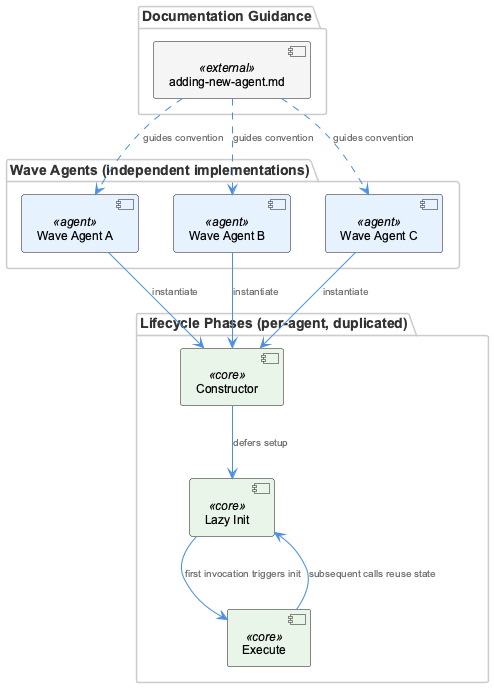
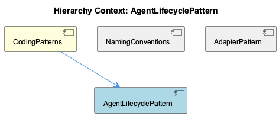

# AgentLifecyclePattern

**Type:** SubComponent

Documentation guidance for adding new agents (docs/architecture/adding-new-agent.md) is the most relevant entry point for understanding how this lifecycle pattern is expected to be followed

# AgentLifecyclePattern

## What It Is

AgentLifecyclePattern is a structural convention observed across wave/agent components rather than a formally implemented abstraction. There is no dedicated source file, base class, or module that defines this pattern — it exists as a recurring shape found by examining how individual wave agents are constructed and executed. The pattern is characterized by a three-phase lifecycle: constructor, lazy-init, and execute. Because it is "potentially used" rather than definitively enforced, its presence in the codebase is inferred from repeated structural similarity across agent implementations, not from a shared interface or abstract class that agents inherit from.

As a member of the CodingPatterns grouping, AgentLifecyclePattern shares the same fundamental nature as its siblings NamingConventions and AdapterPattern: it is a conceptual label applied during architecture synthesis to catch a convention recurring across subsystems, rather than something owned by a single module. Just as CodingPatterns itself has no dedicated directory, this pattern has no canonical home in the codebase — it is scattered across each wave agent's own implementation.

## Architecture and Design

The core architectural insight is the deferred-initialization design: agents separate cheap construction from expensive setup, delaying the latter until the lazy-init phase is actually triggered by first invocation. This is a deliberate optimization suited to agent tasks that run infrequently — paying setup costs only when needed avoids wasted work for agents that may never execute in a given session.

Unlike the AdapterPattern sibling, where concrete implementations (TranscriptAdapter, SpecstoryAdapter) converge on a common internal shape through shared conversion logic, AgentLifecyclePattern has no equivalent convergence point. Each wave agent independently implements its own version of the constructor/lazy-init/execute sequence rather than inheriting from a common AgentLifecycle base class. This makes the pattern a matter of convention rather than a compiler-enforced contract — the architectural decision here is decentralization: no framework-level lifecycle manager coordinates or dictates agent behavior.

## Implementation Details

Because no dedicated module exists, there are no concrete classes or functions to enumerate for this pattern — the "implementation" is distributed across each individual wave agent's source. The mechanics consistently follow the three-phase shape: a lightweight constructor establishes the agent instance, a lazy-init routine performs expensive setup work only when first needed, and an execute phase carries out the agent's actual task. This structural repetition across otherwise independent agent implementations is what allows the pattern to be identified at all, despite the absence of a shared parent class or interface.

## Integration Points

The most concrete integration point is documentation-based rather than code-based: docs/architecture/adding-new-agent.md serves as the expected entry point for developers who need to implement a new agent following this lifecycle shape. This positions the pattern's "interface" as a documentation contract rather than a type-system contract. Within the broader CodingPatterns grouping, this pattern sits alongside NamingConventions (which classifies by suffix like *Manager, *Service, *Adapter, *Provider) and AdapterPattern (exemplified by TranscriptAdapter and SpecstoryAdapter) as one of several recurring conventions synthesized during architecture analysis rather than discovered via a browsable module structure.

## Usage Guidelines

Developers adding new wave agents should consult docs/architecture/adding-new-agent.md as the primary guide for correctly implementing the constructor/lazy-init/execute shape. Because enforcement relies entirely on convention and code review rather than compiler or type-level guarantees, reviewers should specifically check that new agents defer expensive setup to the lazy-init phase rather than performing it in the constructor, preserving the intended performance characteristic for infrequently-run tasks. Given the absence of a shared base class, any refactor that introduces an actual AgentLifecycle abstraction should be considered carefully, as it would centralize behavior currently duplicated across independent agent implementations — improving maintainability at the cost of touching every existing wave agent.

## Hierarchy Context

### Parent
- [CodingPatterns](./CodingPatterns.md) -- [LLM] CodingPatterns has no dedicated source directory or module of its own within the Coding project; it exists purely as a conceptual grouping label applied during component analysis to catch conventions that recur across many subsystems but are not owned by any single one. A new developer searching for 'CodingPatterns.ts' or 'patterns/' will find nothing—the actual pattern implementations live scattered inside the real subsystems (wave agents, adapters, managers) and are only retroactively categorized as 'CodingPatterns' during architecture synthesis. This means any onboarding effort to understand this component should redirect to CLAUDE.md and docs/architecture/ rather than expecting a browsable codebase location.

### Siblings
- [NamingConventions](./NamingConventions.md) -- The convention classifies classes by suffix pattern (e.g., *Manager, *Service, *Adapter, *Provider) rather than by directory location, meaning classification is name-driven not structure-driven
- [AdapterPattern](./AdapterPattern.md) -- TranscriptAdapter and SpecstoryAdapter are cited as concrete examples of this pattern, both converting external format-specific data into a common internal shape

---

*Generated from 5 observations*
