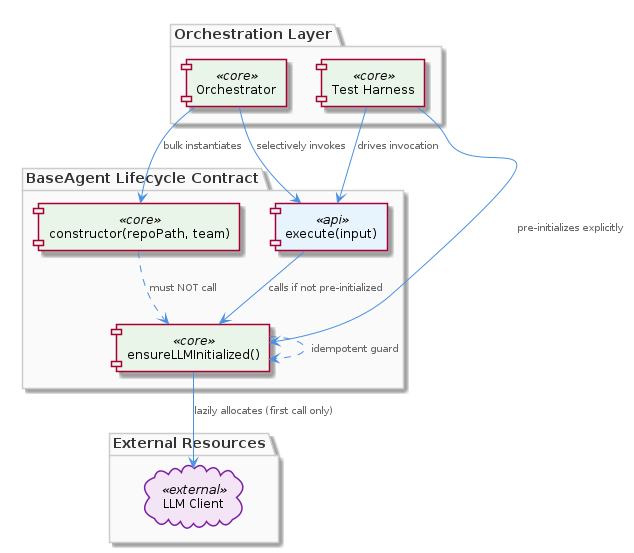
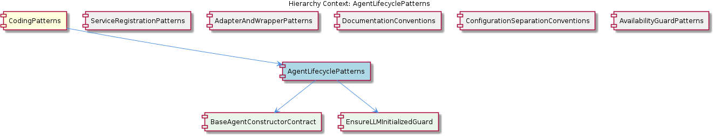

# AgentLifecyclePatterns

**Type:** SubComponent

BaseAgent subclasses documented in integrations/mcp-server-semantic-analysis/docs/architecture/agents.md all follow a constructor(repoPath, team) signature that captures only configuration context, explicitly forbidding any LLM client instantiation at this stage.

# AgentLifecyclePatterns

## What It Is

AgentLifecyclePatterns is a SubComponent that codifies the lifecycle contract enforced on all LLM-backed agents within the `integrations/mcp-server-semantic-analysis/` subsystem. The contract itself is documented in `integrations/mcp-server-semantic-analysis/docs/architecture/agents.md`, with historical context preserved in `integrations/mcp-server-semantic-analysis/CRITICAL-ARCHITECTURE-ISSUES.md`, which references resolved lifecycle violations and confirms that this contract was retrofitted after early mis-implementations exposed resource exhaustion problems.

At its core, the pattern prescribes a strict three-phase lifecycle: `constructor(repoPath, team)` → `ensureLLMInitialized()` → `execute(input)`. Each phase has a precisely defined role and a set of forbidden behaviors. Construction is reserved for capturing configuration context only; LLM client allocation is deferred to an idempotent initialization guard; and `execute(input)` serves as the sole public entry point for performing agent work. This pattern sits within the broader `CodingPatterns` parent grouping, which collects cross-cutting conventions that govern how the codebase is structured.

The SubComponent decomposes into two child entities that capture the two non-trivial obligations of the lifecycle: `BaseAgentConstructorContract` (governing what construction must and must not do) and `EnsureLLMInitializedGuard` (governing the deferred allocation point). Together they form a complete specification of the contract that every `BaseAgent` subclass must honor.

## Architecture and Design

The architectural approach is best characterized as **lazy initialization with an idempotent guard**, layered over a uniform two-parameter constructor signature. By separating *configuration capture* (cheap, side-effect-free) from *resource acquisition* (expensive, network-touching), the design enables orchestrators to instantiate large pools of agents speculatively without paying the cost of LLM connections for agents that are never invoked. This is the motivating scenario explicitly called out in `agents.md`: orchestrator code that pre-instantiates agents in bulk, where only a subset are ultimately executed.

The interaction model between the three phases is intentionally permissive at the boundary between phases two and three. A harness may call `ensureLLMInitialized()` explicitly before invoking `execute(input)` — useful when the harness wants to surface initialization failures eagerly — or it may rely on `execute(input)` itself to call `ensureLLMInitialized()` at its top. Because the guard is idempotent, both call sites can coexist safely; only the first invocation allocates the LLM client, and subsequent calls are no-ops. This dual-entry idiom prevents the kind of double-initialization bugs that would otherwise occur in reentrant or harness-driven scenarios.

The design philosophy contrasts cleanly with sibling patterns in the same `CodingPatterns` hierarchy. Where `ServiceRegistrationPatterns` insists on *immediate* side effects after process spawn (calling `ProcessStateManager.registerService()` right away as the canonical liveness signal), `AgentLifecyclePatterns` insists on *deferred* side effects. The two patterns share a common concern — making lifecycle transitions explicit and observable — but resolve it in opposite directions because their underlying resource profiles differ. Similarly, `AvailabilityGuardPatterns` (which gates dynamic imports of `VkbApiClient` behind `isServerAvailable()` checks) shares the broader instinct of avoiding speculative resource acquisition.

## Implementation Details

The `BaseAgentConstructorContract` child component fixes the constructor signature at exactly two parameters: `repoPath` and `team`. This uniformity is not incidental — it allows orchestrators to instantiate agents generically without per-class branching, since every `BaseAgent` subclass accepts the same configuration shape. Inside the constructor, the only permitted work is to store these values; explicitly forbidden is any code that opens an LLM connection, creates an LLM client, or otherwise commits to network or process resources. `agents.md` flags such constructor-side acquisition as a contract violation, and new-contributor guidance reiterates that it causes resource exhaustion in bulk-instantiation orchestrator scenarios.

The `EnsureLLMInitializedGuard` child component implements the deferred allocation mechanism. The function is structured as an idempotent guard: on the first invocation it allocates the LLM client and records that initialization has completed; on every subsequent invocation it returns immediately without re-allocating. This idempotency is a load-bearing property of the design, since it allows `execute(input)` to call the guard defensively at its top without coordinating with whatever harness logic may already have invoked it.

The `execute(input)` method is specified in `agents.md` as the sole public entry point for agent work. The wording "sole public entry point" is significant: it implies that other methods on `BaseAgent` subclasses are not intended to be invoked externally as part of normal operation, and that the lifecycle contract only needs to be honored along the `execute()` call path. This narrow public surface keeps the contract enforceable — there is exactly one place where the agent needs to verify that initialization has occurred.

## Integration Points

The pattern's primary integration point is with orchestrator code that pre-instantiates agents in bulk. The contract exists specifically to make this orchestrator pattern viable: by guaranteeing that construction is cheap, the contract permits the orchestrator to materialize agents speculatively without committing to LLM connections for any of them. This is the inverse of the `ServiceRegistrationPatterns` integration model, where `scripts/api-service.js` deliberately commits to a registration immediately, treating the registered state as the canonical truth.

The contract also integrates with test harnesses. Because `ensureLLMInitialized()` may be called explicitly by a harness before `execute(input)`, harnesses gain the option of surfacing LLM initialization failures separately from execution failures — a useful diagnostic distinction when debugging agent behavior. The idempotency of the guard ensures that the harness's explicit call and the implicit call inside `execute(input)` coexist without conflict.

Within the broader documentation ecosystem, `agents.md` lives alongside other architectural documents under `integrations/mcp-server-semantic-analysis/docs/architecture/`. This directory convention aligns with the sibling `DocumentationConventions` pattern, which establishes that architecture documentation (and its `.puml` diagram sources) is colocated under `docs/` subtrees. The `CRITICAL-ARCHITECTURE-ISSUES.md` file at the integration root provides a complementary historical record, documenting that the lifecycle contract was retrofitted after early violations were observed.

The pattern is configuration-aware but not configuration-dependent: per-agent behavioral configuration (model selection, parameters, capabilities) lives in `config/agent-profiles.json` as established by the sibling `ConfigurationSeparationConventions`. The lifecycle contract is orthogonal to that configuration — the contract governs *when* the LLM client is constructed, while the profile governs *how* it is configured once constructed.

## Usage Guidelines

When adding a new `BaseAgent` subclass, the constructor must accept exactly `(repoPath, team)` and must do nothing more than capture those values. Any attempt to instantiate an LLM client, open a network connection, or perform other resource acquisition in the constructor constitutes a contract violation per `agents.md` and will cause resource exhaustion in orchestrator scenarios that pre-instantiate agents in bulk. New contributors should treat this as a hard rule, not a guideline — `agents.md` explicitly flags constructor-side LLM acquisition as a contract violation.

All LLM client allocation must be funneled through `ensureLLMInitialized()`. This function must remain idempotent: the implementation should check whether initialization has already occurred and return immediately if so. Repeated calls must be safe, because both harnesses and `execute(input)` itself are permitted to invoke it. Implementations that allocate unconditionally — re-creating the LLM client on every call — would defeat the purpose of the guard and could leak connections.

Agent work must be exposed exclusively through `execute(input)`. Adding alternative public methods that perform agent work would fragment the lifecycle enforcement surface, since each such method would need to replicate the `ensureLLMInitialized()` guard call. Keeping `execute(input)` as the sole entry point preserves the simplicity of the contract: one place to enforce, one place to verify.

When writing orchestrators or harnesses that consume agents, prefer to pre-instantiate agents lazily relative to invocation but feel free to construct them in bulk, since construction is guaranteed cheap. If you want eager initialization failure semantics, call `ensureLLMInitialized()` explicitly on the agents you intend to use; otherwise, simply call `execute(input)` and let the agent initialize itself on demand. The `CRITICAL-ARCHITECTURE-ISSUES.md` record exists as a reminder that violations of this contract have caused real production-shaped problems in the past, and the retrofitted contract is now the authoritative model for all agent lifecycle behavior in this subsystem.

## Hierarchy Context

### Parent
- [CodingPatterns](./CodingPatterns.md) -- [LLM] The project enforces a strict three-phase lazy initialization contract for all LLM-backed agents, documented in integrations/mcp-server-semantic-analysis/docs/architecture/agents.md. The contract mandates the sequence: constructor(repoPath, team) → ensureLLMInitialized() → execute(input). In the constructor phase, the agent captures only its configuration context (repository path and team assignment) without touching LLM infrastructure. The second phase, ensureLLMInitialized(), is an idempotent guard method that performs the actual LLM client instantiation and is designed to be safe to call multiple times — only the first call allocates resources. The third phase, execute(input), is the sole public entry point for agent work and implicitly relies on ensureLLMInitialized() having been called (either explicitly by a harness or at the top of execute() itself). This pattern is a deliberate trade-off: it keeps agent construction cheap for cases where agents are instantiated in bulk but only a subset are actually invoked, preventing unnecessary LLM connection overhead. A new contributor adding an agent must not acquire LLM connections in the constructor — doing so would break the lifecycle contract and cause resource exhaustion in orchestrator scenarios that pre-instantiate agents.

### Children
- [BaseAgentConstructorContract](./BaseAgentConstructorContract.md) -- As documented in integrations/mcp-server-semantic-analysis/docs/architecture/agents.md, every BaseAgent subclass must accept exactly two constructor parameters — repoPath and team — establishing a uniform configuration-capture interface across all agent implementations.
- [EnsureLLMInitializedGuard](./EnsureLLMInitializedGuard.md) -- Because agents.md mandates that constructors never instantiate LLM clients, the architecture requires a separate initialization pathway; the parent component analysis identifies ensureLLMInitialized() in agents.md as that deferred allocation point.

### Siblings
- [ServiceRegistrationPatterns](./ServiceRegistrationPatterns.md) -- scripts/api-service.js calls ProcessStateManager.registerService() immediately after process spawn, establishing the registration as the canonical signal that a service is live and trackable.
- [AdapterAndWrapperPatterns](./AdapterAndWrapperPatterns.md) -- GraphDatabaseAdapter wraps the Graphology graph library combined with LevelDB persistence, exposing a domain-oriented API rather than the raw Graphology or LevelDB interfaces directly.
- [DocumentationConventions](./DocumentationConventions.md) -- All architecture diagrams are stored as .puml files under docs/puml/ directories, as evidenced by the documentation listing showing integrations/mcp-server-semantic-analysis/docs/architecture/ containing multiple .md files that reference PlantUML sources.
- [ConfigurationSeparationConventions](./ConfigurationSeparationConventions.md) -- config/agent-profiles.json holds runtime behavioral configuration for agents (model selection, parameters, capabilities), deliberately separated from topology concerns.
- [AvailabilityGuardPatterns](./AvailabilityGuardPatterns.md) -- isServerAvailable() is called before dynamic imports of VkbApiClient, ensuring the optional external API client is never loaded if its backing server cannot be reached.

---

*Generated from 6 observations*
