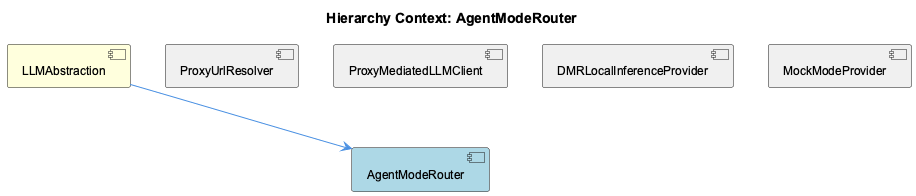
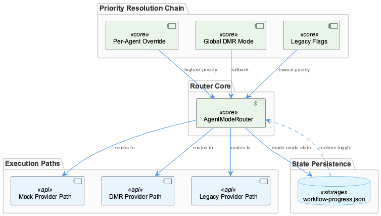

# AgentModeRouter

**Type:** SubComponent

Priority chain resolves in order: per-agent override → global mode → legacy flags, meaning a per-agent mock setting overrides a global DMR mode without affecting other agents

# AgentModeRouter — Technical Insight Document

## What It Is

AgentModeRouter is a SubComponent of LLMAbstraction that functions as the single decision point for selecting among three structurally distinct execution paths: MockModeProvider, DMRLocalInferenceProvider, and the proxy-mediated cloud path via ProxyMediatedLLMClient. Its state is persisted in `.data/workflow-progress.json`, making routing decisions durable across process restarts and directly inspectable without tooling.

The router's core responsibility is isolation: each of the three provider paths has meaningfully different mechanics (in-process mock responses, a local Docker Model Runner API, and a proxied cloud call through rapid-llm-proxy), and AgentModeRouter ensures none of those paths bleeds implementation concern into the others or into the callers above them.

## Architecture and Design

The central design decision is a **priority chain** for mode resolution: per-agent override → global mode → legacy flags. This three-level cascade means that an operator can set a global mode (say, DMR) while allowing individual agents to deviate from it independently, without affecting the rest of the workflow. The legacy flag tier at the bottom of the chain exists specifically to maintain backward compatibility with deployments that predate the per-agent/global mode system — it costs nothing in the common case but prevents breakage for older configurations.

This priority structure is a deliberate trade-off: it adds resolution complexity in exchange for operational flexibility. An operator can override routing for a single misbehaving agent without touching global config, or flip an entire workflow to mock mode for testing without modifying code. The fact that state lives in a plain JSON file (`.data/workflow-progress.json`) rather than environment variables or compiled config means changes take effect on the next LLM call with no restart required, which aligns with how the parent LLMAbstraction exposes runtime toggling as a first-class capability.

The router's position as the *only* decision point for provider selection is an explicit architectural constraint. Routing logic is not distributed across the provider implementations — DMRLocalInferenceProvider doesn't know when it should be bypassed in favor of mock, and MockModeProvider doesn't know about DMR. AgentModeRouter owns that logic entirely.

## Implementation Details

Mode resolution reads from `.data/workflow-progress.json` at call time, checking first for a per-agent entry, then a global mode field, then legacy flag fields. Because the file is read on each routing decision (rather than cached at startup), runtime toggling works without process restarts — an operator edits the JSON and the next LLM invocation picks up the new routing immediately.

The three paths the router dispatches to are structurally isolated from each other. MockModeProvider returns synthetic responses in-process. DMRLocalInferenceProvider targets an OpenAI-compatible endpoint at `localhost:${DMR_PORT}/engines/v1`, reusing OpenAI SDK request formatting. The proxy path routes through ProxyMediatedLLMClient (the `llm-with-process.ts` module), which injects a `process` tag before forwarding to rapid-llm-proxy at the port resolved by ProxyUrlResolver. AgentModeRouter selects among these without exposing the selection logic to any of them.

Legacy flag support warrants specific attention: it exists as the lowest-priority tier specifically to avoid breaking deployments that set mode via older mechanisms. This is a backward-compatibility shim, not an intended primary path for new deployments.

## Integration Points

AgentModeRouter sits inside LLMAbstraction and is the gating layer that all three sibling provider components sit behind. Callers of LLMAbstraction do not interact with provider selection directly — that contract is wholly owned by the router. The state file `.data/workflow-progress.json` is the external interface through which operators and tooling influence routing, and it is shared with other parts of the workflow-progress system, meaning routing state is observable alongside other workflow state in a single file.

The router's dependency on ProxyUrlResolver is indirect — ProxyUrlResolver's output matters only when the router selects the proxy path, at which point ProxyMediatedLLMClient uses it. Similarly, the DMR port configuration matters only when DMRLocalInferenceProvider is selected. This means misconfiguration of a non-selected path does not surface as a router failure.

## Usage Guidelines

**Routing is controlled via `.data/workflow-progress.json`, not code.** Per-agent overrides are the highest-priority mechanism and the right tool when a single agent needs a different provider than the global setting. Global mode should be the default configuration lever. Legacy flags should be treated as read-only compatibility shims for existing deployments, not as a configuration target for new work.

Because the file is read at call time, operators can toggle modes in running workflows — but this also means the file must remain well-formed JSON at all times. A malformed file will affect all subsequent LLM calls until corrected. Teams should treat `.data/workflow-progress.json` as a runtime operational artifact with write discipline similar to a live config file.

The router's isolation guarantee — that each provider path is unaware of the others — is only maintained if routing logic is not duplicated elsewhere. Adding conditional provider selection inside individual provider implementations or in callers above LLMAbstraction would break the single-decision-point invariant and make the priority chain untrustworthy. All mode-selection logic belongs in AgentModeRouter.

---

**Architectural Patterns:** Priority-chain resolution, single-point dispatch, externalized mutable state for runtime control, backward-compatibility tiering.

**Key Trade-off:** File-based mutable state enables operational flexibility and zero-restart toggling at the cost of requiring write discipline on a shared runtime artifact.

**Maintainability:** High, as long as the single-decision-point constraint is respected. The JSON state file makes routing behavior inspectable without instrumentation, which aids debugging.

## Hierarchy Context

### Parent
- [LLMAbstraction](./LLMAbstraction.md) -- LLMAbstraction is a multi-layered abstraction over LLM providers that enables provider-agnostic model calls through three distinct execution paths: mock mode (for testing), local inference via Docker Model Runner (DMR), and public cloud providers (Anthropic, OpenAI, Groq) routed through a rapid-llm-proxy. The system supports per-agent and global mode switching stored in `.data/workflow-progress.json`, allowing runtime toggling between modes without code changes. Provider selection follows a priority chain from per-agent overrides to global mode to legacy flags.

The architecture centers on a proxy-mediated request pattern where most LLM calls route through a local rapid-llm-proxy daemon (default port 12435) via `/api/complete`, enabling centralized token tracking, tier-based routing, and telemetry attribution. The `llm-with-process.ts` module exists specifically to inject a `process` tag into proxy requests — a gap in the SDK's `LLMService.complete()` that caused all wave-analysis calls to appear as `process='unknown'` in token-usage telemetry. DMR provider uses an OpenAI-compatible API at `localhost:${DMR_PORT}/engines/v1` for fully local inference.

Key patterns include: environment-variable-driven URL resolution with multiple fallback levels, singleton client instances with health-check caching, YAML-based provider configuration with env-var expansion, and SDK-shape response normalization ensuring downstream consumers work unchanged regardless of which provider path was taken.

### Siblings
- [ProxyUrlResolver](./ProxyUrlResolver.md) -- Resolves proxy endpoint by checking environment variables RAPID_LLM_PROXY_URL, LLM_CLI_PROXY_URL, and LLM_PROXY_URL in priority order, falling back to localhost:12435 as the default, ensuring compatibility across Docker and host environments
- [ProxyMediatedLLMClient](./ProxyMediatedLLMClient.md) -- The llm-with-process.ts module exists specifically to inject a process tag into proxy requests, filling a gap in LLMService.complete() that caused wave-analysis calls to appear as process='unknown' in token-usage telemetry
- [DMRLocalInferenceProvider](./DMRLocalInferenceProvider.md) -- DMR provider targets an OpenAI-compatible API at localhost:${DMR_PORT}/engines/v1, allowing reuse of OpenAI SDK request formatting without modification
- [MockModeProvider](./MockModeProvider.md) -- Mock mode is one of three named execution paths in LLMAbstraction, activated via per-agent or global mode flags stored in .data/workflow-progress.json

---

*Generated from 5 observations*
