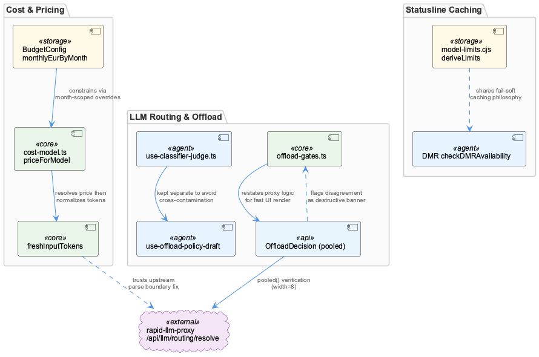
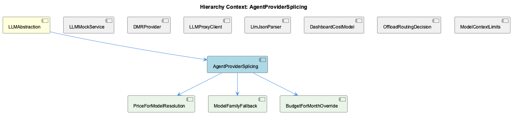

# AgentProviderSplicing

**Type:** SubComponent

# AgentProviderSplicing — Technical Insight Document

## What It Is

AgentProviderSplicing is a SubComponent of the LLMAbstraction layer, centered on `integrations/system-health-dashboard/src/components/cost/cost-model.ts`, with supporting cache logic in `lib/statusline/model-limits.cjs`. It encompasses the machinery that resolves what a given model/provider combination should cost, how that cost should be interpreted against evolving budget policy, and how family/fast-mode variants of a model are priced when an exact match isn't available. Its three children — PriceForModelResolution, ModelFamilyFallback, and BudgetForMonthOverride — are not independent features but three facets of the same underlying pricing/budget resolution engine implemented primarily through `priceForModel()` and `budgetForMonth()`.

## Architecture and Design

The dominant architectural pattern here is **tiered/layered precedence resolution**, the same philosophy that governs `getLLMMode()` in the parent LLMAbstraction layer (perAgentOverrides → globalMode → legacy `progress.mockLLM`). In AgentProviderSplicing, this manifests as `priceForModel()`'s ladder: exact model key match, then fast-mode suffix-stripping with a recursive call and `scalePrice()` multiplier, then family-based fallback via `FAMILY_REPRESENTATIVE`. This project-wide convention treats identity resolution as inherently ambiguous and evolving, so rather than a flat lookup, explicit precedence chains are built and their outcome is made observable — PriceForModelResolution's `ResolvedPrice.source` discriminant (`'exact' | 'family' | 'fast' | 'none'`) exposes *which rule fired*, not just an answer.

A second pattern is **append-only/history-preserving configuration**, embodied in BudgetForMonthOverride's `monthlyEurByMonth` structure. This avoids retroactively reinterpreting past months against a budget cap that didn't exist at the time — structurally the same temporal-integrity concern as the dual-write design in `setGlobalLLMMode()` in the parent component.

Finally, `cost-model.ts` as a whole enforces a **pure-function boundary**: as its sibling DashboardCostModel notes, every exported function is a pure function of `CostRow[]`/`CostConfig` with no hooks, fetch calls, or component state — sharply distinct from siblings like `offload-decision.tsx` and `use-classifier-judge.ts`, which interleave I/O and dirty-state tracking directly.

## Implementation Details

`priceForModel()` implements ModelFamilyFallback and PriceForModelResolution together as a single recursive function. The exact-match branch checks `prices[normalized]` directly. The fast-mode branch strips `FAST_MODE_SUFFIX` and recurses into `priceForModel(base, prices)` before applying `FAST_MODE_MULTIPLIER` via `scalePrice()` — crucially, this recursion reuses the exact/family branches rather than duplicating lookup logic, and the ordering is load-bearing: fast-mode is checked *before* family fallback specifically so an explicit `<model>-fast` row can override the multiplier via exact match on the recursive call. Reversing this order would let family fallback silently mis-price fast-mode rows with no warning, since `priced: true` is set regardless.

BudgetForMonthOverride's `budgetForMonth()` uses `Object.prototype.hasOwnProperty.call(byMonth, month)` to distinguish three states: present-and-null ("no cap that month"), present-and-set, and absent ("use standing cap `b.monthlyEur`"). This guards against the natural but wrong simplification `byMonth?.[month] ?? b.monthlyEur`, which would silently collapse an intentional null override back to the standing cap.

Elsewhere in the module, `freshInputTokens()` stands as a deliberately preserved "identity function with history" — it once subtracted `cache_read_tokens` for OpenAI-wire providers to prevent double-billing, a compensation removed once the proxy's `openAIFreshInputTokens` parse boundary was fixed upstream. The function and its comments remain as a forensic breadcrumb warning future maintainers not to reintroduce a fix for an already-fixed defect — the same house style seen in the dual-write comments of `setGlobalLLMMode()`.

Adjacent but architecturally parallel, `model-limits.cjs`'s `deriveLimits()` implements a fail-soft cache: rather than parsing a 4.5MB models.dev catalogue on every 5-second statusline tick, it derives a boiled-down JSON map, invalidated via mtime+size comparison (not hashing), written via temp-file+rename to avoid partial reads. Every failure path returns `null` rather than throwing.

## Integration Points

AgentProviderSplicing sits inside LLMAbstraction alongside siblings LLMMockService, DMRProvider, LLMProxyClient, LlmJsonParser, DashboardCostModel, OffloadRoutingDecision, and ModelContextLimits. It shares its precedence-resolution philosophy directly with LLMMockService's `getLLMMode()` and with `use-classifier-judge.ts`'s `JudgeBackend.enabled`/`reachable` split. Its fail-soft caching approach mirrors DMRProvider's `checkDMRAvailability()` health-check cache and ModelContextLimits' `model-limits.cjs`. Its forensic-comment convention (`freshInputTokens`) parallels the dual-write documentation in the parent's `setGlobalLLMMode()`. Structurally, it is a leaf pricing/budget engine consumed by dashboard callers (e.g., `cellCostUsd`, `monthlySeries`) that themselves handle I/O (`GET /api/token-usage/cost`, `GET /api/llm/settings`) — none of which cost-model.ts performs itself.

## Usage Guidelines

Developers extending `priceForModel()` must preserve branch ordering: fast-mode must be checked before family fallback, or fast-mode rows will be silently mis-priced with no `priced: false` signal. When adding budget logic, always use `hasOwnProperty` semantics rather than `??` chaining against `monthlyEurByMonth`, since null and absent carry distinct meaning. Do not remove `freshInputTokens()`'s dead-looking legacy branch without checking whether the upstream proxy fix it depends on is still in place — the comment exists precisely to prevent this. Finally, respect the pure-function boundary of `cost-model.ts`: new I/O, hooks, or fetch logic belongs in caller components (per the DashboardCostModel convention), not inside this module.

## Hierarchy Context

### Parent
- [LLMAbstraction](./LLMAbstraction.md) -- [LLM] The mock/local/public mode toggle system in llm-mock-service.ts is designed around a persisted state file (.data/workflow-progress.json) rather than environment variables, which allows runtime mode switching without process restarts. The LLMState structure with globalMode and perAgentOverrides fields enables fine-grained control where a specific agent can be forced into mock mode for testing while the rest of the system runs against real providers. This is critical for integration testing scenarios where a developer wants to validate one agent's prompt-handling logic without incurring API costs or non-determinism from the LLM calls of other agents in a multi-agent pipeline. The getLLMMode() read path checks perAgentOverrides first, then falls back to globalMode, and finally to the legacy progress.mockLLM boolean, establishing a three-tier precedence resolution that any new developer must understand before assuming a single toggle controls behavior.

### Children
- [PriceForModelResolution](./PriceForModelResolution.md) -- [LLM] priceForModel() in integrations/system-health-dashboard/src/components/cost/cost-model.ts implements a three-tier resolution ladder with an explicit `ResolvedPrice.source` discriminant ('exact' | 'family' | 'fast' | 'none') rather than a boolean 'found' flag. This is a deliberate observability choice: the function doesn't just answer 'what price', it answers 'which rule fired', which lets any caller (e.g. cellCostUsd) or a future debugging UI distinguish a confidently-priced exact match from a family-fallback guess without re-deriving the logic. The recursive call `priceForModel(base, prices)` for the fast-mode strip-and-retry means the 'exact' and 'family' branches are reused rather than duplicated for the fast path — the recursion, not a second copy of the lookup table, is what keeps 'fast' honest.
- [ModelFamilyFallback](./ModelFamilyFallback.md) -- [LLM] priceForModel() in integrations/system-health-dashboard/src/components/cost/cost-model.ts implements the ModelFamilyFallback logic as a three-tier resolution chain: exact key match against `prices[normalized]`, then a fast-mode branch that strips the `-fast` suffix (FAST_MODE_SUFFIX) and recurses into priceForModel() on the base model before applying FAST_MODE_MULTIPLIER via scalePrice(), and only then the family fallback that walks FAMILY_REPRESENTATIVE[modelFamily(model)] before falling back further to `Object.keys(prices).find(k => modelFamily(k) === fam)`. The ordering is deliberate and load-bearing: fast-mode is checked before the family fallback specifically so an explicit `<model>-fast` row in modelPrices can still override the multiplier rule via the exact-match path on the recursive call, and the comments explicitly document that reversing this order would let the family fallback silently mis-price fast-mode rows at the standard rate with no warning (`priced: true` either way).
- [BudgetForMonthOverride](./BudgetForMonthOverride.md) -- [LLM] BudgetForMonthOverride, realized as budgetForMonth() in integrations/system-health-dashboard/src/components/cost/cost-model.ts, implements month-scoped precedence over a standing cap: it checks Object.prototype.hasOwnProperty.call(byMonth, month) before falling back to b.monthlyEur, and explicitly distinguishes an override key that maps to null ('no cap that month') from a key that is simply absent ('use the standing cap'). This three-way semantic (present-and-null vs present-and-set vs absent) is easy to collapse accidentally with a simpler `byMonth?.[month] ?? b.monthlyEur` expression, which is exactly the bug the hasOwnProperty guard exists to prevent — a naive `??` chain would silently promote an intentional null override back to the standing cap.

### Siblings
- [LLMMockService](./LLMMockService.md) -- [LLM] The `use-classifier-judge.ts` hook (integrations/system-health-dashboard/src/components/llm-routing/use-classifier-judge.ts) implements the same config-vs-runtime split described for LLMMockService's `getLLMMode()` precedence chain, but for the offload judge rather than the mock toggle: `JudgeBackend.enabled` is what the YAML file says, while `JudgeBackend.reachable` is whether it actually answered on the last poll. The header comment documents a real incident (2026-09-02) where `enabled: true` masked a dead backend for about a day because nothing distinguished 'switched off' from 'not answering' — the exact class of ambiguity that `getLLMMode()`'s three-tier precedence (perAgentOverrides → globalMode → legacy progress.mockLLM) is designed to avoid by making precedence explicit rather than collapsing multiple signals into one boolean.
- [DMRProvider](./DMRProvider.md) -- [LLM] The DMR provider in dmr-provider.ts is deliberately built as a thin OpenAI-shape adapter rather than a bespoke client — it targets `http://${DMR_HOST}:${DMR_PORT}/engines/v1` but reuses the same request/response contract as the OpenAI SDK integration. This is a 'protocol reuse' strategy: instead of writing DMR-specific request builders, response parsers, and error mappers, the team accepts that Docker Model Runner exposes an OpenAI-compatible surface and piggybacks on existing code paths. The trade-off is that any DMR-specific quirks (different error codes, different streaming semantics, different rate-limit headers) would have to be shimmed into the OpenAI shape rather than handled natively, which could become a leaky abstraction if DMR's compatibility layer ever diverges meaningfully from the OpenAI spec it's mimicking.
- [LLMProxyClient](./LLMProxyClient.md) -- [LLM] The parent context establishes that llm-with-process.ts is a deliberate fetch-based bypass around the SDK's LLMService.complete(), built specifically to inject the 'process' telemetry tag the rapid-llm-proxy's /api/complete endpoint requires, with resolveProxyCompleteUrl() implementing a layered precedence (RAPID_LLM_PROXY_URL → LLM_CLI_PROXY_URL → LLM_PROXY_URL → localhost default). This is the LLMProxyClient's actual transport layer, and the dashboard code surveyed here (offload-decision.tsx, use-classifier-judge.ts) is the operator-facing control plane that sits ABOVE that transport: neither file makes an LLM completion call itself, they instead call GET/PATCH against the proxy's HTTP surface (/api/llm/routing/resolve, /api/llm/classifier) to inspect and edit the routing policy that governs how llm-with-process.ts's requests get dispatched. This is a clean separation between the data-plane client (proxy-bridge, llm-with-process.ts) and the control-plane client (this dashboard code), but it also means the two must agree on wire semantics independently — evidenced by the extensive commentary in offload-decision.tsx about the proxy's resolved answers being compared against the dashboard's own ladder logic rather than trusted.
- [LlmJsonParser](./LlmJsonParser.md) -- [LLM] parse-llm-json.ts's core value proposition is that it treats malformed JSON-mode output as a two-orthogonal-failure-mode problem rather than one generic 'try/catch and give up' problem. escapeControlCharsInStrings() targets corruption caused by raw control characters (e.g. literal newlines or tabs) embedded inside string literals — a byte-level defect that a naive JSON.parse() cannot tolerate — while truncateToLastCompleteElement() targets a structural defect: the provider hit its output-token ceiling mid-object/mid-array. Because these are independent failure modes with independent signatures, running them as a fixed two-stage pipeline rather than a single heuristic means each stage can be reasoned about, tested, and evolved in isolation, and a malformed-but-complete response only pays the cost of the first stage.
- [DashboardCostModel](./DashboardCostModel.md) -- [LLM] cost-model.ts is deliberately framed as "pure cost/budget logic... No React here" — every exported function (budgetForMonth, priceForModel, cellCostUsd, monthlySeries) is a pure function of CostRow[]/CostConfig inputs with no hooks, fetch calls, or component state. This is a sharp architectural boundary against sibling files like use-classifier-judge.ts and offload-decision.tsx, which interleave data-fetching, polling, and dirty-state tracking directly inside hooks and components. The payoff is testability (pure functions can be unit-tested without a DOM or mock fetch) and the ability to reuse the same pricing math in both the live dashboard tab and, presumably, offline reporting scripts — at the cost of pushing all I/O (GET /api/token-usage/cost, GET /api/llm/settings) to callers this file doesn't show.
- [OffloadRoutingDecision](./OffloadRoutingDecision.md) -- [LLM] OffloadDecision (offload-decision.tsx) is architected around a dual-mode toggle — 'config' (routes, answering 'what will happen') versus 'recorded' (calls, answering 'what did happen') — that deliberately share the same GATES/rung geometry so an operator can flip between intent and behaviour without re-reading a layout. This is a single-component design choice explicitly justified in the header comment rather than splitting into two cards, trading some internal branching complexity (mode-dependent counts, detail strings) for a consistent mental model at the UI layer.
- [ModelContextLimits](./ModelContextLimits.md) -- [LLM] The module in lib/statusline/model-limits.cjs implements a two-tier caching strategy specifically because it runs in a fresh process every 5 seconds per status-line pane (documented in the file's header comment). The in-process memo (`_memo`, `_userMemo`) only helps within a single tick's multiple calls to catalogueContextWindow(); the real cross-tick optimization is the on-disk derived cache at catalogueCachePath() (.logs/model-context-limits.json), which avoids re-parsing opencode's 4.5MB/213-provider models.json (a documented 33ms cost) on every single tick across every open pane. This is a deliberate departure from typical in-memory caching because the process boundary itself defeats memoization.

---

*Generated from 10 observations*
