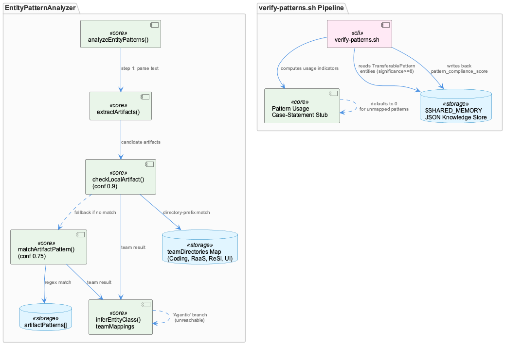
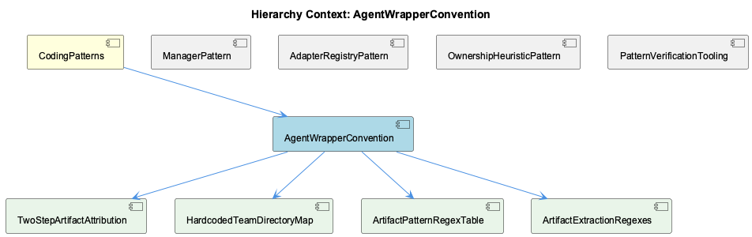

# AgentWrapperConvention

**Type:** SubComponent

# AgentWrapperConvention — Technical Insight Document

## What It Is

AgentWrapperConvention is centered on `src/ontology/heuristics/EntityPatternAnalyzer.ts`, a heuristic classification component that attributes free-text knowledge-base content to owning teams via a confidence-scored, two-step pattern-matching cascade. It also encompasses the ancillary compliance-scanning tooling in `scripts/knowledge-management/verify-patterns.sh`, which reads and writes pattern-usage metadata back into a shared knowledge store. As a child of CodingPatterns, this convention takes the parent's Manager/Classifier naming philosophy (`LLMServiceProvider`, `MockModeManager`, `SensitivityClassifier`) and repurposes it defensively: instead of prescribing how classes should be named, it uses those naming patterns as *signals* for automatically inferring team ownership of code artifacts mentioned in text.

## Architecture and Design

The core design is a two-layer classification cascade, implemented as `TwoStepArtifactAttribution`: `analyzeEntityPatterns()` (line 69) first extracts candidate artifacts via `extractArtifacts()` (line 104), then tries `checkLocalArtifact()` (line 141, directory-prefix match, confidence 0.9) before falling back to `matchArtifactPattern()` (line 161, regex match, confidence 0.75). This encodes an explicit trust hierarchy — directory placement, enforced by repo structure, is trusted more than naming conventions, which can drift — as documented in the sibling OwnershipHeuristicPattern.

Structurally, the component is a data-driven registry rather than an object-oriented adapter set (per sibling AdapterRegistryPattern): `HardcodedTeamDirectoryMap` (the `teamDirectories` Map) and `ArtifactPatternRegexTable` (the `artifactPatterns` array of `{team, patterns, entityClassMap}`) are two parallel, independently maintained lookup tables rather than a single source of truth. Notably, per sibling ManagerPattern, `EntityPatternAnalyzer` diverges from the parent's Manager-suffix convention entirely — it has no init/start/stop lifecycle, no mutable state, and is a pure, stateless classifier over data frozen at construction, despite structurally resembling the Manager pattern's registry-building behavior.

A key architectural tension: the parent codebase's documented philosophy that "classification thresholds and categories are treated as data, not code" (per prompt-classifier.yaml and <AWS_SECRET_REDACTED>) is violated here — `teamDirectories`, `artifactPatterns`, and `teamMappings` are hardcoded TypeScript literals in the constructor, not externally loaded YAML.

## Implementation Details

`ArtifactExtractionRegexes` — implemented in `extractArtifacts()` — runs four independent regex passes (file paths, npm scopes, class-suffix patterns, bare directory prefixes) into a single untyped `Set<string>`. This produces overlapping, near-duplicate artifacts (e.g., `src/ontology/types.ts` and `src/ontology/`) that get independently re-scored, meaning the same underlying reference can yield different confidence values depending on extraction order.

The class-suffix regex (`/[A-Z][a-zA-Z]+(Service|Agent|Manager|Engine|Handler|Analyzer|Classifier|Filter|Monitor)/g`) mirrors the parent's Manager/Classifier convention but is used <COMPANY_NAME_REDACTED>-level as a *detection heuristic* rather than an implementation rule — meaning any future renaming of a `*Manager`/`*Classifier` class in the broader codebase could silently degrade team-attribution accuracy here, with no compile-time signal.

`TwoStepArtifactAttribution`'s cascade has a subtle flaw: because `extractArtifacts()`'s Set preserves insertion order (file paths, then npm packages, then class names, then directories), and `analyzeEntityPatterns()` returns on the *first* artifact producing any match rather than the highest-confidence match overall, evidence priority is accidental rather than designed.

`HardcodedTeamDirectoryMap` and `ArtifactPatternRegexTable` cover exactly four teams (Coding, RaaS, ReSi, UI) via plain string-literal prefixes and regexes — not enum-backed constants — so directory renames silently degrade Layer 1 attribution. Separately, `inferEntityClass()`'s `teamMappings` contains a dead 'Agentic' branch (Agent→AgentFramework, RAG→RAGSystem, etc.) unreachable from either caller, suggesting a partially removed or unfinished fifth team.

The PatternVerificationTooling sibling, `verify-patterns.sh`, closes a feedback loop: it scans the repo for pattern compliance (console.log vs Logger, useState vs Redux, network-awareness, documentation), reads TransferablePattern entities from `$SHARED_MEMORY` JSON, and writes `metadata.last_pattern_verification`/`metadata.pattern_compliance_score` back into that same file. Its usage-tracking is a case-statement stub keyed on name substrings (`*Logging*`, `*Redux*|*State*`) that defaults to zero for any unrecognized pattern name — a scaling gap for newly added patterns. It also contains a latent bash bug: `((PASSED_CHECKS++))` under `set -euo pipefail` can evaluate falsy on a zero-to-one transition, risking silent early script termination.

## Integration Points

AgentWrapperConvention integrates upward with CodingPatterns by consuming (and repurposing) its Manager/Classifier naming convention as classification signal rather than structural mandate. It shares implementation surface with all four siblings — ManagerPattern, AdapterRegistryPattern, OwnershipHeuristicPattern, and PatternVerificationTooling — each describing a different facet of the same `EntityPatternAnalyzer.ts` file. Its four children — TwoStepArtifactAttribution, HardcodedTeamDirectoryMap, ArtifactPatternRegexTable, and ArtifactExtractionRegexes — decompose the analyzer's control flow, data tables, and extraction logic respectively. Externally, `verify-patterns.sh` couples tightly to a specific `$SHARED_MEMORY` JSON schema (`.entities[]`, `.metadata.last_pattern_verification`, `.metadata.pattern_compliance_score`), and resolves its repo root via the same layered environment-variable fallback style (`CODING_TOOLS_PATH` → `CODING_REPO` → computed default) used elsewhere for LLM proxy URL resolution.

## Usage Guidelines

Developers extending team ownership rules must edit both `teamDirectories` and `artifactPatterns` in tandem, since they are independently maintained parallel structures — a mismatch (as with the dead 'Agentic' branch) silently produces unreachable code. Given the hardcoded, non-YAML nature of these rules, this component should either be reconciled with the <AWS_SECRET_REDACTED> config-driven convention, or its exception explicitly documented. Renaming any `*Manager`/`*Classifier`-suffixed class elsewhere in the codebase should trigger a review of `extractArtifacts()`'s class-suffix regex. When adding new TransferablePatterns to the knowledge base, corresponding checks must be manually wired into `verify-patterns.sh`'s case statement — it does not scale automatically. Finally, the bash increment pattern in `verify-patterns.sh` should be replaced with a safer construct (e.g., `PASSED_CHECKS=$((PASSED_CHECKS+1))`) to eliminate the `set -e` early-exit risk.

## Hierarchy Context

### Parent
- [CodingPatterns](./CodingPatterns.md) -- [LLM] The Manager-suffix naming convention observed across LLMServiceProvider, MockModeManager, CachingMechanism, CircuitBreakerManager, and BudgetTracker reflects a deliberate architectural choice to encapsulate stateful, cross-cutting concerns behind a consistent interface shape. New developers should expect any class named *Manager to expose lifecycle methods (init/start/stop or similar), own some internal mutable state (cache entries, circuit state, budget counters), and be instantiated once per service boundary rather than per-request. This convention makes it easy to locate resilience and resource-control logic by grep'ing for 'Manager' across the codebase, and it implies that when adding a new cross-cutting concern (e.g., rate limiting), the idiomatic approach is to add a RateLimitManager sibling rather than embedding the logic inline in provider code.

### Children
- [TwoStepArtifactAttribution](./TwoStepArtifactAttribution.md) -- [LLM] EntityPatternAnalyzer.analyzeEntityPatterns() implements a short-circuit two-step confidence cascade: for each artifact extracted from free text, it calls checkLocalArtifact() first (directory-prefix match, confidence 0.9) and only calls matchArtifactPattern() (regex match, confidence 0.75) if that fails, then returns on the FIRST artifact that produces any match at all — not the highest-confidence match across all extracted artifacts. Because extractArtifacts() populates a Set (whose JavaScript iteration order is insertion order: file paths, then npm packages, then class names, then bare directories), the effective priority of evidence types is accidental rather than designed — a class name like 'BudgetTracker' appearing before a directory reference like 'src/ontology/' in the source text will never even be tried against checkLocalArtifact() if an earlier-extracted artifact already matched, even weakly.
- [HardcodedTeamDirectoryMap](./HardcodedTeamDirectoryMap.md) -- [LLM] The `teamDirectories` Map constructed in `EntityPatternAnalyzer`'s constructor hardcodes exactly four teams (Coding, RaaS, ReSi, UI) with directory prefixes like `src/ontology`, `raas-service`, `virtual-target`, and `curriculum-alignment`. Because `checkLocalArtifact()` iterates this Map with `dirs.some((dir) => artifact.startsWith(dir))`, any artifact path extracted by `extractArtifacts()` that doesn't begin with one of these twelve literal strings falls through to `matchArtifactPattern()` or returns null entirely — meaning a new team or a renamed top-level directory (e.g. `src/ontology` becoming `src/knowledge-ontology`) silently degrades Layer 1 attribution with no compiler or test signal, since these are plain string literals, not enum-backed constants.
- [ArtifactPatternRegexTable](./ArtifactPatternRegexTable.md) -- [LLM] The `ArtifactPatternRegexTable` — the `artifactPatterns` array literal in `EntityPatternAnalyzer.ts`'s constructor — is a hardcoded four-team lookup table (Coding, RaaS, ReSi, UI) that pairs an array of case-insensitive `RegExp` objects with a parallel `entityClassMap`. Each team entry's patterns and map keys are maintained by hand and only loosely coupled: for example the UI team's `entityClassMap` includes a `Redux` key mapped to `ReduxState`, and the corresponding pattern `/React(Component)?|Redux/i` does match bare 'Redux' mentions, but `inferEntityClassFromPattern` (referenced but truncated in the visible file) must still correctly extract 'Redux' as the map key from an arbitrary matched substring like 'ReduxState' or 'useReduxHook' — a fragile string-prefix inference rather than a captured regex group.
- [ArtifactExtractionRegexes](./ArtifactExtractionRegexes.md) -- [LLM] The 'ArtifactExtractionRegexes' component centers on extractArtifacts() in src/ontology/heuristics/EntityPatternAnalyzer.ts, which runs four independent regex passes over free-text knowledge content into a single Set<string>: a file-path pattern (`/[a-z-]+\/[a-z-]+\/[a-zA-Z0-9_\-\/]+\.(ts|js|cpp|java|tsx|jsx|py|go|rs)/g`), an npm-scope pattern (`/@[a-z-]+\/[a-z-]+/g`), the Service/Agent/Manager/... class-suffix pattern, and a bare directory-prefix pattern (`/[a-z-]+\/[a-z-]+\//g`). Because all four write into the same untyped Set, a single substring like 'src/ontology/types.ts' can simultaneously satisfy the file-path pattern AND (via prefix overlap) get partially re-matched by the directory pattern, producing near-duplicate artifacts ('src/ontology/types.ts' and 'src/ontology/') that are then independently re-checked against teamDirectories and artifactPatterns in the analyzeEntityPatterns() loop — meaning the same underlying reference can be scored twice with different confidence values depending on which regex-extracted variant happens to hit a match first.

### Siblings
- [ManagerPattern](./ManagerPattern.md) -- [LLM] EntityPatternAnalyzer (src/ontology/heuristics/EntityPatternAnalyzer.ts) is suffixed 'Analyzer', not 'Manager', yet it structurally resembles the Manager convention described for the parent: it builds two readonly, immutable collections in its constructor — `teamDirectories` (a `Map<string, string[]>`) and `artifactPatterns` (an array of `{team, patterns: RegExp[], entityClassMap}` objects) — and exposes exactly one lifecycle-free public method, `analyzeEntityPatterns()`. Unlike the CircuitBreakerManager/BudgetTracker pattern described in the parent observations, there is no init/start/stop, no mutable counters, and no connect/disconnect semantics; the class is effectively a stateless classifier over data frozen at construction time. This is evidence the 'Manager' suffix convention is NOT universal — naming diverges for components whose job is pure classification rather than owning a stateful external resource.
- [AdapterRegistryPattern](./AdapterRegistryPattern.md) -- [LLM] EntityPatternAnalyzer (src/ontology/heuristics/EntityPatternAnalyzer.ts) is the concrete implementation of the 'registry + adapter' idiom described at the parent (CodingPatterns) level: `teamDirectories` is a Map acting as a lightweight registry keying team names to directory prefixes, and `artifactPatterns` is an array-of-records registry keying team names to arrays of RegExp + an `entityClassMap`. Rather than a class-per-adapter registry (as implied by ProviderRegistryManager or SpecstoryAdapter/TranscriptAdapter), this component implements the same conceptual pattern with plain data structures (Map and array literals) instead of instantiated adapter objects — a 'data-driven registry' variant of the adapter-registry idiom rather than an object-oriented one.
- [OwnershipHeuristicPattern](./OwnershipHeuristicPattern.md) -- [LLM] EntityPatternAnalyzer (src/ontology/heuristics/EntityPatternAnalyzer.ts) implements the ownership heuristic as a two-step cascade inside analyzeEntityPatterns(): step (a) checkLocalArtifact() does an O(teams) prefix match against a hardcoded teamDirectories Map (e.g. 'src/ontology', 'src/knowledge-management', 'src/live-logging', 'scripts', '.specstory' → 'Coding'), and only if that misses does step (b) matchArtifactPattern() fall back to a set of per-team RegExp arrays (artifactPatterns) keyed on class-name suffixes like *Manager, *Classifier, *Analyzer. This ordering encodes an explicit confidence hierarchy: a direct path match returns confidence 0.9 while a naming-convention match returns 0.75, meaning the heuristic trusts 'where a file lives' strictly more than 'what a class is called' — a defensible choice given that directory placement is enforced by repo structure while naming conventions can drift.
- [PatternVerificationTooling](./PatternVerificationTooling.md) -- [LLM] EntityPatternAnalyzer (src/ontology/heuristics/EntityPatternAnalyzer.ts) implements the PatternVerificationTooling component's core classification logic as a two-step, two-layer detector: `checkLocalArtifact` performs a direct team-directory prefix match (via the `teamDirectories` Map, confidence 0.9) before falling back to `matchArtifactPattern`, which runs a table of per-team regexes (`artifactPatterns`, confidence 0.75) against extracted artifact strings. This mirrors the 'Manager wraps external resource lifecycle' and 'registry + adapter' idioms noted in the parent context: rather than a single monolithic dispatcher, ownership resolution is data-driven (the `entityClassMap` and `teamDirectories` tables) so adding a new team means appending to a table, not editing `analyzeEntityPatterns`'s control flow — the same config-over-code philosophy attributed to <AWS_SECRET_REDACTED> in the parent observations.

---

*Generated from 10 observations*
