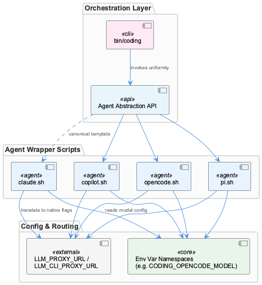
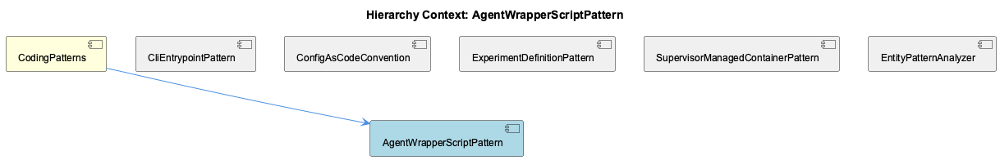

# AgentWrapperScriptPattern

**Type:** SubComponent

Wrappers must be manually kept in sync whenever a new common capability (model selection, proxy routing) is added, since there is no shared base library between claude.sh, copilot.sh, opencode.sh, pi.sh

# AgentWrapperScriptPattern

## What It Is

AgentWrapperScriptPattern is implemented under `config/agents/` through a family of shell scripts — `claude.sh`, `copilot.sh`, `opencode.sh`, and `pi.sh` — each acting as an adapter between a third-party agent CLI and the common invocation expectations of the Coding infrastructure. As a SubComponent of the broader `CodingPatterns` grouping, it embodies the same adapter philosophy that governs how heterogeneous tools get normalized into uniform interfaces. Each wrapper is a thin translation layer: it reads Coding-wide configuration (typically environment variables) and converts it into the specific flags or config files that its underlying agent binary expects, rather than embedding any business logic of its own.

## Architecture and Design

The core architectural pattern is a per-tool adapter/wrapper design, where uniformity is achieved not through shared code but through a shared *contract*. That contract is formally documented in `docs/architecture/agent-abstraction-api.md`, which defines the common interface each script must satisfy so that orchestration layers — most notably `bin/coding` — can invoke any agent without needing to know which one it is. This lets calling code stay agent-agnostic while each wrapper independently owns the translation logic for its target CLI.

A key design decision is the deliberate absence of a shared base library: `claude.sh`, `copilot.sh`, `opencode.sh`, and `pi.sh` do not inherit from or delegate to common shell functions. This trades DRY-ness for independence and simplicity per script, at the cost of requiring manual synchronization whenever a new cross-cutting capability (model selection, proxy routing) is introduced — each script must be updated individually.

## Implementation Details

Each wrapper reads its own distinct environment variable namespace to select configuration, exemplified by `CODING_OPENCODE_MODEL` in `opencode.sh`, which selects model configuration for that agent without requiring changes to caller code. This namespacing convention (agent-specific prefixes) is what allows the wrapper scripts to coexist and be invoked uniformly while still exposing agent-specific tuning knobs.

Proxy routing is handled similarly: variables in the `LLM_PROXY_URL` / `LLM_CLI_PROXY_URL` family are translated by wrappers into agent-native flags, indicating that proxy configuration is a cross-cutting concern each script independently implements. This is one of the capabilities explicitly called out as needing manual propagation across all four scripts since there's no shared implementation.

`docs/architecture/adding-new-agent.md` designates `claude.sh` as the canonical template for new wrapper implementations, meaning its structure — reading namespaced env vars, translating them to agent-native syntax, and satisfying the abstraction API — should be replicated when onboarding a new agent CLI.

## Integration Points

The primary integration point is the orchestration layer, likely `bin/coding`, which relies on the common interface described in `docs/architecture/agent-abstraction-api.md` to invoke any wrapper script uniformly. This decouples the orchestration logic from agent-specific details entirely. Within its parent `CodingPatterns`, this pattern sits alongside siblings like `CliEntrypointPattern` (standalone CLI entrypoints such as `scripts/knowledge-management/verify-patterns.sh`) and `ConfigAsCodeConvention` (declarative, JSON/jq-driven configuration), reflecting a broader system preference for declarative, environment/config-driven behavior over hardcoded branching logic. It also shares conceptual DNA with `ExperimentDefinitionPattern`, where configuration/results are documented separately from code — similarly, wrapper behavior is documented in `docs/architecture/agent-abstraction-api.md` and `adding-new-agent.md` rather than being self-describing in code.

## Usage Guidelines

Developers adding support for a new agent should start from `claude.sh` as the canonical template, per `docs/architecture/adding-new-agent.md`, and ensure the new wrapper satisfies the interface documented in `docs/architecture/agent-abstraction-api.md`. Because there is no shared base library, any new common capability (e.g., a new proxy variable or model-selection mechanism) must be manually implemented across `claude.sh`, `copilot.sh`, `opencode.sh`, and `pi.sh` — a maintainability risk that requires discipline and cross-checking when such features are introduced. Wrapper scripts should remain thin translation layers: business logic belongs in the orchestration layer or the agent binaries themselves, not in the wrapper. Environment variable naming should follow the established namespacing convention (e.g., `CODING_<AGENT>_<SETTING>`) to avoid collisions and preserve clarity about which wrapper consumes which variable.

## Hierarchy Context

### Parent
- [CodingPatterns](./CodingPatterns.md) -- [LLM] The agent wrapper scripts under config/agents/ (claude.sh, copilot.sh, opencode.sh, pi.sh) implement a consistent adapter pattern where each script normalizes a distinct third-party CLI's invocation surface into a common interface expected by the rest of the Coding infrastructure. Rather than having callers branch on which agent is being invoked, each wrapper reads its own set of environment variables (e.g., CODING_OPENCODE_MODEL for opencode.sh) and translates them into the flags or config files that the underlying binary expects. This pattern lets orchestration code (likely in bin/coding or docs/architecture/agent-abstraction-api.md-described layers) treat all agents uniformly, at the cost of needing to keep each wrapper script in sync whenever a new common capability (like model selection or proxy routing) is added — a new developer adding agent support should look at an existing wrapper like claude.sh as the canonical template, per docs/architecture/adding-new-agent.md.

### Siblings
- [CliEntrypointPattern](./CliEntrypointPattern.md) -- scripts/knowledge-management/verify-patterns.sh acts as a standalone CLI entrypoint invoked directly rather than through a shared bin/ dispatcher, computing paths relative to SCRIPT_DIR
- [ConfigAsCodeConvention](./ConfigAsCodeConvention.md) -- verify-patterns.sh reads pattern definitions dynamically from a jq-queried JSON knowledge base file ($SHARED_MEMORY) filtering entities by entityType == 'TransferablePattern' and significance >= 8
- [ExperimentDefinitionPattern](./ExperimentDefinitionPattern.md) -- docs/benchmarks/coding-v1/README.md and RESULTS.md describe a benchmark named coding-v1 whose configuration/results are documented separately from code, implying a declarative experiment definition
- [SupervisorManagedContainerPattern](./SupervisorManagedContainerPattern.md) -- No supervisord configuration files or Dockerfile content were present in the provided Source Files to substantiate specific observations
- [EntityPatternAnalyzer](./EntityPatternAnalyzer.md) -- EntityPatternAnalyzer.teamDirectories Map hardcodes directory-to-team ownership, e.g. 'Coding' owns src/ontology, src/knowledge-management, scripts, .specstory

---

*Generated from 6 observations*
