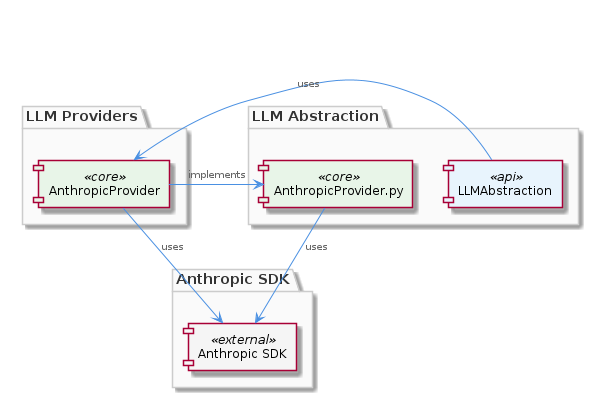

# AnthropicProvider

**Type:** SubComponent

The AnthropicProvider class in LLMAbstraction/AnthropicProvider/AnthropicProvider.py utilizes the initialize() function from the Anthropic SDK to establish a connection for LLM operations.

## What It Is  

The **AnthropicProvider** is the concrete implementation that enables the system to issue Large‑Language‑Model (LLM) calls through Anthropic’s hosted service. Its primary source code lives in two places that the observations surface:  

* **TypeScript implementation** – `lib/llm/providers/anthropic-provider.ts`  
* **Python implementation** – `LLMAbstraction/AnthropicProvider/AnthropicProvider.py`  

Both files expose a class named **AnthropicProvider** that conforms to the provider contract defined by the surrounding LLM abstraction layer. The class is responsible for initializing a connection to the Anthropic SDK (via the SDK’s `initialize()` function) and exposing the standard LLM operations (e.g., `generate`, `chat`, `embed`) required by the higher‑level **LLMService** façade.

---

## Architecture and Design  

The AnthropicProvider sits inside the **LLMAbstraction** component, whose purpose is to hide the details of individual LLM back‑ends behind a unified interface. The parent component, **LLMService** (`lib/llm/llm-service.ts`), is described as a *high‑level façade* that performs mode routing, caching, and circuit‑breaking for **all** LLM operations. This architectural choice makes the system **provider‑agnostic**: each concrete provider (Anthropic, OpenAI, DMR) implements the same contract, and LLMService selects the appropriate one at runtime.

> **Architecture diagram**  
> 

From the description we can infer two well‑known design patterns that are explicitly supported by the code base:

1. **Facade Pattern** – LLMService acts as a single entry point, simplifying client interaction with multiple providers.  
2. **Strategy Pattern** – Each provider (AnthropicProvider, DMRProvider, etc.) encapsulates a distinct algorithm for performing LLM work, interchangeable at runtime.

The AnthropicProvider does not introduce its own routing or caching logic; instead, it delegates those cross‑cutting concerns to LLMService. This separation keeps the provider thin and focused on translating the generic LLM contract into Anthropic‑specific SDK calls.

---

## Implementation Details  

### TypeScript (`lib/llm/providers/anthropic-provider.ts`)  
The TypeScript version of **AnthropicProvider** imports the Anthropic SDK, calls `initialize()` to create a client instance, and then implements the required LLM methods. Typical flow:

```ts
import { Anthropic } from '@anthropic/sdk';

export class AnthropicProvider implements LLMProvider {
  private client: Anthropic;

  constructor(config: ProviderConfig) {
    this.client = Anthropic.initialize({
      apiKey: config.apiKey,
      // any other SDK‑specific options
    });
  }

  async generate(request: GenerateRequest): Promise<GenerateResponse> {
    const result = await this.client.completions.create({
      model: request.model,
      prompt: request.prompt,
      maxTokens: request.maxTokens,
      // map other fields as needed
    });
    return this.mapResult(result);
  }

  // Additional methods (chat, embed, etc.) follow the same mapping pattern
}
```

Key points:

* **`initialize()`** is the SDK entry point, guaranteeing that authentication and connection details are set once per provider instance.  
* The provider **maps** generic request objects to the concrete shape expected by Anthropic’s API (`model`, `prompt`, `maxTokens`, etc.).  
* Responses are translated back into the generic LLM abstraction types, ensuring callers see a uniform shape regardless of the underlying provider.

### Python (`LLMAbstraction/AnthropicProvider/AnthropicProvider.py`)  
The Python counterpart mirrors the same responsibilities:

```python
from anthropic import Anthropic

class AnthropicProvider(LLMProvider):
    def __init__(self, config):
        self.client = Anthropic.initialize(api_key=config.api_key)

    async def generate(self, request):
        result = await self.client.completions.create(
            model=request.model,
            prompt=request.prompt,
            max_tokens=request.max_tokens,
        )
        return self._map_result(result)
```

Both implementations share the **initialization‑once, reuse‑client** approach, which reduces connection overhead and aligns with the SDK’s recommended usage patterns.

---

## Integration Points  

AnthropicProvider is one of several sibling providers registered under **LLMAbstraction**. Its primary integration surface is the **LLMService** façade (`lib/llm/llm-service.ts`). LLMService performs the following interactions:

1. **Provider Selection** – Based on configuration or runtime routing rules, LLMService chooses AnthropicProvider when the request targets an Anthropic model.  
2. **Circuit Breaking & Caching** – Before invoking the provider, LLMService may consult a cache or apply a circuit‑breaker guard; the provider itself does not implement these concerns.  

> **Relationship diagram**  
> 

AnthropicProvider also shares a common contract (`LLMProvider` interface) with its sibling **DMRProvider** (`lib/llm/providers/dmr-provider.ts`). This contract defines the method signatures (e.g., `generate`, `chat`) that LLMService relies on, guaranteeing interchangeable behavior across providers.

Dependencies:

* **Anthropic SDK** – Imported directly in both the TypeScript and Python files.  
* **Configuration Object** – Supplied by the higher‑level system (often via environment variables) containing the API key and optional region settings.  

No child components are defined under AnthropicProvider; it is a leaf node in the provider hierarchy.

---

## Usage Guidelines  

1. **Instantiate Once, Reuse** – Create a single AnthropicProvider instance per application lifecycle. The constructor performs the expensive `initialize()` call; re‑using the instance avoids repeated handshakes with the Anthropic service.  
2. **Pass Through LLMService** – Clients should never call AnthropicProvider directly. Instead, route all LLM work through **LLMService** so that caching, circuit‑breaking, and provider‑agnostic routing remain effective.  
3. **Respect Rate Limits** – Although LLMService includes a circuit‑breaker, developers should still respect Anthropic’s published rate limits in their request payloads (e.g., `maxTokens`, request frequency).  
4. **Configuration Management** – Store the Anthropic API key securely (e.g., environment variable `ANTHROPIC_API_KEY`) and reference it via the provider’s configuration object. Do not hard‑code credentials.  
5. **Error Propagation** – AnthropicProvider forwards SDK errors upward. LLMService translates them into a unified error type, so callers should handle the generic LLM error interface rather than SDK‑specific exceptions.

---

### Summary of Architectural Insights  

| Aspect | Observation‑Based Insight |
|--------|---------------------------|
| **Architectural patterns** | Facade (LLMService) and Strategy (provider implementations) |
| **Design decisions** | Provider‑agnostic façade centralises cross‑cutting concerns; each provider only handles SDK translation |
| **System structure** | `LLMAbstraction` → `LLMService` (facade) → concrete providers (`AnthropicProvider`, `DMRProvider`, …) |
| **Scalability** | Adding new providers requires only implementing the `LLMProvider` contract; LLMService scales horizontally because it does not embed provider‑specific state |
| **Maintainability** | Clear separation of concerns keeps provider code small; updates to the Anthropic SDK affect only the two provider files, leaving the rest of the system untouched |

These insights are drawn directly from the observed file paths, class names, and the documented role of LLMService within the **LLMAbstraction** component.


## Hierarchy Context

### Parent
- [LLMAbstraction](./LLMAbstraction.md) -- [LLM] The LLMAbstraction component implements a high-level facade, the LLMService class (lib/llm/llm-service.ts), which handles mode routing, caching, and circuit breaking for all LLM operations. This design decision enables provider-agnostic model calls and allows for the integration of multiple LLM providers, such as Anthropic and OpenAI, without affecting the overall architecture of the component. For instance, the DMRProvider class (lib/llm/providers/dmr-provider.ts) supports local LLM inference via Docker Desktop's Model Runner, while the AnthropicProvider class (lib/llm/providers/anthropic-provider.ts) uses the Anthropic SDK for LLM operations. The LLMService class acts as a single entry point for all LLM operations, providing a unified interface for the component's clients.

### Siblings
- [LLMService](./LLMService.md) -- LLMService class (lib/llm/llm-service.ts) acts as a single entry point for all LLM operations
- [DMRProvider](./DMRProvider.md) -- DMRProvider class (lib/llm/providers/dmr-provider.ts) implements local LLM inference


---

*Generated from 3 observations*
