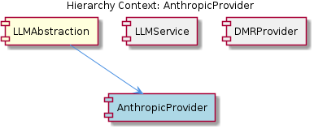

# AnthropicProvider

**Type:** SubComponent

The AnthropicProvider class provides a specific implementation of the LLM provider interface, allowing the LLMService to interact with the Anthropic LLM service.

## What It Is  

The **AnthropicProvider** is a concrete implementation of the LLM‑provider interface that enables the application to communicate with Anthropic’s large‑language‑model service. Its source lives in the file **`lib/llm/providers/anthropic-provider.ts`**. The class is instantiated and managed by the **LLMService** (found at `lib/llm/llm-service.ts`) and is one of several provider modules that sit under the **LLMAbstraction** component. In practice, the provider holds its own configuration – encapsulated in the **AnthropicConfig** child component – which includes items such as the `ANTHROPIC_API_KEY` and any endpoint URLs required for authentication and request routing.

---

## Architecture and Design  

The surrounding codebase follows a **modular provider architecture**. Each LLM vendor (Anthropic, DMR, etc.) is represented by a dedicated provider class (`AnthropicProvider`, `DMRProvider`) that implements a common provider interface. This design allows the **LLMService** to treat all providers uniformly while delegating vendor‑specific details to the appropriate module.  

The **LLMAbstraction** component serves as a **facade** for all LLM‑related operations. By exposing a single public entry point – the `LLMService` – the system centralises concerns such as mode routing, caching, circuit‑breaking, budget or sensitivity checks, and provider fallback. The description of LLMService explicitly states that it “instantiates and manages the various provider classes,” confirming a **factory‑like responsibility** for provider lifecycle management.  

Because each provider lives in its own file under `lib/llm/providers/`, the architecture also exhibits a **separation‑of‑concerns** principle: the provider knows how to talk to its external API, while the service knows *when* and *why* to use it. The relationship hierarchy is therefore:

* **LLMAbstraction** (parent) → **LLMService** (orchestrator) → **AnthropicProvider** (concrete provider) → **AnthropicConfig** (configuration child).  

Sibling providers (e.g., `DMRProvider`) share the same interface contract and are interchangeable from the perspective of the service, enabling easy addition of new vendors without altering the core service logic.

---

## Implementation Details  

Although no concrete symbols were listed in the observations, the documented structure allows us to infer the key implementation pieces:

1. **Provider Interface** – Defined somewhere within the LLM abstraction layer, this interface declares the methods that every provider must implement (e.g., `generateCompletion`, `streamResponse`). `AnthropicProvider` implements this contract, translating generic calls into Anthropic‑specific HTTP requests.  

2. **AnthropicProvider (`lib/llm/providers/anthropic-provider.ts`)** – Holds a reference to an **AnthropicConfig** instance, reads the `ANTHROPIC_API_KEY` (and possibly a base URL), and constructs request payloads according to Anthropic’s API specification. The class likely contains private helper methods for request construction, error handling, and response parsing.  

3. **AnthropicConfig** – A lightweight configuration holder that encapsulates environment variables or configuration file values needed for authentication (`ANTHROPIC_API_KEY`) and any optional endpoint overrides. By isolating these values, the provider remains testable and can be swapped out with mock configurations in unit tests.  

4. **LLMService (`lib/llm/llm-service.ts`)** – Acts as the orchestrator. During initialisation it creates an instance of `AnthropicProvider` (and other providers) based on runtime configuration or feature flags. When a request arrives, LLMService decides which provider to use (e.g., based on model name or budget constraints), applies cross‑cutting concerns such as caching or circuit breaking, and then forwards the call to the selected provider.  

5. **Provider Fallback** – The service description mentions “provider fallback.” This suggests that if an Anthropic request fails (e.g., due to rate limits or circuit‑breaker activation), LLMService can transparently route the request to an alternative provider like `DMRProvider`, preserving continuity for the caller.

---

## Integration Points  

* **Parent – LLMAbstraction**: The provider is a child of the broader abstraction layer. Any changes to the provider interface must be reflected in LLMAbstraction to keep the contract stable.  

* **Sibling – DMRProvider**: Both providers share the same interface and are instantiated by LLMService. They therefore compete or cooperate based on the service’s routing logic (e.g., budget‑aware selection).  

* **Child – AnthropicConfig**: All authentication and endpoint details flow through this config object. The provider reads from it at construction time, making the config the primary integration surface for environment‑specific values.  

* **LLMService (`lib/llm/llm-service.ts`)**: The sole public façade that external callers use. All interactions with AnthropicProvider are mediated by LLMService, meaning that any consumer of LLM capabilities never references AnthropicProvider directly.  

* **External Dependencies** – While not listed, the provider inevitably depends on an HTTP client library (e.g., `axios` or `fetch`) to issue REST calls to Anthropic’s endpoints. It also likely relies on a logger and possibly a retry utility supplied by the broader application framework.

---

## Usage Guidelines  

1. **Consume via LLMService** – Developers should request LLM functionality through the `LLMService` façade rather than instantiating `AnthropicProvider` directly. This ensures that cross‑cutting concerns (caching, circuit breaking, budget checks) are consistently applied.  

2. **Configure Through AnthropicConfig** – The `ANTHROPIC_API_KEY` must be supplied in the environment or configuration file that `AnthropicConfig` reads. Changing the key or endpoint should be done by updating the config, not by editing provider code.  

3. **Respect Provider Fallback Semantics** – If a request is critical, callers can rely on LLMService’s fallback mechanism. However, they should be aware that the fallback may route to a different vendor, potentially altering cost or model behaviour.  

4. **Avoid Direct HTTP Calls** – All communication with Anthropic’s API should be performed by the provider’s internal methods. Bypassing the provider circumvents the unified error handling and metric collection baked into LLMService.  

5. **Testing** – When writing unit tests, mock `AnthropicConfig` and inject a stubbed version of `AnthropicProvider` into LLMService. Because the provider is isolated behind an interface, this substitution is straightforward and preserves test isolation.  

---

### Architectural Patterns Identified  

* **Provider / Strategy Pattern** – Separate classes (`AnthropicProvider`, `DMRProvider`) implement a common interface, allowing the service to select the appropriate strategy at runtime.  
* **Facade Pattern** – `LLMService` offers a simplified, unified API for all LLM operations, hiding the complexity of multiple providers.  
* **Factory / Service Locator** – LLMService creates and holds provider instances, centralising lifecycle management.  
* **Modular Architecture / Separation of Concerns** – Each vendor’s integration lives in its own module under `lib/llm/providers/`.  

### Design Decisions and Trade‑offs  

* **Modularity vs. Overhead** – Isolating each provider simplifies onboarding of new vendors but adds a small runtime cost for provider lookup and instantiation.  
* **Centralised Orchestration** – Placing routing, caching, and circuit‑breaking in LLMService guarantees consistency, yet it creates a single point of failure if the service becomes a bottleneck.  
* **Configuration Isolation** – Using `AnthropicConfig` isolates secrets, improving security and testability, at the expense of an extra indirection layer.  

### System Structure Insights  

The system is layered: **LLMAbstraction** (definition layer) → **LLMService** (orchestration layer) → **Provider modules** (integration layer) → **Config objects** (environment layer). This clear vertical separation aids both comprehension and future extension.  

### Scalability Considerations  

* Adding new providers is a matter of creating a new class under `lib/llm/providers/` that implements the existing interface – no changes to LLMService logic are required beyond registration.  
* Provider fallback and circuit‑breaking mechanisms built into LLMService help the system gracefully handle load spikes or third‑party throttling, supporting horizontal scaling of request traffic.  

### Maintainability Assessment  

The architecture’s strong modularity and explicit interface contracts make the codebase maintainable. Changes to Anthropic’s API are confined to `anthropic-provider.ts` and its config, leaving the rest of the system untouched. Centralising cross‑cutting concerns in LLMService reduces duplication and eases updates to caching or budgeting policies. The only maintainability risk is the potential for the service layer to become overly complex as more providers and policies are added; careful refactoring (e.g., extracting routing policies into separate modules) may be needed as the system grows.

## Diagrams

### Relationship

## Architecture Diagrams

## Hierarchy Context

### Parent
- [LLMAbstraction](./LLMAbstraction.md) -- [LLM] The LLMAbstraction component employs a modular architecture, with separate modules for different LLM providers, as seen in the DMRProvider class (lib/llm/providers/dmr-provider.ts) and the AnthropicProvider class (lib/llm/providers/anthropic-provider.ts). This design decision allows for easy integration of multiple LLM providers and provides a high-level facade for all LLM operations, handled by the LLMService class (lib/llm/llm-service.ts). The LLMService class acts as the single public entry point for all LLM operations, handling mode routing, caching, circuit breaking, budget/sensitivity checks, and provider fallback. This is evident in the code, where the LLMService class is responsible for instantiating and managing the various provider classes, such as DMRProvider and AnthropicProvider.

### Children
- [AnthropicConfig](./AnthropicConfig.md) -- The presence of ANTHROPIC_API_KEY in the project documentation suggests that AnthropicConfig would handle this key for authentication purposes.

### Siblings
- [LLMService](./LLMService.md) -- The LLMService class is responsible for instantiating and managing various provider classes, such as DMRProvider and AnthropicProvider.
- [DMRProvider](./DMRProvider.md) -- The DMRProvider class is located in lib/llm/providers/dmr-provider.ts and is an example of a provider class managed by the LLMService.

---

*Generated from 3 observations*
