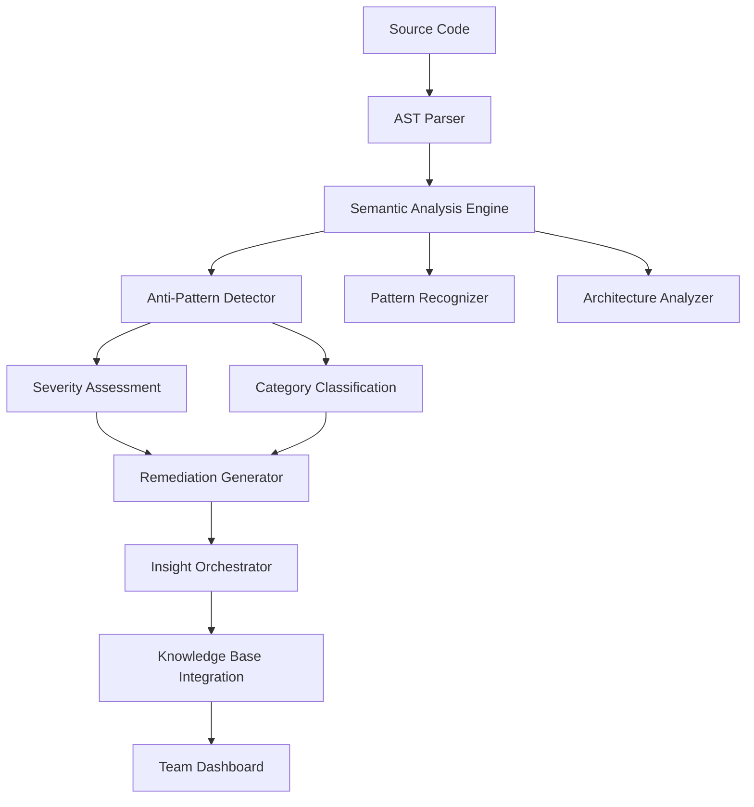

# Anti-Pattern Detection System

## Overview

**AntiPatternDetectionSystem** is a comprehensive framework for systematically identifying, categorizing, and addressing anti-patterns in codebases through automated analysis and guided remediation workflows.

## Semantic Analysis Workflow Integration

This pattern was automatically detected and documented by the Semantic Analysis System during the analysis of code pattern detection workflows. The system identified this as a critical component of the overall pattern analysis architecture with the following workflow:

### Automated Detection Process
1. **Session Analysis**: The semantic analysis system analyzed 5 conversation logs to extract pattern insights
2. **Multi-Source Analysis**: Combined conversation content, repository changes, and web research
3. **Pattern Recognition**: Identified anti-pattern detection as a key architectural component
4. **Significance Scoring**: Rated at 7/10 for team impact and architectural importance
5. **Documentation Generation**: Automatically created comprehensive documentation with diagrams

### Integration with Semantic Analysis System
```javascript
// Part of the semantic analysis workflow
const antiPatternAnalysis = await coordinator.analyzeCodePatterns({
  codebase: './src',
  analysisTypes: ['anti-patterns'],
  depth: 'full',
  generateDocs: true
});

// Automated insight extraction
const insights = await insightOrchestrator.extractInsights({
  sources: ['session-logs', 'git-commits', 'ast-analysis'],
  patterns: ['anti-patterns', 'code-smells', 'security-vulnerabilities'],
  significance: 7
});
```

### Semantic Analysis Architecture Components
The anti-pattern detection system operates within a larger semantic analysis framework:



### Workflow Execution Details
- **Input Sources**: `.specstory/history/` conversation logs, git commits, source code
- **Analysis Pipeline**: `insight-orchestrator.js` (922 lines) → pattern detection → documentation
- **Output Artifacts**: Markdown documentation, PlantUML/Mermaid diagrams (3-4 per insight)
- **Knowledge Integration**: Automated ukb commands for persistent storage

## Problem

Anti-pattern identification lacks systematic detection and automated remediation workflows for development teams. Without structured anti-pattern detection, teams face:

- **Hidden Technical Debt**: Anti-patterns accumulate unnoticed until they become major issues
- **Inconsistent Quality Standards**: Manual detection leads to subjective and incomplete assessments
- **Reactive Problem Solving**: Issues discovered only after performance or maintainability problems emerge
- **Knowledge Gaps**: Junior developers may not recognize common anti-patterns
- **Scaling Challenges**: Manual code reviews don't scale with team and codebase growth

## Solution

Comprehensive anti-pattern detection system with severity assessment and automated refactoring suggestions:

### Core Implementation

```javascript
// Anti-pattern detection engine
class AntiPatternDetector {
  constructor(config = {}) {
    this.analyzers = new Map();
    this.severityLevels = ['low', 'medium', 'high', 'critical'];
    this.categories = config.categories || [
      'maintainability',
      'performance', 
      'security',
      'design',
      'architecture'
    ];
  }

  async analyzeCodebase(codebasePath, options = {}) {
    const detectedPatterns = [];
    
    for (const [name, analyzer] of this.analyzers) {
      try {
        const patterns = await analyzer.analyze(codebasePath, options);
        detectedPatterns.push(...patterns.map(p => ({
          ...p,
          analyzer: name,
          detectedAt: new Date().toISOString()
        })));
      } catch (error) {
        console.error(`Analyzer ${name} failed:`, error);
      }
    }
    
    return this.categorizeAndPrioritize(detectedPatterns);
  }

  categorizeAndPrioritize(patterns) {
    return patterns
      .map(pattern => ({
        ...pattern,
        severity: this.calculateSeverity(pattern),
        category: this.categorizePattern(pattern),
        remediation: this.generateRemediationPlan(pattern)
      }))
      .sort((a, b) => this.severityWeight(b.severity) - this.severityWeight(a.severity));
  }
}
```

### Multi-Category Analysis Framework

#### Maintainability Anti-Patterns
```javascript
class MaintainabilityAnalyzer {
  async analyze(codebase) {
    return [
      await this.detectGodObjects(codebase),
      await this.detectLongMethods(codebase),
      await this.detectDeepNesting(codebase),
      await this.detectDuplicateCode(codebase)
    ].flat();
  }

  async detectGodObjects(codebase) {
    // Detect classes with too many responsibilities
    const classes = await this.extractClasses(codebase);
    return classes
      .filter(cls => cls.methods.length > 20 || cls.properties.length > 15)
      .map(cls => ({
        type: 'god-object',
        severity: cls.methods.length > 30 ? 'high' : 'medium',
        location: cls.location,
        description: `Class ${cls.name} has ${cls.methods.length} methods and ${cls.properties.length} properties`,
        suggestions: [
          'Extract related methods into separate classes',
          'Apply Single Responsibility Principle',
          'Consider using composition over inheritance'
        ]
      }));
  }
}
```

#### Performance Anti-Patterns
```javascript
class PerformanceAnalyzer {
  async analyze(codebase) {
    return [
      await this.detectNestedLoops(codebase),
      await this.detectMemoryLeaks(codebase),
      await this.detectInefficientQueries(codebase),
      await this.detectUnoptimizedRendering(codebase)
    ].flat();
  }

  async detectNestedLoops(codebase) {
    const ast = await this.parseCodebase(codebase);
    const nestedLoops = [];
    
    traverse(ast, {
      ForStatement(path) {
        const depth = this.calculateNestingDepth(path);
        if (depth >= 3) {
          nestedLoops.push({
            type: 'nested-loops',
            severity: depth >= 4 ? 'high' : 'medium',
            depth,
            location: path.node.loc,
            suggestions: [
              'Consider using Map/Set for O(1) lookups',
              'Extract inner logic to separate functions',
              'Use more efficient algorithms (e.g., hash tables)'
            ]
          });
        }
      }
    });
    
    return nestedLoops;
  }
}
```

#### Security Anti-Patterns
```javascript
class SecurityAnalyzer {
  async analyze(codebase) {
    return [
      await this.detectSQLInjection(codebase),
      await this.detectXSSVulnerabilities(codebase),
      await this.detectHardcodedSecrets(codebase),
      await this.detectInsecureRandomness(codebase)
    ].flat();
  }

  async detectHardcodedSecrets(codebase) {
    const patterns = [
      /password\s*=\s*["'][^"']+["']/i,
      /api[_-]?key\s*=\s*["'][^"']+["']/i,
      /secret\s*=\s*["'][^"']+["']/i,
      /token\s*=\s*["'][^"']+["']/i
    ];
    
    const violations = [];
    const files = await this.getSourceFiles(codebase);
    
    for (const file of files) {
      const content = await fs.readFile(file.path, 'utf8');
      for (const pattern of patterns) {
        const matches = content.match(pattern);
        if (matches) {
          violations.push({
            type: 'hardcoded-secrets',
            severity: 'critical',
            file: file.path,
            line: this.getLineNumber(content, matches.index),
            description: 'Hardcoded secret detected',
            suggestions: [
              'Use environment variables',
              'Implement secure secret management',
              'Use encrypted configuration files'
            ]
          });
        }
      }
    }
    
    return violations;
  }
}
```

## Key Benefits

### Proactive Quality Management
- **Early Detection**: Identify anti-patterns before they become major issues
- **Consistent Standards**: Automated detection ensures uniform quality criteria
- **Scalable Reviews**: Handle large codebases without proportional reviewer effort

### Systematic Assessment
- **Multi-dimensional Analysis**: Evaluate maintainability, performance, and security simultaneously
- **Severity Prioritization**: Focus efforts on highest-impact issues first
- **Trend Analysis**: Track anti-pattern evolution over time

### Guided Remediation
- **Specific Suggestions**: Concrete steps for addressing each anti-pattern
- **Best Practice Links**: Educational resources for team learning
- **Automated Fixes**: Simple refactoring suggestions for common issues

## Implementation Strategy

### Phase 1: Core Detection
```bash
# Install and configure anti-pattern detection
npm install @semantic-analysis/anti-pattern-detector
```

```javascript
// Basic configuration
const detector = new AntiPatternDetector({
  categories: ['maintainability', 'performance', 'security'],
  severity: ['medium', 'high', 'critical'],
  outputFormat: 'detailed'
});

const report = await detector.analyzeCodebase('./src');
```

### Phase 2: Integration Pipeline
```yaml
# CI/CD integration
anti-pattern-check:
  runs-on: ubuntu-latest
  steps:
    - name: Checkout code
      uses: actions/checkout@v3
    
    - name: Run Anti-Pattern Detection
      run: |
        npx anti-pattern-detector analyze src/
        npx anti-pattern-detector report --format=junit
    
    - name: Fail on Critical Issues
      run: npx anti-pattern-detector check --fail-on=critical
```

### Phase 3: Team Integration
```javascript
// Team dashboard integration
class AntiPatternDashboard {
  async generateTeamReport() {
    const report = await detector.analyzeCodebase('./src');
    
    return {
      summary: this.generateSummary(report),
      trends: await this.analyzeTrends(report),
      topIssues: report.filter(p => p.severity === 'critical'),
      recommendations: this.generateTeamRecommendations(report)
    };
  }
}
```

## Detection Categories

### Design Anti-Patterns
- **God Object**: Classes with too many responsibilities
- **Spaghetti Code**: Unstructured, difficult-to-follow code
- **Copy-Paste Programming**: Duplicated code blocks
- **Magic Numbers**: Hardcoded values without explanation

### Performance Anti-Patterns
- **Premature Optimization**: Optimizing before measuring
- **N+1 Queries**: Inefficient database access patterns
- **Memory Leaks**: Unreleased resources and references
- **Synchronous Blocking**: Blocking operations in async contexts

### Security Anti-Patterns
- **Hardcoded Secrets**: Passwords and keys in source code
- **SQL Injection**: Unsafe query construction
- **XSS Vulnerabilities**: Unescaped user input
- **Insecure Randomness**: Predictable random number generation

### Architecture Anti-Patterns
- **Circular Dependencies**: Modules depending on each other
- **Tight Coupling**: High interdependence between modules
- **Feature Envy**: Classes accessing other classes' data excessively
- **Inappropriate Intimacy**: Classes knowing too much about each other

## Severity Assessment Framework

### Critical (Immediate Action Required)
- Security vulnerabilities
- Performance bottlenecks affecting user experience
- Architecture issues preventing scalability

### High (Address in Current Sprint)
- Maintainability issues affecting team productivity
- Design flaws impacting code quality
- Performance issues with measurable impact

### Medium (Address in Next Release)
- Code organization improvements
- Minor performance optimizations
- Style and convention violations

### Low (Technical Debt Backlog)
- Code style inconsistencies
- Minor duplication
- Documentation improvements

## Remediation Workflows

### Automated Fixes
```javascript
// Simple refactoring suggestions
class AutomatedRefactoring {
  async generateFixes(antiPattern) {
    switch (antiPattern.type) {
      case 'magic-numbers':
        return this.extractConstants(antiPattern);
      case 'duplicate-code':
        return this.extractMethods(antiPattern);
      case 'long-method':
        return this.suggestMethodExtraction(antiPattern);
      default:
        return this.generateManualSuggestions(antiPattern);
    }
  }
}
```

### Team Education
```javascript
// Educational resource mapping
const educationalResources = {
  'god-object': [
    'https://refactoring.guru/smells/large-class',
    'Single Responsibility Principle explanation',
    'Class decomposition techniques'
  ],
  'sql-injection': [
    'https://owasp.org/www-community/attacks/SQL_Injection',
    'Parameterized query examples',
    'ORM security best practices'
  ]
};
```

## Integration Points

### IDE Integration
```javascript
// VS Code extension for real-time detection
const antiPatternExtension = {
  onDocumentChange(document) {
    const patterns = detector.analyzeDocument(document);
    this.updateDiagnostics(patterns);
  },
  
  provideCodeActions(document, range) {
    const pattern = this.getPatternAtRange(range);
    return pattern ? this.generateQuickFixes(pattern) : [];
  }
};
```

### Knowledge Management Integration
```javascript
// Store anti-pattern insights in knowledge base
const storeAntiPatternInsight = async (pattern) => {
  await mcp.call('memory_create_entities', {
    entities: [{
      name: `${pattern.type}AntiPattern`,
      entityType: 'AntiPattern',
      observations: [
        `Detected in ${pattern.file} at line ${pattern.line}`,
        `Severity: ${pattern.severity}`,
        `Category: ${pattern.category}`,
        `Remediation: ${pattern.suggestions.join(', ')}`
      ],
      significance: pattern.severity === 'critical' ? 9 : 
                   pattern.severity === 'high' ? 7 : 5
    }]
  });
};
```

## Metrics and Success Criteria

### Quality Metrics
- **Anti-Pattern Density**: Anti-patterns per thousand lines of code
- **Resolution Rate**: Percentage of detected issues resolved
- **Recurrence Rate**: How often the same anti-patterns reappear
- **Time to Resolution**: Average time from detection to fix

### Team Metrics
- **Detection Coverage**: Percentage of codebase analyzed
- **False Positive Rate**: Incorrectly flagged issues
- **Team Adoption**: Developer engagement with the system
- **Knowledge Transfer**: Team learning from anti-pattern education

## Advanced Features

### Machine Learning Enhancement
```javascript
// Pattern learning from team feedback
class PatternLearning {
  async learnFromFeedback(pattern, feedback) {
    const trainingData = {
      pattern: pattern.features,
      severity: feedback.agreedSeverity,
      relevance: feedback.relevanceScore
    };
    
    await this.updateModel(trainingData);
  }
}
```

### Custom Pattern Definition
```javascript
// Team-specific anti-pattern definitions
const customPatterns = {
  'team-specific-god-class': {
    detector: (ast) => this.detectLargeReactComponents(ast),
    threshold: { methods: 15, hooks: 8 },
    suggestions: [
      'Split into smaller components',
      'Extract custom hooks',
      'Use composition patterns'
    ]
  }
};
```

## Best Practices

### Detection Strategy
1. **Start Conservative**: Begin with high-confidence, low-false-positive patterns
2. **Iterative Refinement**: Adjust thresholds based on team feedback
3. **Context Awareness**: Consider project-specific constraints and requirements

### Team Adoption
1. **Education First**: Explain why anti-patterns matter before enforcing detection
2. **Gradual Rollout**: Introduce categories incrementally
3. **Positive Reinforcement**: Celebrate improvements and learning

### Maintenance
1. **Regular Calibration**: Update detection rules based on evolving standards
2. **Performance Monitoring**: Ensure detection doesn't slow development workflow
3. **Feedback Integration**: Continuously improve based on team input

---

*This anti-pattern detection system enables proactive code quality management through systematic identification and guided remediation of problematic code patterns.*