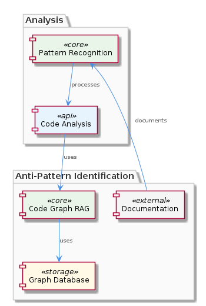
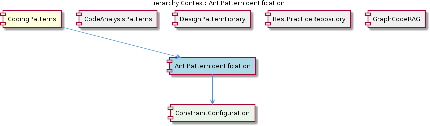

# AntiPatternIdentification

**Type:** SubComponent

Contributing to the documentation of anti-patterns could follow guidelines similar to those in integrations/code-graph-rag/CONTRIBUTING.md, though that is specific to the Code Graph RAG system.

## What It Is  

AntiPatternIdentification is defined as a **sub‑component** of the broader **CodingPatterns** domain. Although the source tree does not contain a dedicated implementation file (the “0 code symbols found” observation confirms this), its logical presence is inferred from the component hierarchy and from documentation that ties it to the **ConstraintConfiguration** child artifact. The primary purpose of AntiPatternIdentification is to *recognize ineffective or counter‑productive coding practices* and to record them so that developers can avoid repeating the same mistakes. In practice, this recognition is expected to be driven by the same graph‑based analysis engine that powers the parent **CodingPatterns** component – the **Graph‑Code RAG** system described in `integrations/code-graph-rag/README.md`.  

Because the component itself is not materialised in source code, the concrete entry points are indirect: the **EntityValidator** class in `integrations/mcp-server-semantic-analysis/src/agents/ontology-classification-agent.ts` validates entities (including anti‑patterns) as part of the batch processing pipeline, while the **ConstraintConfiguration** guide (`constraint-configuration.md`) supplies the rules that steer what constitutes an anti‑pattern. The sibling components – **CodeAnalysisPatterns**, **DesignPatternLibrary**, **BestPracticeRepository**, and **GraphCodeRAG** – share the same reliance on the graph‑based analysis, suggesting a common infrastructure that AntiPatternIdentification taps into.  

---

## Architecture and Design  

The architectural stance of AntiPatternIdentification is **composition over inheritance**: it composes its behaviour from the parent **CodingPatterns** graph‑analysis capabilities rather than implementing a separate engine. The parent component leverages a **graph‑based code representation** (as outlined in `integrations/code-graph-rag/README.md`) and a **batch processing pipeline** orchestrated by `ontology-classification-agent.ts`. This pipeline feeds code‑entity graphs into a **validation layer** (`EntityValidator`) that checks each node against a set of constraints defined in `constraint-configuration.md`.  

From an architectural pattern perspective, the system exhibits a **Pipeline pattern** (batch processing of code artefacts) combined with a **Validator pattern** (entity validation against constraints). The **Graph‑Code RAG** system functions as a **shared service** that multiple sibling components consume, providing a **service‑oriented** flavour without explicitly naming a micro‑service. The relationship diagram below illustrates how AntiPatternIdentification sits between the parent graph engine and its child constraint configuration, while also aligning with sibling components that reuse the same graph service.  

Design decisions evident from the observations include:

* **Centralised graph analysis** – rather than scattering static analysis logic across each pattern component, the team consolidated it in the Graph‑Code RAG system, reducing duplication.
* **Constraint‑driven anti‑pattern definition** – the use of `constraint-configuration.md` indicates a declarative approach, allowing new anti‑patterns to be added without code changes.
* **Batch‑oriented processing** – the presence of a batch pipeline (`ontology-classification-agent.ts`) suggests a trade‑off favoring throughput over immediate, per‑file feedback.

---

## Implementation Details  

Even though no concrete class named *AntiPatternIdentification* appears in the repository, its functional implementation can be traced through the following artefacts:

1. **EntityValidator** (`integrations/mcp-server-semantic-analysis/src/agents/ontology-classification-agent.ts`) – This TypeScript class receives graph nodes representing code constructs and validates them against the rules supplied by **ConstraintConfiguration**. When a node violates a rule, the validator flags it as an anti‑pattern candidate.

2. **ConstraintConfiguration** (`constraint-configuration.md`) – This markdown guide enumerates the constraints that define anti‑patterns (e.g., “no public mutable fields”, “avoid deep inheritance”). The file’s structure is likely parsed by a lightweight configuration loader used by the validator, enabling rule updates without recompilation.

3. **Graph‑Code RAG** (`integrations/code-graph-rag/README.md`) – Provides the underlying graph representation (nodes, edges, properties) and retrieval APIs that the validator queries. The README mentions “graph‑based code analysis” and “RAG (retrieval‑augmented generation)”, implying that the system can also surface contextual documentation when an anti‑pattern is detected.

4. **Contributing Guidelines** (`integrations/code-graph-rag/CONTRIBUTING.md`) – Although specific to the Graph‑Code RAG system, these guidelines hint at the contribution workflow for adding new anti‑patterns: developers should extend the constraint configuration, run the batch pipeline, and verify results via the validator.

The workflow can be summarised as: source code → graph extraction (Graph‑Code RAG) → batch pipeline (`ontology-classification-agent.ts`) → `EntityValidator` checks each graph node against constraints → flagged anti‑patterns are recorded for downstream documentation (e.g., in a **BestPracticeRepository**).

---

## Integration Points  

AntiPatternIdentification interacts with several parts of the ecosystem:

* **Parent – CodingPatterns**: The parent supplies the graph‑analysis engine and the batch processing framework. AntiPatternIdentification does not operate in isolation; it relies on the parent’s `EntityValidator` and the graph data structures defined in the Graph‑Code RAG system.

* **Sibling – CodeAnalysisPatterns**: Shares the same graph‑analysis backend, meaning any optimisation (e.g., caching of graph queries) benefits both components simultaneously.

* **Sibling – GraphCodeRAG**: Acts as the source of the code graph and the retrieval‑augmented generation capabilities. Enhancements to GraphCodeRAG’s indexing or query performance directly improve anti‑pattern detection latency.

* **Child – ConstraintConfiguration**: Provides the declarative rule set. Updates to this file are the primary mechanism for evolving the anti‑pattern catalogue. The child relationship is one‑directional: AntiPatternIdentification consumes the configuration but does not modify it.

* **Potential downstream – BestPracticeRepository**: While not explicitly referenced, the logical place to store documented anti‑patterns would be this sibling component, enabling developers to browse and search for known pitfalls.

No explicit import statements or API contracts are visible in the observations, so the integration is inferred through shared documentation and the common use of the `EntityValidator` class.

---

## Usage Guidelines  

1. **Define anti‑patterns declaratively** – Add or modify entries in `constraint-configuration.md`. Follow the existing syntax (typically a YAML or markdown table) to ensure the `EntityValidator` can parse the rules without code changes.

2. **Run the batch pipeline** – Execute the classification agent (`ontology-classification-agent.ts`) after updating constraints. This guarantees that the latest graph representation is validated against the new rules.

3. **Leverage Graph‑Code RAG for context** – When an anti‑pattern is flagged, use the retrieval capabilities described in `integrations/code-graph-rag/README.md` to fetch related documentation or examples, aiding developers in understanding why a pattern is discouraged.

4. **Document findings** – Although the source does not contain a dedicated repository, the logical place to record identified anti‑patterns is the **BestPracticeRepository** sibling. Follow any contribution workflow outlined in `integrations/code-graph-rag/CONTRIBUTING.md` to ensure consistency.

5. **Avoid direct code modifications** – Since AntiPatternIdentification is a logical sub‑component without its own source files, developers should not create new classes named *AntiPatternIdentification*. Instead, extend the existing validator or constraint files.

---

### Summary Deliverables  

**1. Architectural patterns identified**  
* Pipeline pattern (batch processing in `ontology-classification-agent.ts`)  
* Validator pattern (entity validation via `EntityValidator`)  
* Service‑oriented shared graph service (Graph‑Code RAG)  

**2. Design decisions and trade‑offs**  
* Centralised graph analysis reduces duplication but creates a single point of failure.  
* Declarative constraint configuration enables rapid rule updates at the cost of limited expressive power compared to code‑based checks.  
* Batch processing maximises throughput for large codebases, sacrificing immediate feedback for individual files.  

**3. System structure insights**  
* AntiPatternIdentification lives as a logical layer atop the **CodingPatterns** graph engine, consuming constraints from **ConstraintConfiguration** and feeding results into sibling repositories such as **BestPracticeRepository**.  
* All sibling components share the same graph backend, fostering consistency across pattern detection, design‑pattern cataloguing, and best‑practice storage.  

**4. Scalability considerations**  
* The batch pipeline can be horizontally scaled by partitioning the code graph and running multiple instances of the classification agent.  
* Graph‑Code RAG’s indexing strategy (not detailed here) will dictate how well the system handles very large repositories; caching frequently accessed sub‑graphs can mitigate latency.  

**5. Maintainability assessment**  
* High maintainability due to the declarative constraint model – new anti‑patterns are added without code changes.  
* The lack of a dedicated source file for AntiPatternIdentification means the responsibility is distributed across validator logic and configuration, which can lead to scattered knowledge if documentation is not kept up‑to‑date.  
* Shared dependencies on the Graph‑Code RAG system mean that changes to the graph API must be coordinated across all siblings, requiring disciplined versioning and testing.

## Hierarchy Context

### Parent
- [CodingPatterns](./CodingPatterns.md) -- [LLM] The CodingPatterns component utilizes a graph-based approach for code analysis, as seen in the integrations/code-graph-rag/README.md file, which describes the Graph-Code RAG system. This system is used for graph-based code analysis and implies the use of graph structures and algorithms within the CodingPatterns component. The entity validation is performed by the EntityValidator class in integrations/mcp-server-semantic-analysis/src/agents/ontology-classification-agent.ts, suggesting a structured approach to validating entities within the coding patterns. Furthermore, the batch processing pipeline is defined in integrations/mcp-server-semantic-analysis/src/agents/ontology-classification-agent.ts, indicating that the CodingPatterns component may leverage batch processing for efficient handling of coding pattern analysis.

### Children
- [ConstraintConfiguration](./ConstraintConfiguration.md) -- The constraint-configuration.md file provides a guide for configuring constraints, indicating a structured approach to constraint management.

### Siblings
- [CodeAnalysisPatterns](./CodeAnalysisPatterns.md) -- CodeAnalysisPatterns utilizes the Graph-Code RAG system described in integrations/code-graph-rag/README.md for graph-based code analysis.
- [DesignPatternLibrary](./DesignPatternLibrary.md) -- DesignPatternLibrary is mentioned as a known sub-component but lacks specific references in the provided source files.
- [BestPracticeRepository](./BestPracticeRepository.md) -- BestPracticeRepository is acknowledged as a sub-component but lacks concrete references in the source files.
- [GraphCodeRAG](./GraphCodeRAG.md) -- GraphCodeRAG is described in integrations/code-graph-rag/README.md as a Graph-Code RAG system for any codebases.

---

*Generated from 6 observations*
