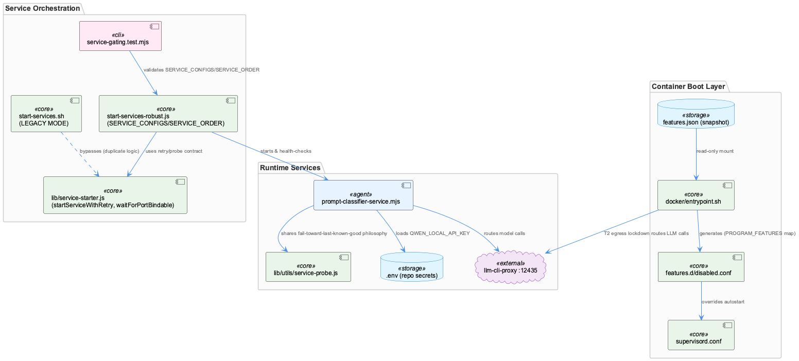
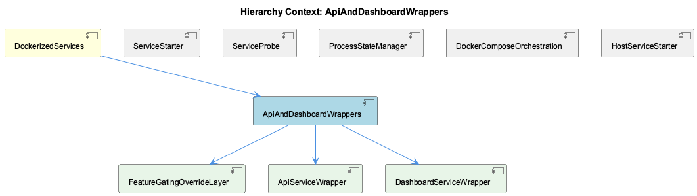

# ApiAndDashboardWrappers

**Type:** SubComponent

[Architecture Notes] Two parallel service-startup implementations coexist by design: start-services-robust.js (default, ROBUST_MODE=true) and a legacy inline bash path in start-services.sh (ROBUST_MODE=false) — the legacy path does not share the retry/timeout/health-probe abstractions the robust path uses.; Feature gating spans host and container asymmetrically: the host resolves ~/.coding/features.yaml via the full resolver, but the container only ever sees a flattened, read-only JSON snapshot (features.json) and cannot re-derive gating decisions itself — coupling docker/entrypoint.sh's PROGRAM_FEATURES map to the host's feature catalogue by convention, not by shared code.; Structural test coverage is used as the drift-prevention mechanism instead of runtime validation: tests/features/service-gating.test.mjs asserts SERVICE_ORDER and SERVICE_CONFIGS 'cover each other exactly' and that every service names a real feature, catching config drift at test time rather than at service-start time.; prompt-classifier-service.mjs deliberately has zero agent-awareness (no knowledge of claude/opencode/copilot/pi) so that a single classification service can serve every agent uniformly — an intentional constraint documented directly in its module header.; Secret handling for launchd-managed Node daemons is standardized on 'load .env inside the module' rather than 'inject via the plist', established first by bin/start-llm-proxy.sh and explicitly replicated (with a documented incident/rationale) in prompt-classifier-service.mjs.

# ApiAndDashboardWrappers — Technical Insight Document

## What It Is

ApiAndDashboardWrappers is the SubComponent of DockerizedServices responsible for wrapping the API and dashboard services with the operational scaffolding needed to run them safely across both containerized and host deployments: feature gating, secret handling, config-driven orchestration, and startup verification. Its concrete implementation surfaces in `docker/entrypoint.sh` (feature-gating override and egress lockdown), `scripts/prompt-classifier-service.mjs` (hot-reloadable config with fail-toward-last-known-good semantics), and `scripts/start-services-robust.js` / `start-services.sh` (the config-driven service registry and its legacy bash counterpart). It contains three children — FeatureGatingOverrideLayer, ApiServiceWrapper, and DashboardServiceWrapper — each of which implements a facet of this shared behavior against the same underlying mechanisms.

## Architecture and Design

The dominant pattern here is **override-layer-over-static-configuration**: rather than rewriting `docker/supervisord.conf`, `docker/entrypoint.sh` generates `/etc/supervisor/features.d/disabled.conf` at container boot, flipping `autostart=false` for programs whose feature is disabled per `/coding/.coding/runtime/features.json`. This preserves supervisord.conf as the single source of truth for process definitions (echoing the parent DockerizedServices principle) while allowing feature state to be layered on top. FeatureGatingOverrideLayer implements the mechanics of this loop; ApiServiceWrapper and DashboardServiceWrapper each apply it to their respective `[program:...]` entries.

A second pattern, **fail-open-with-loud-reason**, runs through nearly every observation: unknown or missing feature keys resolve to "enabled," a missing snapshot leaves the entire features.d directory empty (starting everything), and DashboardServiceWrapper's `wait_for_service` TCP probes return success even after exhausting retries, deferring the real liveness judgment to supervisord. The rationale is explicit and consistent — a silently-stopped container is harder to diagnose than an over-permissive one.

A third pattern, **disabled vs. degraded vs. failed as distinct first-class outcomes**, governs `scripts/start-services-robust.js`, whose `SERVICE_CONFIGS`/`SERVICE_ORDER` registry is validated by `tests/features/service-gating.test.mjs` to ensure disabled services are never misreported as degraded. This is the same epistemic discipline seen in the sibling ServiceProbe and in `prompt-classifier-service.mjs`'s config loader, applied here to service-startup results instead of health status.

## Implementation Details

FeatureGatingOverrideLayer's core loop shells out to `node -e` per `PROGRAM_FEATURES` pair (e.g. `constraint-monitor:constraints`, `health-dashboard:health`) rather than parsing the JSON snapshot once — a defensive but noisy design where a malformed `features.json` produces multiple swallowed node crashes instead of one clear error, with fail-open enforced twice (optional chaining `?.` plus shell `|| echo "true"`).

The T2 egress-lockdown block (`entrypoint.sh:52-63`) is a bash `case` pattern-match filtering `*_API_KEY|*_TOKEN|*_MANAGEMENT_KEY` when sourcing `/coding/.env`, forcing all LLM/embedding traffic through the host's llm-cli-proxy on :12435. The security guarantee is only as strong as this naming convention — a credential-shaped variable with a non-matching name would leak through.

`prompt-classifier-service.mjs`'s `loadConfig()` refuses to adopt a broken YAML edit, keeping the prior config and logging "REFUSED — keeping the last good one" on parse failure. Its `ENV_FILE`/`process.loadEnvFile` block loads `QWEN_LOCAL_API_KEY` directly from the repo `.env`, replicating the convention established by `bin/start-llm-proxy.sh` after a real incident where a launchd plist's `PATH`-only `EnvironmentVariables` caused the classifier to fail open silently (`asked: 18, answered: 0, failed: 18`).

`scripts/start-services-robust.js` adds `waitForPortBindable()`, a disposable `net.createServer().listen()` probe solving a narrow race where the kernel holds a crashed process's socket open, causing `EADDRINUSE` to burn a retry slot — a direct-verification approach consistent with `lib/utils/service-probe.js`'s preference over log/timing inference.

## Integration Points

ApiAndDashboardWrappers sits directly under DockerizedServices and depends on its shared abstractions: `lib/service-starter.js`'s `startServiceWithRetry`, and the probe/retry contract that ServiceStarter and ServiceProbe define. It reuses `lib/features/catalogue.cjs`'s `FEATURE_IDS` for structural validation, and ProcessStateManager (via PSM) for orphan/dedup detection in service startup functions like `transcriptMonitor.startFn`. DockerComposeOrchestration and HostServiceStarter are siblings implementing analogous gating and registry logic at the container and host levels respectively — coupled to this component only by convention (the PROGRAM_FEATURES map and SERVICE_CONFIGS must stay in sync with the host's feature catalogue, with no shared code enforcing it).

## Usage Guidelines

Developers modifying `PROGRAM_FEATURES` in `entrypoint.sh` must keep it in sync with `supervisord.conf`'s `[program:...]` sections and the feature catalogue by hand; only `tests/features/container-gating.test.mjs` and `service-gating.test.mjs` catch drift, since there is no shared code between host and container gating. Any new launchd-managed Node service (like the prompt classifier) must load secrets from `.env` inside the module itself, never from plist `EnvironmentVariables`. The legacy `ROBUST_MODE=false` path in `start-services.sh` should be treated as a maintenance liability — fixes to `lib/service-starter.js`'s retry/timeout/probe semantics do not propagate to it, so new work should target the robust path exclusively.

## Hierarchy Context

### Parent
- [DockerizedServices](./DockerizedServices.md) -- [LLM] The DockerizedServices component enforces a strict separation between 'containerized' and 'host-process' deployment modes while sharing a single codebase for service lifecycle management. This is achieved via lib/service-starter.js's startServiceWithRetry(), which is deployment-mode agnostic: it doesn't care whether the service it's starting is a Docker container or a local Node process, it just needs a start function and a health probe callback. This design lets scripts/api-service.js and scripts/dashboard-service.js be used identically whether the orchestrator is docker-compose (via docker/docker-compose.yml and supervisord.conf) or a bare host machine running `npm start`. New developers should understand that the abstraction boundary is the probe/retry contract, not the process spawning mechanism itself — this is what allows the same health-check logic to apply uniformly across deployment targets.

### Children
- [FeatureGatingOverrideLayer](./FeatureGatingOverrideLayer.md) -- [LLM] docker/entrypoint.sh implements the feature-gating override as a bash loop that shells out to `node -e` per PROGRAM_FEATURES pair rather than parsing the JSON snapshot once: for each of the eight hardcoded program:feature pairs it spawns a fresh node process, reads `snap.features?.[feature]`, and writes 'true'/'false' to stdout, defaulting to the string 'true' if the node invocation itself fails (`|| echo "true"`). This means a malformed features.json produces eight separate node crashes (each swallowed by the same fallback) rather than one clear parse error, and the fail-open guarantee is enforced twice over — once by the optional-chaining `?.` returning undefined for a missing key, and once by the shell's `||` catching a total node failure — which is defensive but makes the actual failure mode hard to distinguish from a legitimately-missing feature in the logs.
- [ApiServiceWrapper](./ApiServiceWrapper.md) -- [LLM] docker/entrypoint.sh's feature-gating block (the `PROGRAM_FEATURES` loop and the `node -e` snippet that reads `/coding/.coding/runtime/features.json`) is an override layer bolted onto supervisord rather than a replacement for it: it writes only `/etc/supervisor/features.d/disabled.conf` with `autostart=false` stanzas, leaving every `[program:...]` command/logging definition in `supervisord.conf` untouched. The `enabled=$(node -e '...' || echo "true")` construct is doubly fail-open — both the inline JS (`value === false ? "false" : "true"`, so anything but an explicit `false` reads as enabled) and the shell fallback (`|| echo "true"` if node itself throws or the file is missing) resolve toward 'run it'. This means a corrupt or stale features.json degrades to 'everything starts', which is diagnosable, rather than to 'nothing starts', which the comment explicitly says would be harder to debug.
- [DashboardServiceWrapper](./DashboardServiceWrapper.md) -- [LLM] docker/entrypoint.sh implements a two-phase startup: (1) a `wait_for_service` bash function that TCP-probes Qdrant and Redis via `/dev/tcp/$host/$port` with a bounded retry loop, deliberately returning 0 even on exhaustion ('Don't fail - let supervisord handle it'), and (2) a feature-gating phase that reads `/coding/.coding/runtime/features.json` and materializes `/etc/supervisor/features.d/disabled.conf`. Both phases share the same fail-open philosophy documented in the parent observations, but the mechanisms are quite different in risk profile: the DB-wait loop just delays startup (worst case, downstream services retry against a not-yet-ready dependency), whereas the feature-gating loop determines whether entire programs (constraint-monitor, health-dashboard, etc.) run at all — a `node -e` snippet parsing the snapshot silently defaults unparseable or missing entries to 'true' (enabled), which is a much higher-consequence fail-open than a delayed DB connection.

### Siblings
- [ServiceStarter](./ServiceStarter.md) -- startServiceWithRetry() in lib/service-starter.js accepts a startFn and healthCheckFn as parameters, making it agnostic to whether the underlying process is a Docker container or a Node child process
- [ServiceProbe](./ServiceProbe.md) -- [LLM] docker/entrypoint.sh's wait_for_service() function (lines defining `wait_for_service()`) implements the same epistemic-humility contract described for lib/utils/service-probe.js at the bash layer: it uses `timeout 2 bash -c "echo >/dev/tcp/$host/$port"` to prove only that a TCP socket accepted a connection, then explicitly returns 0 even after exhausting `max_attempts` with a `WARNING: ... continuing anyway` message and the comment `# Don't fail - let supervisord handle it`. This is a deliberate fail-open probe: the script never asserts 'healthy' or blocks container startup on a probe failure, deferring the actual liveness judgment to supervisord's own process management, which mirrors the SPEC R6 distinction between 'running/reachable' and 'functioning correctly' at a completely different layer of the stack (container boot vs. in-process service management).
- [ProcessStateManager](./ProcessStateManager.md) -- [CGR] ProcessStateManager (class) in process-state-manager.js
- [DockerComposeOrchestration](./DockerComposeOrchestration.md) -- [LLM] docker/entrypoint.sh implements a fail-open feature-gating override rather than a rewrite of docker/supervisord.conf: it reads a flat host-written snapshot at /coding/.coding/runtime/features.json (mounted read-only) and, for each entry in the PROGRAM_FEATURES mapping (e.g. 'semantic-analysis:knowledge', 'constraint-monitor:constraints', 'health-dashboard-frontend:health'), shells out to `node -e` (not jq, which the comment notes isn't installed in the image) to check `snap.features?.[feature]`. Any program whose feature reads `false` gets an autostart=false stanza written into /etc/supervisor/features.d/disabled.conf, which supervisord includes alongside the main config. Critically, an unknown/missing feature key resolves to 'true' by design ('a snapshot written by an older host cannot silently switch a program off'), and a missing/unreadable snapshot file leaves the entire features.d directory empty, starting every program — the pre-existing historical behavior. This directly implements the DockerizedServices principle from the parent context that supervisord.conf is the single source of truth for in-container processes, while this script is merely an additive filter over it.
- [HostServiceStarter](./HostServiceStarter.md) -- start-services-robust.js defines SERVICE_CONFIGS and SERVICE_ORDER, asserted in tests/features/service-gating.test.mjs to cover each other exactly so no service is configured but never started

---

*Generated from 10 observations*
