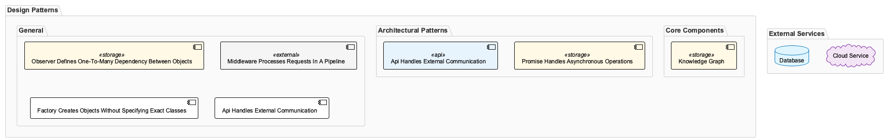

# ApiHandlesExternalCommunication
**Type:** general
**Generated:** 2026-01-11T14:49:01.718Z

## Pattern Overview
When working with api in this codebase, changes often span multiple modules. Key files: `copilot-http-server.js`, `README.md`, `vscode-extension.md`; Handles external communication. This pattern was established to ensure consistent external interfaces and maintainable service contracts; DO: Check `copilot-http-server.js`, `README.md`, `vscode-extension.md` when modifying api behavior. DON'T: Make isolated changes without verifying related modules

**Significance:** 9/10

## Evidence
- When working with api in this codebase, changes often span multiple modules. Key files: `copilot-http-server.js`, `README.md`, `vscode-extension.md`
- Handles external communication. This pattern was established to ensure consistent external interfaces and maintainable service contracts
- DO: Check `copilot-http-server.js`, `README.md`, `vscode-extension.md` when modifying api behavior. DON'T: Make isolated changes without verifying related modules
- This api pattern is applicable when building JavaScript, Markdown, JSON systems with critical reliability requirements
- Details: http://localhost:8080/knowledge-management/insights/ApiHandlesExternalCommunication.md

## Development History
Analysis of 902 commits.

## Conversation Insights
Analysis of 1008 development sessions.

## Diagrams

## Related Patterns
- **PromiseHandlesAsynchronousOperations** (general): When working with promise in this codebase, changes often span multiple modules. Key files: `agent-detector.js`, `system.js`, `claude-conversation-extractor.js`; Handles asynchronous operations. This pattern was established to manage asynchronous operations and prevent callback complexity; DO: Check `agent-detector.js`, `system.js`, `claude-conversation-extractor.js` when modifying promise behavior. DON'T: Make isolated changes without verifying related modules
- **ApiHandlesExternalCommunication** (general): When working with api in this codebase, changes often span multiple modules. Key files: `enhanced-transcript-monitor.js`, `2025-10-27_1600-1700_g9b30a.md`, `2025-10-27_1600-1700_g9b30a_from-curriculum-alignment.md`; Handles external communication. This pattern was established to ensure consistent external interfaces and maintainable service contracts; DO: Check `enhanced-transcript-monitor.js`, `2025-10-27_1600-1700_g9b30a.md`, `2025-10-27_1600-1700_g9b30a_from-curriculum-alignment.md` when modifying api behavior. DON'T: Make isolated changes without verifying related modules
- **PromiseHandlesAsynchronousOperations** (general): When working with promise in this codebase, changes often span multiple modules. Key files: `2025-11-15_1200-1300_g9b30a.md`, `combined-status-line.js`, `2025-11-15_1800-1900_g9b30a.md`; Handles asynchronous operations. This pattern was established to manage asynchronous operations and prevent callback complexity; DO: Check `2025-11-15_1200-1300_g9b30a.md`, `combined-status-line.js`, `2025-11-15_1800-1900_g9b30a.md` when modifying promise behavior. DON'T: Make isolated changes without verifying related modules
- **ApiHandlesExternalCommunication** (general): When working with api in this codebase, changes often span multiple modules. Key files: `combined-status-line.js`, `health-verifier.js`, `2025-06-16_14-28Z-knowledge-base-viewer-statistics.md`; Handles external communication. This pattern was established to ensure consistent external interfaces and maintainable service contracts; DO: Check `combined-status-line.js`, `health-verifier.js`, `2025-06-16_14-28Z-knowledge-base-viewer-statistics.md` when modifying api behavior. DON'T: Make isolated changes without verifying related modules
- **PromiseHandlesAsynchronousOperations** (general): When working with promise in this codebase, changes often span multiple modules. Key files: `combined-status-line.js`, `health-verifier.js`, `2025-06-16_13-32Z-clarification-on-code-assistance-request.md`; Handles asynchronous operations. This pattern was established to manage asynchronous operations and prevent callback complexity; DO: Check `combined-status-line.js`, `health-verifier.js`, `2025-06-16_13-32Z-clarification-on-code-assistance-request.md` when modifying promise behavior. DON'T: Make isolated changes without verifying related modules
