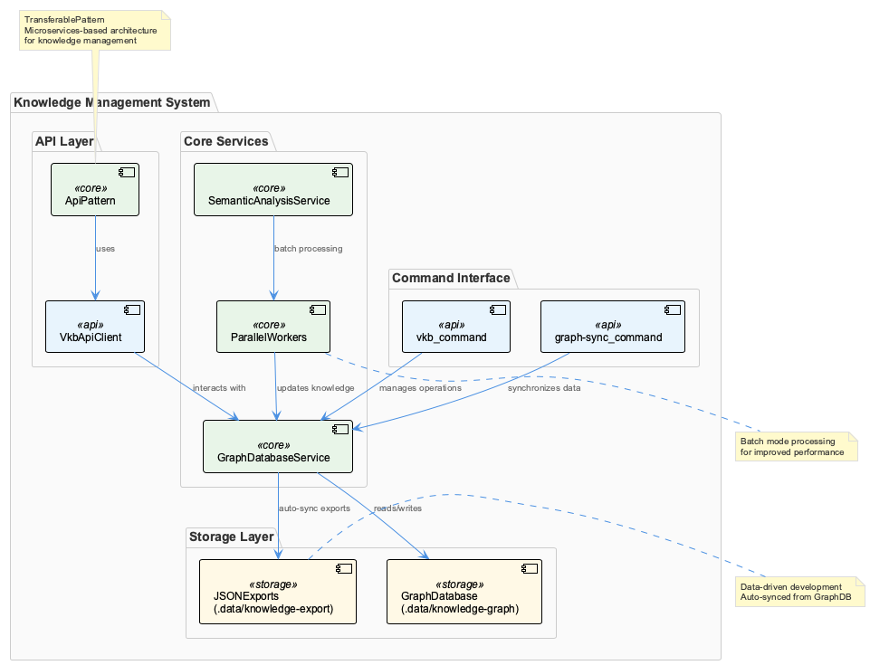
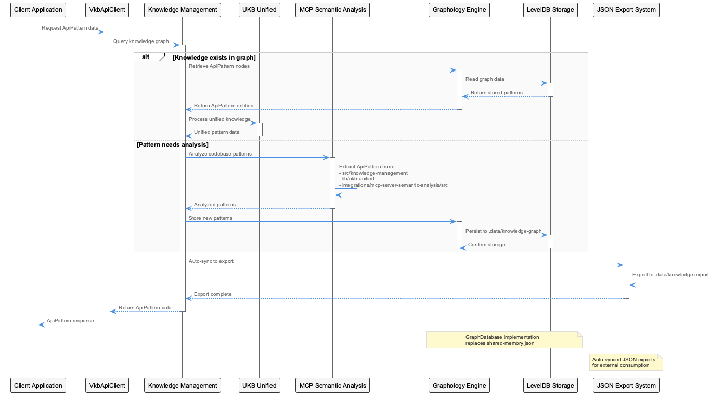
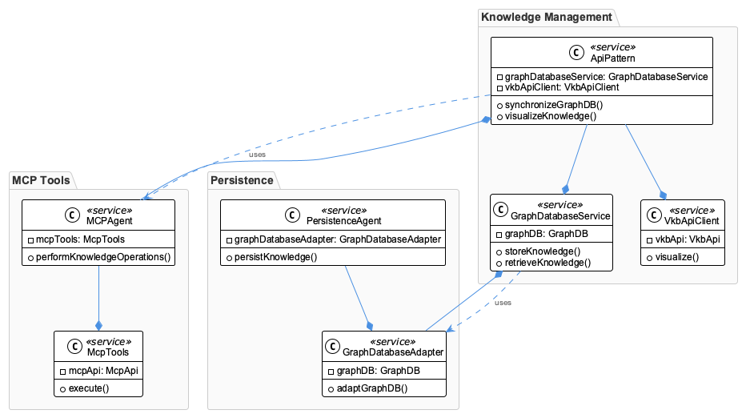
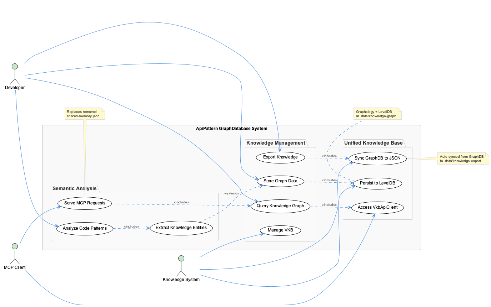

# ApiPattern

**Type:** TransferablePattern

The system uses a microservices-based architecture, with components such as GraphDatabaseService and VkbApiClient, to manage knowledge storage and export.

## What It Is

- The use of specific commands, such as vkb and graph-sync, provides a clear and organized way to manage knowledge operations and visualization.

- The system uses a microservices-based architecture, with components such as GraphDatabaseService and VkbApiClient, to manage knowledge storage and export.

- The GraphDatabaseService component is used to interact with the knowledge graph stored in .data/knowledge-graph.

- The system uses JSON exports at .data/knowledge-export, which are auto-synced from the GraphDB, to provide a data-driven development approach.

## Diagrams

### Architecture

### Sequence

### Class

### Use cases

---

*Generated from 5 observations*
