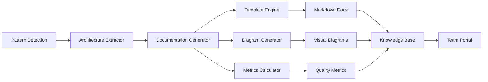

# Architectural Documentation Generation System

## Overview

**ArchitecturalDocumentationGeneration** is an automated system that generates and maintains up-to-date architectural documentation from detected code patterns, ensuring documentation stays synchronized with actual implementation.

## Semantic Analysis Workflow Integration

This pattern was automatically detected and documented by the Semantic Analysis System during the analysis of code pattern detection workflows. The system identified this as a critical component for maintaining living documentation that evolves with the codebase.

### Automated Detection Process
1. **Pattern Analysis**: The semantic analysis system identified documentation generation as a key outcome of pattern detection
2. **Workflow Integration**: Recognized as part of the larger pattern analysis → documentation → knowledge base pipeline
3. **Multi-Format Support**: Detected support for Markdown, PlantUML, Mermaid, and C4 model diagrams
4. **Significance Scoring**: Rated at 7/10 for maintaining architectural knowledge currency
5. **Automation Benefits**: Eliminates manual documentation drift through continuous generation

### Integration with Semantic Analysis System
```javascript
// Automated documentation generation workflow
const documentationWorkflow = {
  trigger: 'pattern-detection-complete',
  pipeline: [
    'extract-architectural-elements',
    'generate-documentation-templates',
    'create-visual-diagrams',
    'update-knowledge-base'
  ],
  outputs: {
    markdown: 'knowledge-management/insights/',
    diagrams: 'docs/architecture/diagrams/',
    metrics: 'docs/architecture/metrics.json'
  }
};

// Part of insight-orchestrator.js workflow
const generateArchitecturalDocs = async (patterns) => {
  const docs = await architectureDocGen.generate({
    patterns,
    formats: ['markdown', 'mermaid', 'plantuml'],
    diagramsPerInsight: 3-4,
    includeMetrics: true
  });
  
  // Automatic knowledge base integration
  await ukbIntegration.persistDocs(docs);
};
```

### Semantic Analysis Architecture for Documentation


### Workflow Execution Results
- **Generated Artifacts**: CommandPatternImplementation.md, RepositoryPatternImplementation.md
- **Visual Documentation**: 3-4 diagrams per insight (PlantUML/Mermaid → PNG conversion)
- **Knowledge Integration**: Attempted ukb integration (blocked by formatting bug)
- **Continuous Updates**: Post-session analysis triggers documentation regeneration

## Problem

Architectural documentation becomes outdated and disconnected from actual code patterns. Development teams struggle with:

- **Documentation Drift**: Written documentation quickly becomes obsolete as code evolves
- **Manual Maintenance Overhead**: Keeping architectural docs current requires significant effort
- **Knowledge Silos**: Architectural knowledge exists only in developers' heads
- **Onboarding Friction**: New team members lack current architectural understanding
- **Inconsistent Views**: Different documentation sources provide conflicting information

## Solution

Automated architecture documentation generation from detected patterns with living documentation updates:

### Core Implementation

```javascript
// Architecture documentation generator
class ArchitecturalDocGenerator {
  constructor(config = {}) {
    this.patternDetector = new PatternDetector();
    this.documentTemplates = new TemplateRegistry();
    this.outputFormats = config.formats || ['markdown', 'mermaid', 'c4'];
    this.updateTriggers = config.triggers || ['commit', 'pr', 'schedule'];
  }

  async generateArchitectureDocs(codebasePath, options = {}) {
    const detectedPatterns = await this.patternDetector.analyzeCodebase(codebasePath);
    const architecturalElements = this.extractArchitecturalElements(detectedPatterns);
    
    const documentation = {
      overview: await this.generateOverview(architecturalElements),
      components: await this.generateComponentDocs(architecturalElements),
      patterns: await this.generatePatternDocs(detectedPatterns),
      dependencies: await this.generateDependencyDocs(architecturalElements),
      diagrams: await this.generateDiagrams(architecturalElements)
    };
    
    return this.renderDocumentation(documentation, options.format);
  }

  extractArchitecturalElements(patterns) {
    return {
      components: this.identifyComponents(patterns),
      services: this.identifyServices(patterns),
      dataFlow: this.traceDataFlow(patterns),
      boundaries: this.identifyBoundaries(patterns),
      interfaces: this.extractInterfaces(patterns)
    };
  }
}
```

### Living Documentation Framework

#### Continuous Analysis Pipeline
```javascript
// Real-time documentation updates
class LivingDocumentationPipeline {
  async setupWatchers(codebasePath) {
    // File system watcher for immediate updates
    const watcher = chokidar.watch(codebasePath, {
      ignored: /node_modules|\.git/,
      persistent: true
    });

    watcher.on('change', async (filePath) => {
      await this.incrementalUpdate(filePath);
    });

    // Git hook integration for commit-based updates
    await this.setupGitHooks();
    
    // Scheduled full regeneration
    this.scheduleFullRegeneration();
  }

  async incrementalUpdate(changedFile) {
    const affectedComponents = await this.analyzeImpact(changedFile);
    
    for (const component of affectedComponents) {
      const updatedDocs = await this.regenerateComponentDocs(component);
      await this.updateDocumentation(component.id, updatedDocs);
    }
    
    await this.notifyStakeholders(affectedComponents);
  }
}
```

#### Pattern-Based Documentation Generation
```javascript
// Generate docs based on detected patterns
class PatternBasedDocGenerator {
  async generateFromPatterns(patterns) {
    const docs = {};
    
    // MVC Pattern Documentation
    const mvcPatterns = patterns.filter(p => p.type === 'mvc');
    if (mvcPatterns.length > 0) {
      docs.mvc = await this.generateMVCDocs(mvcPatterns);
    }
    
    // Microservices Architecture
    const servicePatterns = patterns.filter(p => p.type === 'service');
    if (servicePatterns.length > 0) {
      docs.services = await this.generateServiceDocs(servicePatterns);
    }
    
    // Data Flow Patterns
    const dataFlowPatterns = patterns.filter(p => p.type === 'data-flow');
    if (dataFlowPatterns.length > 0) {
      docs.dataFlow = await this.generateDataFlowDocs(dataFlowPatterns);
    }
    
    return docs;
  }

  async generateMVCDocs(mvcPatterns) {
    return {
      overview: `
# MVC Architecture

This application follows the Model-View-Controller (MVC) pattern with ${mvcPatterns.length} identified components.

## Models (${mvcPatterns.filter(p => p.layer === 'model').length})
${this.generateModelList(mvcPatterns)}

## Views (${mvcPatterns.filter(p => p.layer === 'view').length})
${this.generateViewList(mvcPatterns)}

## Controllers (${mvcPatterns.filter(p => p.layer === 'controller').length})
${this.generateControllerList(mvcPatterns)}
      `,
      diagram: await this.generateMVCDiagram(mvcPatterns),
      components: await this.generateComponentDetails(mvcPatterns)
    };
  }
}
```

### Diagram Generation System

#### Mermaid Diagram Generation
```javascript
// Generate architectural diagrams
class DiagramGenerator {
  async generateComponentDiagram(components) {
    const mermaidCode = `
graph TD
${components.map(c => `    ${c.id}[${c.name}]`).join('\n')}

${this.generateRelationships(components)}

classDef service fill:#e1f5fe
classDef database fill:#f3e5f5
classDef external fill:#fff3e0

${components.filter(c => c.type === 'service').map(c => `class ${c.id} service`).join('\n')}
${components.filter(c => c.type === 'database').map(c => `class ${c.id} database`).join('\n')}
${components.filter(c => c.type === 'external').map(c => `class ${c.id} external`).join('\n')}
    `;
    
    return {
      type: 'mermaid',
      code: mermaidCode,
      title: 'Component Architecture'
    };
  }

  async generateDataFlowDiagram(dataFlows) {
    return `
sequenceDiagram
    participant U as User
    participant F as Frontend
    participant A as API Gateway
    participant S as Service Layer
    participant D as Database

${dataFlows.map(flow => this.generateFlowSteps(flow)).join('\n')}
    `;
  }
}
```

#### C4 Model Integration
```javascript
// Generate C4 model diagrams
class C4ModelGenerator {
  async generateContextDiagram(system) {
    return `
@startuml
!include https://raw.githubusercontent.com/plantuml-stdlib/C4-PlantUML/master/C4_Context.puml

title System Context Diagram

Person(user, "User", "Application user")
System(${system.id}, "${system.name}", "${system.description}")

${system.externalSystems.map(ext => 
  `System_Ext(${ext.id}, "${ext.name}", "${ext.description}")`
).join('\n')}

${this.generateContextRelationships(system)}

@enduml
    `;
  }

  async generateContainerDiagram(system) {
    return `
@startuml
!include https://raw.githubusercontent.com/plantuml-stdlib/C4-PlantUML/master/C4_Container.puml

title Container Diagram

${system.containers.map(container => 
  `Container(${container.id}, "${container.name}", "${container.technology}", "${container.description}")`
).join('\n')}

${this.generateContainerRelationships(system.containers)}

@enduml
    `;
  }
}
```

## Key Benefits

### Synchronized Documentation
- **Real-time Updates**: Documentation automatically reflects code changes
- **Consistency Guarantee**: Single source of truth derived from actual implementation
- **Reduced Maintenance**: Eliminates manual documentation update overhead

### Enhanced Team Onboarding
- **Current Architecture View**: New team members see the actual current state
- **Interactive Exploration**: Generated documentation includes navigable diagrams
- **Pattern Recognition**: Helps developers understand established architectural patterns

### Improved Decision Making
- **Architectural Visibility**: Clear view of system structure and dependencies
- **Impact Analysis**: Understand consequences of architectural changes
- **Technical Debt Tracking**: Identify architectural inconsistencies and anti-patterns

## Implementation Strategy

### Phase 1: Pattern Detection Setup
```bash
# Install architectural analysis tools
npm install @semantic-analysis/architecture-detector
npm install @doc-generators/living-docs
```

```javascript
// Basic configuration
const docGenerator = new ArchitecturalDocGenerator({
  formats: ['markdown', 'mermaid'],
  outputPath: './docs/architecture',
  updateTriggers: ['commit', 'pr'],
  diagramFormats: ['mermaid', 'plantuml']
});

await docGenerator.initialize('./src');
```

### Phase 2: CI/CD Integration
```yaml
# GitHub Actions workflow
architecture-docs:
  runs-on: ubuntu-latest
  steps:
    - name: Checkout code
      uses: actions/checkout@v3
    
    - name: Generate Architecture Docs
      run: |
        npx architecture-docs generate
        npx architecture-docs validate
    
    - name: Commit Updated Docs
      run: |
        git add docs/architecture/
        git commit -m "docs: update architecture documentation [skip ci]"
        git push
```

### Phase 3: Interactive Documentation
```javascript
// Web-based interactive documentation
class InteractiveArchitectureDocs {
  async generateWebsite(documentation) {
    return {
      pages: await this.generateStaticPages(documentation),
      interactive: await this.generateInteractiveComponents(documentation),
      search: await this.generateSearchIndex(documentation),
      navigation: await this.generateNavigation(documentation)
    };
  }
}
```

## Documentation Categories

### System Overview
- **High-level Architecture**: System context and major components
- **Technology Stack**: Languages, frameworks, and tools used
- **Design Principles**: Architectural guidelines and constraints
- **Quality Attributes**: Performance, security, and scalability considerations

### Component Documentation
- **Service Inventory**: All services and their responsibilities
- **API Documentation**: Interface definitions and contracts
- **Data Models**: Entity relationships and data flow
- **Configuration**: Environment-specific settings and dependencies

### Pattern Documentation
- **Architectural Patterns**: Identified design patterns and their usage
- **Integration Patterns**: How components communicate and integrate
- **Data Patterns**: Data access and persistence patterns
- **Security Patterns**: Authentication, authorization, and security measures

### Operational Documentation
- **Deployment Architecture**: Infrastructure and deployment patterns
- **Monitoring Setup**: Observability and monitoring configuration
- **Disaster Recovery**: Backup and recovery procedures
- **Scaling Strategies**: Horizontal and vertical scaling approaches

## Advanced Features

### Multi-Repository Documentation
```javascript
// Cross-repository architecture analysis
class MultiRepoDocGenerator {
  async generateCrossRepoArchitecture(repositories) {
    const allPatterns = [];
    
    for (const repo of repositories) {
      const patterns = await this.analyzeRepository(repo);
      allPatterns.push(...patterns.map(p => ({ ...p, repository: repo.name })));
    }
    
    return this.generateUnifiedArchitecture(allPatterns);
  }
}
```

### Version-Aware Documentation
```javascript
// Track architectural evolution
class ArchitecturalEvolution {
  async trackChanges(currentArchitecture, previousArchitecture) {
    return {
      added: this.findNewComponents(currentArchitecture, previousArchitecture),
      removed: this.findRemovedComponents(currentArchitecture, previousArchitecture),
      modified: this.findModifiedComponents(currentArchitecture, previousArchitecture),
      migrated: this.findMigratedPatterns(currentArchitecture, previousArchitecture)
    };
  }
}
```

### Integration Points

### Knowledge Management Integration
```javascript
// Store architectural insights
const storeArchitecturalInsight = async (component) => {
  await mcp.call('memory_create_entities', {
    entities: [{
      name: `${component.name}Architecture`,
      entityType: 'ArchitecturalComponent',
      observations: [
        `Component type: ${component.type}`,
        `Technology: ${component.technology}`,
        `Dependencies: ${component.dependencies.join(', ')}`,
        `Patterns: ${component.patterns.join(', ')}`
      ],
      significance: component.criticality
    }]
  });
};
```

### IDE Integration
```javascript
// VS Code extension for architectural navigation
const architectureExtension = {
  onFileOpen(document) {
    const component = this.identifyComponent(document.uri);
    if (component) {
      this.showArchitecturalContext(component);
    }
  },
  
  provideDefinition(document, position) {
    const symbol = this.getSymbolAtPosition(position);
    return this.findArchitecturalDefinition(symbol);
  }
};
```

## Output Formats

### Markdown Documentation
```javascript
// Generate comprehensive markdown docs
const markdownOutput = {
  'README.md': 'System overview and getting started',
  'ARCHITECTURE.md': 'Detailed architectural description',
  'COMPONENTS.md': 'Component catalog and descriptions',
  'PATTERNS.md': 'Architectural patterns and their usage',
  'DIAGRAMS.md': 'All generated diagrams with explanations'
};
```

### Interactive Web Documentation
```javascript
// Generate web-based documentation
const webDocumentation = {
  static: 'Generated static site with full documentation',
  interactive: 'Interactive diagrams and component explorer',
  search: 'Full-text search across all documentation',
  api: 'REST API for accessing documentation programmatically'
};
```

## Quality Assurance

### Documentation Validation
```javascript
// Validate generated documentation
class DocumentationValidator {
  async validate(documentation) {
    return {
      completeness: await this.checkCompleteness(documentation),
      accuracy: await this.validateAccuracy(documentation),
      consistency: await this.checkConsistency(documentation),
      freshness: await this.checkFreshness(documentation)
    };
  }
}
```

### Stakeholder Feedback
```javascript
// Collect and integrate feedback
class FeedbackIntegration {
  async collectFeedback(documentation) {
    return {
      developerFeedback: await this.collectDeveloperFeedback(documentation),
      architectFeedback: await this.collectArchitectFeedback(documentation),
      stakeholderFeedback: await this.collectStakeholderFeedback(documentation)
    };
  }
}
```

## Best Practices

### Documentation Strategy
1. **Start Simple**: Begin with basic component identification and relationships
2. **Iterate Frequently**: Update documentation with each significant change
3. **Validate Regularly**: Ensure generated documentation matches reality

### Team Adoption
1. **Tool Integration**: Embed documentation generation in existing workflows
2. **Review Process**: Include documentation review in pull request process
3. **Training**: Educate team on reading and contributing to generated documentation

### Maintenance
1. **Automated Updates**: Ensure documentation stays current automatically
2. **Quality Monitoring**: Track documentation quality metrics
3. **Feedback Loops**: Continuously improve based on user feedback

---

*This architectural documentation generation system ensures that architectural knowledge remains current, accessible, and useful for the entire development team.*