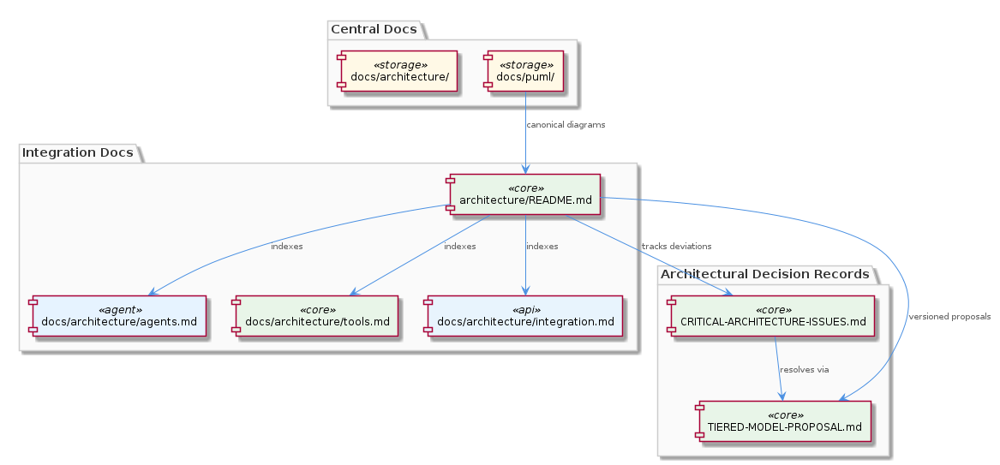
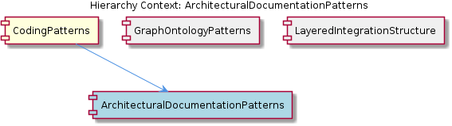

# ArchitecturalDocumentationPatterns

**Type:** SubComponent

integrations/mcp-server-semantic-analysis/CRITICAL-ARCHITECTURE-ISSUES.md follows a named pattern of flagging and then resolving architectural deviations in a tracked document rather than inline comments

# ArchitecturalDocumentationPatterns

## What It Is

ArchitecturalDocumentationPatterns is a SubComponent of CodingPatterns that codifies how architecture decisions, diagrams, proposals, and issue tracking are organized across integrations. Its conventions are most clearly visible in `integrations/mcp-server-semantic-analysis/`, which contains the richest documentation structure in the project: a `docs/architecture/` subdirectory with dedicated files (`agents.md`, `tools.md`, `integration.md`), an index entry point at `docs/architecture/README.md`, a proposal document at `docs/TIERED-MODEL-PROPOSAL.md`, and a tracked issues file at `CRITICAL-ARCHITECTURE-ISSUES.md`. PlantUML diagrams have a canonical home in `docs/puml/`, establishing a physical separation between visual and prose documentation. Together these conventions form a repeatable, integration-scoped documentation standard rather than a centralized monolithic architecture repository.

## Architecture and Design

The documentation architecture mirrors the layered code architecture enforced by CodingPatterns and made canonical in LayeredIntegrationStructure. Just as `integrations/code-graph-rag/codebase_rag/` separates concerns into `parsers/`, `providers/`, `services/`, `tools/`, and `utils/`, the documentation layer separates concerns into distinct artifact types: diagrams (`docs/puml/`), prose subdocs (`docs/architecture/agents.md`, `tools.md`, `integration.md`), proposals (`docs/TIERED-MODEL-PROPOSAL.md`), and issue tracking (`CRITICAL-ARCHITECTURE-ISSUES.md`). Each artifact type has exactly one expected home, enforcing the same "one concern, one location" principle at the documentation level that the code structure enforces at the implementation level.

The subdoc structure within `docs/architecture/` is not arbitrary — it directly mirrors the code layer separation. `agents.md`, `tools.md`, and `integration.md` correspond to identifiable layers in the integration's implementation, meaning the documentation schema is coupled to the architectural decomposition. This makes the docs a reliable map of the code rather than an independent narrative that can drift. The `docs/architecture/README.md` index layer reinforces this by acting as a navigation entry point, establishing the expectation that each integration owns and maintains its own architecture README.

A notable design decision is the deliberate choice to keep architectural documentation integration-local rather than centralized. `docs/TIERED-MODEL-PROPOSAL.md` lives inside `integrations/mcp-server-semantic-analysis/` rather than in a central ADR (Architecture Decision Record) directory. This is a trade-off: integration-local docs travel with the code and remain contextually accurate, but cross-integration discoverability requires navigating each integration independently rather than consulting a single registry.

## Implementation Details

The `CRITICAL-ARCHITECTURE-ISSUES.md` pattern is particularly deliberate. Rather than leaving architectural deviations as inline code comments — which are invisible to reviewers scanning the repository — deviations are surfaced in a named, tracked document at the integration root. The naming convention (`CRITICAL-` prefix, all-caps) signals urgency and discoverability. The document follows a flag-then-resolve lifecycle: issues are recorded when identified and marked resolved when addressed, creating a lightweight audit trail without requiring a full issue tracker or formal ADR process.

PlantUML diagrams in `docs/puml/` are kept separate from prose documentation rather than embedded inline. This separation acknowledges that diagrams and prose have different maintenance cadences and tooling requirements — PlantUML files are source-controlled text that require a renderer, while Markdown prose is directly readable. Keeping them in a dedicated directory prevents diagram source files from cluttering prose directories while still maintaining them in version control alongside the documentation they support.

The three-file structure of `docs/architecture/` (`agents.md`, `tools.md`, `integration.md`) represents a decomposition schema that aligns with GraphOntologyPatterns' containment hierarchy — each file scopes its content to a distinct architectural concern, mirroring how the graph ontology encodes relationships between discrete components rather than treating the system as a monolith.

## Integration Points

ArchitecturalDocumentationPatterns connects directly to CodingPatterns as a child SubComponent, inheriting the parent's commitment to explicit structural conventions. The documentation layer patterns are essentially a projection of the LayeredIntegrationStructure onto documentation artifacts — the same five-layer split that governs `integrations/code-graph-rag/codebase_rag/` is the conceptual model that the `docs/architecture/` subdoc files describe. A developer following LayeredIntegrationStructure to add a new capability should simultaneously consult ArchitecturalDocumentationPatterns to determine which documentation artifact to update: new agents go into `agents.md`, new tool exposures into `tools.md`, and cross-system wiring into `integration.md`.

The `docs/architecture/README.md` index convention also creates an integration point with any tooling or onboarding process that navigates by README discovery. If a documentation generator or repository explorer follows README files as entry points, each integration's architecture README serves as the declared root of that integration's documentation graph — a pattern consistent with how GraphOntologyPatterns encodes containment hierarchies for navigation.

## Usage Guidelines

Every integration is expected to maintain its own `docs/architecture/README.md` as a navigation entry point — this is not optional decoration but a structural contract implied by the `mcp-server-semantic-analysis` reference implementation. When creating a new integration, the first documentation act should be establishing this index before adding subdocs, so that the entry point exists before the content it navigates.

Architectural proposals should be stored as versioned documents within the relevant integration (following `docs/TIERED-MODEL-PROPOSAL.md`) rather than in any central ADR directory. This keeps proposals co-located with the code they affect, but developers should be aware of the discoverability trade-off: cross-integration architectural patterns will not surface automatically and require active cross-integration documentation review.

The `CRITICAL-ARCHITECTURE-ISSUES.md` pattern should be used for tracking deviations from the established layered architecture — not for general technical debt. Its value is in making structural violations visible at the repository root level. Once an issue is resolved, it should be marked as such in the document rather than deleted, preserving the audit trail. Inline comments are explicitly not the right tool for this class of issue.

PlantUML source files belong in `docs/puml/` and nowhere else. Embedding diagram source inline in Markdown or scattering `.puml` files across subdirectories would break the convention that gives `docs/puml/` its value as the canonical diagram location. Rendered diagram images may be referenced from prose documentation, but the source of truth for diagram content is always the `.puml` file in its designated directory.

## Hierarchy Context

### Parent
- [CodingPatterns](./CodingPatterns.md) -- [LLM] The project enforces a strict layered architecture within each integration, most visibly in integrations/code-graph-rag/codebase_rag/ which separates concerns into parsers/, providers/, services/, tools/, and utils/ subdirectories. This mirrors a classic hexagonal/ports-and-adapters style: parsers handle raw source ingestion, providers abstract data sources, services contain business logic, tools expose callable capabilities (likely as MCP tools), and utils hold shared helpers. A new developer adding a language parser would add only to parsers/, while a new MCP-exposed capability would live in tools/ — the structure enforces that each concern has exactly one home. This same pattern repeats in integrations/mcp-server-semantic-analysis/ and integrations/mcp-constraint-monitor/, suggesting the project treats this directory layout as a project-wide architectural standard rather than an incidental choice.

### Siblings
- [GraphOntologyPatterns](./GraphOntologyPatterns.md) -- The relationship types CONTAINS_PACKAGE, CONTAINS_FOLDER, CONTAINS_FILE, CONTAINS_MODULE form a strict containment hierarchy in config/graph-database-config.json, encoding filesystem and module nesting as first-class graph edges
- [LayeredIntegrationStructure](./LayeredIntegrationStructure.md) -- integrations/code-graph-rag/codebase_rag/ is the canonical reference implementation of the five-layer split, documented in the CONTRIBUTING.md as the expected structure for new contributors

---

*Generated from 5 observations*
