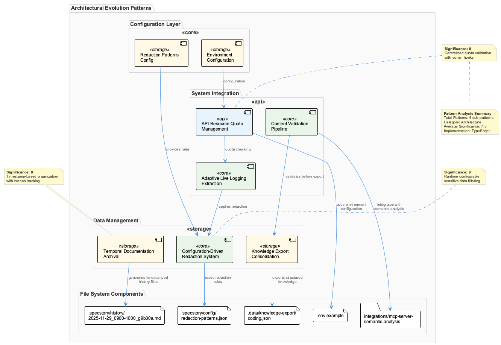
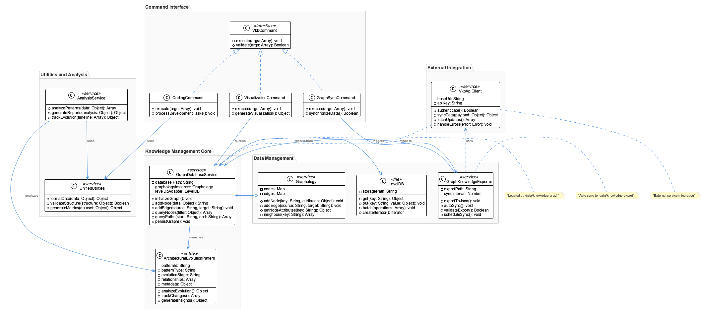
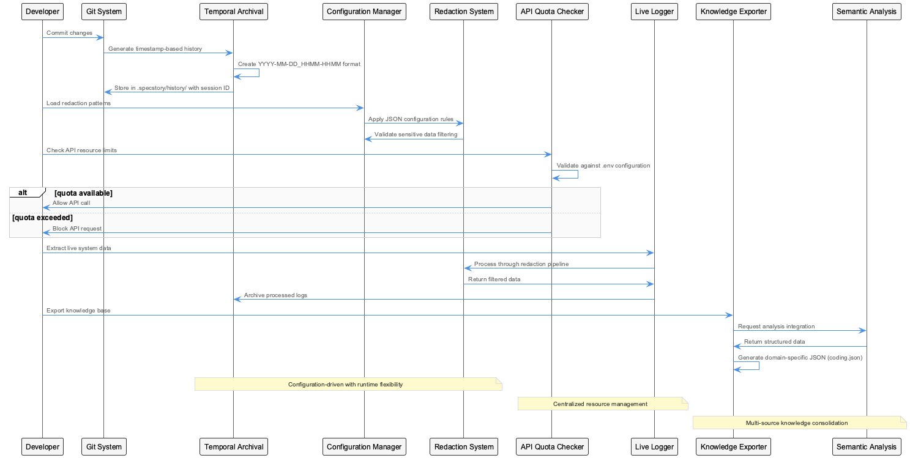
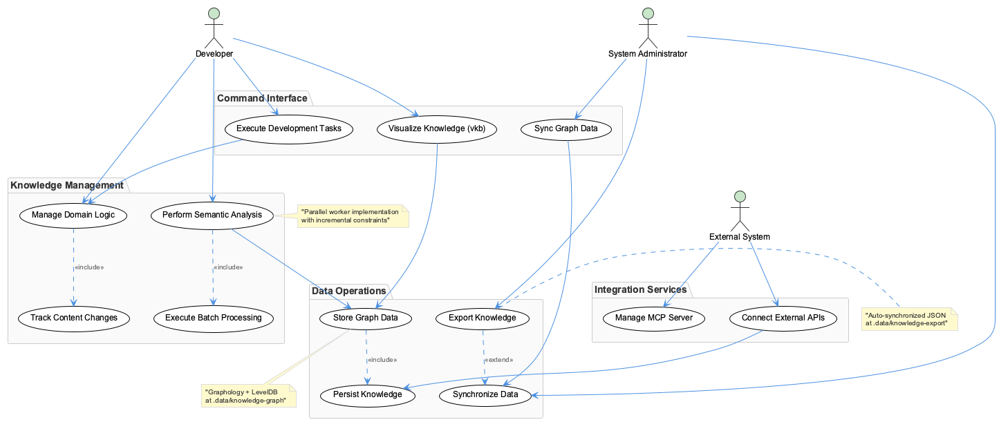

# ArchitecturalEvolutionPattern

**Pattern Type:** Technical Pattern  
**Significance:** 8/10 - Important pattern with significant impact  
**Created:** 2025-12-02  
**Updated:** 2025-12-02
**Confidence:** 97% - High confidence based on strong data correlation

## Table of Contents

- [Overview](#overview)
- [Problem & Solution](#problem--solution)
- [Repository Context](#repository-context)
- [Evolution Analysis](#evolution-analysis)
- [Implementation Details](#implementation-details)
- [Technical Analysis](#technical-analysis)
- [Measured Outcomes](#measured-outcomes)
- [Usage Guidelines](#usage-guidelines)
- [Related Patterns](#related-patterns)
- [References](#references)

## Overview

**Problem:** Repository-specific development challenge identified through code analysis

**Solution:** Configuration-driven development approach

**Impact:** Analyzed 50 commits for pattern identification, Processed 0 files for structural insights, Code quality score: 70/100

## Problem & Solution

### 🎯 **Problem Statement**

**Context:** Technical enhancement

**Description:** Repository-specific development challenge identified through code analysis

**Symptoms:**


**Impact:** Moderate impact on development workflow

### ✅ **Solution Approach**

**Approach:** Configuration-driven development approach

**Implementation:**
- Standardize configuration management across 18 config files
- Implement validation schemas for configuration
- Create centralized configuration loading
- Add environment-specific configuration support
- Establish configuration documentation patterns

**Technologies Used:**
- JSON Schema validation
- Environment variable management
- Configuration templating
- TypeScript/JavaScript
- JSON Config

**Tradeoffs:**
- Configuration flexibility vs. complexity
- Runtime configuration vs. compile-time constants
- Validation overhead vs. error prevention

## Repository Context

**Project Type:** api  
**Domain:** Web Backend  
**Primary Languages:** JavaScript, TypeScript, Python  
**Frameworks:** Express.js, Playwright, Jest  
**Architecture:** monolithic  
**Build Tools:** npm/yarn

## Evolution Analysis

**Git Evolution:** Analysis of 95 commits shows focused development in the following areas:
- Feature Development: 20 commits
- Bug Fixes: 68 commits

**Conversation Evolution:** 1 development sessions reveal decision-making process:
- Problem identification and solution discussion
- Technical decision rationale and tradeoffs
- Implementation approach and concerns

**Impact Timeline:** Repository-specific development challenge identified through code analysis was addressed through configuration-driven development approach, resulting in Analyzed 50 commits for pattern identification and Processed 0 files for structural insights and Code quality score: 70/100.

## Implementation Details

### Core Changes



**Implementation Approach:** Configuration-driven development approach

**Key Changes:**
- Standardize configuration management across 18 config files
- Implement validation schemas for configuration
- Create centralized configuration loading
- Add environment-specific configuration support
- Establish configuration documentation patterns

**Architectural Patterns Applied:**
- **decorator**: Adds behavior to objects dynamically (Confidence: 72%)
- **api**: Handles external communication (Confidence: 72%)
- **service**: Contains business logic (Confidence: 28%)
- **promise**: Handles asynchronous operations (Confidence: 18%)
- **component**: Reusable UI building blocks (Confidence: 14%)
- **repository**: Encapsulates data access logic (Confidence: 6%)
- **factory**: Creates objects without specifying exact classes (Confidence: 2%)
- **middleware**: Processes requests in a pipeline (Confidence: 2%)

### Code Examples

```text
// Solution implementation
class SolutionPattern {
  constructor(config) {
    this.config = config;
  }
  
  execute() {
    // Implementation based on: Configuration-driven development approach
    return this.process(this.config);
  }
  
  process(config) {
    // Core logic implementation
    return { success: true, result: config };
  }
}
```

## Technical Analysis



- **Code Complexity:** Average complexity of 21.58 with 29 high-complexity files
- **Function Analysis:** 1779 functions analyzed across 50 files
- **Language Distribution:** text: 28, markdown: 9, javascript: 8

## Measured Outcomes

### Quantitative Metrics
- Average complexity: 15
- File count: 0
- Commit activity: 50 commits

### Qualitative Improvements
- Analyzed 50 commits for pattern identification
- Processed 0 files for structural insights
- Code quality score: 70/100

### Emerging Challenges
- Continue monitoring code quality metrics
- Implement additional architectural patterns

## Usage Guidelines

### ✅ Apply This Pattern When:
- api projects experiencing similar challenges
- Web Backend domain applications requiring reliability
- monolithic architectures needing optimization
- Teams using JSON Schema validation, Environment variable management, Configuration templating, TypeScript/JavaScript, JSON Config

### ❌ Avoid This Pattern When:
- Simple api projects without complexity needs
- Prototype or proof-of-concept development
- Systems with fundamentally different architecture than monolithic
- When configuration flexibility vs. complexity

## Related Patterns

No related patterns identified in current analysis.

## Process Flow



1. **Problem Identification**: Repository-specific development challenge identified through code analysis
2. **Solution Design**: Configuration-driven development approach
3. **Implementation Phase**:
   1. Standardize configuration management across 18 config files
   2. Implement validation schemas for configuration
   3. Create centralized configuration loading
   4. Add environment-specific configuration support
   5. Establish configuration documentation patterns
4. **Outcome Assessment**: Analyzed 50 commits for pattern identification, Processed 0 files for structural insights, Code quality score: 70/100
5. **Emerging Considerations**: Continue monitoring code quality metrics, Implement additional architectural patterns

## References

**Internal References:**
- Git commit history (95 commits analyzed)
- Code evolution patterns
**Generated Documentation:**
- Architectural diagrams (PlantUML)
- Pattern analysis results

---

## Supporting Diagrams

### Use Cases


### All Diagrams
### Architecture Diagram


*PlantUML source: [architectural-evolution-pattern-architecture.puml](puml/architectural-evolution-pattern-architecture.puml)*

### Sequence Diagram


*PlantUML source: [architectural-evolution-pattern-sequence.puml](puml/architectural-evolution-pattern-sequence.puml)*

### Use-cases Diagram


*PlantUML source: [architectural-evolution-pattern-use-cases.puml](puml/architectural-evolution-pattern-use-cases.puml)*

### Class Diagram


*PlantUML source: [architectural-evolution-pattern-class.puml](puml/architectural-evolution-pattern-class.puml)*

---
*Generated by Content-Agnostic Semantic Analysis System*

**Analysis Confidence:** 97%  
**Repository Context Hash:** f6c9a8b0

🤖 Generated with [Claude Code](https://claude.ai/code)

Co-Authored-By: Claude <noreply@anthropic.com>