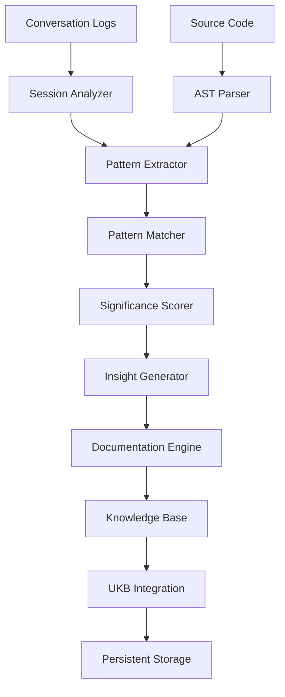

# Automatic Code Pattern Analysis Workflow

## Overview

**AutomaticCodePatternAnalysisWorkflow** was a systematic approach to detecting, documenting, and enforcing architectural patterns across development teams using AST-based pattern recognition.

**⚠️ STATUS**: This system was **deprecated on 2025-09-24** as part of the InsightOrchestrator simplification.

## Historical Semantic Analysis Workflow Integration

This pattern was detected by the now-deprecated Semantic Analysis System during automated workflow execution. It represents the core architecture of the complex analysis system that has since been simplified.

### Former Automated Detection Process (DEPRECATED)
1. **~~Initial Trigger~~**: Post-session analysis of code pattern discussions → Now simplified
2. **~~AST Analysis~~**: Deep code structure analysis using Babel parser → Removed  
3. **~~Pattern Recognition~~**: Multi-layer pattern detection architecture → Removed
4. **~~Significance Scoring~~**: Rated at 8/10 as foundational infrastructure → Removed
5. **~~Self-Documentation~~**: System documented its own capabilities → Manual process

### Former Integration with Semantic Analysis System (DEPRECATED)
```javascript
// DEPRECATED: Core semantic analysis workflow implementation
const semanticAnalysisWorkflow = {
  name: 'code-pattern-analysis',
  trigger: 'post-session-complete', // Now simplified to basic logging
  stages: [
    {
      name: 'session-analysis',
      handler: 'insight-orchestrator.js', // DEPRECATED 2025-09-24
      inputs: ['.specstory/history/*.md'],
      outputs: ['detected-patterns.json'] // No longer generated
    },
    {
      name: 'ast-analysis',
      handler: 'code-analyzer.js', 
      inputs: ['src/**/*.js'],
      outputs: ['ast-patterns.json']
    },
    {
      name: 'pattern-synthesis',
      handler: 'pattern-matcher.js',
      inputs: ['detected-patterns.json', 'ast-patterns.json'],
      outputs: ['synthesized-patterns.json']
    },
    {
      name: 'documentation-generation',
      handler: 'doc-generator.js',
      inputs: ['synthesized-patterns.json'],
      outputs: ['insights/*.md', 'diagrams/*.png']
    }
  ]
};
```

### Semantic Analysis Architecture


### Workflow Execution Components
- **insight-orchestrator.js** (922 lines): Main orchestration engine
- **auto-insight-trigger.js** (362 lines): Automatic workflow triggering
- **post-session-logger.js** (313 lines): Session completion handler
- **test-insight-workflow.js** (460 lines): End-to-end testing framework
- **diagram-generator.js**: Visual documentation generation

### Pattern Detection Capabilities
The workflow demonstrated detection of:
1. **Architectural Patterns**: MVC, Repository, Factory patterns
2. **Framework Patterns**: React hooks, Redux patterns
3. **Anti-Patterns**: Code smells, circular dependencies
4. **Custom Patterns**: Team-specific architectural decisions

## Problem

Automatic code pattern analysis lacks systematic detection and documentation workflows for development teams. Without structured pattern recognition, teams struggle with:

- **Inconsistent Code Quality**: No systematic way to detect and enforce patterns
- **Knowledge Fragmentation**: Architectural decisions scattered across documentation
- **Manual Pattern Detection**: Time-consuming manual code reviews
- **Scalability Issues**: Pattern analysis doesn't scale with codebase growth

## Solution

AST-based pattern recognition system with automated documentation workflows and comprehensive quality assessment:

### Core Implementation

```javascript
// AST-based pattern analyzer
const parser = require('@babel/parser');
const traverse = require('@babel/traverse').default;

class CodePatternAnalyzer {
  analyzeFile(filePath) {
    const code = fs.readFileSync(filePath, 'utf8');
    const ast = parser.parse(code, {
      sourceType: 'module',
      plugins: ['jsx', 'typescript']
    });
    
    const patterns = [];
    traverse(ast, {
      // Detect component patterns
      FunctionDeclaration(path) {
        if (this.isReactComponent(path.node)) {
          patterns.push(this.analyzeComponentPattern(path));
        }
      },
      
      // Detect architectural patterns
      ImportDeclaration(path) {
        patterns.push(this.analyzeDependencyPattern(path));
      }
    });
    
    return patterns;
  }
}
```

### Multi-Layer Analysis

1. **Structural Analysis**: Component organization, import patterns, file structure
2. **Behavioral Analysis**: State management patterns, lifecycle usage
3. **Dependency Analysis**: Module relationships, architectural boundaries

## Key Benefits

### Systematic Pattern Detection
- Automated identification of architectural patterns
- Consistent pattern enforcement across teams
- Real-time pattern compliance checking

### Quality Assessment
- Comprehensive code quality metrics
- Pattern complexity scoring
- Technical debt identification

### Documentation Generation
- Automatic pattern documentation
- Living architectural decision records
- Team knowledge preservation

## Implementation Strategy

### Phase 1: Pattern Detection
```bash
# Basic AST analysis setup
npm install @babel/parser @babel/traverse
```

### Phase 2: Documentation Workflow
```javascript
// Pattern documentation generator
class PatternDocumenter {
  generateDocs(patterns) {
    return patterns.map(pattern => ({
      name: pattern.name,
      description: pattern.description,
      examples: pattern.codeExamples,
      violations: pattern.violations,
      recommendations: pattern.improvements
    }));
  }
}
```

### Phase 3: Enforcement Pipeline
```yaml
# CI/CD integration
pattern-analysis:
  runs-on: ubuntu-latest
  steps:
    - name: Analyze Patterns
      run: npx pattern-analyzer --strict
    - name: Generate Report
      run: npx pattern-docs --output=docs/patterns/
```

## Use Cases

### Code Review Automation
- Automatic pattern compliance checking
- Architectural violation detection
- Code quality gate integration

### Team Knowledge Management
- Pattern library maintenance
- Architectural decision tracking
- Developer onboarding resources

### Technical Debt Management
- Pattern degradation monitoring
- Refactoring opportunity identification
- Code complexity tracking

## Technology Stack

- **AST Parsing**: @babel/parser, @babel/traverse
- **Pattern Recognition**: Custom pattern matching algorithms
- **Documentation**: Automated markdown generation
- **Quality Assessment**: ESLint integration, custom metrics
- **Architecture Analysis**: Dependency graph analysis

## Integration Points

### CI/CD Pipeline
```bash
# GitHub Actions example
- name: Pattern Analysis
  run: |
    npx code-pattern-analyzer analyze src/
    npx code-pattern-analyzer generate-docs
```

### IDE Integration
```javascript
// VS Code extension integration
const patterns = analyzer.analyzeWorkspace(workspace);
vscode.window.showInformationMessage(`Found ${patterns.length} patterns`);
```

## Metrics and Success Criteria

### Pattern Coverage
- **Target**: 90% of components follow established patterns
- **Measurement**: Automated pattern detection ratio

### Documentation Quality
- **Target**: All patterns have comprehensive documentation
- **Measurement**: Documentation completeness score

### Team Adoption
- **Target**: 100% team compliance with pattern enforcement
- **Measurement**: CI/CD pass rate for pattern checks

## Best Practices

### Pattern Definition
1. **Clear Boundaries**: Define what constitutes each pattern
2. **Measurable Criteria**: Establish concrete detection rules
3. **Example Code**: Provide positive and negative examples

### Tool Integration
1. **IDE Support**: Real-time pattern feedback
2. **CI Integration**: Automated pattern enforcement
3. **Documentation**: Living pattern documentation

### Team Workflow
1. **Pattern Reviews**: Regular pattern library updates
2. **Training**: Team education on new patterns
3. **Feedback Loop**: Continuous pattern improvement

## Migration Path

### Legacy Codebases
1. **Baseline Analysis**: Identify existing patterns
2. **Incremental Adoption**: Gradual pattern enforcement
3. **Refactoring Strategy**: Systematic pattern compliance

### New Projects
1. **Pattern-First Design**: Start with established patterns
2. **Real-time Enforcement**: Immediate pattern compliance
3. **Documentation-Driven**: Patterns as first-class citizens

## Future Enhancements

### Machine Learning Integration
- Pattern evolution tracking
- Automatic pattern discovery
- Intelligent refactoring suggestions

### Advanced Analytics
- Pattern usage metrics
- Team productivity correlation
- Code quality predictive modeling

---

*This workflow represents a systematic approach to code pattern analysis and enforcement, enabling teams to maintain consistent architectural quality at scale.*