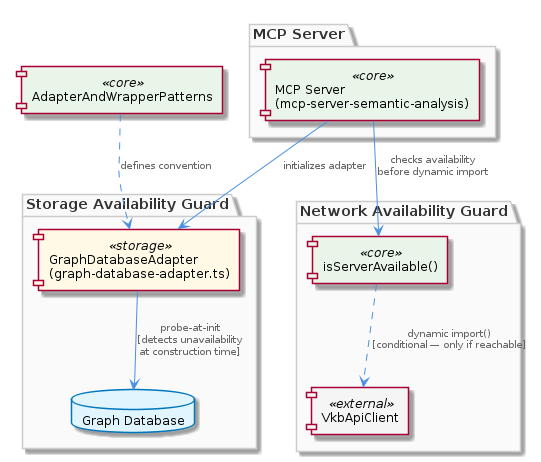
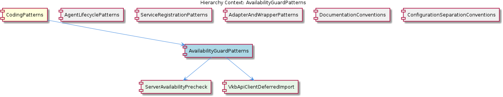

# AvailabilityGuardPatterns

**Type:** SubComponent

This pattern is documented in integrations/mcp-server-semantic-analysis/docs/architecture/integration.md under integration patterns, indicating it is a recognized architectural strategy rather than ad-hoc error handling.

# AvailabilityGuardPatterns

## What It Is

AvailabilityGuardPatterns is a SubComponent of `CodingPatterns` that codifies the project's strategies for protecting against unavailable external dependencies before they are engaged. It is documented as a recognized architectural strategy in `integrations/mcp-server-semantic-analysis/docs/architecture/integration.md` under the integration patterns section, making it a first-class convention rather than ad-hoc defensive coding. The pattern manifests concretely in two distinct call sites: an `isServerAvailable()` precheck invoked before dynamic imports of `VkbApiClient`, and a probe-at-init availability check executed during construction of the adapter in `storage/graph-database-adapter.ts`.

The pattern decomposes into two child sub-components that represent its operational halves: `ServerAvailabilityPrecheck`, which establishes the strict sequencing contract that availability confirmation must precede module resolution, and `VkbApiClientDeferredImport`, which ensures the external API client's module code is never evaluated when the backing server is absent. Together they form a layered guard: the precheck is the decision point, the deferred import is the lever it controls.

## Architecture and Design

The architecture reflects a deliberate split between **network-resource guards** and **local-resource guards**. The `isServerAvailable()` mechanism handles network services — dependencies whose availability is non-deterministic and bound to runtime connectivity — while the probe-at-init pattern in `storage/graph-database-adapter.ts` handles local storage resources, where availability is more deterministic but still requires verification before the adapter is trusted by callers. These two strategies are explicitly distinguished in the documented pattern, signaling that contributors should select the guard mechanism appropriate to the resource class rather than apply a single guard uniformly.

A key design choice for the network-side guard is the use of dynamic `import()` calls instead of static imports for optional dependencies such as `VkbApiClient`. This is more than a styling preference: a static import would load the module into memory regardless of whether its backing server can be reached, while a dynamic import gated by `isServerAvailable()` ensures the module is never resolved or evaluated when the precondition fails. The guard therefore operates at the module-loading boundary, not merely at the function-call boundary, eliminating both the runtime cost and the side-effects of loading optional client code in degraded environments.

On the storage side, the probe-at-init in `storage/graph-database-adapter.ts` aligns intentionally with the sibling `AdapterAndWrapperPatterns` convention. Because `GraphDatabaseAdapter` wraps Graphology plus LevelDB behind a domain-oriented API, the adapter's constructor is the canonical seam where the underlying storage substrate is touched for the first time. Performing the availability probe there means that any caller holding a successfully constructed adapter can treat the storage layer as live, rather than discovering an unavailability condition deep within a domain operation.

## Implementation Details

The `ServerAvailabilityPrecheck` mechanism is realized by invoking `isServerAvailable()` immediately before the `import()` expression that resolves `VkbApiClient`. This establishes a strict ordering: the network probe runs first, and only on its success does control proceed to the dynamic import. Because the dynamic import returns a Promise that resolves to the module namespace, the entire chain — probe, import, client instantiation — composes into an asynchronous initialization flow whose short-circuit point is the availability check.

The `VkbApiClientDeferredImport` sub-component complements this by virtue of where the import is written. Placing the import inside a guarded asynchronous path (rather than at module top level) means the JavaScript engine never resolves the `VkbApiClient` module specifier when the guard fails. This is significant for both memory footprint and for environments where the module's side-effects (e.g., construction of HTTP clients, configuration validation at import time) would otherwise be triggered erroneously.

The probe-at-init mechanism inside `storage/graph-database-adapter.ts` is structurally different: it runs synchronously (or as part of the adapter's initialization sequence) during construction, before the adapter object is handed back to its caller. This means availability detection happens at construction time rather than at first use, surfacing failures earlier and at a point where remediation (e.g., falling back to an alternative adapter, surfacing a fatal startup error) is architecturally cleaner than mid-operation failures.

## Integration Points

AvailabilityGuardPatterns sits beneath `CodingPatterns` and shares the same hierarchical level as `AgentLifecyclePatterns`, `ServiceRegistrationPatterns`, `AdapterAndWrapperPatterns`, `DocumentationConventions`, and `ConfigurationSeparationConventions`. Its strongest cross-pattern relationship is with `AdapterAndWrapperPatterns`: the probe-at-init strategy is explicitly aligned with that convention because `GraphDatabaseAdapter` is the wrapping seam that hides Graphology and LevelDB behind a domain API. The availability guard piggybacks on the adapter's existing role as the single point of entry to the storage substrate.

There is also a meaningful contrast with `AgentLifecyclePatterns`, the sibling that governs `BaseAgent` subclasses. Agent constructors deliberately do *not* perform resource acquisition (LLM connections are deferred to `ensureLLMInitialized()`), whereas the adapter constructor in `storage/graph-database-adapter.ts` deliberately *does* probe its resource. The two patterns reach opposite conclusions because they optimize for different concerns: agent construction must remain cheap for bulk instantiation, while adapter construction must guarantee that downstream callers receive a usable handle. AvailabilityGuardPatterns thus codifies the rule that the guard's placement is driven by what the caller needs to assume about the returned object.

The downstream integration is most visible in the `VkbApiClient` dynamic-import site, where the guard mediates between the application's optional integration with an external API server and the rest of the codebase. The documentation in `integrations/mcp-server-semantic-analysis/docs/architecture/integration.md` is the authoritative reference, ensuring that future integrations with optional external services have a documented template to follow.

## Usage Guidelines

When introducing an optional dependency on a network service, contributors should follow the `ServerAvailabilityPrecheck` + `VkbApiClientDeferredImport` template: write an availability probe equivalent to `isServerAvailable()`, gate a dynamic `import()` of the client module on its result, and avoid any static import of the optional client. The combination guarantees both that the failure mode is fast and observable and that the client's module code does not enter memory in degraded environments. Static imports of optional clients are an anti-pattern under this convention.

When introducing a local resource adapter — particularly one that wraps a storage backend, in keeping with `AdapterAndWrapperPatterns` — the availability probe belongs in the adapter's initialization. The contract is that a successfully constructed adapter implies a live resource. Deferring the probe to first use violates this contract and pushes failure handling into every call site that uses the adapter, undermining the encapsulation benefit of the wrapper.

Developers should also be deliberate about which of the two guard strategies applies. Network services are non-deterministically available and benefit from per-invocation prechecks combined with deferred import. Local resources are typically deterministic at process start and benefit from a one-time probe during construction. Misapplying the strategies — for example, probing a network service only at construction time — undermines the guard, because the resource's state can change between construction and use. Following the documented distinction in `integrations/mcp-server-semantic-analysis/docs/architecture/integration.md` keeps the pattern coherent across the codebase.

Finally, because both child mechanisms are documented as recognized patterns rather than incidental code, any new optional-dependency integration should be reviewed against this pattern. Ad-hoc try/catch around an unguarded import or an unprotected adapter call should be refactored to one of the two canonical forms so the codebase retains a single, predictable approach to availability handling.

## Hierarchy Context

### Parent
- [CodingPatterns](./CodingPatterns.md) -- [LLM] The project enforces a strict three-phase lazy initialization contract for all LLM-backed agents, documented in integrations/mcp-server-semantic-analysis/docs/architecture/agents.md. The contract mandates the sequence: constructor(repoPath, team) → ensureLLMInitialized() → execute(input). In the constructor phase, the agent captures only its configuration context (repository path and team assignment) without touching LLM infrastructure. The second phase, ensureLLMInitialized(), is an idempotent guard method that performs the actual LLM client instantiation and is designed to be safe to call multiple times — only the first call allocates resources. The third phase, execute(input), is the sole public entry point for agent work and implicitly relies on ensureLLMInitialized() having been called (either explicitly by a harness or at the top of execute() itself). This pattern is a deliberate trade-off: it keeps agent construction cheap for cases where agents are instantiated in bulk but only a subset are actually invoked, preventing unnecessary LLM connection overhead. A new contributor adding an agent must not acquire LLM connections in the constructor — doing so would break the lifecycle contract and cause resource exhaustion in orchestrator scenarios that pre-instantiate agents.

### Children
- [ServerAvailabilityPrecheck](./ServerAvailabilityPrecheck.md) -- isServerAvailable() is explicitly invoked ahead of the dynamic import call for VkbApiClient, establishing a strict sequencing contract: availability confirmation must precede module resolution.
- [VkbApiClientDeferredImport](./VkbApiClientDeferredImport.md) -- By placing VkbApiClient behind a dynamic import guarded by isServerAvailable(), the sub-component ensures the external API client's module code is never evaluated in environments or conditions where its backing server is absent.

### Siblings
- [AgentLifecyclePatterns](./AgentLifecyclePatterns.md) -- BaseAgent subclasses documented in integrations/mcp-server-semantic-analysis/docs/architecture/agents.md all follow a constructor(repoPath, team) signature that captures only configuration context, explicitly forbidding any LLM client instantiation at this stage.
- [ServiceRegistrationPatterns](./ServiceRegistrationPatterns.md) -- scripts/api-service.js calls ProcessStateManager.registerService() immediately after process spawn, establishing the registration as the canonical signal that a service is live and trackable.
- [AdapterAndWrapperPatterns](./AdapterAndWrapperPatterns.md) -- GraphDatabaseAdapter wraps the Graphology graph library combined with LevelDB persistence, exposing a domain-oriented API rather than the raw Graphology or LevelDB interfaces directly.
- [DocumentationConventions](./DocumentationConventions.md) -- All architecture diagrams are stored as .puml files under docs/puml/ directories, as evidenced by the documentation listing showing integrations/mcp-server-semantic-analysis/docs/architecture/ containing multiple .md files that reference PlantUML sources.
- [ConfigurationSeparationConventions](./ConfigurationSeparationConventions.md) -- config/agent-profiles.json holds runtime behavioral configuration for agents (model selection, parameters, capabilities), deliberately separated from topology concerns.

---

*Generated from 6 observations*
