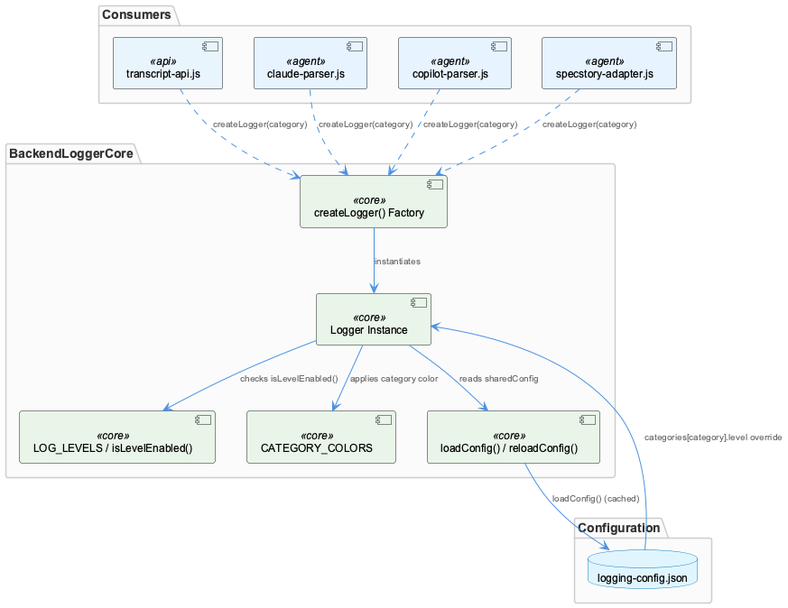
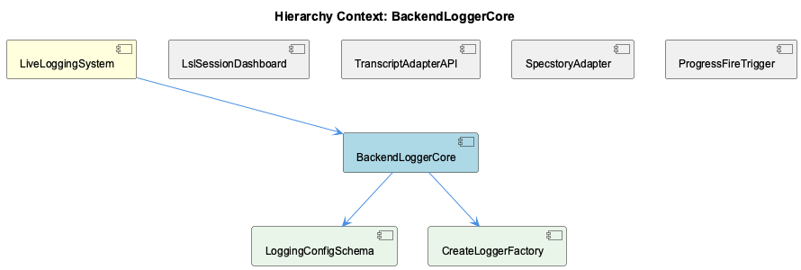

# BackendLoggerCore

**Type:** SubComponent

environments block in logging-config.json defines development/production/test overrides (e.g., test sets console:false, production disables colors) though environment selection logic isn't shown in the truncated Logger.js

# BackendLoggerCore — Technical Insight Document

## What It Is

BackendLoggerCore is implemented in `Logger.js`, backed by the configuration file `config/logging-config.json`. It provides the shared logging infrastructure for the broader LiveLoggingSystem, serving as the underlying mechanism that all category-specific loggers are built upon. As a child-bearing component, it owns two direct subcomponents: LoggingConfigSchema, which defines the shape of the configuration file, and CreateLoggerFactory, which exposes the `createLogger(category)` entry point used throughout the codebase. While LiveLoggingSystem's parent module (`logging.ts`) is concerned with session windowing and transcript capture, BackendLoggerCore is concerned strictly with *how log messages are leveled, colored, and emitted* — a cross-cutting utility consumed by nearly every other subcomponent in the system.

## Architecture and Design

The core architectural pattern is a **singleton configuration cache with per-instance override**. `Logger.js` calls `loadConfig()` once and stores the result in a module-level `sharedConfig`, avoiding repeated disk reads, while `reloadConfig()` exists as an escape hatch to force a refresh when configuration changes at runtime. Layered on top of this cached global config is an **instance-level merge strategy**: the Logger constructor merges per-instance options over the global config, then applies a category-specific override pulled from `globalConfig.categories[category].level` if one exists. This produces a three-tier precedence chain: instance options > category override > global default.

Level gating is handled through a classic numeric-priority table: `LOG_LEVELS` assigns error:0 through trace:4, and `isLevelEnabled()` compares the requested level against `config.level` before allowing `_log()` to execute. This is a standard, low-overhead filtering approach that avoids string comparison in the hot path. The `environments` block in `logging-config.json` further layers development/production/test-specific overrides (e.g., test disables console output, production disables colors), though the observations note that the environment-selection logic itself is not visible in the truncated `Logger.js`, suggesting this may be an area worth verifying directly against source when extending environment behavior.

## Implementation Details

The configuration schema (owned by child component LoggingConfigSchema) defines per-category level overrides for `health`, `billing`, `transcript`, `knowledge`, `workflow`, `database`, `api`, and `mcp`. Notably, `database` defaults to `'warn'` while all other categories default to `'info'` — a deliberate design decision to reduce noise from what is presumably a high-frequency or less operationally interesting category. `CATEGORY_COLORS` maps each of these same categories to a distinct ANSI color code, giving terminal output visual disambiguation between subsystems without needing to read the category label text.

The factory function, implemented as CreateLoggerFactory, is the sole documented construction path: `createLogger(category)` returns a logger instance pre-bound to a category, which then automatically inherits that category's level override and color from the shared config. This keeps consumer code simple — callers never interact with `LOG_LEVELS`, `sharedConfig`, or `CATEGORY_COLORS` directly.

## Integration Points

BackendLoggerCore sits beneath LiveLoggingSystem in the hierarchy but is consumed laterally by sibling components as well as external modules. The `createLogger(category)` convention is explicitly used by `transcript-api.js` (TranscriptAdapterAPI), `claude-parser.js`, `copilot-parser.js`, and `specstory-adapter.js` (SpecstoryAdapter) — meaning any change to level-gating, color mapping, or config merge order in `Logger.js` has direct, cascading effects across these consumers. This mirrors the way the parent LiveLoggingSystem's `logging.ts` is described as an authoritative source of truth for downstream consumers: BackendLoggerCore plays the same authoritative role, but for *log emission* rather than *session/transcript structure*.

The dependency on `config/logging-config.json` (validated conceptually via LoggingConfigSchema) is the other major integration point — any category added to sibling/consumer code must have a corresponding entry in this JSON file to receive a meaningful override, otherwise it silently falls back to the global default.

## Usage Guidelines

Developers should always obtain loggers via `createLogger(category)` rather than instantiating Logger directly, matching the pattern already established by transcript-api.js, claude-parser.js, copilot-parser.js, and specstory-adapter.js. When introducing a new category, add a corresponding entry to `logging-config.json`'s `categories` block and, if terminal disambiguation matters, extend `CATEGORY_COLORS` accordingly. Because `sharedConfig` is cached at module load, code paths that mutate `logging-config.json` at runtime must explicitly call `reloadConfig()` to see changes take effect — silent staleness is a real risk otherwise. Finally, be cautious with the `database` category's `'warn'` default: if debugging database-layer issues, the level override must be raised explicitly, either per-instance or via the config file, since it will not surface `info`/`debug` logs by default.

## Hierarchy Context

### Parent
- [LiveLoggingSystem](./LiveLoggingSystem.md) -- [LLM] The LiveLoggingSystem centers around logging.ts, which owns the core responsibilities of session windowing, file routing, and transcript capture. This module acts as the single ingestion point for live Claude Code conversation data, meaning any change to session lifecycle semantics (e.g., how a 'session window' is defined or when it rolls over to a new file) has cascading effects on downstream consumers like the classification agent and config validation tooling. New developers should treat logging.ts as the authoritative source of truth for how raw conversation events are structured before they are persisted to disk.

### Children
- [LoggingConfigSchema](./LoggingConfigSchema.md) -- Top-level keys 'level', 'console', 'file', 'filePath', 'colors', 'timestamp' set the default logging behavior consumed when Logger.js calls loadConfig()
- [CreateLoggerFactory](./CreateLoggerFactory.md) -- Consumers such as lib/agent-api/transcript-api.js call `const logger = createLogger('transcript-api')` to get a module-scoped logger

### Siblings
- [LslSessionDashboard](./LslSessionDashboard.md) -- lsl-sessions.mjs defines a chain as an hourly tranche including rotation parts, not a single file, because legacy '-N_' markdown parts are headerless fragments split mid-token and pi-format parts are linked via parentSession
- [TranscriptAdapterAPI](./TranscriptAdapterAPI.md) -- TranscriptAdapter is an abstract base class in transcript-api.js that throws on direct instantiation via `new.target === TranscriptAdapter` check, forcing agent-specific subclasses to implement getAgentType, readTranscripts, convertToLSL, getCurrentSession
- [SpecstoryAdapter](./SpecstoryAdapter.md) -- SpecstoryAdapter.initialize() tries three connection methods in fallback order: connectViaHTTP(), then connectViaIPC(), then connectViaFileWatch()
- [ProgressFireTrigger](./ProgressFireTrigger.md) -- progressFireDecision() fires on EITHER of two independent triggers: a token-delta trigger (cumulative output tokens grown by >= thresholdTokens since last mark) or a wall-clock trigger (elapsed ms >= elapsedThresholdMs)

---

*Generated from 7 observations*
