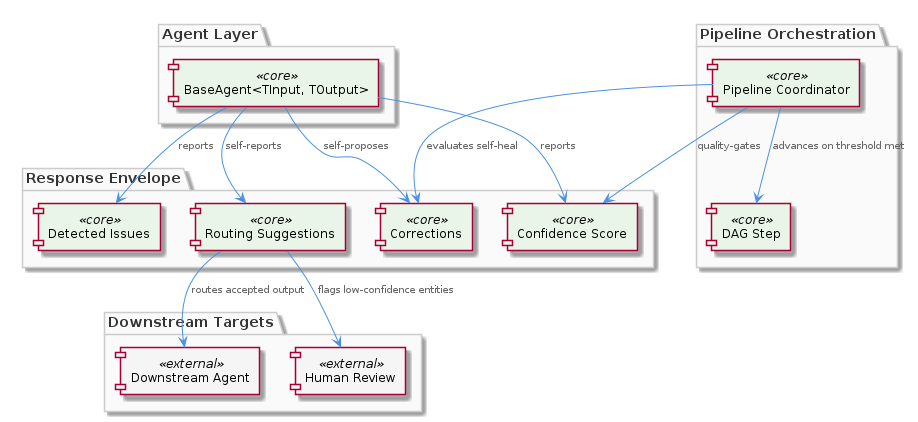
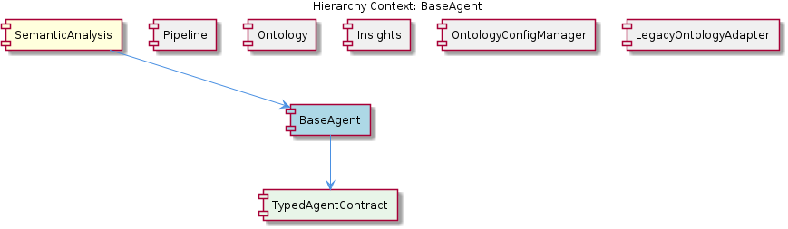

# BaseAgent

**Type:** SubComponent

Routing suggestions in the envelope allow agents to self-report that their output should be directed to an alternative downstream agent (e.g., flagging low-confidence entities for human review rather than direct persistence)

## What It Is

BaseAgent<TInput, TOutput> is a generic abstract class documented in `integrations/mcp-server-semantic-analysis/docs/architecture/agents.md`. It serves as the foundational contract for all specialized agents within the SemanticAnalysis pipeline, enforcing compile-time type safety across agents that handle heterogeneous data shapes. Its child component TypedAgentContract formalizes this generic parameterization.

## Architecture and Design

BaseAgent enforces a standard response envelope containing: confidence score, detected issues, routing suggestions, and corrections. This envelope-based design gives the Pipeline coordinator sufficient signal to decide retry, reroute, or accept outcomes at each DAG step.

The design employs three key patterns:

**Self-healing responses** — The corrections field allows agents to propose fixes within the same response cycle, reducing coordinator retry overhead. **Declarative routing** — Routing suggestions let agents self-report alternative downstream targets (e.g., flagging low-confidence entities for human review). **<USER_ID_REDACTED>-gating** — The confidence field feeds directly into the pipeline coordinator's threshold logic for advancing through DAG steps defined in `batch-analysis.yaml`.

## Implementation Details

Each concrete agent (insight-generation, ontology classification, persistence, etc.) extends BaseAgent with specific TInput/TOutput type parameters. The response envelope is not optional — all fields (confidence, issues, routing suggestions, corrections) are mandated, ensuring the coordinator never operates on incomplete metadata.

Sibling components like Ontology agents (backed by LegacyOntologyAdapter) and Insights agents all inherit this contract. OntologyConfigManager ensures shared configuration state across all BaseAgent implementations.

## Integration Points

- **Pipeline coordinator** reads confidence scores to enforce <USER_ID_REDACTED> gates and topological DAG execution
- **LegacyOntologyAdapter** decouples BaseAgent subclasses from km-core's concrete OntologyRegistry API
- **Routing suggestions** interface with downstream agent selection, enabling dynamic pipeline branching
- All sibling components (Ontology, Insights, Pipeline) consume or produce BaseAgent-shaped envelopes

## Usage Guidelines

When implementing a new agent: parameterize TInput/TOutput explicitly, always populate all envelope fields (even if confidence is 1.0 and corrections is empty), and use routing suggestions to flag edge cases rather than silently passing low-<USER_ID_REDACTED> output downstream. The self-healing corrections pattern should be preferred over relying on coordinator retries.

## Hierarchy Context

### Parent
- [SemanticAnalysis](./SemanticAnalysis.md) -- SemanticAnalysis is a multi-agent pipeline in `integrations/mcp-server-semantic-analysis/` that processes git history, LSL/vibe sessions, and AST-parsed code graphs to extract and persist structured knowledge entities. The system orchestrates several specialized agents—covering git history ingestion, code graph construction, semantic insight generation, ontology classification, content validation, and persistence—coordinated through a batch-analysis workflow. Each agent extends a common `BaseAgent<TInput, TOutput>` abstract class that enforces a standard response envelope with confidence scoring, issue detection, routing suggestions, and corrections, enabling robust retry and <USER_ID_REDACTED>-gating across pipeline steps.

### Children
- [TypedAgentContract](./TypedAgentContract.md) -- Documented in integrations/mcp-server-semantic-analysis/docs/architecture/agents.md, BaseAgent<TInput, TOutput> is described as a generic abstract class parameterized on input and output types, enforcing compile-time type safety across agents that handle different data shapes.

### Siblings
- [Pipeline](./Pipeline.md) -- batch-analysis.yaml defines the pipeline as a DAG of steps with explicit depends_on edges, enabling topological execution order across coordinator, observation, KG, dedup, and persistence agents
- [Ontology](./Ontology.md) -- docs/architecture/agents.md describes OntologyClassifier and OntologyValidator as distinct interfaces, both now backed by LegacyOntologyAdapter wrapping km-core OntologyRegistry
- [Insights](./Insights.md) -- docs/architecture/agents.md identifies a dedicated insight-generation agent responsible for authoring structured knowledge reports from aggregated code and history signals
- [OntologyConfigManager](./OntologyConfigManager.md) -- Implemented as a singleton (per docs/configuration.md patterns) to ensure all pipeline agents share a single authoritative view of ontology paths and classification thresholds
- [LegacyOntologyAdapter](./LegacyOntologyAdapter.md) -- Resolves the architectural issue documented in CRITICAL-ARCHITECTURE-ISSUES.md where OntologyClassifier was tightly coupled to an internal registry; the adapter decouples pipeline agents from the km-core registry's concrete API

---

*Generated from 5 observations*
