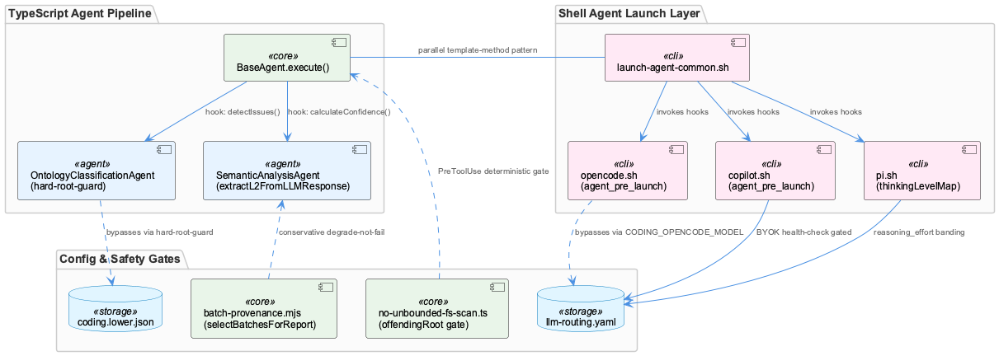
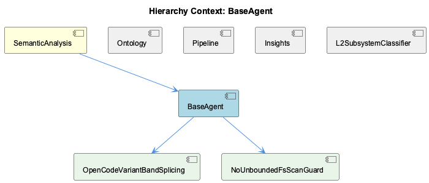

# BaseAgent

**Type:** SubComponent

[Architecture Notes] The supplied code files do not include integrations/semantic-analysis/src/agents/base-agent.ts, so no direct evidence for BaseAgent's execute() pipeline is present in this batch — those claims originate from the parent-context summary, not from files analyzed here.; There are two structurally similar but functionally distinct 'agent' abstractions in this codebase: semantic-analysis's BaseAgent subclasses (data-processing pipeline stages) and the CLI wrapper's config/agents/*.sh launch definitions (external tool orchestration) — a naming collision worth flagging to avoid conflating them in documentation or search.; All three CLI agent configs (copilot.sh, opencode.sh, pi.sh) route through a single LLM proxy (port 12435) rather than each agent's native API, centralizing cost/routing control at the proxy layer instead of in each agent's config.; pi's extension and config-writing logic favors copy-with-marker-guard semantics (checking for a first-line marker comment before overwriting) to distinguish tool-managed files from user-authored ones, avoiding destructive overwrites in shared config directories.

# BaseAgent — Technical Insight Document

## What It Is

BaseAgent is defined at `integrations/semantic-analysis/src/agents/base-agent.ts` and forms the foundation of the SemanticAnalysis pipeline's agent architecture. Per the parent-context description, it exposes a fixed processing pipeline — `execute()` → `process()` → `calculateConfidence()` → `detectIssues()` → `generateRouting()` → `applyCorrections()` → `buildMetadata()` — that subclasses such as OntologyClassificationAgent and SemanticAnalysisAgent implement to turn raw observations (git history, LSL session data) into structured knowledge-graph entities wrapped in a standardized `AgentResponse` envelope.

**Important caveat:** none of the source files supplied for this analysis (`config/agents/copilot.sh`, `config/agents/opencode.sh`, `config/agents/pi.sh`, `config/agents/pi-extensions/no-unbounded-fs-scan.ts`, `integrations/system-health-dashboard/src/components/agent-badge.tsx`) touch `base-agent.ts` itself. There is a naming collision in this codebase between two unrelated "agent" concepts: (1) semantic-analysis's BaseAgent subclasses, which are data-processing pipeline stages, and (2) the top-level coding CLI's `config/agents/*.sh` launch configs, which orchestrate external human-facing coding-assistant tools (copilot, opencode, pi). This document must therefore be read as two layers: direct, class-level claims about BaseAgent come from parent context only, while the bulk of the concrete, file-grounded observations describe the CLI launch-config subsystem, included here because it shares BaseAgent's core philosophy — a standardized envelope/hook around agent-specific logic — even though it is architecturally distinct.

## Architecture and Design

At the class level, BaseAgent embodies the template-method pattern: a fixed pipeline of stages that subclasses fill in with domain logic, always emitting a uniform `AgentResponse` with confidence breakdowns, detected issues, and routing suggestions for retry/escalation. Its siblings — Pipeline, Ontology, L2SubsystemClassifier, and LegacyOntologyAdapter — all extend or plug into this scaffold, and OntologyClassificationAgent additionally layers in hierarchy-root guards from `@fwornle/km-core`'s `HIERARCHY_ROOTS` for closed-set entities.

The CLI-side "agent" configs, by contrast, implement the same *philosophy* — a standardized wrapper around variable, agent-specific behavior — through a convention-based plugin/strategy pattern rather than inheritance. Each `config/agents/<name>.sh` file (copilot.sh, opencode.sh, pi.sh) implicitly satisfies an interface (`AGENT_NAME`, `AGENT_COMMAND`, `agent_check_requirements()`, `agent_pre_launch()`, optional `agent_cleanup()`) sourced by a shared `launch-agent-common.sh`. This is a structural echo of BaseAgent's design goal — one place defines the contract, many implementations fill it in — realized in bash conventions instead of a TypeScript class hierarchy. Similarly, `no-unbounded-fs-scan.ts` implements a fail-open interceptor pattern (`pi.on('tool_call', ...)` returning `{block, reason, terminate}`) that mirrors BaseAgent's "structured decision object instead of ad-hoc logic" ethos, and `agent-badge.tsx`'s static `AGENT_COLORS` fallback table mirrors BaseAgent's guarantee of a always-valid response envelope, applied instead to UI rendering safety.

## Implementation Details

Within the true BaseAgent lineage, OntologyClassificationAgent (`ontology-classification-agent.ts`) combines heuristic classifiers, an LLM-backed OntologyClassifier, and hard-coded guards, and the newer L2 refinement layer (Phase 57/60) adds pure, testable helpers (`loadL2Classes`, `buildL2RefinementPrompt`, `extractL2FromLLMResponse`) plus a deterministic keyword-based fallback in L2SubsystemClassifier (`l2-subsystem-classifier.ts`) for when `coding.lower.json` is absent — a graceful-degradation pattern BaseAgent's subclasses are expected to honor throughout.

The CLI configs illustrate the same graceful-degradation instinct at the implementation level: `config/agents/pi.sh:_pi_write_models_json()` conditionally emits headers like `x-task-id` only when `TASK_ID` is actually set, working around quirks such as `${TASK_ID:-}` failing pi's `ENV_VAR_NAME_RE` and `||` vs `??` semantics in `resolveEnvConfigValue`. `config/agents/opencode.sh:_oc_splice_config()` safely merges JSON fragments to avoid trailing-comma errors, and `agent_pre_launch()` builds per-model `variants`/`reasoningEffort` configuration. `config/agents/copilot.sh:agent_pre_launch()` deliberately clears `COPILOT_PROVIDER_*` env vars rather than exporting them, an idempotent-config pattern documented inline (D-03/WR-02/WR-05) to ensure the later `configure_proxy_routing()` hook remains the single source of routing truth. `no-unbounded-fs-scan.ts` implements `offendingRoot()`, `unboundedRoots()`, and `findRoots()` to detect filesystem-wide `find` calls (citing a 343-second scan of `/`), failing open via a bare try/catch since blocking legitimate commands is cheaper than losing bash capability entirely.

## Integration Points

BaseAgent integrates directly with its SemanticAnalysis parent pipeline and siblings: Pipeline agents extend it for envelope consistency, Ontology's OntologyClassificationAgent and L2SubsystemClassifier's fallback classifier both feed into the same confidence/routing machinery, and LegacyOntologyAdapter presumably bridges older data into this envelope model. On the CLI side, all three agent launch configs converge on a single `rapid-llm-proxy` (port 12435) instead of each tool's native API, centralizing cost and routing control at the proxy layer — a pattern architecturally analogous to BaseAgent centralizing confidence/routing logic in one class rather than scattering it across subclasses. `agent-badge.tsx`'s `AGENT_COLORS` map integrates with the system-health-dashboard UI, defaulting unknown agent strings to `claude`'s color.

## Usage Guidelines

Documentation and search tooling should treat "BaseAgent" (semantic-analysis) and "config/agents/*.sh" (CLI launch configs) as distinct systems despite the shared naming and shared design philosophy — conflating them will confuse future maintenance. When extending BaseAgent subclasses, follow the established graceful-degradation convention (empty/fallback results rather than thrown errors), as modeled by L2SubsystemClassifier's keyword fallback and the CLI's conditional header emission. Routing-related configuration should live in exactly one place (`configure_proxy_routing()` for CLI agents; presumably `generateRouting()` for BaseAgent subclasses) — other hooks should defensively clear rather than set such state. New agent types added to either system (a new BaseAgent subclass, a new `config/agents/*.sh`, or a new CLI tool shown in `agent-badge.tsx`) require updates in multiple corresponding places (color map, launch-common interface, proxy config) since none of these registries are dynamically discovered.

## Code Evidence

Key code artifacts grounding this entity's analysis:

- [LLM] The code files supplied for this analysis (config/agents/copilot.sh, config/agents/opencode.sh, config/agents/pi.sh, config/agents/pi-extensions/no-unbounded-fs-scan.ts, integrations/system-health-dashboard/src/components/agent-badge.tsx) do not correspond to the parent-context description of BaseAgent (integrations/semantic-analysis/src/agents/base-agent.ts) and its execute() -> process() -> calculateConfidence() -> detectIssues() -> generateRouting() -> applyCorrections() -> buildMetadata() pipeline. There is a naming collision between two unrelated 'agent' concepts in this codebase: (1) semantic-analysis's BaseAgent subclasses (OntologyClassificationAgent, SemanticAnalysisAgent) that process observations into knowledge-graph entities, and (2) the top-level 'coding' CLI wrapper's per-tool agent launch configs (copilot/opencode/pi) that configure how a human-facing coding assistant CLI is started, proxied, and instrumented. No code_graph data was provided, so no [LLM+CGR] observations can be made; all statements below are grounded in the literal file contents shown, not in the BaseAgent class itself.

## Hierarchy Context

### Parent
- [SemanticAnalysis](./SemanticAnalysis.md) -- SemanticAnalysis is a multi-agent pipeline (integrations/semantic-analysis/src/agents/) that processes git history and LSL session data to extract, classify, and persist structured knowledge entities into the ontology-backed knowledge graph. It orchestrates specialized agents extending BaseAgent (base-agent.ts) which wrap agent-specific logic in a standardized AgentResponse envelope, computing confidence breakdowns, detecting issues, and generating routing suggestions for retry/escalation between workflow steps.

At its core, OntologyClassificationAgent (ontology-classification-agent.ts) assigns ontology metadata (class, confidence, method) to observations by combining heuristic classifiers, an LLM-backed OntologyClassifier, and hard-coded hierarchy-root guards for closed-set entities (CollectiveKnowledge, Coding, DynArch, Timeline, Normalisa) imported from @fwornle/km-core's HIERARCHY_ROOTS. A newer L2 refinement layer (Phase 57/60) further refines generic L1 classes (Component/SubComponent/Detail) into specific subsystem classes declared in coding.lower.json, using pure, independently-testable helper functions (loadL2Classes, buildL2RefinementPrompt, extractL2FromLLMResponse) alongside a deterministic keyword-based fallback classifier (l2-subsystem-classifier.ts).

The SemanticAnalysisAgent (semantic-analysis-agent.ts) performs the actual code/git/vibe cross-analysis, reading files from git history, computing complexity metrics and architectural pattern detection, and invoking an LLM (via @rapid/llm-proxy's LLMService) to generate deeper semantic insights that are merged with heuristically-detected patterns. The pipeline emphasizes testability (extensive node:test suites with tmpdir-isolated ontology fixtures) and graceful degradation (e.g., absent coding.lower.json yields empty L2 refinement rather than errors), reflecting an incremental, plan-driven development process (Phase 42/57/60 markers throughout the code).

### Siblings
- [Pipeline](./Pipeline.md) -- Pipeline agents extend BaseAgent (base-agent.ts) so each stage wraps its output in a standardized AgentResponse envelope with confidence breakdowns.
- [Ontology](./Ontology.md) -- OntologyClassificationAgent (ontology-classification-agent.ts) combines heuristic classifiers, an LLM-backed OntologyClassifier, and hard-coded hierarchy-root guards.
- [Insights](./Insights.md) -- [CGR] INSIGHTS (class) in kb-ab-sample-tasks.mjs
- [L2SubsystemClassifier](./L2SubsystemClassifier.md) -- [LLM] The L2SubsystemClassifier's fallback path is a deterministic keyword-based classifier housed in l2-subsystem-classifier.ts, separate from the LLM-driven refinement in ontology-classification-agent.ts. This separation lets the pipeline degrade gracefully: when the LLM call fails, times out, or coding.lower.json is absent, the workflow can still emit an L2 class (or empty result) without throwing, consistent with the project's stated 'graceful degradation' design goal rather than hard-failing the whole classification step.
- [LegacyOntologyAdapter](./LegacyOntologyAdapter.md) -- [CGR] LegacyOntologyAdapter (class) in LegacyOntologyAdapter.ts

---

*Generated from 9 observations*
