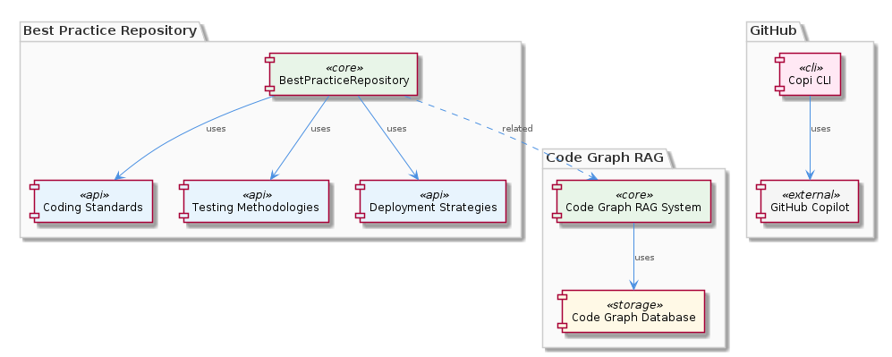
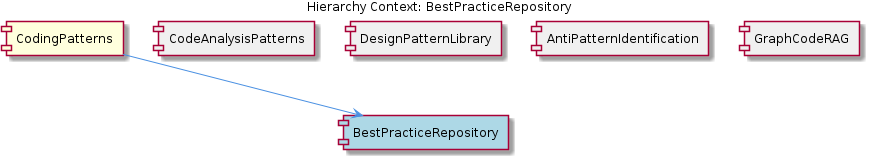

# BestPracticeRepository

**Type:** SubComponent

Contributing to the BestPracticeRepository might involve guidelines similar to those outlined in integrations/code-graph-rag/CONTRIBUTING.md, although that file is specific to the Code Graph RAG system.

## What It Is  

**BestPracticeRepository** is declared as a *sub‑component* of the **CodingPatterns** component.  The only concrete locations that mention it are high‑level metadata – there are no source files, classes, or functions that directly implement the repository.  From the observations we can infer that the repository is intended to be a curated collection of best‑practice artefacts (coding standards, testing methodologies, deployment strategies, etc.) that support the broader **CodingPatterns** ecosystem.  

The closest concrete artefacts are the markdown‑style documentation files that live under the `integrations/` folder, for example `integrations/copi/README.md`, which discusses best‑practice recommendations for using the Copi CLI wrapper.  Although these files are not part of a formal “BestPracticeRepository” package, they serve as the only tangible evidence of the kind of guidance the repository is expected to provide.  

Because the component is referenced only at the architectural level, its implementation is likely a set of static resources (e.g., markdown files, JSON schemas) rather than executable code.  This matches the pattern used by sibling components such as **DesignPatternLibrary** and **AntiPatternIdentification**, which are also described conceptually but lack concrete code artefacts in the current snapshot.

---

## Architecture and Design  

The architectural picture of **BestPracticeRepository** can be understood only by looking at its parent, **CodingPatterns**, and the shared infrastructure that the sibling components rely on.  **CodingPatterns** employs a *graph‑based* approach for code analysis, as described in `integrations/code-graph-rag/README.md`.  The graph‑code RAG system builds a knowledge graph of code entities, and an `EntityValidator` class in `integrations/mcp-server-semantic-analysis/src/agents/ontology-classification-agent.ts` validates those entities against an ontology.  

In this context, **BestPracticeRepository** is positioned as a *data source* that feeds curated best‑practice nodes into the same graph.  The repository does not introduce its own runtime behaviour; instead, it supplies static knowledge that the graph‑processing pipeline can query.  This design keeps the repository lightweight and decoupled from the processing engine, allowing the graph layer to evolve independently.  

  

The architecture therefore follows a **separation‑of‑concerns** pattern: the repository holds immutable guidance artefacts, while the graph engine (used by **CodeAnalysisPatterns**, **GraphCodeRAG**, and other siblings) handles traversal, inference, and recommendation generation.  No explicit design patterns such as factories or adapters are visible in the source because the repository is not represented by code; the pattern that does emerge is the *knowledge‑base* pattern, where a read‑only data store is queried by multiple consumers.

---

## Implementation Details  

Because the observations report **0 code symbols** and no explicit file paths for the repository itself, the implementation details are limited to the surrounding conventions:

* **Static Documentation Files** – The only concrete files that discuss best‑practice guidance are markdown documents, e.g., `integrations/copi/README.md`.  These files likely follow a common schema (title, description, usage examples) that the graph‑building process can parse into nodes.

* **Contribution Workflow** – The contributing guidelines for a related component (`integrations/code-graph-rag/CONTRIBUTING.md`) provide a template for how new best‑practice entries should be added:  
  1. Create a markdown file under a designated folder (e.g., `best-practices/`).  
  2. Follow the prescribed header format (e.g., `# Practice Name`, `## Scope`, `## Rationale`).  
  3. Ensure the entry is linted with the repository’s markdown linter and passes any CI checks.

* **No Executable Classes** – There are no classes such as `BestPracticeRepository` or functions like `loadBestPractices()` in the observed code base.  The ingestion of best‑practice artefacts is therefore likely handled by generic parsers used by the graph‑code RAG system, which scan markdown directories and convert them into graph nodes.

* **Potential Integration Hooks** – The `ontology-classification-agent.ts` file contains the `EntityValidator` class, which validates entities against an ontology.  While not directly tied to the repository, it is reasonable to assume that best‑practice nodes are part of that ontology, enabling validation of code against recommended patterns.

---

## Integration Points  

**BestPracticeRepository** interacts with the rest of the system primarily through *data consumption* rather than direct API calls.  The key integration pathways are:

1. **Graph‑Code RAG Pipeline** – The graph engine described in `integrations/code-graph-rag/README.md` periodically scans the repository’s markdown files, transforms them into graph nodes, and links them to related code entities.  This enables downstream components like **CodeAnalysisPatterns** to surface best‑practice recommendations during analysis.

2. **Copi Integration** – The `integrations/copi/README.md` file illustrates how developers can invoke Copi (a GitHub Copilot CLI wrapper) with best‑practice hints.  Although Copi itself does not import the repository, the README demonstrates a *usage contract*: developers should consult the best‑practice guidance before running Copi commands, ensuring that generated code aligns with organizational standards.

3. **Ontology Validation** – The `EntityValidator` in `integrations/mcp-server-semantic-analysis/src/agents/ontology-classification-agent.ts` validates any new code entities against the best‑practice ontology.  When a developer submits code that violates a documented practice, the validator can flag the issue, feeding back into the CI pipeline.

4. **Sibling Consumption** – Components such as **DesignPatternLibrary** and **AntiPatternIdentification** may reference the same underlying markdown artefacts to enrich their own knowledge graphs.  This shared consumption reinforces consistency across the **CodingPatterns** family.

  

Through these pathways, the repository remains a *passive* yet essential source of guidance, allowing multiple consumers to stay synchronized with the latest best‑practice definitions without requiring duplicated logic.

---

## Usage Guidelines  

Given the lack of concrete implementation code, the practical guidance for developers centers on *contributing* and *consuming* the static artefacts:

* **Follow Existing Contribution Templates** – When adding a new best‑practice entry, mirror the structure used in `integrations/code-graph-rag/CONTRIBUTING.md`.  Include a clear title, a concise description, rationale, and concrete examples.  This uniformity ensures the graph‑ingestion scripts can reliably parse the content.

* **Maintain Consistent Naming** – Use kebab‑case filenames that reflect the practice name (e.g., `unit-testing-strategy.md`).  Consistent naming aids automated discovery and prevents naming collisions across sibling components.

* **Validate Markdown** – Run the repository’s markdown linter (if present) before submitting a pull request.  Linting guarantees that the documentation renders correctly in downstream tools such as Copi’s suggestion overlays.

* **Link to Ontology** – When a practice maps to an existing ontology term, add the appropriate identifier in the markdown front‑matter.  This enables the `EntityValidator` to recognize the practice during code validation.

* **Stay Aligned with Parent Conventions** – Because **BestPracticeRepository** lives under the **CodingPatterns** umbrella, any architectural changes to the graph‑code RAG system (e.g., schema updates) must be reflected in the repository’s markdown schema.  Periodic reviews of the parent component’s documentation (`integrations/code-graph-rag/README.md`) are recommended.

---

### Summary of Requested Insights  

1. **Architectural patterns identified** – Knowledge‑base pattern (static markdown repository) feeding a graph‑based analysis engine; separation‑of‑concerns between data (best practices) and processing (graph RAG).  
2. **Design decisions and trade‑offs** – Choosing a read‑only, file‑based store keeps the repository simple and version‑controlled but limits dynamic updates; reliance on generic parsers avoids duplication but introduces coupling to the graph ingestion logic.  
3. **System structure insights** – BestPracticeRepository sits as a leaf data source under **CodingPatterns**, supplying nodes to the same graph that powers **CodeAnalysisPatterns**, **GraphCodeRag**, and related siblings.  
4. **Scalability considerations** – Because the repository is file‑based, scaling is mainly a matter of filesystem performance and parser throughput; the graph engine can horizontally scale the ingestion pipeline to handle large numbers of markdown files.  
5. **Maintainability assessment** – High maintainability: the repository consists of plain markdown, versioned alongside code, with contribution guidelines that enforce consistency.  The main risk is drift between the markdown schema and the graph‑ingestion parser, mitigated by shared contribution templates and periodic audits.

## Hierarchy Context

### Parent
- [CodingPatterns](./CodingPatterns.md) -- [LLM] The CodingPatterns component utilizes a graph-based approach for code analysis, as seen in the integrations/code-graph-rag/README.md file, which describes the Graph-Code RAG system. This system is used for graph-based code analysis and implies the use of graph structures and algorithms within the CodingPatterns component. The entity validation is performed by the EntityValidator class in integrations/mcp-server-semantic-analysis/src/agents/ontology-classification-agent.ts, suggesting a structured approach to validating entities within the coding patterns. Furthermore, the batch processing pipeline is defined in integrations/mcp-server-semantic-analysis/src/agents/ontology-classification-agent.ts, indicating that the CodingPatterns component may leverage batch processing for efficient handling of coding pattern analysis.

### Siblings
- [CodeAnalysisPatterns](./CodeAnalysisPatterns.md) -- CodeAnalysisPatterns utilizes the Graph-Code RAG system described in integrations/code-graph-rag/README.md for graph-based code analysis.
- [DesignPatternLibrary](./DesignPatternLibrary.md) -- DesignPatternLibrary is mentioned as a known sub-component but lacks specific references in the provided source files.
- [AntiPatternIdentification](./AntiPatternIdentification.md) -- AntiPatternIdentification is recognized as a sub-component but lacks direct references in the provided source files.
- [GraphCodeRAG](./GraphCodeRAG.md) -- GraphCodeRAG is described in integrations/code-graph-rag/README.md as a Graph-Code RAG system for any codebases.

---

*Generated from 6 observations*
