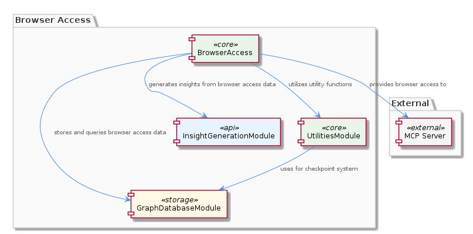
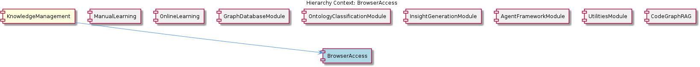

# BrowserAccess

**Type:** SubComponent

The BrowserAccess sub-component is responsible for providing browser access functionality, ensuring that the browser can access and interact with the system.

## What It Is  

The **BrowserAccess** sub‑component lives under the `integrations/browser-access/` directory of the repository. Its purpose, as stated in the observations, is to “provide browser access functionality, ensuring that the browser can access and interact with the system.” The component is documented in `integrations/browser-access/README.md`, which supplies the consumer‑facing description and basic usage instructions.  

Two environment‑style configuration variables are central to its operation:

* **`BROWSER_ACCESS_SSE_URL`** – the endpoint that the BrowserAccess logic connects to for Server‑Sent Events (SSE) communication.  
* **`LOCAL_CDP_URL`** – the URL of a locally‑running Chrome DevTools Protocol (CDP) endpoint that BrowserAccess can use to drive a browser instance.  

Together these settings allow the sub‑component to establish a low‑latency, push‑based channel (via SSE) and, when required, a direct control channel (via CDP) so that a browser can both receive updates from the backend and be programmatically steered.

---

## Architecture and Design  

### Architectural Approach  
BrowserAccess is organized as a **sub‑component** inside the broader **CodingPatterns** parent component. The parent’s documentation emphasizes lazy initialization for LLM services, a pattern that signals a design preference for **on‑demand resource activation**. While the observations do not explicitly call out lazy loading for BrowserAccess, the presence of configurable URLs (`BROWSER_ACCESS_SSE_URL`, `LOCAL_CDP_URL`) suggests a similar **configuration‑driven activation** model: the sub‑component remains inert until the runtime environment supplies the necessary endpoints.

### Design Patterns Evident  
1. **Configuration‑Driven Wiring** – The two variables act as external configuration knobs that decouple the component from hard‑coded URLs. This follows a classic *External Configuration* pattern, enabling the same codebase to run in multiple environments (dev, test, prod) without source changes.  

2. **Server‑Sent Events (SSE) for Push Communication** – By leveraging SSE, BrowserAccess adopts a **push‑based streaming** pattern. SSE is a lightweight, unidirectional streaming protocol that fits scenarios where the server needs to broadcast state changes to the browser without the overhead of full‑duplex WebSockets.  

3. **Chrome DevTools Protocol (CDP) Integration** – The use of a `LOCAL_CDP_URL` indicates an **Adapter**‑like relationship: BrowserAccess abstracts the details of CDP behind its own API, allowing higher‑level code to interact with the browser without dealing directly with CDP specifics.

### Interaction Model  
The sub‑component likely performs the following steps:

1. **Startup** – Reads `BROWSER_ACCESS_SSE_URL` and `LOCAL_CDP_URL` from the environment (or a configuration file).  
2. **SSE Connection** – Opens an `EventSource` (or equivalent server‑side SSE client) to the SSE URL, listening for events that convey system state or commands.  
3. **CDP Session** – If `LOCAL_CDP_URL` is present, establishes a CDP WebSocket connection to control the browser (e.g., navigation, DOM manipulation).  
4. **Event Handling** – Translates incoming SSE messages into CDP commands or higher‑level callbacks that the rest of the system can consume.  

Because the component resides alongside siblings such as **CodeAnalysis**, **DatabaseManagement**, **LLMIntegration**, **ConstraintConfiguration**, and **ConcurrencyManagement**, it shares the same **modular integration philosophy**: each sub‑component encapsulates a distinct concern while exposing a thin, well‑defined interface to the rest of the system.

---

## Implementation Details  

Although no concrete class or function names appear in the observations, the documented variables and the README give a clear picture of the implementation scaffolding:

* **Configuration Loading** – A small utility (likely a module in `integrations/browser-access/`) reads `process.env.BROWSER_ACCESS_SSE_URL` and `process.env.LOCAL_CDP_URL`. The presence of these variables is a prerequisite for the component to become active.  

* **SSE Client** – The component probably creates an `EventSource` (Node.js `eventsource` package or native browser API) pointed at `BROWSER_ACCESS_SSE_URL`. Event listeners (`onmessage`, `onerror`) are attached to react to server‑sent payloads.  

* **CDP Connector** – When `LOCAL_CDP_URL` is defined, the component opens a WebSocket to the CDP endpoint. It may use a library such as `chrome-remote-interface` to issue commands like `Page.navigate`, `Runtime.evaluate`, or `DOM.getDocument`.  

* **Message Translation Layer** – Incoming SSE events are parsed (likely JSON) and mapped to CDP commands or internal events. This translation layer isolates the rest of the system from the raw SSE payload format.  

* **Graceful Shutdown** – A typical implementation would expose a `close()` or `dispose()` method that tears down both the SSE `EventSource` and the CDP WebSocket, ensuring no dangling network resources.  

* **README Documentation** – `integrations/browser-access/README.md` serves as the single source of truth for developers, describing required environment variables, expected event formats, and any runtime prerequisites (e.g., a locally running Chrome instance exposing CDP).

Because the parent component **CodingPatterns** already employs lazy initialization (`ensureLLMInitialized()`), it is plausible that BrowserAccess follows a similar **lazy activation** pattern: the SSE/ CDP connections are only opened when the first consumer requests browser access, reducing unnecessary network traffic during idle periods.

---

## Integration Points  

1. **Parent – CodingPatterns**  
   BrowserAccess is a child of the **CodingPatterns** component. While CodingPatterns focuses on LLM‑related lazy initialization, BrowserAccess contributes the “browser‑side” interaction capability. Both likely share a common configuration loader and may be initialized together in a higher‑level bootstrap script that sets up the overall application environment.

2. **Sibling Components**  
   * **CodeAnalysis** and **LLMIntegration** – These siblings also rely on lazy initialization of external services. BrowserAccess can be orchestrated alongside them, for example, by initializing the SSE channel only after LLM services have been confirmed, ensuring that any analysis results can be streamed to the browser in real time.  
   * **DatabaseManagement** – Uses `MEMGRAPH_BATCH_SIZE` for DB batching. BrowserAccess might consume data that originates from database queries, but the observations do not specify a direct link.  
   * **ConcurrencyManagement** – Provides a work‑stealing executor (`WaveController.runWithConcurrency()`). If BrowserAccess needs to process a high volume of SSE events, it could off‑load heavy handling to the concurrency controller, though this is speculative.  

3. **External Services**  
   * **SSE Server** – The URL supplied via `BROWSER_ACCESS_SSE_URL` points to an external service that pushes events. The component must handle reconnection logic and back‑pressure, typical of SSE clients.  
   * **Chrome DevTools Protocol Endpoint** – The `LOCAL_CDP_URL` targets a locally running Chrome (or Chromium) instance exposing the CDP interface. This dependency requires that developers run Chrome with the `--remote-debugging-port` flag or use a headless browser container.  

4. **Configuration Layer** – All integration points rely on environment variables, reinforcing a **configuration‑centric** integration model that simplifies deployment across varied environments (CI pipelines, local dev, cloud).

---

## Usage Guidelines  

1. **Provide Both URLs When Needed** – If the application only needs to receive server‑pushed events, set `BROWSER_ACCESS_SSE_URL` alone. To drive the browser (e.g., automated UI tests, live previews), also define `LOCAL_CDP_URL`. Omitting required URLs will cause the component to stay inert or fail to connect.  

2. **Run Chrome with CDP Enabled** – When using `LOCAL_CDP_URL`, start Chrome with the `--remote-debugging-port=<port>` flag and ensure the port matches the URL. For headless environments, use `chrome --headless --remote-debugging-port=<port>`.  

3. **Handle Reconnection** – SSE connections can be interrupted; developers should listen for the `error` event and implement exponential back‑off reconnection logic. The component’s internal implementation likely already does this, but callers should be prepared for temporary unavailability.  

4. **Respect Lazy Activation** – Do not force the component to initialize at import time. Instead, request browser access through the exposed API (e.g., `BrowserAccess.getInstance()` or similar) so that the underlying SSE/CDP connections are opened only when needed. This aligns with the parent’s lazy‑initialization philosophy and conserves resources.  

5. **Clean Up Resources** – When the application shuts down or the browser session ends, invoke the component’s shutdown/cleanup method to close the SSE stream and CDP WebSocket. This prevents dangling network sockets and avoids port exhaustion in long‑running processes.  

6. **Consult the README** – All configuration keys, expected event payload schemas, and sample initialization code are documented in `integrations/browser-access/README.md`. Treat this file as the authoritative reference for any changes to the component’s contract.

---

### Architectural Patterns Identified  

| Pattern | Evidence |
|---------|----------|
| Configuration‑Driven Wiring | Use of `BROWSER_ACCESS_SSE_URL` and `LOCAL_CDP_URL` variables |
| Server‑Sent Events (push streaming) | BrowserAccess “utilizes SSE for efficient communication” |
| Adapter (CDP integration) | `LOCAL_CDP_URL` enables BrowserAccess to control a browser via CDP |
| Lazy/On‑Demand Activation (inherited from parent) | Parent component CodingPatterns uses lazy initialization; BrowserAccess likely follows a similar approach |

### Design Decisions & Trade‑offs  

* **SSE vs. WebSockets** – SSE offers simpler server‑to‑client streaming with automatic reconnection, at the cost of being unidirectional. The decision favors ease of implementation and lower overhead for scenarios where the browser only needs to receive updates.  
* **External Configuration** – Decoupling URLs from code increases flexibility but introduces runtime validation requirements; missing or malformed URLs will prevent the component from functioning.  
* **CDP Dependency** – Leveraging CDP provides fine‑grained browser control but ties the component to a Chrome/Chromium runtime, limiting portability to other browsers unless alternative adapters are added.  

### System Structure Insights  

* BrowserAccess is a **leaf sub‑component** under the **CodingPatterns** hierarchy, focused exclusively on browser‑side interaction.  
* It shares the **modular, configuration‑first** design language of its siblings, reinforcing a cohesive system architecture where each concern (analysis, database, concurrency, constraints) is encapsulated behind environment‑driven entry points.  

### Scalability Considerations  

* **SSE Scaling** – Because SSE uses a single HTTP connection per client, scaling to many concurrent browsers requires the SSE server to handle many open connections. The component itself is lightweight, but the backend must be provisioned accordingly (e.g., using an event‑driven server or a reverse proxy that supports HTTP/2 multiplexing).  
* **CDP Session Limits** – Each browser instance opened via CDP consumes a separate debugging port and resources. In high‑concurrency test suites, consider pooling browsers or using headless containers to avoid exhausting system resources.  

### Maintainability Assessment  

* **High Maintainability** – The component’s responsibilities are narrowly defined (SSE consumption and optional CDP control) and are driven by explicit configuration variables, making the codebase easy to understand and modify.  
* **Documentation Centralization** – All usage details are consolidated in `integrations/browser-access/README.md`, reducing knowledge silos.  
* **Potential Risks** – Absence of explicit class or function names in the current observations makes automated code navigation harder; adding well‑named symbols (e.g., `BrowserAccessClient`, `CdpController`) would further improve readability and tooling support.  

Overall, **BrowserAccess** embodies a straightforward, configuration‑centric design that complements the broader **CodingPatterns** ecosystem, providing a reliable bridge between server‑side events and browser‑side interaction while keeping the implementation lightweight and maintainable.

## Diagrams

### Relationship

### Architecture

## Architecture Diagrams

## Hierarchy Context

### Parent
- [CodingPatterns](./CodingPatterns.md) -- [LLM] The CodingPatterns component utilizes a lazy initialization approach for LLM services, which is evident in the ensureLLMInitialized() method within the base-agent.ts file. This method ensures that the LLM service is only initialized when it is actually needed, thus optimizing resource usage and improving performance. Furthermore, the use of lazy initialization allows for more flexibility in the component's design, as it enables the creation of agents that can be used with or without LLM services. The ensureLLMInitialized() method is typically called within the constructor of the agent classes, such as the CodeGraphAgent class in integrations/mcp-server-semantic-analysis/src/agent/code-graph-agent.ts, to guarantee that the LLM service is properly initialized before the agent's execution.

### Siblings
- [CodeAnalysis](./CodeAnalysis.md) -- The ensureLLMInitialized() method in base-agent.ts guarantees the LLM service is initialized before code analysis execution.
- [DatabaseManagement](./DatabaseManagement.md) -- The MEMGRAPH_BATCH_SIZE variable is used to configure the batch size for database interactions.
- [LLMIntegration](./LLMIntegration.md) -- The ensureLLMInitialized() method in base-agent.ts guarantees the LLM service is initialized before data analysis execution.
- [ConstraintConfiguration](./ConstraintConfiguration.md) -- The integrations/mcp-constraint-monitor/docs/constraint-configuration.md file provides information on constraint configuration.
- [ConcurrencyManagement](./ConcurrencyManagement.md) -- The WaveController.runWithConcurrency() method implements work-stealing via shared nextIndex counter, allowing idle workers to pull tasks immediately.

---

*Generated from 6 observations*
