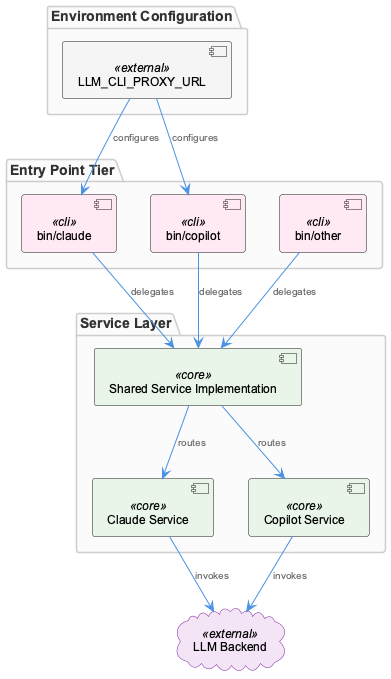
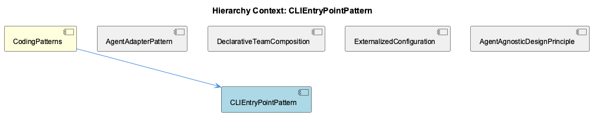

# CLIEntryPointPattern

**Type:** SubComponent

CLAUDE.md describes bin/ scripts as proxies that delegate to underlying services, establishing delegation as the explicit architectural intent rather than an implementation detail

# CLIEntryPointPattern

## What It Is

CLIEntryPointPattern describes the structural convention governing all scripts in the `bin/` directory of the Coding project. These scripts serve as the outermost shell of the invocation chain — the public-facing command surface that developers interact with directly, as documented in `docs/getting-started.md`. Rather than containing substantive logic, each `bin/` script functions as a **proxy**: it receives arguments, prepares the environment, and delegates execution to an underlying service layer. This delegation model is not incidental — `CLAUDE.md` explicitly establishes it as the architectural intent, elevating the proxy pattern from implementation detail to a named design principle.

As a member of CodingPatterns, CLIEntryPointPattern sits alongside sibling conventions like ExternalizedConfiguration and AgentAgnosticDesignPrinciple. Together, these patterns form the cross-cutting design vocabulary of the project. The CLI entry point pattern, in particular, enforces the boundary between the human-facing invocation surface and the backend execution machinery.

## Architecture and Design

The architecture of `bin/` follows a strict two-tier model. The first tier — the entry point tier, as named in `docs/architecture/system-overview.md` — comprises the `bin/` scripts themselves. Their responsibility is narrow: forward arguments and configure the environment. The second tier is the service layer, where actual execution logic lives. This separation is a deliberate load-bearing design decision: by keeping `bin/` scripts thin, the system allows multiple entry points to share the same underlying service implementations without duplication.

This design directly supports the AgentAgnosticDesignPrinciple. Because Claude, Copilot, and other backends are implemented in service layers rather than in `bin/` scripts, the entry point scripts remain neutral with respect to which AI backend is being invoked. The proxy layer does not need to change when a new backend is added — only the service layer grows. This is the same separating principle that motivates AgentAdapterPattern: the `bin/` scripts consume the unified interface, not the backend directly.

The externalization of routing targets further reinforces this design. `LLM_CLI_PROXY_URL` is a documented environment variable consumed at the CLI layer, meaning even the destination of a proxy call is not hardcoded in `bin/`. This aligns directly with the ExternalizedConfiguration sibling pattern, which governs credentials and URLs like `LLM_PROXY_URL` and `OPENAI_API_KEY`. The `bin/` layer and the configuration layer are thus designed to work in concert: neither contains values that belong in the other.

## Implementation Details

A `bin/` script implementing this pattern contains two mechanical responsibilities. First, **argument forwarding**: the script captures its invocation arguments and passes them through to the service layer without interpretation. Second, **environment setup**: the script may read or validate environment variables — such as `LLM_CLI_PROXY_URL` — before delegating. Beyond these two operations, logic does not belong in `bin/`.

The practical consequence of this constraint is that `bin/` scripts are intentionally short. Their value is positional — they define the named commands that developers call — not computational. The substantive behavior for any given command lives in a referenced service, meaning the `bin/` script is essentially a named pointer with a thin environment-preparation wrapper around it.

This pattern also means that debugging and testing focus should be directed at service layers rather than `bin/` scripts. A failure at the `bin/` level is almost certainly an environment configuration problem (a missing variable, a wrong path) rather than a logic error. Logic errors surface in the service layer.

## Integration Points

The primary integration surface of CLIEntryPointPattern is the boundary between `bin/` and the service layer. Every `bin/` script has exactly one downstream dependency: the service it delegates to. This one-to-one delegation relationship is what makes the pattern clean — there is no fan-out of logic within a `bin/` script itself.

At the environment boundary, `LLM_CLI_PROXY_URL` connects the CLI layer to externalized routing configuration. This variable must be set in the execution environment before a `bin/` script runs, placing a documented dependency on the operator or developer environment. The ExternalizedConfiguration pattern governs this contract more broadly: the same principle that externalizes `ANTHROPIC_API_KEY` and `OPENAI_API_KEY` also externalizes proxy routing targets.

The `bin/` layer also connects upward to developers through `docs/getting-started.md`, which treats these scripts as the canonical interface for using the toolkit. This means the names and behaviors exposed by `bin/` scripts constitute the **public API** of the system — changes to them are user-visible in a way that changes to service layers are not.

The relationship to DeclarativeTeamComposition and AgentAdapterPattern is indirect but structurally important. A developer invokes a `bin/` command, which delegates to a service, which may instantiate an agent adapter, which operates within a team configuration defined in `config/teams/`. The `bin/` layer is the initiating step of that entire chain.

## Usage Guidelines

**Keep `bin/` scripts thin by design.** If you find yourself writing conditional logic, parsing arguments, or implementing business rules in a `bin/` script, that logic belongs in the service layer. The script should read like a one-line delegation with environment preamble.

**Externalize all routing and target configuration.** Following the ExternalizedConfiguration pattern, any URL, host, or backend target referenced in a `bin/` script must come from an environment variable. `LLM_CLI_PROXY_URL` is the established precedent. Hardcoding a service location in `bin/` violates both this pattern and the AgentAgnosticDesignPrinciple, because it binds the entry point to a specific backend or environment.

**Treat the `bin/` namespace as a public API.** Because `docs/getting-started.md` directs developers to these scripts as their primary interface, renaming or removing a `bin/` command is a breaking change in the user-facing contract. New backends or capabilities should be added by extending the service layer and — only if a new named command is genuinely needed — adding a new `bin/` entry point that delegates to the new service.

**Prefer shared service implementations over duplicated `bin/` scripts.** The pattern explicitly supports multiple `bin/` entry points sharing one service implementation. If two commands do similar things, the right answer is a shared service with two thin `bin/` wrappers, not two independently implemented scripts.

## Hierarchy Context

### Parent
- [CodingPatterns](./CodingPatterns.md) -- CodingPatterns serves as the architectural catch-all component for the Coding project, capturing cross-cutting programming conventions, design patterns, and best practices that permeate the entire codebase. The project follows consistent patterns visible across its configuration, tooling, and documentation: agent abstractions use a constructor+initialize+execute lifecycle, shell scripts in bin/ follow a proxy/delegation pattern to underlying services, and configuration is externalized into config/ YAML/JSON files rather than hardcoded values. The system emphasizes agent-agnostic design, enabling multiple AI backends (Claude, Copilot, Mastra, OpenCode) to operate under a unified interface.

### Siblings
- [AgentAdapterPattern](./AgentAdapterPattern.md) -- docs/architecture/agent-abstraction-api.md defines the unified Agent Abstraction API that all backends must conform to, serving as the contract between adapters and consumers
- [DeclarativeTeamComposition](./DeclarativeTeamComposition.md) -- config/teams/ directory holds JSON files that define which agents participate in a team and their roles, as described in the architecture documentation
- [ExternalizedConfiguration](./ExternalizedConfiguration.md) -- LLM_PROXY_URL, RAPID_LLM_PROXY_URL, OPENAI_API_KEY, and ANTHROPIC_API_KEY are all documented as environment variables rather than in-code constants, enforcing externalization at the credential level
- [AgentAgnosticDesignPrinciple](./AgentAgnosticDesignPrinciple.md) -- CLAUDE.md explicitly names agent-agnostic design as a core architectural principle, making backend independence a first-class documented constraint rather than an emergent property

---

*Generated from 6 observations*
