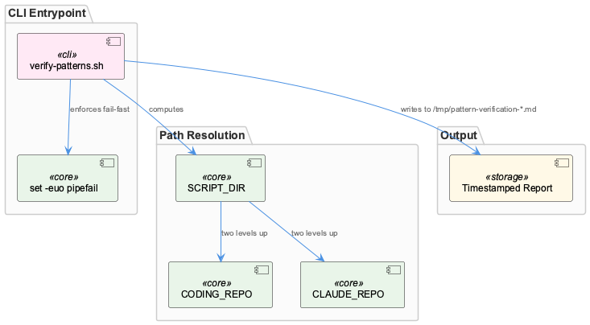
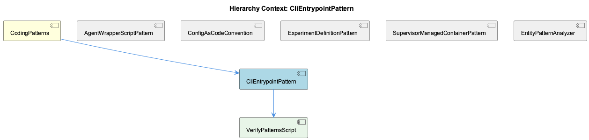

# CliEntrypointPattern

**Type:** SubComponent

scripts/knowledge-management/verify-patterns.sh acts as a standalone CLI entrypoint invoked directly rather than through a shared bin/ dispatcher, computing paths relative to SCRIPT_DIR

# CliEntrypointPattern

## What It Is

CliEntrypointPattern is a documented convention within CodingPatterns for structuring standalone command-line scripts in this repository, exemplified concretely by `scripts/knowledge-management/verify-patterns.sh`. Rather than routing through a shared `bin/` dispatcher, this script is invoked directly, computing all of its working paths relative to its own location via `SCRIPT_DIR`. This makes it self-contained: it can be run from any working directory and still correctly resolve the repository root and its own configuration inputs.

## Architecture and Design

The defining architectural trait of this pattern is location-relative path resolution instead of hardcoded absolute paths. The child component VerifyPatternsScript implements this directly: it computes `SCRIPT_DIR` using `SCRIPT_DIR="$(cd "$(dirname "${BASH_SOURCE[0]}")" && pwd)"`, then derives `DEFAULT_REPO`/`CODING_REPO`/`CLAUDE_REPO` by walking two directories up — a relationship explicitly annotated in-script as "Coding root is 2 levels up." This is a common bash entrypoint idiom that decouples the script from any assumption about install location or invocation context.

A second architectural trait is defensive execution: the script opens with `set -euo pipefail`, ensuring it fails fast on unset variables, command errors, or pipeline failures rather than silently continuing with corrupted state. This is a lightweight but important reliability convention for scripts that are not covered by a test harness.

A third trait is auditable output: rather than only printing to stdout, the script writes a structured, timestamped report to `/tmp/pattern-verification-*.md`. This establishes a reusable convention — other CLI entrypoints following this pattern can adopt the same timestamped-report approach to produce inspectable, retained artifacts of each run.

## Implementation Details

The core mechanics live in VerifyPatternsScript, the sole documented child of this pattern. Path derivation is a two-step process: first resolve the script's own directory (handling symlinks and relative invocation via `dirname`/`cd`/`pwd`), then ascend two levels to reach the Coding repository root, populating `CODING_REPO` and `CLAUDE_REPO`. This avoids hardcoding developer-machine-specific or CI-specific absolute paths.

Output generation writes a Markdown-formatted report to a timestamped file under `/tmp`, giving each invocation a distinct, non-overwriting artifact suitable for later review or archival. Combined with `set -euo pipefail`, the script's execution model is: resolve paths defensively, do work under strict error handling, and emit a durable report rather than ephemeral console output alone.

Notably, the actual pattern-verification logic pulls its input from a shared JSON knowledge base — this is documented separately under the sibling ConfigAsCodeConvention, where verify-patterns.sh queries `$SHARED_MEMORY` via `jq`, filtering entities by `entityType == 'TransferablePattern'` and `significance >= 8`. This shows the CLI entrypoint's role is largely orchestration and reporting around a declaratively-defined dataset, not embedding pattern logic itself.

## Integration Points

CliEntrypointPattern sits as a subcomponent of CodingPatterns, alongside sibling conventions AgentWrapperScriptPattern, ConfigAsCodeConvention, ExperimentDefinitionPattern, SupervisorManagedContainerPattern, and EntityPatternAnalyzer. It shares a philosophical kinship with AgentWrapperScriptPattern — both are script-level conventions for normalizing invocation — though AgentWrapperScriptPattern focuses on adapting third-party CLIs (e.g., `claude.sh`, `opencode.sh` reading `CODING_OPENCODE_MODEL`) while CliEntrypointPattern focuses on self-locating, standalone repo tooling.

Its most direct integration is with ConfigAsCodeConvention: verify-patterns.sh, the concrete instance of this pattern, is also the concrete instance of that sibling pattern, since it consumes the `$SHARED_MEMORY` JSON knowledge base via `jq`. Its sole child, VerifyPatternsScript, is the literal implementation artifact that realizes the pattern's path-resolution and reporting conventions.

## Usage Guidelines

Developers writing new standalone scripts in this repository should follow VerifyPatternsScript as the canonical template: compute `SCRIPT_DIR` from `BASH_SOURCE`, derive repo-root paths by explicit, commented directory traversal (avoid hardcoded absolute paths), and open with `set -euo pipefail` to fail fast. When a script produces meaningful output, prefer writing a timestamped report file (e.g., under `/tmp`) over stdout alone, so results are auditable after the fact. If the script needs pattern or configuration data, follow the sibling ConfigAsCodeConvention by querying the shared JSON knowledge base with `jq` rather than embedding data in the script. Because this is a lightweight, convention-based pattern rather than a shared library, maintainers should keep new entrypoints consistent by inspection/reference to verify-patterns.sh rather than expecting a shared dispatcher to enforce it.

## Hierarchy Context

### Parent
- [CodingPatterns](./CodingPatterns.md) -- [LLM] The agent wrapper scripts under config/agents/ (claude.sh, copilot.sh, opencode.sh, pi.sh) implement a consistent adapter pattern where each script normalizes a distinct third-party CLI's invocation surface into a common interface expected by the rest of the Coding infrastructure. Rather than having callers branch on which agent is being invoked, each wrapper reads its own set of environment variables (e.g., CODING_OPENCODE_MODEL for opencode.sh) and translates them into the flags or config files that the underlying binary expects. This pattern lets orchestration code (likely in bin/coding or docs/architecture/agent-abstraction-api.md-described layers) treat all agents uniformly, at the cost of needing to keep each wrapper script in sync whenever a new common capability (like model selection or proxy routing) is added — a new developer adding agent support should look at an existing wrapper like claude.sh as the canonical template, per docs/architecture/adding-new-agent.md.

### Children
- [VerifyPatternsScript](./VerifyPatternsScript.md) -- Computes SCRIPT_DIR via `SCRIPT_DIR="$(cd "$(dirname "${BASH_SOURCE[0]}")" && pwd)"` and derives DEFAULT_REPO by going two directories up, comment explicitly states 'Coding root is 2 levels up'

### Siblings
- [AgentWrapperScriptPattern](./AgentWrapperScriptPattern.md) -- Each wrapper reads a distinct env var namespace, e.g. CODING_OPENCODE_MODEL for opencode.sh, to select model configuration without changing caller code
- [ConfigAsCodeConvention](./ConfigAsCodeConvention.md) -- verify-patterns.sh reads pattern definitions dynamically from a jq-queried JSON knowledge base file ($SHARED_MEMORY) filtering entities by entityType == 'TransferablePattern' and significance >= 8
- [ExperimentDefinitionPattern](./ExperimentDefinitionPattern.md) -- docs/benchmarks/coding-v1/README.md and RESULTS.md describe a benchmark named coding-v1 whose configuration/results are documented separately from code, implying a declarative experiment definition
- [SupervisorManagedContainerPattern](./SupervisorManagedContainerPattern.md) -- No supervisord configuration files or Dockerfile content were present in the provided Source Files to substantiate specific observations
- [EntityPatternAnalyzer](./EntityPatternAnalyzer.md) -- EntityPatternAnalyzer.teamDirectories Map hardcodes directory-to-team ownership, e.g. 'Coding' owns src/ontology, src/knowledge-management, scripts, .specstory

---

*Generated from 4 observations*
