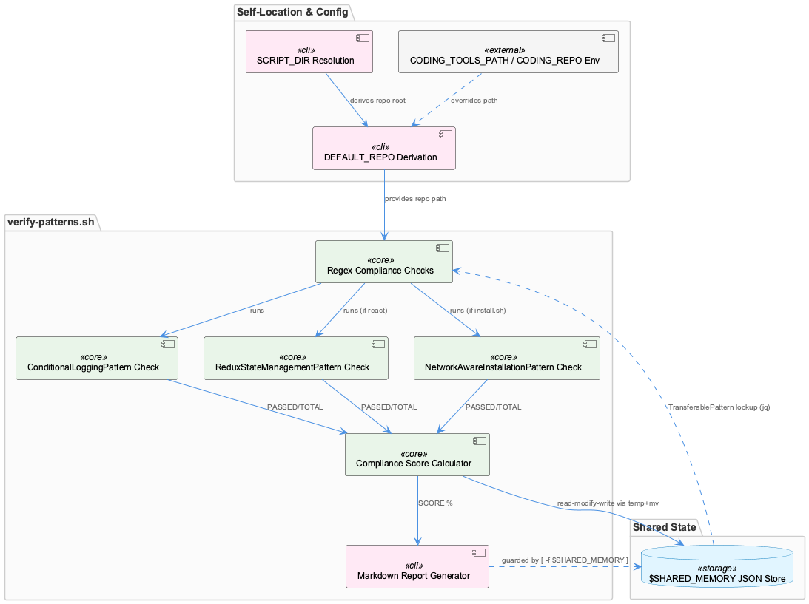
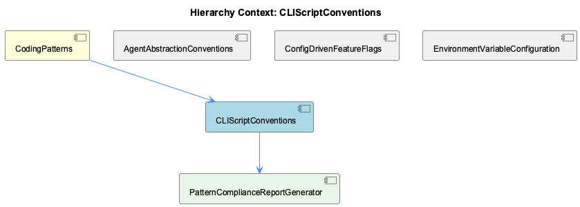

# CLIScriptConventions

**Type:** SubComponent

[Architecture Notes] verify-patterns.sh computes DEFAULT_REPO two directory levels above its own location, coupling its correctness to the script remaining at scripts/knowledge-management/ — moving the file would silently break repo-root resolution unless CODING_REPO is set; Conditional TOTAL_CHECKS accumulation means the compliance percentage is not normalized across environments, undermining cross-run comparability of pattern_compliance_score; The script both reads and writes $SHARED_MEMORY (a JSON knowledge store) using a read-modify-write via a temp file (`jq ... > "$SHARED_MEMORY.tmp" && mv`), a common safe-write pattern but with no locking against concurrent writers; Generated remediation commands (sed-based console.log→Logger.log rewrite) are emitted as text in a report rather than executed, keeping the script read-only/non-destructive despite auditing for a mutation

# CLIScriptConventions — Technical Insight Document

## What It Is

CLIScriptConventions is the broader shell-scripting idiom in this codebase, concretely instantiated in `scripts/knowledge-management/verify-patterns.sh`. While the parent component, CodingPatterns, documents the `config/agents/*.sh` adapter scripts (claude.sh, copilot.sh, opencode.sh, pi.sh) that normalize vendor CLIs into a common invocation contract, CLIScriptConventions captures the more general convention underlying all of these: self-contained, idempotent Bash CLI tools that resolve their own execution context rather than assuming a fixed working directory. verify-patterns.sh is the best-documented instance and serves as the reference implementation for this document, alongside its own child component, PatternComplianceReportGenerator, which handles the report-artifact-naming responsibility.

Unlike the adapter scripts in the parent, which normalize *external* vendor CLIs, verify-patterns.sh performs a different function entirely — auditing the repo's own source for adherence to documented patterns (a "compliance-as-shell-script" role) — but it is built from the same structural primitives.

## Architecture and Design

The defining architectural pattern is self-locating path resolution: `SCRIPT_DIR="$(cd "$(dirname "${BASH_SOURCE[0]}")" && pwd)"` followed by a derived `DEFAULT_REPO="$(dirname "$(dirname "$SCRIPT_DIR")")"` (verify-patterns.sh:9–11). This is layered with an environment-variable override chain — `CLAUDE_REPO="${CODING_TOOLS_PATH:-${CODING_REPO:-$DEFAULT_REPO}}"` — mirroring the same fallback idiom used for `LLM_PROXY_URL`/`QWEN_LOCAL_API_KEY` elsewhere in the system, as also noted by the sibling components AgentAbstractionConventions and EnvironmentVariableConfiguration. This makes any script relocatable and CI/cron-safe without hardcoded paths.

A second pattern is regex-based static compliance auditing: rather than AST-aware analysis, checks are computed via ripgrep counts (e.g., `console.log` vs `Logger.*` at lines 30–31, `useState(` vs Redux hooks, install.sh keyword grepping for network-awareness). This is a deliberate cost/precision trade-off — cheap heuristics over structural correctness.

A third pattern is report-generation-as-side-effect: a timestamped markdown file written to `/tmp/pattern-verification-$(date +%Y%m%d_%H%M%S).md`, implemented by the child component PatternComplianceReportGenerator, paired with a JSON metadata write-back into `$SHARED_MEMORY` via a safe read-modify-write (`jq ... > "$SHARED_MEMORY.tmp" && mv`, lines 213–218) — safe against corruption but not against concurrent writers, since no locking is present.

## Implementation Details

The scoring engine conditionally accumulates `TOTAL_CHECKS`/`PASSED_CHECKS` per applicable pattern (lines 189–208) — for example, the Redux check only fires `if [ -f "package.json" ] && grep -q "react" package.json` (lines 60–62). `SCORE=$((PASSED_CHECKS * 100 / TOTAL_CHECKS))` is therefore not normalized across environments: a non-React repo subset with no install.sh can trivially score 100% off a single applicable check, making cross-directory comparisons of `pattern_compliance_score` unsound without knowing preconditions.

The `$SHARED_MEMORY`-driven lookup of `TransferablePattern` entities (`jq -r '.entities[] | select(.entityType == "TransferablePattern" and .significance >= 8) | .name'`, lines 135–149) depends on an environment variable that is never defined within the script itself — an implicit coupling to an external caller (likely a ukb workflow or sibling knowledge-management script). When unset, the `[ -f "$SHARED_MEMORY" ]` guard silently no-ops the pattern-usage section and the write-back, a quiet-degradation behavior.

Notably, the script detects a real logging-convention conflict against `feedback_logger_class.md` ("NO raw console.* outside utils/logging/Logger.ts"): it flags any nonzero `console.log` count as NON-COMPLIANT and emits a suggested `sed`-based remediation directly into the report text. Critically, this remediation is never executed — it's advisory text only, keeping the script read-only despite auditing for a mutation.

## Integration Points

CLIScriptConventions sits under CodingPatterns alongside AgentAbstractionConventions, ConfigDrivenFeatureFlags, and EnvironmentVariableConfiguration. It shares the self-locating/env-fallback idiom with AgentAbstractionConventions' `config/agents/*.sh` scripts, and shares the environment-variable-fallback philosophy with EnvironmentVariableConfiguration's LLM provider wiring, applied here to repo-root discovery instead of API endpoints.

Its child, PatternComplianceReportGenerator, is solely responsible for the uniquely-named report artifact (`VERIFICATION_REPORT="/tmp/pattern-verification-$(date +%Y%m%d_%H%M%S).md"`). The implicit dependency on `$SHARED_MEMORY` as an external JSON knowledge store is the component's most fragile integration surface, since it's inherited from caller environment rather than declared. Note: the XAML/C# graphify test fixtures (DesignViewModel.cs, DesignView.xaml) surfaced in the same glob are unrelated — no functional dependency exists between them and this component.

## Usage Guidelines

Scripts following this convention must never hardcode absolute paths; always derive location via `BASH_SOURCE` and allow override via env vars (`CODING_TOOLS_PATH`/`CODING_REPO`). Consumers of `pattern_compliance_score` should be aware scores are only comparable when the same file preconditions hold across runs/repos — don't treat it as an absolute quality metric. Treat generated remediation snippets (e.g., sed rewrites) as advisory only; never pipe them directly to a shell, since they lack import-awareness. Given the silent-degradation behavior around `$SHARED_MEMORY`, any script consuming or producing it should explicitly validate its presence rather than relying on the guard's default no-op, especially since other parts of the project (e.g., apply-tiers) favor fail-closed behavior for state-mutating scripts. Finally, do not relocate verify-patterns.sh from `scripts/knowledge-management/` without also setting `CODING_REPO`, since its root-resolution logic is hardcoded to two directory levels up.

## Hierarchy Context

### Parent
- [CodingPatterns](./CodingPatterns.md) -- [LLM] The config/agents/*.sh scripts (claude.sh, copilot.sh, opencode.sh, pi.sh) implement a uniform adapter pattern where each script normalizes a different vendor CLI into a common invocation contract described in docs/architecture/agent-abstraction-api.md. Concretely, each script accepts the same positional arguments and environment variables (e.g., LLM_PROXY_URL, CODING_OPENCODE_MODEL), performs argument translation specific to its backend binary, and emits output in a shared format consumable by the orchestrator layer. This lets the rest of the system (e.g., wave-controller.ts or any dispatcher invoking these scripts) remain agnostic to which underlying agent CLI is actually installed—new agents can be onboarded by adding a new script that satisfies the same contract rather than modifying core dispatch logic, as described in docs/architecture/adding-new-agent.md.

### Children
- [PatternComplianceReportGenerator](./PatternComplianceReportGenerator.md) -- VERIFICATION_REPORT="/tmp/pattern-verification-$(date +%Y%m%d_%H%M%S).md" creates a uniquely named report file per run

### Siblings
- [AgentAbstractionConventions](./AgentAbstractionConventions.md) -- [LLM] The `config/agents/*.sh` adapter scripts described in the parent context establish a normalization boundary that is structurally mirrored in `scripts/knowledge-management/verify-patterns.sh`: both are Bash entrypoints that resolve their own root via `$(cd "$(dirname ...)" && pwd)` rather than assuming a fixed working directory, and both read configuration through environment variables with fallback chains (`CODING_TOOLS_PATH:-${CODING_REPO:-$DEFAULT_REPO}` in verify-patterns.sh mirrors the `LLM_PROXY_URL`/`RAPID_LLM_PROXY_URL` fallback idiom cited for the agent scripts). This shows the environment-variable-with-fallback convention is not confined to LLM provider wiring — it is a project-wide idiom for making any `bin/`- or `scripts/`-level executable relocatable and invocable from CI, cron, or an arbitrary submodule checkout without hardcoded paths.
- [ConfigDrivenFeatureFlags](./ConfigDrivenFeatureFlags.md) -- [LLM] The EntityPatternAnalyzer class in src/ontology/heuristics/EntityPatternAnalyzer.ts embodies the config-driven feature flags idea from the parent context, but inverted: instead of an external YAML/JSON file like config/feature-profiles.yaml, the classification rules are hardcoded as in-memory data structures (`teamDirectories: Map<string, string[]>` and `artifactPatterns: ArtifactPattern[]`) built inside the constructor. This is a notable deviation from the declarative-config convention described for OntologyClassifier and SensitivityClassifier elsewhere in the codebase — here the 'declarative catalog' is TypeScript object literals rather than a parseable file, meaning changes to team ownership (e.g., adding a new team or artifact pattern) require a code change and rebuild rather than a config PR, undermining the stated goal of behavior changes shipping without TypeScript/JS edits.
- [EnvironmentVariableConfiguration](./EnvironmentVariableConfiguration.md) -- [LLM] The parent context describes environment-variable-driven configuration (LLM_PROXY_URL, RAPID_LLM_PROXY_URL, QWEN_LOCAL_API_KEY, QWEN_LAPTOP_API_BASE_URL, GSD_BROWSER_BROWSER_PATH) as a pervasive but informally-enforced convention with no central schema validator. This is corroborated by scripts/knowledge-management/verify-patterns.sh, which itself resolves its own root path via an environment-variable fallback chain: `CLAUDE_REPO="${CODING_TOOLS_PATH:-${CODING_REPO:-$DEFAULT_REPO}}"`. This is the same PROVIDER_ROLE_PURPOSE-style layering described for LLM integrations, but applied to repo-root discovery — a script that must run correctly whether invoked from CI, a cron job, or a developer's shell, none of which can be assumed to have identical environment setup.

---

*Generated from 9 observations*
