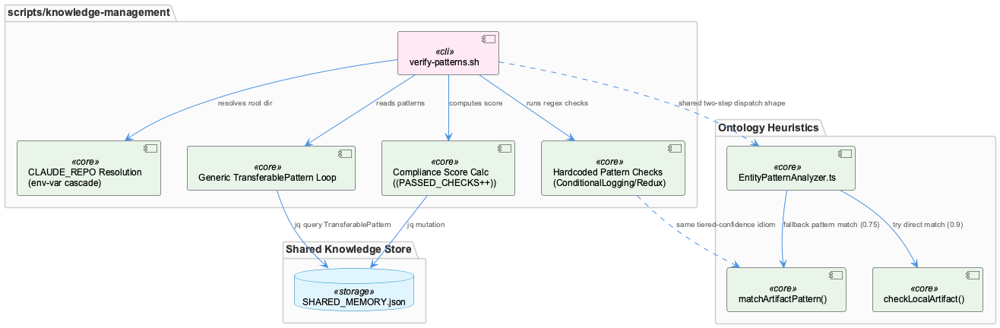
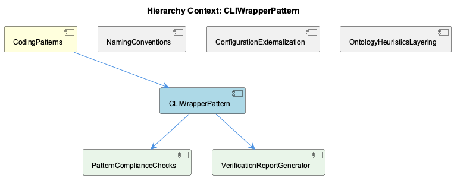

# CLIWrapperPattern

**Type:** SubComponent

# CLIWrapperPattern — Technical Insight Document

## What It Is

CLIWrapperPattern is best understood not as a single implementation but as a *named convention under stress-test*, concretely embodied in `scripts/knowledge-management/verify-patterns.sh`. As a SubComponent of CodingPatterns, it is meant to codify the project's stated rule that command-line entry points should be "short, primarily responsible for argument parsing and delegating to library/service code" (the bin/ thin-wrapper convention). The evidence, however, shows verify-patterns.sh living in `scripts/` rather than `bin/`, and instead of delegating, it embeds substantial logic directly: regex-based compliance scanning, a full Markdown report generator, and a compliance-scoring algorithm (`PASSED_CHECKS * 100 / TOTAL_CHECKS`). This makes the component simultaneously a description of an intended pattern and a documented counter-example of it — a useful tension for anyone extending the script or writing new CLI tooling in this codebase.

## Architecture and Design

The component decomposes into two child SubComponents that mirror its two intertwined responsibilities: **PatternComplianceChecks**, which owns "what counts as compliant," and **VerificationReportGenerator**, which owns "how it's rendered." In the actual script these are *not* separated — each of the four compliance blocks (ConditionalLoggingPattern, ReduxStateManagementPattern, NetworkAwareInstallationPattern, and an undocumented-functions heuristic) both computes its check and writes its own `cat >> "$VERIFICATION_REPORT" << EOF` heredoc fragment inline. This coupling is the central architectural finding: detection logic, rendering, and thresholding all live in the same conditional block, so the children are conceptually distinct but not yet physically separated in code — a natural refactor target (extracting a `generate_report()` fed by a metrics structure) rather than a currently-realized design.

A second architectural thread is the coexistence of two extensibility models in one file: hardcoded per-pattern if-blocks (lines ~30-69) versus a generic loop (lines ~113-135) that reads `TransferablePattern` entities with `significance >= 8` from `$SHARED_MEMORY` via `jq`. New hardcoded checks require editing the script; new KB-registered patterns do not. This hybrid model is a defining, somewhat unresolved design decision for the component.

Path resolution follows a defensive, environment-variable cascade (`CODING_TOOLS_PATH` → `CODING_REPO` → computed `DEFAULT_REPO` via `SCRIPT_DIR`) before settling on `CLAUDE_REPO` — the same declarative-configuration-over-hardcoding instinct seen in sibling ConfigurationExternalization, applied here to paths instead of tunables, at the cost of a fragile "two levels up" assumption.

## Implementation Details

The four compliance checks (owned conceptually by PatternComplianceChecks) each hardcode a detection rule: `rg "console\.log"` vs `rg "Logger\.(log|debug|info|warn|error)"` for ConditionalLoggingPattern; `useState\(` counts vs `useSelector|useDispatch|createSlice` for ReduxStateManagementPattern (gated by a `grep -q "react" package.json` check); and `grep -c "check_network|detect_network|timeout"` against `install.sh` for NetworkAwareInstallationPattern. Compliance scoring aggregates these into `PASSED_CHECKS`/`TOTAL_CHECKS`, but the increment mechanism — `((PASSED_CHECKS++))` inside `&&` chains — is a live instance of a project-tracked hazard: post-increment from 0 evaluates to a false exit status under `set -euo pipefail`, meaning the script can abort on its very first passing check. This is documented elsewhere in project memory as the "bash arith errexit platform divergence" pattern, and its presence here should be treated as a concrete bug to fix (`PASSED_CHECKS=$((PASSED_CHECKS + 1))`), not a stylistic nit.

VerificationReportGenerator's responsibility — the long sequence of heredoc appends — is architecturally inseparable from the check logic in the current file, reinforcing that the "children" are best understood as logical seams for a future refactor rather than existing modules.

Notably, unrelated fixture files (`integrations/graphify/tests/fixtures/xaml_viewmodel/...`) surfaced in this component's evidence set are graphify test corpus artifacts (an empty `DesignViewModel.cs` stub) and should be disregarded as noise, not treated as part of CLIWrapperPattern's implementation.

## Integration Points

CLIWrapperPattern integrates with the shared knowledge base through `$SHARED_MEMORY`, both reading `TransferablePattern` entities via `jq` (the generic PATTERNS loop) and writing back compliance results via direct `jq` mutation — making the script both a consumer and mutator of shared project state rather than a pure read-only checker.

Conceptually, it shares a design idiom with sibling OntologyHeuristicsLayering and its concrete implementation `EntityPatternAnalyzer.ts` (`src/ontology/heuristics/EntityPatternAnalyzer.ts`): both converge independently on a two-step "direct/local match first, pattern-based fallback second" dispatch shape (`checkLocalArtifact()` → `matchArtifactPattern()` vs. hardcoded checks → generic KB loop), and both use the same tiered confidence convention (0.9 for direct match, 0.75 for pattern-fallback match). This convergence, occurring without shared code, suggests an implicit project-wide idiom for heuristic classification that is not yet centralized — a candidate for future extraction into shared library code, which would itself bring the script closer to the bin/-style delegation convention it currently violates.

## Usage Guidelines

Developers extending verify-patterns.sh should recognize that scripts/ and bin/ appear to be governed by different unwritten rules: bin/ enforces the thin-wrapper/delegation convention from the parent CodingPatterns, while scripts/ tolerates heavier, self-contained operational tooling. New contributors should not assume all CLI entry points must be thin wrappers — but should be aware this file is cited precisely as the pattern's counter-example, so new bin/ scripts should still follow the delegation convention.

When adding new compliance checks, prefer extending the generic `TransferablePattern`/`$SHARED_MEMORY` loop over adding another hardcoded if-block, to avoid deepening the two-model split. Any arithmetic increment under `set -euo pipefail` must avoid bare `((x++))` given the documented errexit hazard. Finally, when tracing evidence for this component, exclude graphify's XAML/C# fixture files as unrelated adjacency noise, and look to PatternComplianceChecks and VerificationReportGenerator as the natural seams for a future refactor that separates metric collection from report rendering.

## Hierarchy Context

### Parent
- [CodingPatterns](./CodingPatterns.md) -- [LLM] The '*Manager' suffix convention observed across GraphDatabaseManager, ProviderRegistryManager, ConnectionManager, MockModeManager, and CircuitBreakerManager signals a project-wide idiom for classes that own mutable, long-lived state and coordinate access to a shared resource (a database connection, a pool of LLM providers, a network connection, or a fault-tolerance mechanism). New developers should expect these classes to expose lifecycle methods (init/connect/close or similar), maintain internal state that must be protected from concurrent misuse, and typically be instantiated once and passed around or accessed via a singleton/registry rather than created ad hoc per call. When adding a new stateful coordination class to the Coding project, following this suffix convention (rather than inventing a new name like 'Handler' or 'Controller') keeps discoverability high, since grep-based searches for '*Manager' across the codebase double as an architectural map of all stateful coordination points, including CircuitBreakerManager's role in resilience patterns tied to RUNG_OFFLOADED-style degraded-mode operation.

### Children
- [PatternComplianceChecks](./PatternComplianceChecks.md) -- [LLM] verify-patterns.sh (scripts/knowledge-management/verify-patterns.sh) implements its compliance checks as four independent, hand-written if-blocks — ConditionalLoggingPattern (console.log vs Logger.* counts via `rg`), ReduxStateManagementPattern (useState vs useSelector/useDispatch/createSlice, gated on `grep -q "react" package.json`), NetworkAwareInstallationPattern (grep -c against install.sh for check_network|detect_network|timeout), and an undocumented-functions heuristic built from a `rg` + multi-stage `grep -v` pipeline. Each block writes its own markdown fragment via `cat >> "$VERIFICATION_REPORT" << EOF`, so the report format, the detection regex, and the pass/fail threshold are all interleaved in the same shell conditional — there is no separation between 'what counts as compliant' and 'how it's rendered'.
- [VerificationReportGenerator](./VerificationReportGenerator.md) -- [LLM] verify-patterns.sh (scripts/knowledge-management/verify-patterns.sh) generates its Markdown report through a long sequence of `cat >> "$VERIFICATION_REPORT" << EOF` heredoc appends interleaved with the actual compliance-check logic (rg/grep invocations, conditional scoring). This couples report formatting to check execution in a single linear script rather than separating 'collect metrics' from 'render report' as distinct phases — a refactor extracting a `generate_report()` function fed by a metrics associative array would decouple the two concerns, but as written, adding a new check requires touching both the detection logic and the heredoc block in the same edit, which is exactly the 'hardcoded pattern-specific if-blocks' extensibility gap already flagged in the parent CLIWrapperPattern observations.

### Siblings
- [NamingConventions](./NamingConventions.md) -- [LLM] `src/ontology/heuristics/EntityPatternAnalyzer.ts` operationalizes the project's suffix-naming conventions described in the parent context (Manager/Service/Adapter) as a machine-readable classification heuristic. Its `extractArtifacts()` method uses a regex `[A-Z][a-zA-Z]+(Service|Agent|Manager|Engine|Handler|Analyzer|Classifier|Filter|Monitor)` to pull class names directly out of free-text knowledge content, then `matchArtifactPattern()` maps those names to a team and an inferred `entityClass` via the `artifactPatterns` array. This means naming conventions in this codebase are not just a human-readability aid — they are load-bearing for an automated team/entity-attribution pipeline (Layer 1 of what is implied to be a multi-layer classification system, given `layer: 1` and `layerName: 'EntityPatternAnalyzer'` in the returned `LayerResult`). A class that doesn't follow the established suffix vocabulary becomes invisible to this classifier.
- [ConfigurationExternalization](./ConfigurationExternalization.md) -- [LLM] EntityPatternAnalyzer.ts (src/ontology/heuristics/EntityPatternAnalyzer.ts) externalizes team-ownership classification rules into two in-memory data structures built in the constructor: `teamDirectories` (a Map<string, string[]> of path prefixes like 'src/ontology', 'raas-service', 'virtual-target') and `artifactPatterns` (an array of {team, patterns: RegExp[], entityClassMap} objects). Although these are hardcoded as class fields rather than loaded from config/*.yaml or config/*.json, they represent the same declarative-externalization idiom described in the parent CodingPatterns observations — the classification logic itself (checkLocalArtifact, matchArtifactPattern) never branches on team name directly, it only walks these tables, so adding a new team or artifact convention is a data change to the constructor's literals rather than a new code path.
- [OntologyHeuristicsLayering](./OntologyHeuristicsLayering.md) -- [LLM] `EntityPatternAnalyzer` (src/ontology/heuristics/EntityPatternAnalyzer.ts) implements Layer 1 of a multi-layer, confidence-scored classification pipeline: its own docstring labels it 'Layer 1: File/Artifact Detection' with a documented <1ms target. The two public-facing code paths — `checkLocalArtifact()` (returns confidence 0.9 for a direct team-directory prefix match) and `matchArtifactPattern()` (returns confidence 0.75 for a regex-based match against `artifactPatterns`) — are tried in that fixed order inside `analyzeEntityPatterns()`, meaning a cheap `startsWith()` check is always preferred over regex evaluation. This ordering is itself an implicit performance optimization: string-prefix checks over the `teamDirectories` Map are O(1)-ish and run before the more expensive `RegExp.test()` loop over `artifactPatterns`, so the sub-millisecond budget is protected by cutting regex work whenever a cheaper match already resolves the team.

---

*Generated from 9 observations*
