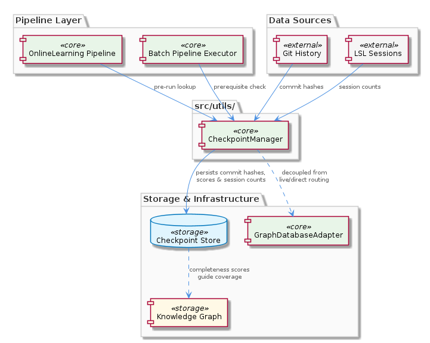
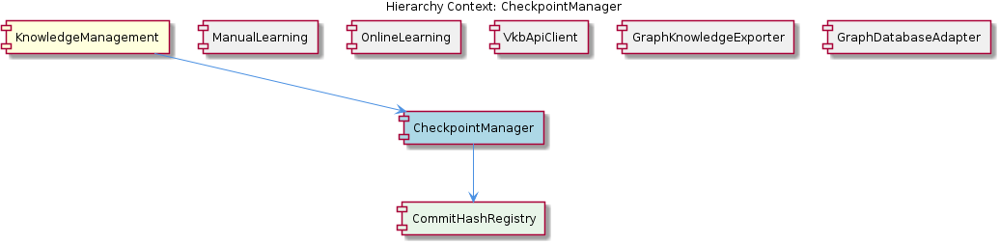

# CheckpointManager

**Type:** SubComponent

CheckpointManager at src/utils/checkpoint-manager.ts stores commit hashes as markers so the OnlineLearning pipeline can skip already-processed git history on subsequent runs

# CheckpointManager — Technical Insight Document

## What It Is

CheckpointManager is a utility module implemented at `src/utils/checkpoint-manager.ts` that persists processing progress markers for incremental analysis pipelines. Its primary responsibility is to store commit hashes as completion markers, allowing the `OnlineLearning` pipeline to skip git history that has already been processed on subsequent runs. Beyond commit tracking, it persists two additional categories of data: completeness scores that quantify knowledge graph coverage for code areas, and session counts that track LSL session processing progress independently of git history progression.

As a sub-component of the `KnowledgeManagement` parent, CheckpointManager occupies a deliberately narrow role — it is a state-persistence utility, not a processing engine. It contains the `CommitHashRegistry` child component, which encapsulates the specific responsibility of persisting commit hashes as markers to gate re-processing of git history. The presence of this child sub-component indicates the design separates "what to remember" (commit identity) from "how to use what's remembered" (decisions about skipping work).

The module is positioned under `src/utils/` rather than alongside storage or routing components, signaling its intent as a cross-cutting helper rather than a coupling point to any particular execution mode.

## Architecture and Design

The architectural approach centers on a **checkpoint/resume pattern** for long-running incremental pipelines. Before each batch pipeline execution, CheckpointManager performs a prerequisite lookup: if a checkpoint exists for a given commit, that commit's analysis is bypassed entirely. This pre-flight gate transforms what would otherwise be redundant work into a constant-time lookup, making the system idempotent across reruns.

A second architectural decision worth noting is the **deliberate decoupling from routing logic**. While the sibling `GraphDatabaseAdapter` (at `storage/graph-database-adapter.ts`) implements a dual-mode routing strategy — choosing between 'live' mode (HTTP API through `VkbApiClient`) and 'direct' mode (LevelDB access through `GraphDatabaseService`) at initialization — CheckpointManager is intentionally unaware of these modes. This placement under `src/utils/` makes it usable in both modes without coupling to `VkbApiClient.isServerAvailable()` checks or LevelDB locking concerns that constrain sibling components like `ManualLearning`.

The design also reflects a **separation of correlated but independent progress dimensions**. Session counts are tracked alongside commit hashes specifically so that LSL session processing progress and git history progress can be correlated yet evolve independently. This is structurally significant: a single conceptual "checkpoint" actually carries multiple orthogonal progress vectors, allowing different sub-pipelines to advance at their own pace.

Completeness scores add a third dimension — a **quantitative coverage signal**. Rather than being a binary "processed/unprocessed" flag, the persisted score enables downstream prioritization logic to target under-analyzed code areas, turning the checkpoint store into a lightweight analytics surface.

## Implementation Details

The implementation lives entirely in `src/utils/checkpoint-manager.ts`. While the source observations do not enumerate specific class methods or function signatures, the behavioral contract is clear: the module must support (1) writing commit hashes as markers, (2) writing session counts associated with those markers, (3) writing completeness scores per analyzed area, and (4) performing existence-checks for commit hashes to enable the skip-gate behavior.

The `CommitHashRegistry` child component is the implementation detail that encapsulates the registry-of-hashes concern. Per its definition, it exists specifically to persist commit hashes as markers gating git history reprocessing. This factoring suggests that the parent `CheckpointManager` likely orchestrates multiple persisted data classes (hashes, counts, scores) while delegating the specific hash-storage mechanics to `CommitHashRegistry`.

Because there are no code symbols extracted into the structural metadata for this entity, deeper introspection of specific class names, method signatures, or storage backends would require reading `src/utils/checkpoint-manager.ts` directly. What the observations do confirm is that the storage is durable across runs (otherwise the skip-on-rerun behavior would be impossible) and that the lookup is fast enough to serve as a per-commit pre-flight check during batch pipeline execution.

## Integration Points

The primary upstream collaborator is the sibling `OnlineLearning` component, which feeds CheckpointManager with commit hashes and session counts so that incremental runs skip already-analyzed history. This relationship is the principal driver of CheckpointManager's existence — without an incremental pipeline that needs resumability, there would be no reason for the checkpoint store.

CheckpointManager is also notable for **what it does not integrate with directly**. Unlike `ManualLearning`, which writes through `GraphDatabaseAdapter` and is therefore subject to live/direct routing concerns and LevelDB lock collisions, CheckpointManager bypasses this routing layer. It does not call `VkbApiClient.isServerAvailable()`, and it is not affected by the once-at-initialization routing decision that `GraphDatabaseAdapter` caches. Similarly, it is independent of the `entity:stored` event channel that `GraphKnowledgeExporter` subscribes to — checkpointing is not modeled as a downstream consumer of graph writes but as a peer concern tracking pipeline progress.

The parent `KnowledgeManagement` component groups CheckpointManager with these siblings to form the broader knowledge-management subsystem, but CheckpointManager's integration footprint within that subsystem is narrow: it is consulted by pipelines as a gate, and updated by pipelines as work completes. Its child `CommitHashRegistry` is its only internal collaborator.

## Usage Guidelines

Developers integrating with CheckpointManager should treat it as the authoritative source of "what has already been processed." Any new pipeline that performs incremental work over git history or LSL sessions should consult CheckpointManager before beginning work and update it as work completes — failing to do so will result in redundant processing on every rerun.

The decoupling from `GraphDatabaseAdapter`'s routing logic is a feature, not an accident. Developers should resist the temptation to push checkpoint data through the main graph storage path. Keeping checkpoints in the utility module preserves the property that they work uniformly across live and direct modes, and they remain available even if the VKB HTTP server is not running when a pipeline starts (a scenario where `GraphDatabaseAdapter` would have selected direct mode at initialization).

When extending CheckpointManager, respect the separation of progress dimensions. Commit hashes, session counts, and completeness scores are correlated but independent — conflating them (for example, gating commit reprocessing on session counts) would couple unrelated pipeline stages and undermine the design. New progress dimensions should be added as additional orthogonal axes rather than overloaded onto existing fields.

Finally, completeness scores should be used as a prioritization signal for analysis <USER_ID_REDACTED> rather than as a skip-gate. The binary skip behavior is reserved for commit hash presence; the score is intended to inform decisions about which already-touched areas deserve deeper analysis. This distinction keeps the resumption semantics clean while still providing the quantitative coverage signal that downstream prioritization logic depends on.

## Hierarchy Context

### Parent
- [KnowledgeManagement](./KnowledgeManagement.md) -- [LLM] GraphDatabaseAdapter (storage/graph-database-adapter.ts) implements a dual-mode routing strategy that is determined once at initialization time via VkbApiClient.isServerAvailable(), not re-evaluated on each operation. This means if the VKB HTTP server starts or stops after the adapter is initialized, the adapter continues using the mode it selected at startup. In 'live' mode it routes all reads and writes through the HTTP API, avoiding LevelDB's single-writer lock. In 'direct' mode it accesses GraphDatabaseService (which holds the LevelDB handle) directly. The consequence is that two processes attempting direct mode simultaneously will collide on the LevelDB lock — the dual-mode design exists specifically to serialize writers through the HTTP server when it is available. New developers integrating additional write paths must either go through the VKB HTTP API or ensure only one process operates in direct mode at a time.

### Children
- [CommitHashRegistry](./CommitHashRegistry.md) -- Based on the CheckpointManager sub-component description at src/utils/checkpoint-manager.ts, its core responsibility is persisting commit hashes as markers to gate re-processing of git history.

### Siblings
- [ManualLearning](./ManualLearning.md) -- ManualLearning writes directly through GraphDatabaseAdapter, which means it must route through the VKB HTTP API (live mode) or risk LevelDB lock collisions in direct mode when other writers are active
- [OnlineLearning](./OnlineLearning.md) -- OnlineLearning feeds CheckpointManager with commit hashes and session counts so incremental runs skip already-analyzed history, as tracked in src/utils/checkpoint-manager.ts
- [VkbApiClient](./VkbApiClient.md) -- VkbApiClient.isServerAvailable() is called once at GraphDatabaseAdapter initialization to determine routing mode — live vs direct — and the result is never re-evaluated, making server availability at startup a critical operational dependency
- [GraphKnowledgeExporter](./GraphKnowledgeExporter.md) -- GraphKnowledgeExporter subscribes to entity:stored events emitted after each successful graph write, decoupling export from the write path itself
- [GraphDatabaseAdapter](./GraphDatabaseAdapter.md) -- GraphDatabaseAdapter calls VkbApiClient.isServerAvailable() exactly once at initialization and caches the result as the permanent routing mode — no per-operation re-evaluation occurs

---

*Generated from 5 observations*
