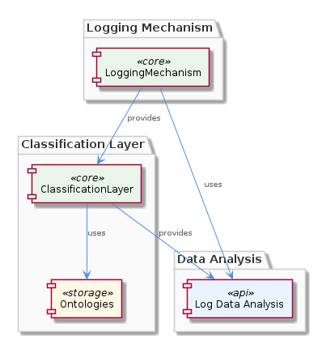
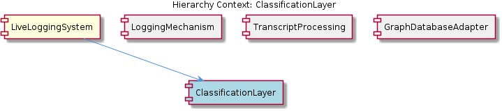

# ClassificationLayer

**Type:** SubComponent

ClassificationLayer's classification process is supported by the modular design of the LiveLoggingSystem, facilitating integration with other sub-components.

## What It Is  

The **ClassificationLayer** is a sub‑component of the **LiveLoggingSystem** that enriches raw log entries with semantic meaning. It does this by applying **pre‑defined ontologies** and rule‑based mappings to incoming **observations** and **entities**, turning them into classified data that downstream components can analyse more effectively. The layer lives inside the same logical module as the rest of the LiveLoggingSystem (the exact source files are not listed in the observations, but its placement is implied by the hierarchy “LiveLoggingSystem contains ClassificationLayer”). Its primary responsibility is to provide **standardised classification** so that log data is consistently interpreted across the system.

## Architecture and Design  

The design of ClassificationLayer follows a **modular, ontology‑driven architecture**. The observations repeatedly stress that the layer “enhances data meaning by categorizing entities and observations based on predefined rules and ontologies” (Obs 1, 2, 4, 7). This indicates a **rule‑engine pattern** where a static knowledge base (the ontologies) drives the classification logic, keeping the behaviour deterministic and easy to audit.

The component is tightly coupled with the **LoggingMechanism** – both “work in conjunction” (Obs 3, 6) to deliver classified log data. The interaction is likely a **pipeline pattern**: raw logs flow from LoggingMechanism into ClassificationLayer, which annotates them before they are persisted or further processed. Because the LiveLoggingSystem is described as “modular” (Obs 5), ClassificationLayer can be swapped or extended without disrupting other sub‑components, a hallmark of **plug‑in modularity**.

The surrounding ecosystem reinforces this modular stance. Sibling components such as **TranscriptProcessing** (which normalises agent transcripts) and **GraphDatabaseAdapter** (which stores graph data using Graphology and LevelDB) all feed into the same logging pipeline, suggesting a **shared‑service architecture** where each sub‑component provides a focused capability that the LiveLoggingSystem orchestrates.

## Implementation Details  

Although the source code does not expose concrete symbols, the observations give a clear picture of the internal mechanics:

1. **Ontology Repository** – A static collection of domain‑specific concepts (e.g., error types, event categories) is loaded at start‑up. Because the classification is “predefined,” the repository is likely read‑only during runtime, enabling fast look‑ups.

2. **Rule Engine** – Classification rules map raw log attributes (such as message patterns, source identifiers) to ontology entries. The rules are deterministic, ensuring that identical observations always receive the same classification.

3. **Classification API** – The layer exposes a function (e.g., `classify(observation)`) that accepts an observation or entity object, queries the ontology repository, applies the relevant rule set, and returns an enriched payload containing classification tags.

4. **Integration Hooks** – The layer is invoked by **LoggingMechanism** as part of the log ingestion flow. The hook likely passes the raw log entry to ClassificationLayer, receives the classified result, and then forwards it to downstream storage (via GraphDatabaseAdapter) or analysis modules.

Because the LiveLoggingSystem’s modularity “facilitates integration with other sub‑components” (Obs 5), ClassificationLayer is probably packaged as an independent module with a well‑defined interface, making it straightforward for siblings like **TranscriptProcessing** to feed pre‑processed data into it if needed.

## Integration Points  

- **LoggingMechanism** – The primary consumer and producer of log data. ClassificationLayer receives raw log entries from LoggingMechanism, enriches them, and returns the classified payload. This bidirectional contract is central to the “comprehensive log data analysis solution” (Obs 6).

- **LiveLoggingSystem (Parent)** – Provides the overall orchestration and lifecycle management. Because ClassificationLayer is a child of LiveLoggingSystem, it inherits configuration (e.g., which ontology files to load) from the parent’s settings.

- **GraphDatabaseAdapter (Sibling)** – Although not directly mentioned as a consumer, the classified logs are eventually persisted via the GraphDatabaseAdapter, which stores graph‑structured log data. The classification tags become node or edge attributes, enabling richer queries.

- **TranscriptProcessing (Sibling)** – May supply normalized transcript entities that also need classification. The shared ontology ensures that both raw logs and processed transcripts are categorised consistently.

These integration points rely on **standardised interfaces** (likely TypeScript interfaces or plain JavaScript objects) that convey observation structures and classification results, ensuring loose coupling and easy substitution.

## Usage Guidelines  

1. **Define Ontologies Up‑Front** – Because ClassificationLayer depends on “predefined ontologies,” developers should maintain a version‑controlled ontology file (e.g., JSON or YAML) and avoid runtime modifications. Any change to the ontology requires a system restart to reload the repository.

2. **Keep Rules Deterministic** – Rule definitions must be exhaustive and unambiguous to guarantee that identical observations receive the same classification. Overlapping rules can cause nondeterministic behaviour and should be resolved during rule authoring.

3. **Invoke Through LoggingMechanism** – Direct calls to ClassificationLayer are discouraged; instead, feed raw logs into **LoggingMechanism**, which will automatically route them through the ClassificationLayer. This preserves the intended pipeline ordering and ensures that all log data receives classification.

4. **Monitor Classification Coverage** – Since the layer “provides meaningful insights from log data” (Obs 7), it is valuable to track the proportion of logs that receive a classification tag. Unclassified logs may indicate gaps in the ontology or rule set.

5. **Leverage Modularity for Extension** – If new domain concepts arise, extend the ontology and add corresponding rules without touching other sub‑components. The modular design of LiveLoggingSystem (Obs 5) means such extensions can be deployed independently.

---

### Architectural Patterns Identified
- **Rule‑Engine / Ontology‑Driven Classification**
- **Modular Plug‑In Architecture**
- **Pipeline (Producer‑Consumer) Integration**

### Design Decisions & Trade‑offs
- **Static Ontologies** provide consistency and fast look‑ups but limit on‑the‑fly learning.
- **Modular placement** enables easy swapping/extending but introduces the need for well‑defined contracts between sub‑components.
- **Deterministic rule‑based classification** ensures auditability at the cost of flexibility compared to ML‑based approaches.

### System Structure Insights
ClassificationLayer sits as a child of LiveLoggingSystem, bridging raw logging (LoggingMechanism) and persisted graph data (GraphDatabaseAdapter). Its sibling, TranscriptProcessing, can feed complementary data into the same classification pipeline, creating a unified semantic layer across diverse log sources.

### Scalability Considerations
- **Read‑only ontology repository** scales horizontally; multiple instances can share the same in‑memory cache.
- **Rule evaluation** is typically O(1) per observation if indexed properly, allowing the layer to keep up with high‑throughput logging streams.
- Potential bottleneck: a monolithic rule engine could become CPU‑bound; sharding the classification work across multiple LiveLoggingSystem instances mitigates this.

### Maintainability Assessment
The reliance on explicit ontologies and rule files makes the component **highly maintainable**: changes are localized to configuration rather than code. The modular interface with LoggingMechanism and the parent LiveLoggingSystem further isolates impact, allowing teams to evolve ClassificationLayer independently while preserving overall system stability.

## Hierarchy Context

### Parent
- [LiveLoggingSystem](./LiveLoggingSystem.md) -- [LLM] The LiveLoggingSystem's ability to integrate with various agents is facilitated by its modular design, as seen in the storage/graph-database-adapter.ts file where the GraphDatabaseAdapter class manages graph data using Graphology and LevelDB. This enables efficient data storage and retrieval, making it a crucial component for understanding system interactions. The use of LevelDB as the underlying storage solution allows for a robust and scalable data management system, capable of handling large volumes of data generated by the logging system. Furthermore, the GraphDatabaseAdapter class provides a standardized interface for interacting with the graph database, making it easier to switch to alternative database solutions if needed.

### Siblings
- [LoggingMechanism](./LoggingMechanism.md) -- LoggingMechanism uses the GraphDatabaseAdapter class in storage/graph-database-adapter.ts to manage graph data using Graphology and LevelDB.
- [TranscriptProcessing](./TranscriptProcessing.md) -- TranscriptProcessing converts transcripts from various agents into a standardized format for unified logging and analysis.
- [GraphDatabaseAdapter](./GraphDatabaseAdapter.md) -- GraphDatabaseAdapter uses Graphology to manage graph data, providing an efficient and scalable solution.

---

*Generated from 7 observations*
