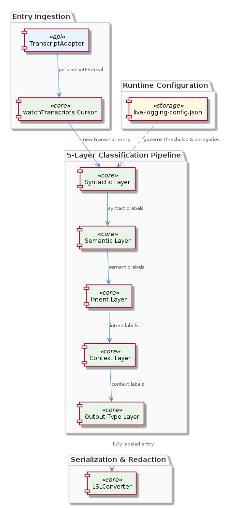
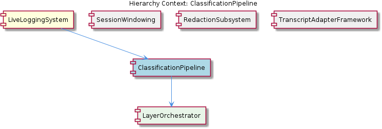

# ClassificationPipeline

**Type:** SubComponent

The TranscriptAdapter.watchTranscripts() cursor in lib/agent-api/transcript-api.js feeds new entries into the classification pipeline on each polling tick, meaning classification latency is bounded by the setInterval period

# ClassificationPipeline — Technical Insight Document

## What It Is

The `ClassificationPipeline` is a SubComponent of the `LiveLoggingSystem` responsible for applying structured semantic labels to transcript entries as they flow through the live logging machinery. Its canonical architectural specification lives in `docs/puml/lsl-5-layer-classification.puml`, which diagrams five discrete classification layers arranged as a strict ordered pipeline. Runtime behavior — including which layers are enabled, confidence thresholds, and category vocabularies — is governed by `config/live-logging-config.json`, allowing operators to tune classification behavior without touching code.

Functionally, the pipeline sits upstream of serialization and redaction: classification is applied to entries *before* `LSLConverter` performs serialization/redaction, so the 5-layer labels are attached as metadata on each entry and become available to downstream consumers (notably the `RedactionSubsystem` and `SessionWindowing` sibling components). The pipeline contains a single child, `LayerOrchestrator`, which is the runtime executor responsible for sequencing the five layers in the order mandated by the PUML specification.

## Architecture and Design

The defining architectural decision is the use of a **strict ordered pipeline** rather than a set of independent classifiers. As documented in `docs/puml/lsl-5-layer-classification.puml`, the five layers are not parallel — each layer's output can inform subsequent layers. This separation cleanly partitions concerns across syntactic, semantic, intent, context, and output-type classification, each encapsulated in its own layer module. The layered decomposition makes the pipeline a textbook **Chain of Responsibility** / **Pipes and Filters** hybrid, where layer ordering is a first-class architectural concern (an emphasis enforced through the child `LayerOrchestrator`, whose entire purpose is to honor the sequencing contract).

A second key design decision is **configuration-driven extensibility**. Because `config/live-logging-config.json` controls enabled layers, thresholds, and category vocabularies, the pipeline supports a clear separation between *mechanism* (the layered classification engine) and *policy* (which categories exist, what thresholds apply). This parallels the approach taken by the sibling `RedactionSubsystem`, whose `.specstory/config/redaction-config.yaml` similarly organizes rules by named categories enable-able without code changes — both subsystems consistently externalize policy from mechanism.

The pipeline's position within `LiveLoggingSystem` is significant: it operates on entries delivered by the `TranscriptAdapterFramework` sibling. Specifically, the `TranscriptAdapter.watchTranscripts()` method (in `lib/agent-api/transcript-api.js`) uses a `setInterval` polling loop with a `lastEntryCount` cursor that feeds newly-detected entries into the classification pipeline on each tick. This means classification operates in a **micro-batched pull model** rather than a push/event model — classification latency is fundamentally bounded by the polling interval configured for the adapter.

## Implementation Details

The pipeline implementation revolves around its child component, `LayerOrchestrator`, which encodes the five-layer ordering contract specified in `docs/puml/lsl-5-layer-classification.puml`. The PUML diagram makes the sequencing first-class: each of the five layers (syntactic, semantic, intent, context, and output-type, per the architectural separation) is a discrete module, and the orchestrator threads an entry through them in order, allowing later layers to consume the labels produced by earlier ones.

Configuration loading is driven by `config/live-logging-config.json`. This JSON file likely specifies enabled layers, confidence thresholds, and category vocabularies. Adding a new classification category therefore requires only a config update (and any required model or rule assets), not structural code changes — a deliberate maintainability investment.

Entry ingestion is mediated by the shared, concrete `watchTranscripts()` implementation in the `TranscriptAdapter` base class (`lib/agent-api/transcript-api.js`). That method runs a `setInterval` loop, slices the transcript list from the `lastEntryCount` cursor forward, and dispatches the new entries into the classification stage. Because the adapter never re-processes already-seen entries, the classification pipeline receives a clean append-only stream — each entry is classified exactly once per session lifetime, simplifying idempotency considerations within the layer modules.

After the orchestrator completes, the entry carries the five-layer labels as metadata. The downstream `LSLConverter` serialization/redaction stage then consumes those labels — meaning the `RedactionSubsystem` can make redaction decisions informed by classification (for example, redacting entries classified into sensitive intent or context categories), and `SessionWindowing` can use them when bucketing entries into time slots.

## Integration Points

The `ClassificationPipeline` integrates with the broader `LiveLoggingSystem` through three primary seams:

1. **Upstream — TranscriptAdapterFramework**: New entries arrive via `TranscriptAdapter.watchTranscripts()` in `lib/agent-api/transcript-api.js`. The adapter's polling cursor (`lastEntryCount`) determines the cadence and granularity of input. Any new adapter implementation (Claude Code, or other agents) inherits this delivery contract automatically, so the pipeline does not need agent-specific input handling.

2. **Downstream — LSLConverter / RedactionSubsystem / SessionWindowing**: Because classification runs *before* `LSLConverter` serialization/redaction, the 5-layer labels are present on the entry when the sibling `RedactionSubsystem` evaluates `.specstory/config/redaction-config.yaml` rule groups, and when `SessionWindowing` performs time-slot bucketing governed by `lsl-config.json` fileManager rotation thresholds. The labels are effectively a shared vocabulary across these downstream stages.

3. **Configuration — live-logging-config.json**: External operators interact with the pipeline almost exclusively through `config/live-logging-config.json`. This file is the integration surface for enabling/disabling layers, tuning thresholds, and registering new categories.

Internally, the pipeline contains exactly one child: `LayerOrchestrator`, which owns the sequencing logic. The pipeline's parent, `LiveLoggingSystem`, is responsible for wiring the configuration, adapter framework, and downstream subsystems together at startup.

## Usage Guidelines

When working with the `ClassificationPipeline`, developers should observe several conventions grounded in its current design:

- **Treat layer ordering as immutable contract**: The five-layer ordering described in `docs/puml/lsl-5-layer-classification.puml` is intentional — later layers may depend on earlier layers' labels. Reordering layers, or introducing a new layer mid-sequence, requires updating the PUML specification and verifying downstream layer assumptions in `LayerOrchestrator`.

- **Add categories via config, not code**: To introduce a new classification category, modify `config/live-logging-config.json` and supply any associated model or rule assets. The architecture specifically supports this without structural code changes — falling back to code modifications when config would suffice indicates a missed extension point.

- **Respect the polling-bound latency model**: Because input arrives via `TranscriptAdapter.watchTranscripts()`'s `setInterval` cursor, classification latency is bounded by the polling period. Do not assume real-time/sub-tick classification semantics — if lower latency is required, the change belongs in the adapter framework, not the pipeline.

- **Ensure labels are downstream-consumable**: Since `RedactionSubsystem` and `SessionWindowing` can reference classification metadata, label shape and naming should remain stable across releases. Renaming a category in `live-logging-config.json` may have effects in `.specstory/config/redaction-config.yaml` rule groups or in windowing logic.

- **Preserve idempotency assumptions**: The upstream cursor in `lib/agent-api/transcript-api.js` guarantees each entry is delivered once. Layer implementations should not introduce state that assumes re-classification of the same entry — if a layer needs persistence, it should be external to the per-entry classification path.

---

### Summary Findings

1. **Architectural patterns identified**: Strict ordered Pipes-and-Filters / Chain-of-Responsibility pipeline (five layers); configuration-driven policy externalization; micro-batched pull ingestion via polling cursor; metadata-enrichment-before-serialization.

2. **Design decisions and trade-offs**: Choosing an ordered pipeline over independent classifiers trades parallelism for inter-layer information flow. Choosing config-driven categories (`config/live-logging-config.json`) trades binary-level type safety for operator agility. Choosing polling-based ingestion (via `TranscriptAdapter.watchTranscripts()`) trades real-time latency for simplicity and adapter uniformity.

3. **System structure insights**: The pipeline is the *labeling* stage in a clear three-stage `LiveLoggingSystem` flow — adapter ingestion → classification → serialization/redaction/windowing. Its sole child `LayerOrchestrator` exists specifically to make sequencing a first-class concern.

4. **Scalability considerations**: Throughput scales with adapter polling cadence and per-layer computation cost. Because each entry is processed once (cursor-based deduplication), the pipeline has no re-processing overhead. The configuration-driven layer toggling allows operators to disable expensive layers under load.

5. **Maintainability assessment**: Strong — the PUML specification, externalized configuration, and inherited polling/deduplication machinery from `TranscriptAdapter` keep the pipeline's surface area small. Adding categories requires no code changes; adding layers requires updating the PUML contract and the orchestrator. The clean separation between mechanism (`LayerOrchestrator`) and policy (`config/live-logging-config.json`) is the principal maintainability asset.

## Hierarchy Context

### Parent
- [LiveLoggingSystem](./LiveLoggingSystem.md) -- [LLM] The TranscriptAdapter abstract base class (lib/agent-api/transcript-api.js) establishes a well-defined polymorphic contract for all agent-specific transcript integrations. The class mandates five abstract methods — getAgentType(), getTranscriptDirectory(), readTranscripts(), convertToLSL(), and getCurrentSession() — which subclasses must implement to describe their agent-specific filesystem layout and data format. Crucially, the base class contributes a concrete, shared implementation of watchTranscripts() that uses a setInterval polling loop with a lastEntryCount cursor to track new entries since the previous tick. This design decision deliberately centralizes the polling mechanism so that every adapter (e.g., one for Claude Code, potentially others for different agents) benefits from the same incremental-read logic without duplicating it. The cursor-based approach means the adapter never re-processes already-seen entries on each interval tick — it reads the full transcript list, slices from lastEntryCount onward, and updates the cursor, a lightweight but effective strategy for append-only log files. A new developer extending this system should be aware that adding a new agent integration requires only implementing the five abstract methods; the polling lifecycle and entry deduplication are inherited for free.

### Children
- [LayerOrchestrator](./LayerOrchestrator.md) -- docs/puml/lsl-5-layer-classification.puml explicitly diagrams five discrete classification layers as a strict ordered pipeline, making the sequencing contract a first-class architectural concern rather than an implementation detail.

### Siblings
- [SessionWindowing](./SessionWindowing.md) -- lsl-config.json defines fileManager rotation thresholds that trigger time-slot bucket transitions, preventing unbounded growth of individual transcript files
- [RedactionSubsystem](./RedactionSubsystem.md) -- .specstory/config/redaction-config.yaml organizes redaction rules by named categories, allowing operators to enable or disable entire rule groups without modifying individual patterns
- [TranscriptAdapterFramework](./TranscriptAdapterFramework.md) -- TranscriptAdapter in lib/agent-api/transcript-api.js declares five abstract methods — getAgentType(), getTranscriptDirectory(), readTranscripts(), convertToLSL(), and getCurrentSession() — forming the mandatory interface for any new agent integration

---

*Generated from 6 observations*
