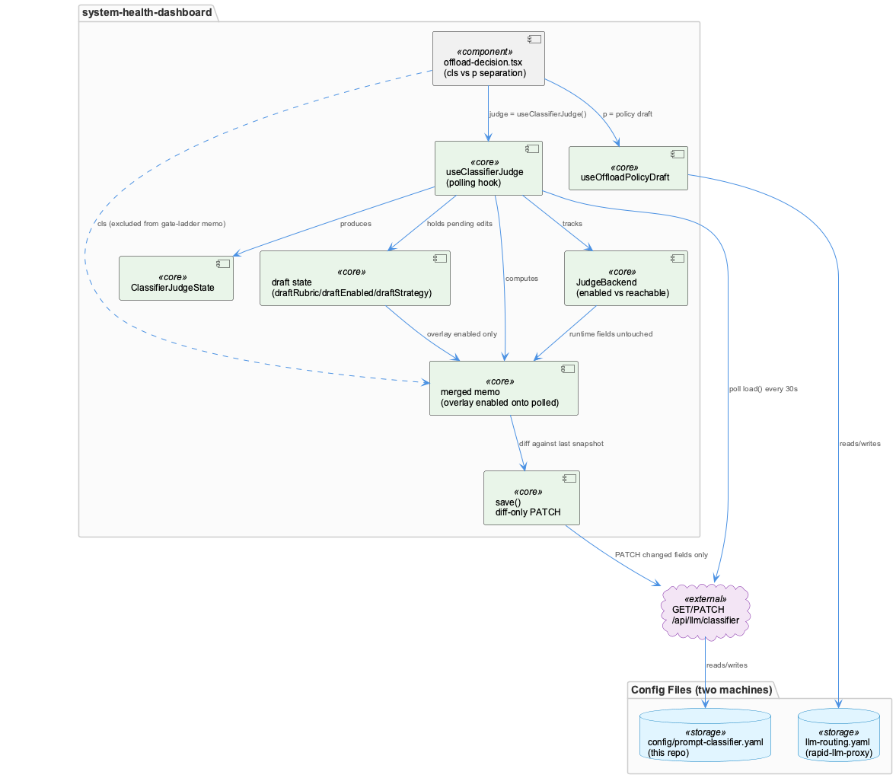
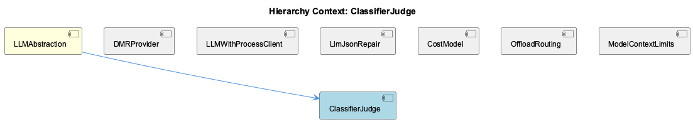

# ClassifierJudge

**Type:** SubComponent

## What It Is

ClassifierJudge is implemented as a React hook, `useClassifierJudge`, in `integrations/system-health-dashboard/src/components/llm-routing/use-classifier-judge.ts`, alongside its return type `ClassifierJudgeState` and the `JudgeBackend` interface. It is consumed by `offload-decision.tsx` in the same directory, where it is instantiated as `const judge = useClassifierJudge(proxyBase)`. As a SubComponent of LLMAbstraction, it is the client-side surface that manages a classifier's rubric, backend list, and strategy — config that lives in this repo's `config/prompt-classifier.yaml`, fetched via `GET /api/llm/classifier` and written via `PATCH`.

## Architecture and Design

The central architectural decision is deliberate non-consolidation: `useClassifierJudge` is kept as a second hook rather than folded into the sibling `use-offload-policy-draft`, even though both feed a single UI card. The file-level comment is explicit about why — the offload policy is owned by rapid-llm-proxy's `llm-routing.yaml` while the judge's rubric/backends are owned by this repo's `config/prompt-classifier.yaml`. Two files, two machines, two save cadences — a rubric typo must never roll back an unrelated offload toggle, or vice versa. This is a config/runtime and config/ownership boundary encoded structurally as a hook boundary, not merely a UI convenience, and it mirrors the sibling OffloadRouting's own careful separation of "what will happen" vs "what did" inside `offload-decision.tsx`.

Within the hook itself, `JudgeBackend` enforces a second boundary: `enabled` (declared config, editable) versus `reachable` (observed runtime fact, `null` if never probed on this network). This split exists because of a documented incident where every classified turn silently fell back to another model for roughly a day while `enabled: true` masked the failure — nothing on the dashboard distinguished "switched off" from "not answering." `reachable` was added specifically to make these two states, which otherwise render as an identical red dot, distinguishable with opposite remediations.

## Implementation Details

`useClassifierJudge` runs a polling `useEffect` calling `load()` on a `setInterval` (default `pollMs=30000`), and it deliberately keeps polling even while an operator has an open edit — freezing the health readout during an edit would hide exactly the failure the panel exists to surface. This is safe because draft state (`draftRubric`, `draftEnabled`, `draftStrategy`) lives in separate `useState` slots from the polled `judge` state, so a poll can never silently overwrite an unsaved edit.

`save()` builds its PATCH body diff-only — comparing `draftEnabled` against the last-loaded snapshot (`backends.filter(b => b.id in draftEnabled && draftEnabled[b.id] !== b.enabled)`) and conditionally including `rubric`/`strategy` — rather than serializing the whole merged object, preventing a poll-vs-edit race from clobbering untouched fields. This discipline directly parallels `useOffloadPolicyDraft`'s sibling save logic, applied to a differently-shaped config file.

The `merged` memo overlays only `enabled` (via `effectiveEnabled(b)`) onto each polled backend, leaving `reachable`, `lastLatencyMs`, `lastError`, `idleMs`, and `selected` untouched — the comment calls this "what this whole hook exists to avoid," i.e., conflating a pending edit with an observed fact, at exactly the point where the two states combine for rendering.

## Integration Points

ClassifierJudge sits under LLMAbstraction alongside DMRProvider, LLMWithProcessClient, LlmJsonRepair, CostModel, OffloadRouting, and ModelContextLimits. Its most direct relationship is with OffloadRouting's `offload-decision.tsx`, where the judge state is explicitly renamed to `cls` ("the classifier half of the same draft") and kept apart from `p`, the offload policy draft, when computing `rungs`/`configRungs`. A comment warns against reading `cls` inside the gate-ladder `useMemo`, enforcing at the call site the same boundary established in the hook: a rubric or backend change must not, by construction, alter offload rung counts computed via `evaluateOffload`.

Organizationally, the split reflects that rapid-llm-proxy is the mandatory shared routing proxy, with this repo holding client-side glue that must stay in sync with proxy-side changes — the offload policy is proxy-owned while the judge's config is repo-owned, making ClassifierJudge a client-glue surface over a proxy-hosted routing decision.

## Usage Guidelines

Developers extending this hook should preserve the draft/poll separation pattern — never merge polled and draft state into a single mutable object, and never let `save()` serialize more than the diffed fields. Any UI consuming both `useClassifierJudge` and offload policy state should keep them as distinct variables (as `offload-decision.tsx` does with `judge`/`cls` vs `p`) and avoid cross-referencing them inside memoized derivations. This pattern echoes the poll-vs-explicit-edit handling described for the LLM Mode Toggle work on LLMModeResolver, though the two do not share code — when touching either, consider whether the same dirty/draft/revert contract needs replicating.

## Code Evidence

Key code artifacts grounding this entity's analysis:

**Structural:**
- ClassifierJudgeState (class) in use-classifier-judge.ts
- useClassifierJudge (function) in use-classifier-judge.ts

**Relationships:**
- Calls: b
- The `merged` memo at the end of `useClassifierJudge` overlays only `enabled` from `effectiveEnabled(b)` onto each backend while leaving every runtime field (`reachable`, `lastLatencyMs`, `lastError`, `idleMs`, `selected`) untouched. The comment calls this 'what this whole hook exists to avoid' — i.e. avoid conflating a pending config edit with an observed fact — reinforcing the enabled/reachable split noted above at the point where the two states are actually combined for rendering.

**Other:**
- `useClassifierJudge` (use-classifier-judge.ts) and its return type `ClassifierJudgeState` are deliberately kept as a second hook rather than folded into `use-offload-policy-draft`, even though both are consumed together by a single card in offload-decision.tsx. The file-level comment states the reason explicitly: the offload policy lives in rapid-llm-proxy's `llm-routing.yaml` while the judge's backends and rubric live in this repo's `config/prompt-classifier.yaml` — two files on two machines' schedules. A single combined `save()` would let a rubric typo roll back an unrelated offload-target toggle, or a rejected band edit block an unrelated rubric fix. This is a config/runtime boundary encoded as a hook boundary, not just a UI convenience.
- The `JudgeBackend` interface (use-classifier-judge.ts) explicitly separates `enabled` ('CONFIG: what the file says. Edited here.') from `reachable` ('RUNTIME: whether it last answered. `null` = never asked on this network.'). The header comment ties this directly to a dated incident: on 2026-09-02 every classified turn recorded `classifier error: classifier HTTP 502` and pi's turns silently fell back to gh-copilot/claude-sonnet-5 for roughly a day, with `enabled: true` and no dashboard signal anywhere except a per-row error string. `reachable` was added specifically so 'switched off' and 'not answering' — which render identically as a single red dot — surface as distinguishable states with opposite remediations.
- The polling effect inside `useClassifierJudge` (the `useEffect` running `load()` on a `setInterval(load, pollMs)`, default 30s) deliberately keeps polling even while an operator has an open rubric/backend/strategy edit. The comment states this is the whole point of the panel: a judge can go unreachable *while* someone is mid-edit, and freezing the health readout during that edit would hide exactly the failure the component exists to surface. This is safe only because the draft (`draftRubric`, `draftEnabled`, `draftStrategy`) is held in separate `useState` slots from the polled `judge` state, so a poll can never silently overwrite an unsaved edit — a pattern that mirrors, but does not share code with, the poll-vs-explicit-edit handling described for the LLM mode chip.
- `save()` in `useClassifierJudge` builds its PATCH body from only the fields that differ from the last-loaded `judge` snapshot (`backends.filter(b => b.id in draftEnabled && draftEnabled[b.id] !== b.enabled)`, plus conditionally `rubric` and `strategy`), rather than serializing the whole merged object back to the server. The inline comment gives the reason: sending the entire file back would let a poll-vs-edit race silently rewrite a field nobody touched. This is the same diff-only persistence discipline used by `useOffloadPolicyDraft`'s sibling save, extended here to a differently-shaped config file.
- In offload-decision.tsx, the consumer explicitly renames the destructured judge state to `cls` ('The classifier half of the same draft') and keeps it apart from `p` (the offload policy draft) when computing `rungs`/`configRungs`, with a comment warning that reading `cls` inside the gate-ladder `useMemo` would silently redraw counts the classifier does not govern. This is the call-site enforcement of the two-hook separation established in `use-classifier-judge.ts` — a change to the judge's rubric or backend list must not, by construction, alter the offload rung counts computed from `evaluateOffload`.

## Work Record

What working sessions recorded about this entity — decisions taken, problems hit, and why things are the way they are:

- LLM Mode Toggle — Poll/Explicit State Handling establishes that explicit operator-set flags must not be clobbered by background polling — the same operator-edit-vs-poll conflict this hook's dirty/draft state design addresses.
- The 'LLM Mode Toggle — Poll/Explicit State Handling' work record (about LLMModeResolver) establishes that user-initiated explicit override flags must survive background polling and be reset correctly so operator actions on a mode-toggle UI are not clobbered by a subsequent poll and do not leak into later sessions. `useClassifierJudge`'s `draftRubric`/`draftEnabled`/`draftStrategy` fields plus its `dirty` computation implement the same contract for a different UI surface: an operator's pending backend-enable/rubric/strategy edit must persist across the hook's own 30-second poll interval and be explicitly cleared by `revert()` or a successful `save()`, never implicitly by the next `load()`.
- The 'RapidLlmProxy — Universal Agent Routing, Worker Pool, Semantic Dispatch, and Hea[lth]' work record establishes that rapid-llm-proxy is the mandatory shared routing proxy all clients must go through, and that this companion repo (coding) holds client-side glue — including classifier config — that must stay in sync with proxy-side changes. This is the organizational fact behind the two-file split documented in `use-classifier-judge.ts`: the offload policy is proxy-owned (`llm-routing.yaml`) while the judge's rubric and backends are owned by this repo (`config/prompt-classifier.yaml`), fetched here via `GET /api/llm/classifier` and written via `PATCH` — a client-glue surface over a proxy-hosted routing decision rather than a proxy-internal feature.

## Hierarchy Context

### Parent
- [LLMAbstraction](./LLMAbstraction.md) -- [SESSION] The 'LLM Model Catalogue — Endpoint-Gated Access Rules' record establishes that the model catalogue must track which API surface (Responses API vs /chat/completions) gates access to specific models, so valid models are not erroneously removed nor invalid endpoint combinations silently allowed

### Siblings
- [DMRProvider](./DMRProvider.md) -- [SESSION] LLM Model Catalogue — Endpoint-Gated Access Rules establishes that the catalogue must track which API surface (Responses API vs /chat/completions) gates access to specific models, so DMRProvider-style entries are not erroneously removed nor invalid endpoint combinations silently allowed.
- [LLMWithProcessClient](./LLMWithProcessClient.md) -- [SESSION] LLM CLI Proxy — Provider Architecture and Restart Behavior notes proxy-bridge/server.mjs routes calls through a tiered provider fallback chain with network-mode-aware routing, which this client depends on as its transport layer.
- [LlmJsonRepair](./LlmJsonRepair.md) -- [SESSION] RapidLlmProxy — Universal Agent Routing, Worker Pool, Semantic Dispatch, and Health record ties this utility to rapid-llm-proxy's client-side glue that must stay in sync with proxy-side response changes.
- [CostModel](./CostModel.md) -- [LLM] cost-model.ts implements priceForModel() with a three-tier resolution order — exact model key, then fast-mode suffix stripping via FAST_MODE_MULTIPLIER, then family fallback via modelFamily()/FAMILY_REPRESENTATIVE — and explicitly documents that a missing fast-mode twin would silently fall through to family pricing at the standard rate with priced:true and no warning, which is why the multiplier rule exists as a computed relationship rather than hand-maintained duplicate rows.
- [OffloadRouting](./OffloadRouting.md) -- [LLM] OffloadDecision (integrations/system-health-dashboard/src/components/llm-routing/offload-decision.tsx) implements a dual-mode analysis surface — 'Configuration' mode counts routes to answer 'what will happen', 'Recorded' mode counts actual calls to answer 'what did' — sharing one gate ladder (GATES, RUNG_OFFLOADED from ./offload-gates) so switching modes diffs intent against behavior without a layout change. The component's own header comment states this is deliberately one component with a toggle rather than two separate cards, because the value is specifically in the ability to flip between the two without re-reading structure.
- [ModelContextLimits](./ModelContextLimits.md) -- [LLM] lib/statusline/model-limits.cjs:deriveLimits() is the core translation from opencode's raw models.dev catalogue (~4.5MB/213 providers) into two flat lookup maps: `byPair` (exact `provider/model` → context size) and `byModel` (a single best-guess size per model id, for when the caller's provider is a custom one like a user's `rapid-proxy` entry that doesn't appear in the public catalogue). The `byModel` resolution first tries FALLBACK_PROVIDERS in order (`github-copilot`, `anthropic`, `openai`, `<COMPANY_NAME_REDACTED>` — i.e. 'who actually serves these ids for us'), and only falls back further to a vote-counted modal value across all providers offering that id, with ties broken toward the LARGER window specifically to avoid under-reporting occupancy and false-triggering a red 'about to compact' state on insufficient evidence.

---

*Generated from 15 observations*
