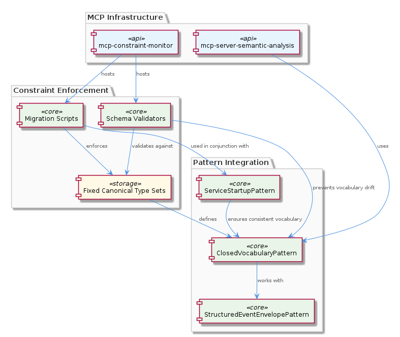
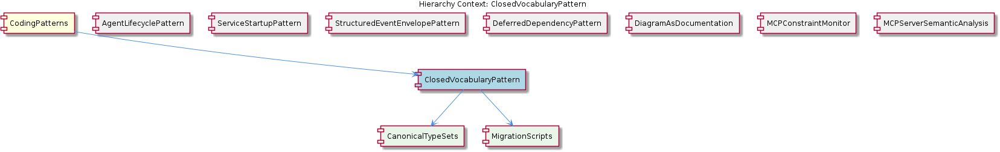

# ClosedVocabularyPattern

**Type:** SubComponent

The ClosedVocabularyPattern is designed to work with the StructuredEventEnvelopePattern, as seen in integrations/mcp-constraint-monitor/docs/CLAUDE-CODE-HOOK-FORMAT.md

# ClosedVocabularyPattern — Technical Insight Document

## What It Is

The `ClosedVocabularyPattern` is a structural coding pattern implemented across the integrations layer of the codebase, with its authoritative documentation residing in `integrations/mcp-constraint-monitor/docs/constraint-configuration.md` and `integrations/mcp-constraint-monitor/docs/semantic-constraint-detection.md`. Additional usage examples are catalogued in `integrations/mcp-server-semantic-analysis/docs/configuration.md`. The pattern enforces a **fixed, canonical set of type identifiers** that any participating subsystem may reference, deliberately closing off the vocabulary to prevent ad-hoc extension at runtime or through uncoordinated developer additions.

At its core, the pattern is composed of two child constructs: `CanonicalTypeSets`, which define the permitted vocabulary, and `MigrationScripts`, which act as the controlled mechanism by which that vocabulary can evolve. Together they form a gating discipline: nothing enters the active vocabulary except through an explicit, reviewed migration step. This positions the pattern as a defense against **vocabulary drift**, a class of bug where divergent string identifiers (e.g., `"agent_started"` vs. `"agent-start"` vs. `"agentStarted"`) silently accumulate across services and erode the reliability of any logic that branches on type.

As a sibling to other foundational `CodingPatterns` such as `AgentLifecyclePattern`, `ServiceStartupPattern`, `StructuredEventEnvelopePattern`, and `DeferredDependencyPattern`, the `ClosedVocabularyPattern` plays the specialized role of guaranteeing *semantic consistency* across the surfaces those other patterns expose. Where `StructuredEventEnvelopePattern` defines the shape of an event, `ClosedVocabularyPattern` defines the *legal values* of the discriminating fields inside that envelope.

## Architecture and Design

The architectural approach is one of **schema-enforced closure**. Rather than allowing arbitrary string values to propagate through the system's type fields, schema validators (documented in `integrations/mcp-constraint-monitor/docs/semantic-constraint-detection.md`) actively reject any identifier not present in the canonical set. This is a deliberate trade between flexibility and correctness — extensibility is sacrificed in favor of guaranteed agreement on the meaning of every type token in circulation.

The design splits responsibility cleanly between the two child entities. `CanonicalTypeSets`, governed by `integrations/mcp-constraint-monitor/docs/constraint-configuration.md` (the "Constraint Configuration Guide"), serves as the single authoritative reference for which type identifiers are permitted. `MigrationScripts`, identified in the same configuration guide, provide the only sanctioned path to mutate that reference. This separation ensures that the *definition* of the vocabulary and the *evolution* of the vocabulary are concerns handled by distinct mechanisms — preventing the common failure mode where vocabulary changes happen as a side-effect of unrelated work.

The pattern is intentionally coupled with `StructuredEventEnvelopePattern`, as documented in `integrations/mcp-constraint-monitor/docs/CLAUDE-CODE-HOOK-FORMAT.md`. The envelope provides the structural carrier, and the closed vocabulary provides the semantic constraint on what that carrier may contain. This combination mirrors a contract-first design philosophy: both the syntax (envelope) and the semantics (vocabulary) of inter-component communication are codified and validated, rather than discovered through runtime debugging.

A second coupling exists with `ServiceStartupPattern` — the migration scripts run in conjunction with the service startup sequence to ensure that by the time services begin handling traffic, every participant has been brought up to the same canonical vocabulary. This is a critical ordering guarantee: vocabulary alignment must precede event production and consumption.

## Implementation Details

The implementation is realized primarily through two cooperating layers. First, the **migration scripts** layer (documented in `constraint-configuration.md`) is the enforcement mechanism for the canonical type sets. These scripts run as part of the deployment and startup lifecycle, applying any pending vocabulary changes in a deterministic order and ensuring that the active configuration matches the declared canonical set before any constraint-sensitive logic executes. They function as the *primary gating control for vocabulary changes across the system*.

Second, the **schema validators** layer (described in `semantic-constraint-detection.md`) provides runtime enforcement. When a structured event or constraint declaration is processed, these validators check the type field against the canonical set and reject inputs containing unknown identifiers. This catches vocabulary drift at the boundary of each service rather than allowing malformed identifiers to propagate inward and surface as confusing downstream failures.

The fixed canonical type sets are referenced throughout the codebase — usage examples are documented in `integrations/mcp-server-semantic-analysis/docs/configuration.md`, demonstrating how consuming components import or reference the canonical set rather than redefining their own type literals. This avoids the classic anti-pattern of "stringly-typed" code where the same logical identifier is spelled differently in different files.

Because no code symbols are surfaced for this entity (0 code symbols found), the pattern is best understood as a **documentation-driven contract** rather than a single class or module. Its enforcement is distributed: it lives partially in the configuration files, partially in the validators that consult them, and partially in the migration scripts that mutate them. The discipline is what makes the pattern real, more so than any single point of code.

## Integration Points

The most explicit integration is with `StructuredEventEnvelopePattern`, where the closed vocabulary populates the discriminating type fields of event envelopes specified in `integrations/mcp-constraint-monitor/docs/CLAUDE-CODE-HOOK-FORMAT.md`. Any subsystem producing or consuming Claude Code hook events implicitly depends on the closed vocabulary to know which event kinds are legal.

The pattern also integrates with `ServiceStartupPattern` through the migration scripts. Because `ServiceStartupPattern`'s `startServiceWithRetry()` function in `lib/service-starter.js` wraps service startup with retry logic, the migration scripts can be safely sequenced into the startup chain — failures during vocabulary migration become recoverable startup failures rather than silent runtime inconsistencies.

Within the `mcp-constraint-monitor` integration, the pattern underpins the constraint configuration system as a whole. The schema validators in `semantic-constraint-detection.md` use the canonical type sets as their source of truth for what constitutes a valid constraint definition. Within `mcp-server-semantic-analysis`, the pattern is referenced from `configuration.md` as a structural example for how semantic analysis configurations should constrain their own vocabularies.

As a child of `CodingPatterns`, the entity inherits the convention seen across its siblings of being documented in a way that makes the pattern reproducible: just as `AgentLifecyclePattern` is anchored in `base-agent.ts` and `DiagramAsDocumentation` is anchored in `docs/puml/`, `ClosedVocabularyPattern` is anchored in the `constraint-configuration.md` and `semantic-constraint-detection.md` documents within the `mcp-constraint-monitor` integration.

## Usage Guidelines

When introducing a new type identifier to any subsystem that participates in the closed vocabulary, developers must **never** add the identifier inline at the call site. Instead, the identifier must be added to the relevant canonical type set via a migration script. The "Constraint Configuration Guide" at `integrations/mcp-constraint-monitor/docs/constraint-configuration.md` is the authoritative reference for which canonical sets exist and how to extend them — it should be consulted before any change that introduces or renames a type token.

When consuming type identifiers, code should reference the canonical set as its source of truth rather than hard-coding string literals. This makes vocabulary changes detectable at compile or validation time and ensures that the schema validators (per `semantic-constraint-detection.md`) cannot reject a value that the rest of the codebase considers legitimate.

When designing a new subsystem that emits or consumes structured events, pair the use of `StructuredEventEnvelopePattern` (per `CLAUDE-CODE-HOOK-FORMAT.md`) with the appropriate canonical vocabulary. The two patterns are intentionally co-designed, and using the envelope without the vocabulary discipline reintroduces precisely the drift problem the pattern was created to prevent.

When integrating with service startup, ensure that any migration script runs *before* the service exposes endpoints or begins emitting events. The combination with `ServiceStartupPattern` exists specifically to provide this ordering — bypassing it (for example, by starting a service without invoking the retry-wrapped startup path) can leave the service operating against a stale vocabulary, defeating the closure guarantee.

Finally, treat any class or module described as managing a `CanonicalTypeSet` with the same caution as the singleton managers described in the parent `CodingPatterns` documentation: do not duplicate or re-instantiate the set in your own module, and always access it through the designated accessor that the migration scripts maintain. This preserves the invariant that there is exactly one active vocabulary in force at any time.

## Hierarchy Context

### Parent
- [CodingPatterns](./CodingPatterns.md) -- [LLM] The project-wide singleton guard pattern is formally codified in `docs/puml/psm-singleton-pattern.puml` and manifests consistently wherever stateful managers are instantiated. The pattern follows a strict guard-and-return idiom: a module-level variable holds the single instance (initialized to null or undefined), and every access point checks that variable before constructing a new object. If an instance already exists, the existing reference is returned immediately without re-running any constructor or initialization logic. This prevents race conditions in async service environments where multiple subsystems might attempt to spin up the same stateful manager concurrently — a real concern in Node.js applications that use event-driven concurrency without explicit locking primitives. For new developers, the implication is that any class described as a 'manager' or 'session' object in this codebase should be assumed to follow this pattern: do not call `new` directly on these classes from arbitrary call sites; instead, always go through the designated factory or accessor function that enforces the singleton contract. The PlantUML diagram in `docs/puml/psm-singleton-pattern.puml` is authoritative and should be consulted before introducing any new singleton-style manager to ensure the guard logic is structurally consistent with the rest of the project.

### Children
- [CanonicalTypeSets](./CanonicalTypeSets.md) -- Governed and documented in `integrations/mcp-constraint-monitor/docs/constraint-configuration.md` ('Constraint Configuration Guide'), which acts as the single authoritative reference for which type identifiers are permitted in the system.
- [MigrationScripts](./MigrationScripts.md) -- Explicitly identified in the `integrations/mcp-constraint-monitor/docs/constraint-configuration.md` ('Constraint Configuration Guide') as the mechanism that enforces fixed canonical type sets, making them the primary gating control for vocabulary changes across the system.

### Siblings
- [AgentLifecyclePattern](./AgentLifecyclePattern.md) -- The BaseAgent class in base-agent.ts defines the lifecycle methods init(), start(), stop(), pause(), and resume()
- [ServiceStartupPattern](./ServiceStartupPattern.md) -- The startServiceWithRetry() function in lib/service-starter.js wraps the service startup with retry logic
- [StructuredEventEnvelopePattern](./StructuredEventEnvelopePattern.md) -- The CLAUDE-CODE-HOOK-FORMAT.md document specifies the structured event envelope format
- [DeferredDependencyPattern](./DeferredDependencyPattern.md) -- The VkbApiClient module in lib/ukb-unified/core/VkbApiClient.js is loaded dynamically using dynamic-import
- [DiagramAsDocumentation](./DiagramAsDocumentation.md) -- The PlantUML diagrams in docs/puml/ capture architectural decisions and provide visual specification
- [MCPConstraintMonitor](./MCPConstraintMonitor.md) -- The MCPConstraintMonitor module in integrations/mcp-constraint-monitor/README.md monitors and enforces constraints
- [MCPServerSemanticAnalysis](./MCPServerSemanticAnalysis.md) -- The MCPServerSemanticAnalysis module in integrations/mcp-server-semantic-analysis/README.md performs semantic analysis

---

*Generated from 6 observations*
