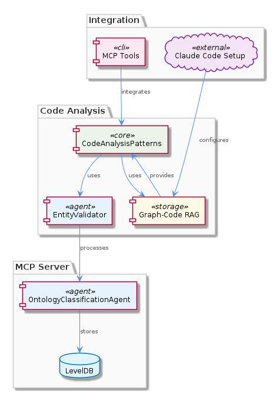
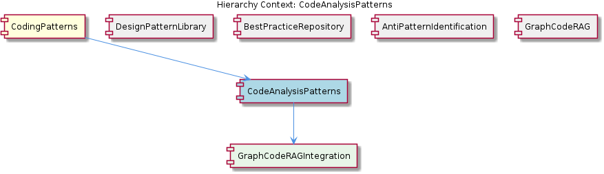

# CodeAnalysisPatterns

**Type:** SubComponent

Entity validation is performed by the EntityValidator class in integrations/mcp-server-semantic-analysis/src/agents/ontology-classification-agent.ts, implying a structured approach to entity validation within code analysis patterns.

## What It Is  

**CodeAnalysisPatterns** is the sub‑component that implements graph‑based code analysis inside the **CodingPatterns** suite. The core implementation lives in the *integrations/code‑graph‑rag* folder, where the **Graph‑Code RAG** system is described in `integrations/code-graph-rag/README.md` and configured via `integrations/code-graph-rag/docs/claude-code-setup.md`. Validation of the entities that are extracted from a codebase is performed by the `EntityValidator` class located in `integrations/mcp-server-semantic-analysis/src/agents/ontology-classification-agent.ts`. The same file also defines a batch‑processing pipeline that feeds code artefacts into the Graph‑Code RAG engine, allowing large codebases to be analysed efficiently. Hooks for extending or customizing quality checks are documented in `integrations/copi/docs/hooks.md`, and contribution conventions are outlined in `integrations/code-graph-rag/CONTRIBUTING.md`. Collectively, these pieces make **CodeAnalysisPatterns** a reusable, graph‑centric analysis engine that can be invoked by the parent **CodingPatterns** component as well as by sibling libraries such as **DesignPatternLibrary**, **BestPracticeRepository**, and **AntiPatternIdentification**.

---

## Architecture and Design  

The architecture centres on a **graph‑based Retrieval‑Augmented Generation (RAG)** pipeline. Code is first parsed into a graph representation by the Graph‑Code RAG system (`integrations/code-graph-rag/README.md`). This graph is then enriched with semantic annotations produced by the **EntityValidator** (found in `ontology-classification-agent.ts`). The validator enforces a structured ontology, ensuring that entities such as classes, functions, and modules conform to a common schema before they are fed into downstream analysis.

A **batch processing pattern** is evident in the same `ontology-classification-agent.ts` file, where a pipeline aggregates multiple source files, validates them in bulk, and streams the resulting graph fragments to the RAG engine. This design choice reduces per‑file overhead and enables horizontal scaling across large repositories.

Hooks, as described in `integrations/copi/docs/hooks.md`, are integrated via a simple plug‑in interface that allows external quality‑check modules to register callbacks at defined stages (e.g., post‑validation, pre‑RAG indexing). This hook mechanism follows an **inversion‑of‑control** style, giving consumers of **CodeAnalysisPatterns** the ability to extend behaviour without modifying core code.

The component sits within the **CodingPatterns** hierarchy, sharing the graph‑centric philosophy with its sibling **GraphCodeRAG** component, while delegating concrete graph handling to its child **GraphCodeRAGIntegration**. The relationship between these entities is illustrated in the diagram below.

---

## Implementation Details  

1. **Graph‑Code RAG Integration** – The `README.md` in `integrations/code-graph-rag/` outlines how the system builds a directed graph where nodes represent code artefacts (files, classes, functions) and edges capture relationships (imports, inheritance, calls). The RAG layer augments this graph with vector embeddings generated by Claude models, as detailed in `integrations/code-graph-rag/docs/claude-code-setup.md`. This setup enables semantic search over the code graph.

2. **EntityValidator** – Implemented in `integrations/mcp-server-semantic-analysis/src/agents/ontology-classification-agent.ts`, the `EntityValidator` class exposes a `validate(entity: CodeEntity): ValidationResult` method. It checks that each entity adheres to the ontology defined for the CodingPatterns domain, rejecting malformed or ambiguous entries early in the pipeline. The validator also tags entities with confidence scores that the RAG layer later uses to weight retrieval results.

3. **Batch Processing Pipeline** – The same `ontology-classification-agent.ts` file defines a `processBatch(files: string[]): BatchResult` routine. It iterates over the supplied file list, parses each file into an intermediate AST, runs the `EntityValidator`, and finally batches the validated entities into a payload for the Graph‑Code RAG indexer. Errors are collected and reported in a consolidated `BatchResult` object, facilitating robust error handling for large‑scale analyses.

4. **Hooks Framework** – The hooks specification in `integrations/copi/docs/hooks.md` declares a `HookRegistry` that maintains a map of hook points (`onPreValidate`, `onPostValidate`, `onPreIndex`, etc.) to arrays of callback functions. Consumers can register a callback by calling `HookRegistry.register('onPostValidate', myCallback)`. During execution, the pipeline invokes each registered callback in order, allowing custom linting, metric collection, or external API calls to be woven into the analysis flow.

5. **Contribution Guidelines** – The `CONTRIBUTING.md` in `integrations/code-graph-rag/` mandates that any new graph transformation or validator rule be accompanied by unit tests, documentation updates, and a changelog entry. This ensures that extensions to **CodeAnalysisPatterns** remain consistent with the overall quality standards of the Graph‑Code RAG ecosystem.

---

## Integration Points  

- **Parent Component (CodingPatterns)** – `CodingPatterns` consumes the analysis results produced by **CodeAnalysisPatterns** to surface higher‑level pattern detections, refactoring suggestions, and quality dashboards. The parent invokes the batch pipeline via a simple façade exposed in `integrations/mcp-server-semantic-analysis/src/agents/ontology-classification-agent.ts`.

- **Sibling Components** – While **DesignPatternLibrary**, **BestPracticeRepository**, and **AntiPatternIdentification** do not appear directly in the source files, they are expected to consume the same graph‑based artefacts. For example, an anti‑pattern detector could subscribe to the `onPostValidate` hook to flag code smells identified during validation.

- **Child Component (GraphCodeRAGIntegration)** – This child encapsulates the low‑level graph construction and vector embedding logic. It provides an API (`GraphRagEngine.index(graph)`, `GraphRagEngine.search(query)`) that the batch pipeline calls after validation.

- **External Hooks** – Third‑party tools can plug into the hooks framework to enrich the analysis (e.g., a security scanner registering on `onPreIndex` to add vulnerability tags).

- **Claude Model Integration** – The Claude code setup (`claude-code-setup.md`) supplies the embedding service credentials and model selection, which the RAG engine uses to generate semantic vectors for each graph node.

---

## Usage Guidelines  

1. **Prepare the Environment** – Follow the Claude setup instructions in `integrations/code-graph-rag/docs/claude-code-setup.md` to configure API keys and model versions before running any analysis.

2. **Batch Invocation** – Use the `processBatch` function from `ontology-classification-agent.ts` to submit a list of source files. Ensure that the file paths are absolute or relative to the project root to avoid parsing errors.

3. **Validate Entities Early** – Rely on the `EntityValidator` to enforce the ontology. If custom entity types are needed, extend the validator class and register the new logic via the `onPreValidate` hook.

4. **Leverage Hooks for Extensibility** – Register custom callbacks in `integrations/copi/docs/hooks.md` to add project‑specific checks (e.g., company coding standards) without altering core code.

5. **Contribute Responsibly** – When adding new graph transformations or validation rules, adhere to the contribution workflow described in `integrations/code-graph-rag/CONTRIBUTING.md`. Include unit tests that cover typical and edge cases.

6. **Monitor Batch Health** – Inspect the `BatchResult` returned by the pipeline for any `ValidationError` entries. Address these errors before re‑indexing to keep the graph consistent.

---

### Architectural Patterns Identified  

- Graph‑based Retrieval‑Augmented Generation (RAG)  
- Batch processing pipeline  
- Validation (Validator) pattern via `EntityValidator`  
- Hook / Plug‑in (Inversion‑of‑Control) pattern  

### Design Decisions and Trade‑offs  

- **Graph‑Centric Model** – Chosen for its ability to represent complex code relationships; trade‑off is higher memory consumption for very large repositories.  
- **Batch Processing** – Improves throughput and reduces per‑file overhead; however, it introduces latency for real‑time analysis scenarios.  
- **Hook Framework** – Provides extensibility without core modifications; the downside is potential performance impact if many heavy callbacks are registered.  
- **Claude Embeddings** – Offers strong semantic search capabilities; reliance on an external LLM service introduces network latency and cost considerations.  

### System Structure Insights  

The system is layered: **CodeAnalysisPatterns** sits beneath the parent **CodingPatterns**, orchestrates validation and batching, and delegates graph construction to its child **GraphCodeRAGIntegration**. Sibling components share the same graph artefacts but focus on different analytical goals (design patterns, best practices, anti‑patterns). The architecture diagram illustrates this hierarchy, while the relationship diagram shows the flow from source files → validator → batch pipeline → Graph‑Code RAG engine → downstream consumers.

### Scalability Considerations  

- **Horizontal Scaling** – The batch pipeline can be parallelized across multiple worker processes or containers, each handling a subset of files.  
- **Graph Partitioning** – For massive codebases, the graph can be sharded by module or package, allowing independent indexing and search.  
- **Caching Embeddings** – Storing generated Claude embeddings reduces repeated LLM calls when re‑analysing unchanged code.  

### Maintainability Assessment  

The clear separation of concerns (validation, batching, graph indexing) and the explicit contribution guidelines (`CONTRIBUTING.md`) promote maintainability. Hook registration centralizes extensibility, reducing the risk of divergent custom code. However, the reliance on external LLM services means that version upgrades or API changes must be tracked carefully. Regular unit tests for the validator and batch pipeline, as mandated by the contribution process, are essential to keep the system robust as the codebase evolves.

## Hierarchy Context

### Parent
- [CodingPatterns](./CodingPatterns.md) -- [LLM] The CodingPatterns component utilizes a graph-based approach for code analysis, as seen in the integrations/code-graph-rag/README.md file, which describes the Graph-Code RAG system. This system is used for graph-based code analysis and implies the use of graph structures and algorithms within the CodingPatterns component. The entity validation is performed by the EntityValidator class in integrations/mcp-server-semantic-analysis/src/agents/ontology-classification-agent.ts, suggesting a structured approach to validating entities within the coding patterns. Furthermore, the batch processing pipeline is defined in integrations/mcp-server-semantic-analysis/src/agents/ontology-classification-agent.ts, indicating that the CodingPatterns component may leverage batch processing for efficient handling of coding pattern analysis.

### Children
- [GraphCodeRAGIntegration](./GraphCodeRAGIntegration.md) -- The Graph-Code RAG system is described in integrations/code-graph-rag/README.md, which outlines its capabilities and usage.

### Siblings
- [DesignPatternLibrary](./DesignPatternLibrary.md) -- DesignPatternLibrary is mentioned as a known sub-component but lacks specific references in the provided source files.
- [BestPracticeRepository](./BestPracticeRepository.md) -- BestPracticeRepository is acknowledged as a sub-component but lacks concrete references in the source files.
- [AntiPatternIdentification](./AntiPatternIdentification.md) -- AntiPatternIdentification is recognized as a sub-component but lacks direct references in the provided source files.
- [GraphCodeRAG](./GraphCodeRAG.md) -- GraphCodeRAG is described in integrations/code-graph-rag/README.md as a Graph-Code RAG system for any codebases.

---

*Generated from 7 observations*
