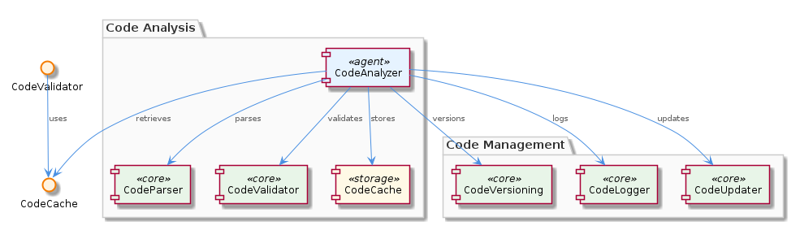
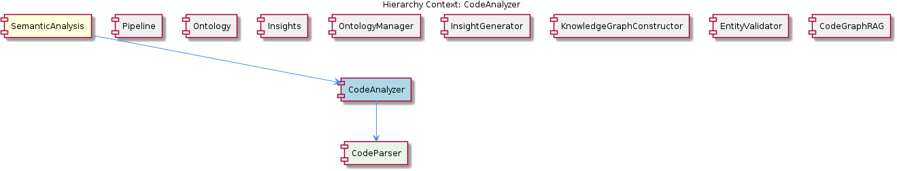

# CodeAnalyzer

**Type:** SubComponent

The CodeAnalyzer employs a set of predefined rules to validate code content and detect staleness in observations and insights, as seen in the integrations/mcp-server-semantic-analysis/src/agents/code-validator.ts file.

## What It Is  

The **CodeAnalyzer** lives inside the `integrations/mcp-server-semantic-analysis/src/agents/` directory and is realised primarily by the `code-analyzer.ts` file. It is a sub‑component of the larger **SemanticAnalysis** component and acts as the dedicated agent for extracting, validating, and serving insights about source‑code artifacts. Its responsibilities are split across several collaborating agents:  

* **Parsing** – `code-analyzer.ts` delegates the raw‑text to a **CodeParser** (its child component) to produce an abstract syntax representation.  
* **Validation** – `code-validator.ts` houses a collection of predefined rules that flag syntactic or semantic problems and detect stale observations.  
* **Caching** – `code-cache.ts` provides an in‑memory store for frequently accessed metadata, reducing repeated parsing work.  
* **Versioning** – `code-versioning.ts` records incremental changes to the analysed code, enabling “as‑of” queries.  
* **Logging** – `code-logger.ts` writes structured logs whenever code is parsed, validated, or updated, supporting auditability.  
* **Updating** – `code-updater.ts` exposes a mechanism for applying dynamic changes to the stored code representation, keeping the analysis surface current.  

Together, these agents expose an **API** (implemented in `code-analyzer.ts`) that other sub‑components—most notably the **InsightGenerator**—call to retrieve up‑to‑date code insights.

## Architecture and Design  

The CodeAnalyzer follows the **agent‑based architecture** that the parent **SemanticAnalysis** component adopts. Each functional concern (parsing, validation, caching, etc.) is encapsulated in its own agent file, allowing independent evolution and clear separation of responsibilities. This mirrors the pattern used by sibling agents such as `ontology-classification-agent.ts` and `code-graph-agent.ts`.

* **Rule‑based validation** – The validator (`code-validator.ts`) implements a simple rule engine: a static list of rule objects is applied to the parsed AST. This design enables easy addition of new checks without touching the core parsing logic.  
* **Cache‑aside pattern** – `code-cache.ts` follows a cache‑aside strategy: callers first query the cache; on a miss they invoke the parser, then populate the cache. This keeps the cache logic thin and avoids stale data because the updater (`code-updater.ts`) explicitly invalidates or refreshes entries.  
* **Versioned data store** – The versioning agent (`code-versioning.ts`) records a monotonically increasing version identifier each time the code is updated. Consumers can request insights tied to a particular version, which is essential for reproducible analysis across CI pipelines.  
* **Logging as a cross‑cutting concern** – `code-logger.ts` is invoked from each major operation (parse, validate, update). By centralising logging, the system gains consistent observability without scattering log statements throughout the codebase.  

These design choices produce a **layered interaction model**:

1. An external request hits the **API** in `code-analyzer.ts`.  
2. The API checks the **cache** (`code-cache.ts`).  
3. On miss, it calls the **parser** (via the child **CodeParser**) to produce an AST.  
4. The **validator** (`code-validator.ts`) runs its rule set on the AST.  
5. Results, together with **version** metadata (`code-versioning.ts`), are returned and optionally logged (`code-logger.ts`).  

## Implementation Details  

### Core Agent (`code-analyzer.ts`)  
The `CodeAnalyzer` class exports methods such as `analyzeFile(path: string)` and `getInsights(query: InsightQuery)`. Internally it orchestrates the other agents: it first queries `CodeCache.get(path)`, falls back to `CodeParser.parse(fileContent)`, then invokes `CodeValidator.validate(ast)`. The method returns a structured `CodeInsight` object that includes the parsed representation, validation results, and the current version identifier from `CodeVersioning.getCurrentVersion(path)`.

### Parsing (`CodeParser`)  
Although the parser implementation lives outside the observed files, the parent‑child relationship is explicit: **CodeAnalyzer contains CodeParser**. The parser likely uses a language‑specific library (e.g., TypeScript compiler API) to produce an AST, which becomes the common lingua franca for downstream agents.

### Validation (`code-validator.ts`)  
The validator defines an interface `ValidationRule` with a single method `apply(ast: AST): ValidationResult`. Concrete rule classes (e.g., `UnusedImportRule`, `DeprecatedAPIRule`) are instantiated in a static array. The `validate` function iterates over this array, aggregates the results, and marks observations as stale when the underlying code has changed beyond a rule’s tolerance window.

### Caching (`code-cache.ts`)  
The cache is a simple `Map<string, CachedCode>` where the key is the file path. Each entry stores the AST, the version at which it was generated, and a timestamp. The cache exposes `get`, `set`, and `invalidate` methods. The `invalidate` call is triggered by `CodeUpdater` whenever a file is rewritten.

### Versioning (`code-versioning.ts`)  
Versioning is implemented as a per‑file counter persisted in a lightweight store (likely a JSON file or in‑memory map). `incrementVersion(path)` is called by `CodeUpdater` after a successful write, and `getCurrentVersion(path)` is consulted by the API to embed version metadata into the insight payload.

### Logging (`code-logger.ts`)  
All agents import a singleton logger from `code-logger.ts`. The logger provides methods like `info`, `warn`, and `error`, and automatically tags each entry with the file path, operation type, and version. This uniform logging aids debugging of stale‑observation detection and cache invalidation events.

### Updating (`code-updater.ts`)  
`CodeUpdater.update(path, newContent)` writes the new source to disk, calls `CodeVersioning.incrementVersion(path)`, and then forces a cache refresh via `CodeCache.invalidate(path)`. By centralising updates, the system guarantees that subsequent analyses see the latest code and version.

## Integration Points  

* **SemanticAnalysis (parent)** – The parent component treats CodeAnalyzer as one of several agents in its DAG‑based execution pipeline. When the **InsightGenerator** needs code‑related data, it calls the CodeAnalyzer API defined in `code-analyzer.ts`.  
* **InsightGenerator (sibling)** – The InsightGenerator imports `CodeAnalyzer` to enrich its semantic insights with concrete code metrics, leveraging the same versioning information that ties code changes to higher‑level ontology classifications.  
* **Pipeline (sibling)** – The overall pipeline coordinates the order of execution; CodeAnalyzer typically runs after source checkout and before ontology classification, ensuring that fresh code insights are available for downstream agents.  
* **OntologyManager & KnowledgeGraphConstructor (siblings)** – These components may consume the versioned code insights to annotate ontology nodes or to populate the knowledge graph with code‑level relationships.  
* **External Consumers** – Any service that requires up‑to‑date code metadata can invoke the public methods of `code-analyzer.ts`. Because the API is version‑aware, external callers can request insights for a specific version, enabling reproducible builds.

## Usage Guidelines  

1. **Prefer the API over direct file access.** All callers should use `CodeAnalyzer.analyzeFile` or `CodeAnalyzer.getInsights` so that caching, versioning, and validation are applied uniformly.  
2. **Treat validation rules as extensible.** When adding a new rule, implement the `ValidationRule` interface and register it in the static rule array inside `code-validator.ts`. This avoids modifying core parsing or caching logic.  
3. **Never mutate cached entries directly.** Updates must go through `CodeUpdater.update`; the updater will handle version bumping and cache invalidation automatically.  
4. **Log contextually.** Use the logger from `code-logger.ts` and include the file path and current version in every log statement to maintain traceability across the analysis pipeline.  
5. **Mind stale observations.** Because the validator marks observations as stale when the underlying code version changes, downstream agents should respect the `stale` flag in `ValidationResult` and re‑request fresh insights if needed.  

---

### Architectural patterns identified  
* Agent‑based modular architecture (inherited from SemanticAnalysis)  
* Rule‑engine pattern for validation (`code-validator.ts`)  
* Cache‑aside pattern (`code-cache.ts`)  
* Versioned data store pattern (`code-versioning.ts`)  
* Centralised logging as a cross‑cutting concern (`code-logger.ts`)  

### Design decisions and trade‑offs  
* **Separation of concerns** – By isolating parsing, validation, caching, and versioning into distinct agents, the system gains testability and independent evolution, at the cost of additional indirection and a slightly larger code surface.  
* **Static rule list** – Simplicity and predictability, but adding dynamic rule loading would increase flexibility.  
* **In‑memory cache** – Provides low latency for repeated analyses on the same files; however, it may not scale across multiple server instances without a distributed cache layer.  

### System structure insights  
* CodeAnalyzer sits at the intersection of raw source files and higher‑level semantic agents, acting as the “ground truth” provider for code‑related insights.  
* Its child **CodeParser** supplies the canonical AST, while sibling agents consume the versioned insights to enrich ontology and knowledge‑graph constructs.  

### Scalability considerations  
* The current cache‑aside implementation scales well for single‑process workloads but would need a shared cache (e.g., Redis) for horizontal scaling.  
* Version identifiers are lightweight integers, so version tracking adds minimal overhead even for large codebases.  
* Validation rule execution is linear in the number of rules; adding many complex rules could become a bottleneck, suggesting possible parallelisation in future iterations.  

### Maintainability assessment  
* Clear module boundaries and well‑named files (`code‑validator.ts`, `code‑cache.ts`, etc.) make the codebase approachable for new developers.  
* Centralised logging and versioning reduce duplication of boiler‑plate code.  
* The reliance on a single parser implementation (via the child **CodeParser**) means that language‑specific changes are isolated, but the lack of an explicit interface in the observations could make future language extensions slightly more invasive.  

Overall, the **CodeAnalyzer** demonstrates a disciplined, agent‑centric design that balances extensibility with performance, fitting cleanly into the broader SemanticAnalysis ecosystem.

## Hierarchy Context

### Parent
- [SemanticAnalysis](./SemanticAnalysis.md) -- [LLM] The SemanticAnalysis component employs a multi-agent architecture, utilizing agents such as the OntologyClassificationAgent, SemanticAnalysisAgent, and CodeGraphAgent, to perform tasks such as code analysis, ontology classification, and insight generation. The OntologyClassificationAgent, for instance, is implemented in the file integrations/mcp-server-semantic-analysis/src/agents/ontology-classification-agent.ts and is responsible for classifying observations against the ontology system. This agent-based approach allows for a modular and scalable design, enabling the component to handle large-scale codebases and provide meaningful insights.

### Children
- [CodeParser](./CodeParser.md) -- The CodeAnalyzer utilizes a parsing mechanism to extract insights from code files, as seen in the parent context.

### Siblings
- [Pipeline](./Pipeline.md) -- The Pipeline coordinator uses a DAG-based execution model with topological sort in batch-analysis steps, each step declaring explicit depends_on edges, as seen in the integrations/mcp-server-semantic-analysis/src/agents/ontology-classification-agent.ts file.
- [Ontology](./Ontology.md) -- The OntologyManager uses a hierarchical structure to organize the ontology system, with upper and lower ontology definitions, as seen in the integrations/mcp-server-semantic-analysis/src/agents/ontology-manager.ts file.
- [Insights](./Insights.md) -- The InsightGenerator utilizes the CodeAnalyzer to extract meaningful insights from code files and git history, as referenced in the integrations/mcp-server-semantic-analysis/src/agents/insight-generator.ts file.
- [OntologyManager](./OntologyManager.md) -- The OntologyManager uses a hierarchical structure to organize the ontology system, with upper and lower ontology definitions, as seen in the integrations/mcp-server-semantic-analysis/src/agents/ontology-manager.ts file.
- [InsightGenerator](./InsightGenerator.md) -- The InsightGenerator utilizes the CodeAnalyzer to extract meaningful insights from code files and git history, as referenced in the integrations/mcp-server-semantic-analysis/src/agents/insight-generator.ts file.
- [KnowledgeGraphConstructor](./KnowledgeGraphConstructor.md) -- The KnowledgeGraphConstructor utilizes Memgraph to store and manage the knowledge graph, as implemented in the integrations/mcp-server-semantic-analysis/src/agents/knowledge-graph-constructor.ts file.
- [EntityValidator](./EntityValidator.md) -- The EntityValidator utilizes a set of predefined rules to validate entity content, as implemented in the integrations/mcp-server-semantic-analysis/src/agents/entity-validator.ts file.
- [CodeGraphRAG](./CodeGraphRAG.md) -- The CodeGraphRAG utilizes a graph database to store and manage the code graph, as implemented in the integrations/code-graph-rag/README.md file.

---

*Generated from 7 observations*
