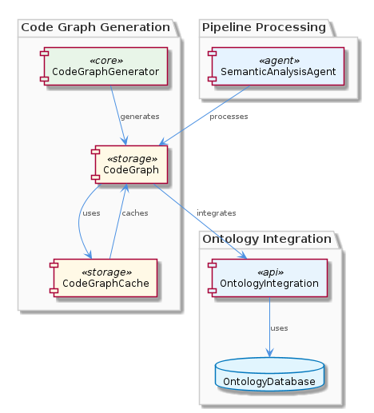
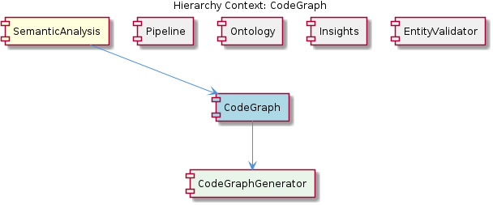

# CodeGraph

**Type:** SubComponent

The code graph uses a graph-based structure, with nodes representing code elements and edges representing relationships between them, as seen in the integrations/code-graph-rag/src/code-graph.ts file.

## What It Is  

The **CodeGraph** sub‑component lives under the `integrations/code-graph-rag/src/` directory. Its core responsibilities are implemented in the following files:  

* **`code-graph-generator.ts`** – houses the `CodeGraphGenerator` class that walks source code and builds the graph.  
* **`code-graph.ts`** – defines the graph data model (nodes for code elements, edges for relationships) and the extensibility hooks that let new element types be added.  
* **`code-graph-representation.ts`** – serialises the in‑memory graph into a portable representation used downstream.  
* **`code-graph-cache.ts`** – provides a caching layer that stores previously generated graphs to avoid recomputation.  
* **`ontology-integration.ts`** – enriches the graph with ontology‑derived annotations, linking code entities to the system’s semantic model.  

Together these pieces produce a **graph‑based representation of the codebase** that can be consumed by the SemanticAnalysis pipeline and other agents (e.g., the `CodeGraphAgent`).  

---

## Architecture and Design  

The design of CodeGraph follows a **graph‑centric, modular architecture**. The primary architectural pattern evident is the **Pipeline pattern**: the `SemanticAnalysisAgent` (found in `integrations/mcp-server-semantic-analysis/src/agents/semantic-analysis-agent.ts`) pulls a generated `CodeGraph` from the `CodeGraphGenerator` and passes it downstream for classification, insight generation, and validation.  

Within the CodeGraph sub‑component itself, the **Builder/Factory style** is visible in `CodeGraphGenerator`. It orchestrates the creation of nodes and edges, delegating the concrete construction of each element to the extensible factories defined in `code-graph.ts`. This makes the graph **extensible** – new node types can be introduced without touching the core generator.  

A lightweight **Cache pattern** is realized in `code-graph-cache.ts`. The cache stores previously built graphs keyed by repository snapshot identifiers, dramatically reducing the cost of repeated analyses on unchanged code.  

Finally, the integration with the ontology (via `ontology-integration.ts`) resembles an **Adapter**: ontology definitions are mapped onto graph nodes, allowing the rest of the system to treat code elements as semantically rich entities without coupling the graph logic to ontology internals.  

All of these patterns coexist without a monolithic service boundary; the sub‑component is a collection of focused TypeScript modules that expose clear interfaces to sibling components such as **Pipeline**, **Ontology**, **Insights**, and **EntityValidator**.  

---

## Implementation Details  

### Core Graph Model (`code-graph.ts`)  
The file defines a `CodeGraph` class that maintains two primary collections:  

* **Nodes** – each node represents a distinct code element (e.g., class, function, module). The node interface includes a unique identifier, a type discriminator, and a payload for language‑specific metadata.  
* **Edges** – edges capture relationships such as “calls”, “inherits”, or “imports”. Edge objects store source/target node IDs and a relationship label.  

Extensibility is achieved through generic type parameters and a registration API (`registerNodeType`, `registerEdgeType`) that allows downstream modules to plug in custom element kinds.

### Generation Logic (`code-graph-generator.ts`)  
`CodeGraphGenerator` implements a multi‑step process:  

1. **Parsing** – leverages language‑specific parsers (not detailed in the observations) to produce an AST.  
2. **Traversal** – walks the AST, invoking the node/edge factories from `code-graph.ts` to emit graph primitives.  
3. **Annotation** – calls the ontology integration layer to enrich each node with ontology concepts (e.g., mapping a `Controller` class to the “APIEndpoint” concept).  

The generator is deliberately stateless; it receives a source snapshot and returns a fresh `CodeGraph` instance, which the cache layer can then store.

### Caching (`code-graph-cache.ts`)  
The cache is a simple key‑value store keyed by a hash of the repository state (commit SHA or timestamp). It exposes `getGraph(key)` and `setGraph(key, graph)` methods. The cache implementation is abstracted behind an interface, enabling future replacement with Redis, in‑memory LRU, or disk‑based storage without touching the generator.

### Ontology Integration (`ontology-integration.ts`)  
This module imports the system‑wide ontology definitions (from the sibling **Ontology** component) and provides a `annotateGraph(graph: CodeGraph)` function. The function iterates over graph nodes, looks up matching ontology concepts, and attaches them as metadata. This decouples the graph from the ontology’s internal representation while still delivering semantic richness to downstream agents.

### Consumption (`semantic-analysis-agent.ts`)  
The `SemanticAnalysisAgent` obtains a `CodeGraph` by invoking `CodeGraphGenerator` (or the cache) and then forwards it to the **Insights** generator, **EntityValidator**, and other pipeline stages. The agent’s responsibilities illustrate how CodeGraph is a shared artifact across the broader SemanticAnalysis parent component.

---

## Integration Points  

* **Parent – SemanticAnalysis**: CodeGraph is a child of the `SemanticAnalysis` component. The `SemanticAnalysisAgent` orchestrates its creation and passes the resulting graph to sibling agents (OntologyClassificationAgent, InsightGenerator, EntityValidator).  
* **Sibling – Pipeline**: The batch processing pipeline defined in the `OntologyClassificationAgent` expects a populated `CodeGraph` to perform classification against the ontology.  
* **Sibling – Ontology**: Ontology definitions are consumed by `ontology-integration.ts` to annotate graph nodes, establishing a bidirectional link between code structure and domain semantics.  
* **Sibling – Insights**: The `InsightGenerator` (found in `integrations/mcp-server-semantic-analysis/src/insights/insight-generator.ts`) consumes the annotated graph to derive higher‑level insights such as architectural smells or dependency cycles.  
* **Sibling – EntityValidator**: Validation rules defined in `entity-validator.ts` operate on the graph to ensure that code entities conform to the ontology’s constraints.  

All interactions are mediated through well‑typed TypeScript interfaces, keeping compile‑time safety and allowing each module to evolve independently.

---

## Usage Guidelines  

1. **Prefer the Cache** – When invoking `CodeGraphGenerator` from any agent, first check `code-graph-cache.ts` with the current repository hash. Store the result back into the cache after generation to avoid unnecessary recomputation.  
2. **Extend via Registration** – To add a new code element (e.g., a “FeatureFlag” annotation), implement a node factory and register it using the `registerNodeType` API in `code-graph.ts`. Do not modify the core `CodeGraph` class directly; this preserves backward compatibility.  
3. **Annotate After Generation** – Always run `ontology-integration.annotateGraph` after the graph is built but before it is handed to downstream agents. Skipping this step will result in missing semantic tags that InsightGenerator and EntityValidator rely on.  
4. **Immutable Graph Instances** – Treat the `CodeGraph` returned by the generator as immutable. If a transformation is required (e.g., pruning unused nodes), clone the graph first to avoid side‑effects that could corrupt the cached version.  
5. **Version‑Lock Ontology** – Because ontology concepts evolve, ensure that the version of the ontology used by `ontology-integration.ts` matches the version expected by the consuming agents. Mismatched versions can lead to failed annotations or validation errors.  

---

### Architectural patterns identified  
* Pipeline pattern (orchestration by `SemanticAnalysisAgent`)  
* Builder/Factory pattern in `CodeGraphGenerator` and node/edge factories  
* Cache pattern (`code-graph-cache.ts`)  
* Adapter pattern for ontology integration (`ontology-integration.ts`)  

### Design decisions and trade‑offs  
* **Stateless generator + external cache** – simplifies testing and enables parallel generation but adds a cache‑consistency responsibility.  
* **Extensible graph model** – promotes future growth (new node types) at the cost of a slightly more complex registration API.  
* **Separate ontology adapter** – decouples domain semantics from graph logic, but introduces an extra processing step before downstream consumption.  

### System structure insights  
* CodeGraph sits as a **child** of the `SemanticAnalysis` parent, providing a shared artifact for all sibling agents.  
* The sub‑component is self‑contained in `integrations/code-graph-rag/src/`, exposing only a few public interfaces (`generate`, `getFromCache`, `annotate`).  
* Its relationship diagram shows tight coupling to the pipeline (input) and ontology (annotation), while remaining loosely coupled to Insight generation and validation.  

### Scalability considerations  
* **Caching** reduces repeated work on large repositories, enabling the pipeline to scale horizontally across many commits.  
* The graph data structure is in‑memory; for extremely large codebases, a streaming or persisted graph store might be required.  
* Extensibility hooks allow incremental addition of element types without re‑architecting the whole generator, supporting growth in language coverage.  

### Maintainability assessment  
* Clear separation of concerns (generation, caching, ontology integration) yields high maintainability.  
* Use of TypeScript interfaces enforces contract stability across siblings.  
* The registration‑based extensibility may require documentation for new contributors, but it avoids invasive changes to core classes.  
* The reliance on external parsers (not detailed) could become a maintenance hotspot if language support expands; encapsulating parser selection behind an interface would mitigate this.

## Hierarchy Context

### Parent
- [SemanticAnalysis](./SemanticAnalysis.md) -- [LLM] The SemanticAnalysis component utilizes a multi-agent system architecture, with agents such as OntologyClassificationAgent, SemanticAnalysisAgent, and CodeGraphAgent, to process git history and LSL sessions. This is evident in the code files, such as integrations/mcp-server-semantic-analysis/src/agents/ontology-classification-agent.ts, integrations/mcp-server-semantic-analysis/src/agents/semantic-analysis-agent.ts, and integrations/mcp-server-semantic-analysis/src/agents/code-graph-agent.ts, which define the respective agents and their responsibilities. The use of multiple agents allows for a modular and scalable design, enabling the processing of large amounts of data and the integration of new agents as needed.

### Children
- [CodeGraphGenerator](./CodeGraphGenerator.md) -- The CodeGraphGenerator class is mentioned in the hierarchy context as the class performing code graph generation.

### Siblings
- [Pipeline](./Pipeline.md) -- The batch processing pipeline is defined in integrations/mcp-server-semantic-analysis/src/agents/ontology-classification-agent.ts, which outlines the responsibilities of the OntologyClassificationAgent.
- [Ontology](./Ontology.md) -- The OntologyClassificationAgent in integrations/mcp-server-semantic-analysis/src/agents/ontology-classification-agent.ts is responsible for classifying entities based on the ontology.
- [Insights](./Insights.md) -- The insight generation is performed by the InsightGenerator class in integrations/mcp-server-semantic-analysis/src/insights/insight-generator.ts.
- [EntityValidator](./EntityValidator.md) -- The entity validation is performed by the EntityValidator class in integrations/mcp-server-semantic-analysis/src/entity-validator.ts.

---

*Generated from 7 observations*
