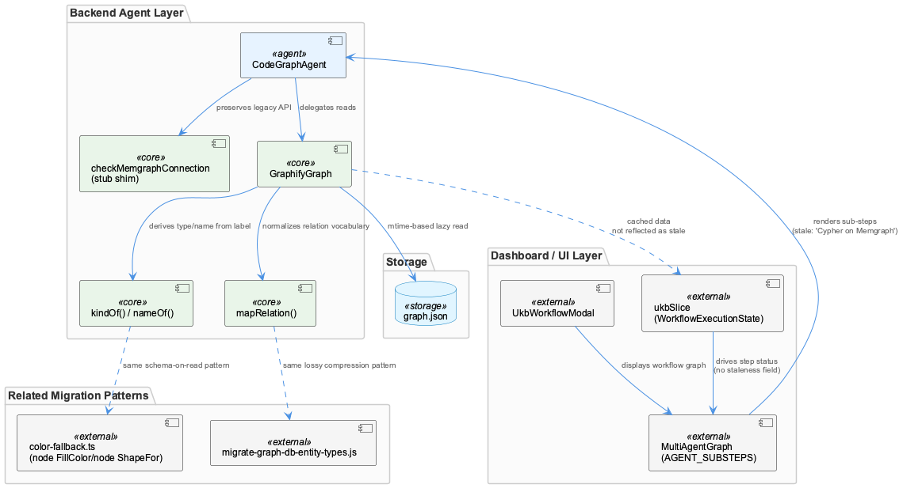
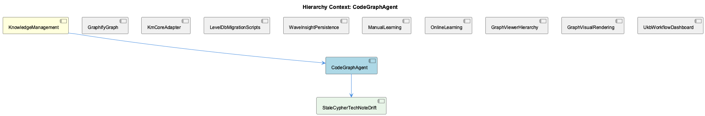

# CodeGraphAgent

**Type:** SubComponent

# CodeGraphAgent — Technical Insight Document

## What It Is

CodeGraphAgent is implemented in `integrations/semantic-analysis/src/agents/code-graph-agent.ts`, where it serves as a backend shim that presents a legacy, Memgraph-era public API surface while internally delegating all graph operations to GraphifyGraph, its sibling component under the shared parent KnowledgeManagement. Rather than issuing Cypher queries against a live Memgraph instance, CodeGraphAgent now reads from a static `graph.json` artifact — a NetworkX node-link export produced by the graphify analysis pipeline. The component retains method names like `checkMemgraphConnection` purely for API-surface compatibility, even though the method performs no real database check. This is a preserved-name, changed-behavior shim — the kind of subtle trap that makes downstream code believe old semantics are still in effect.

## Architecture and Design

CodeGraphAgent is a concrete instance of the Strangler Fig pattern that appears to be a house style across this codebase, mirrored by the LevelDbMigrationScripts sibling's sequential entity-type and storage migrations. The old interface is kept intact while the implementation underneath is fully swapped for GraphifyGraph's file-based reader.

Structurally, this migration pattern is visible at three layers: the backend shim itself; the dashboard's `AGENT_SUBSTEPS['code_graph']` metadata in `integrations/system-health-dashboard/src/components/workflow/multi-agent-graph.tsx`, which still models sub-steps as Code Indexing → Graph Querying → Code Analysis with Cypher/Memgraph framing baked into the 'query' step's `techNote`; and the broader knowledge-graph migration scripts (`migrate-graph-db-entity-types.js`, `migrate-leveldb-to-kmcore.mjs`) that apply the same "change the storage, keep the interface" philosophy elsewhere in KnowledgeManagement. This drift is precisely captured by CodeGraphAgent's child component, StaleCypherTechNoteDrift, which pinpoints the exact stale `techNote: 'Cypher queries on Memgraph'` string versus the sibling `index` sub-step's accurate `'AST parsing via tree-sitter'` note — a partial, not total, documentation drift.

Because GraphifyGraph (the parent-level component this shim delegates to) uses mtime-based lazy caching to avoid re-parsing a potentially tens-of-megabyte `graph.json` file on every read, CodeGraphAgent inherits a batch-consistency model rather than real-time mutation visibility — a direct trade-off of read performance for staleness risk.

## Implementation Details

The actual parsing mechanics live in GraphifyGraph, on which CodeGraphAgent depends: `kindOf()` and `nameOf()` derive type and name from graphify's raw `label` field, an "interpreted schema" approach architecturally analogous to `nodeFillColor()`/`nodeShapeFor()` in `integrations/unified-viewer/src/graph/color-fallback.ts`, which parent-walk an ontology registry to derive visual attributes. Both patterns compute semantics at read time from indirect lookups rather than storing them as flat, queryable fields — a recurring tension between compact storage and richer consumer-side semantic needs.

Similarly, `mapRelation()` performs lossy edge-normalization, collapsing graphify's fine-grained relation vocabulary (e.g., `indirect_call`, `re_exports`) into six canonical `CodeRelationship` types — a read-time compression that mirrors the one-time, persisted-graph consolidation performed by `migrate-graph-db-entity-types.js` (collapsing `TransferablePattern`/`WorkflowPattern`/`TechnicalIssue` into System/Project/Pattern). Both are irreversible simplifications that trade fine-grained recoverability for a smaller, more stable downstream vocabulary.

On the UI side, `AGENT_SUBSTEPS['code_graph']` assigns `llmUsage: 'none'` to indexing and querying but `llmUsage: 'standard'` to the 'analyze' sub-step, confirming that CodeGraphAgent's mechanical read layer is LLM-free — an LLM is only invoked afterward, to interpret the results of an otherwise deterministic graph read.

## Integration Points

CodeGraphAgent sits within KnowledgeManagement alongside GraphifyGraph (its actual execution engine), KmCoreAdapter, LevelDbMigrationScripts, and UkbWorkflowDashboard. Its query results surface through the dashboard's live workflow visualization — `multi-agent-graph.tsx` rendered via `ukb-workflow-modal.tsx` — which drives per-step status (<AWS_SECRET_REDACTED>) through Redux state in `ukbSlice.ts`'s `WorkflowExecutionState.stepStatuses`, updated near-real-time via WebSocket/event-driven mode.

This creates an unaddressed interaction: a workflow step can be marked "completed" in the UI while its underlying graph data reflects a `graph.json` snapshot older than the most recent graphify re-index, because `StepInfo` in `ukbSlice.ts` has no `graphStaleness` or `dataAsOf` field to distinguish fresh from cached reads. This is the same category of file-mtime staleness issue GraphifyGraph faces more broadly.

## Usage Guidelines

Developers should not trust `AGENT_SUBSTEPS['code_graph']`'s `techNote` fields as documentation of CodeGraphAgent's actual backend — the 'query' sub-step's Cypher/Memgraph reference is stale and tracked explicitly as StaleCypherTechNoteDrift; it should be corrected to describe GraphifyGraph's static-file read path. Method names on CodeGraphAgent, notably `checkMemgraphConnection`, should not be assumed to perform their literal described action — verify actual behavior rather than trusting the name. When building UI or monitoring around code-graph queries, account for the mtime-cache staleness window inherited from GraphifyGraph, and consider adding staleness metadata to `StepInfo` to make cache freshness visible to operators. Finally, treat `mapRelation()`'s canonical relationship types as a one-way compression: original fine-grained relation types from graphify cannot be recovered downstream, so any consumer needing finer granularity must intercept data before this normalization.

## Hierarchy Context

### Parent
- [KnowledgeManagement](./KnowledgeManagement.md) -- [LLM] The GraphifyGraph reader (integrations/semantic-analysis/src/agents/graphify-graph.ts) represents a deliberate architectural simplification: rather than maintaining a live graph database connection (Memgraph via Cypher), the component now treats a static graph.json artifact produced by the graphify service as the source of truth for code-structure knowledge. This file, a NetworkX node-link JSON export, can be tens of megabytes, so GraphifyGraph implements mtime-based lazy caching — it stat()s the file and only re-parses when the mtime has changed since the last load. This pattern trades real-time graph mutation capability for drastically simpler deployment (no separate DB process) and fast repeated reads, at the cost of only picking up graph changes when the underlying analysis pipeline re-writes graph.json.

### Children
- [StaleCypherTechNoteDrift](./StaleCypherTechNoteDrift.md) -- [LLM] The stale tech-note lives at a single, precisely locatable point: `AGENT_SUBSTEPS['code_graph']` in integrations/system-health-dashboard/src/components/workflow/multi-agent-graph.tsx, specifically the `query` sub-step object (`id: 'query', name: 'Graph Querying', ... techNote: 'Cypher queries on Memgraph'`). This is static, hand-authored metadata — not derived from any runtime introspection of CodeGraphAgent — so nothing in the build or type system would catch the fact that it describes a backend (live Memgraph + Cypher) that the parent-context migration already replaced with GraphifyGraph's static graph.json reader. The sibling `index` sub-step's techNote ('AST parsing via tree-sitter') is accurate and unaffected, which makes this a partial, not total, drift: two of the three code_graph sub-step descriptions could be correct while the middle one silently lies.

### Siblings
- [GraphifyGraph](./GraphifyGraph.md) -- [LLM] GraphifyGraph (integrations/semantic-analysis/src/agents/graphify-graph.ts) inverts the conventional graph-database architecture by treating a flat, periodically-regenerated graph.json file as the system of record instead of a live queryable store. The mtime-based lazy-caching strategy — stat() the file, compare against the last-seen mtime, and only re-parse the (potentially tens-of-megabytes) NetworkX node-link export when it changes — is a classic read-heavy optimization, but it also means GraphifyGraph is fundamentally a batch-consistency component: it cannot see a code-structure change until the separate graphify analysis pipeline finishes a full re-write of the JSON artifact. This is architecturally similar to the mtime/staleness problem the dashboard integration explicitly worked around elsewhere in this codebase (system-health-dashboard's bind-mount VirtioFS caching required a forced container restart to invalidate a stale read) — both are instances of 'a file on disk is the API' trading real-time correctness for operational simplicity.
- [KmCoreAdapter](./KmCoreAdapter.md) -- [LLM] The provided code files (ukb-workflow-modal.tsx, multi-agent-graph.tsx, ukbSlice.ts, D3GraphCanvas.tsx, color-fallback.ts) belong to system-health-dashboard and unified-viewer, not directly to the KmCoreAdapter/GraphifyGraph pipeline described in the parent observations. This suggests KmCoreAdapter's output (graph.json, entity types, relationship taxonomy) is consumed downstream by visualization layers like D3GraphCanvas and the AGENT_SUBSTEPS 'code_graph' definitions in multi-agent-graph.tsx, which explicitly reference 'Cypher queries on Memgraph' as a techNote — a stale artifact from before the GraphifyGraph migration described in the parent context, meaning the UI's descriptive text has not been updated to reflect the Memgraph-to-graphify strangler-fig migration.
- [LevelDbMigrationScripts](./LevelDbMigrationScripts.md) -- [LLM] The two migration scripts referenced in the parent context — migrate-graph-db-entity-types.js and migrate-leveldb-to-kmcore.mjs — represent sequential, non-idempotent phases of the same underlying transition: first a taxonomy simplification (collapsing TransferablePattern/WorkflowPattern/TechnicalIssue into System/Project/Pattern) performed in-place against the live Graphology in-memory graph, then a structural re-platforming that assigns UUIDv7 identifiers, a layer='evidence' classification, and a legacyId.system='B' backward-reference tag to every entity. Because the second script depends on entities already conforming to the three-category taxonomy (any code still testing for the old fine-grained type strings would silently fail), these scripts form an implicit ordering contract that is not enforced by any shared orchestration file — a developer running migrate-leveldb-to-kmcore.mjs before migrate-graph-db-entity-types.js has completed would migrate stale/incorrect type data into the new km-core shape with no runtime error to signal the mistake.
- [WaveInsightPersistence](./WaveInsightPersistence.md) -- [LLM] The 'persistence' entry in AGENT_SUBSTEPS (integrations/system-health-dashboard/src/components/workflow/multi-agent-graph.tsx) models WaveInsightPersistence as three explicit, sequential sub-steps — w1 ('Wave 1 Persist', L0 Project + L1 Component entities), w2 ('Wave 2 Persist', L2 SubComponent entities), and w3 ('Wave 3 Persist', L3 Detail entities plus operator-refined fields and embeddings). All three declare llmUsage: 'none' and techNote: 'GraphDB + LevelDB storage', confirming that persistence itself is a pure storage operation with no LLM calls — the LLM work (pattern discovery, entity extraction, classification) happens upstream in kg_operators/semantic_analysis/insight_generation, and persistence's job is purely to commit already-synthesized entities. Notably w3's techNote uniquely adds 'direct attribute merge', implying Wave 3 does not simply insert new nodes but merges operator-enriched fields (e.g. embeddings) onto entities that may already exist from earlier waves — a detail not present in w1/w2, suggesting Wave 3 is where duplicate-entity reconciliation actually happens rather than at insight-generation time.
- [ManualLearning](./ManualLearning.md) -- [LLM] The ukb-workflow-modal.tsx file documents its own evolution through inline comments rather than commit messages — the HISTORY_PAGE_SIZE constant carries a multi-paragraph comment explaining that raising it from 50 to 500 was 'close to free' because /api/ukb/history parses every report regardless of limit and only slices at the end. This is a case of manual/institutional learning being encoded directly in source as a durable artifact: a future maintainer who considers lowering this constant for 'performance' will read the comment and understand the tradeoff (response size vs. server work) before making that mistake again, effectively preventing regression of a fix that had no automated test to catch it.
- [OnlineLearning](./OnlineLearning.md) -- [LLM] The 'OnlineLearning' distinction is implemented as a data-driven color/shape overlay rather than a structural entity type: `integrations/unified-viewer/src/graph/color-fallback.ts` defines two parallel palettes, `BATCH_PALETTE` (teal/blue shades keyed by hierarchy depth: System/Project/Component/SubComponent/Detail) and `ONLINE_PALETTE` (red/pink shades for the same hierarchy levels), and `classColor()` picks between them purely based on whether `isOnlineLearned({ metadata: { source } })` returns true. This means 'online-learned' is not a first-class ontology class but a metadata flag (`source: 'auto'` or `'online'`) riding along on any entity, decoupled from what class/type that entity otherwise has.
- [GraphViewerHierarchy](./GraphViewerHierarchy.md) -- [LLM] D3GraphCanvas.tsx (integrations/unified-viewer/src/graph/D3GraphCanvas.tsx) is an explicit, well-documented port of a Redux-based component (memory-visualizer's GraphVisualization.tsx) into a Zustand-store-driven architecture, but it does not simply swap state libraries — it re-derives a large amount of selection/ancestry logic to keep two independently-maintained rendering paths (this D3/SVG canvas and a parallel Sigma/WebGL canvas referenced in comments as 'graph-builder.ts') in sync. The `deriveAncestryFromStorePath()` function is the clearest evidence of this: rather than trusting either the store's `pathToSelected` set or its own inline `computeAncestryPath()` BFS in isolation, it runs both and reconciles them with a 'writer's intent wins' rule — nodes the store claims are in-path but the local BFS can't reach get a synthetic max-depth slot so they still render, while nodes the BFS finds but the store doesn't tag are dropped. This reconciliation is a symptom of maintaining two rendering engines against one shared selection model without a shared traversal implementation.
- [GraphVisualRendering](./GraphVisualRendering.md) -- [LLM] The GraphVisualRendering surface is split across two independently-evolved implementations that never share code: `integrations/system-health-dashboard/src/components/workflow/multi-agent-graph.tsx` renders the UKB workflow pipeline as a fixed-topology SVG (`WAVE_AGENTS`, `KG_OPERATOR_CHILDREN`, `MULTI_AGENT_EDGES` from `./constants`), while `integrations/unified-viewer/src/graph/D3GraphCanvas.tsx` renders the knowledge graph itself as a force-directed D3 simulation (`d3.forceSimulation` + `d3.forceLink(150)` + `d3.forceManyBody(-500)`). The former is a static, hand-authored process diagram; the latter is a dynamic layout engine over live entity/relation data pulled through `useGraphData`. They happen to share the word 'graph' and the general shape of node/edge rendering, but there is no common rendering abstraction, color resolver, or type between them — any visual-consistency fix (e.g. dark-mode palette) has to be applied twice.
- [UkbWorkflowDashboard](./UkbWorkflowDashboard.md) -- [LLM] The HISTORY_PAGE_SIZE constant in ukb-workflow-modal.tsx (currently 500, previously 50) documents a concrete production incident in its own comment block: with the old cap, `/api/ukb/history` silently truncated the report list at 50 entries even though 119+ reports existed, making the single most important run — the batch-analysis run whose Pipeline Totals card shows commits/sessions/entity counts — permanently unreachable from the UI because it sat at position ~51. The fix works because the API route reads and parses every report on every call regardless of `limit`, slicing only at the very end, so raising the page size costs response payload size (roughly 13 header fields per report) rather than server-side work. This is a case where a UI paging constant silently created a data-loss illusion — the data was never lost, just permanently unreachable — and the comment functions as a postmortem note baked directly into source rather than a separate incident doc.

---

*Generated from 9 observations*
