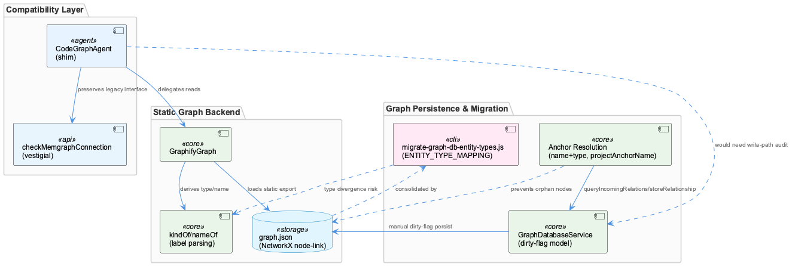
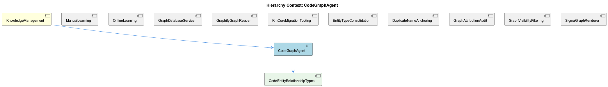

# CodeGraphAgent

**Type:** SubComponent

## What It Is

CodeGraphAgent is implemented at `integrations/semantic-analysis/src/agents/code-graph-agent.ts`, within the KnowledgeManagement component. It is described by the parent entity's context as a compatibility shim: a class that preserves the full historical public interface — the `CodeEntity` and `CodeRelationship` types (surfaced further via its child, CodeEntityRelationshipTypes) and the `checkMemgraphConnection` method — from an era when it queried a live Memgraph/Cypher graph backend. Internally, it now delegates entirely to GraphifyGraph, a sibling-adjacent module at `integrations/semantic-analysis/src/agents/graphify-graph.ts` that reads a static, file-based graph export rather than a live database. No code files for CodeGraphAgent itself were retrieved in this pass; the description here is grounded entirely in parent-entity context and should be read accordingly.

## Architecture and Design

The dominant pattern is a Facade/Adapter applied across a backend migration: consumer code written against the old Memgraph-era contract — including guard clauses like `if (!connectionCheck.connected)` — continues to run unmodified even though "connection" is now a meaningless concept under a static-file backend. This is a deliberate trade-off: it decouples caller code from the storage migration at the cost of a permanently misleading method name (`checkMemgraphConnection`) sitting in the API surface, where its name no longer describes its behavior.

Underneath, GraphifyGraph treats a static NetworkX node-link `graph.json` export as sole source of truth. Its nodes carry no explicit `type` or `name` fields; instead, `kindOf()` and `nameOf()` helpers derive these at read time by parsing each node's `label` string. This turns an implicit string-formatting convention into a de facto schema, with no validation layer to catch drift — meaning the entity taxonomy CodeGraphAgent exposes is only as reliable as whatever the upstream graphify export process happened to produce.

## Implementation Details

Two independent points of type-drift risk compound within CodeGraphAgent's delegation chain. First, GraphifyGraph's label-parsing derivation (`kindOf`/`nameOf`) can produce a type inconsistent with the entity's original semantic category. Second, `scripts/migrate-graph-db-entity-types.js` performs a separate, lossy consolidation via a hardcoded `ENTITY_TYPE_MAPPING` table, folding six historically distinct types into a single canonical `Pattern` type — and defaulting any unmapped type to `Pattern` rather than rejecting or flagging it. A CodeEntity's `.type` field reaching a CodeGraphAgent consumer may therefore have silently diverged from its true category through either mechanism before the consumer ever sees it.

Entity-resolution correctness is another concern directly relevant to any lookup logic this shim exposes. The Wave Insight Persistence work documents that an anchor pass originally resolved entities via `findEntityByName` alone, causing a new Detail-type node to silently inherit 24 incoming edges from an unrelated, same-named SubComponent node. The fix threaded `entityType` through `queryIncomingRelations` and `storeRelationship` so lookups disambiguate by (name, type) pairs, plus a fallback `projectAnchorName = 'Coding'` anchor so unresolvable nodes don't become orphans — a correctness constraint any shim-style entity-resolution surface, including CodeGraphAgent's, must respect.

## Integration Points

CodeGraphAgent sits inside KnowledgeManagement alongside sibling components GraphDatabaseService, GraphifyGraphReader, KmCoreMigrationTooling, EntityTypeConsolidation, DuplicateNameAnchoring, GraphAttributionAudit, GraphVisibilityFiltering, and SigmaGraphRenderer, plus learning-pipeline siblings ManualLearning and OnlineLearning. Its most direct dependency is GraphifyGraph, which supplies the actual read path. Downstream, GraphDatabaseService's manual dirty-flag persistence model (`dbService.isDirty = true` plus explicit `_persistGraphToLevel()`) is a contract any future write-path reintroduction into CodeGraphAgent's currently read-only delegation layer would have to honor, since an omitted flag causes silent data loss on process exit.

The Wave Insight Persistence incident is a concrete illustration of the risk inherent in this architecture: Wave 4 wrote 73 insight documents but zero corresponding Insight-type graph nodes, so the viewer's History sidebar (which filters strictly on `entityType == 'Insight'`) couldn't surface those conclusions. This is exactly the failure class CodeGraphAgent's delegation model is exposed to — a write path that skips node creation is invisible to any reader built atop GraphifyGraph's static export, CodeGraphAgent included, until the graph itself is repaired. Its child, CodeEntityRelationshipTypes, formalizes the `CodeEntity`/`CodeRelationship` type definitions that this integration surface depends on, though no dedicated files for it were retrieved either — both it and CodeGraphAgent are documented here purely via parent-entity context, an artifact of filename-substring retrieval surfacing the broader viewer/graph neighborhood instead.

## Usage Guidelines

Developers consuming CodeGraphAgent should treat `checkMemgraphConnection` as a legacy-named no-op-equivalent check rather than literal evidence of a database connection — it reflects file-read availability under GraphifyGraph, not Cypher connectivity. Any code relying on `CodeEntity.type` should be aware that the value may have passed through two lossy, unvalidated transformations (label-string parsing and entity-type-mapping consolidation) and should not assume it precisely reflects original semantic intent. Any new entity-resolution code built on this shim should disambiguate by (name, type) rather than name alone, per the fix applied to `findEntityByName`, and should provide an anchor fallback rather than allowing orphaned nodes. Finally, if this shim's read-only delegation is ever extended to writes, it must adopt GraphDatabaseService's explicit dirty-flag/flush discipline — otherwise mutations risk silent loss, and reads elsewhere in the system (as the Wave Insight Persistence incident shows) will have no way to detect that a write never landed.

## Work Record

What working sessions recorded about this entity — decisions taken, problems hit, and why things are the way they are:

- The Wave Insight Persistence work record establishes that Wave 4 wrote 73 insight documents but created zero corresponding Insight-type graph nodes, so the viewer's History sidebar — which filters strictly on entityType == 'Insight' to decide whether to render a Batch badge — could not surface that run's conclusions despite the underlying insight data existing on disk. This is a downstream consumer of exactly the kind of graph-read path CodeGraphAgent's delegation model exposes: a write path that skips node creation is invisible to any reader, including CodeGraphAgent's own contract methods, until the graph itself is repaired.
- The same work record documents that the anchor pass originally resolved entities by name only via `findEntityByName`, causing a newly created Detail-type node to silently inherit 24 incoming edges belonging to an unrelated same-named SubComponent node created weeks earlier. The fix required threading entityType through queryIncomingRelations and storeRelationship so lookups disambiguate by (name, type) pairs, and introducing a fixed fallback `projectAnchorName = 'Coding'` so nodes with no other resolvable parent attach to a known anchor rather than becoming orphans — a correctness constraint directly relevant to any entity-resolution logic a shim like CodeGraphAgent exposes to callers.

## Hierarchy Context

### Parent
- [KnowledgeManagement](./KnowledgeManagement.md) -- [SESSION] Wave Insight Persistence work record establishes that Wave 4 was writing 73 insight documents but zero corresponding Insight graph nodes, meaning the viewer's History sidebar (which filters strictly to entityType 'Insight') could never surface a Batch badge for that run's conclusions.

### Children
- [CodeEntityRelationshipTypes](./CodeEntityRelationshipTypes.md) -- [LLM] None of the four supplied files implement or reference CodeEntityRelationshipTypes, CodeEntity, or CodeRelationship. The parent context describes those types as living in integrations/semantic-analysis/src/agents/code-graph-agent.ts (with kindOf()/nameOf() label-parsing in graphify-graph.ts as their upstream source), but neither file was retrieved for this component — instead the file set contains a dashboard modal (ukb-workflow-modal.tsx), a viewer density-budget script (assert-graph-density.ts), two viewer canvas renderers (D3GraphCanvas.tsx, SigmaCanvas.tsx), and an attribution unit-test file. This looks like filename-substring retrieval surfacing the broader 'graph' neighborhood rather than the entity-relationship-types definition itself.

### Siblings
- [ManualLearning](./ManualLearning.md) -- [SESSION] Wave Insight Persistence work record establishes that Wave 4 wrote 73 insight documents but zero corresponding Insight graph nodes, showing manually/human-curated conclusions can exist as documents without ever being anchored into the graph as entities.
- [OnlineLearning](./OnlineLearning.md) -- [SESSION] Wave Insight Persistence work record establishes that the History sidebar filters strictly to entityType 'Insight', so a Batch badge for a run's conclusions can only appear if the online pipeline actually writes Insight-typed graph nodes, not just insight documents.
- [GraphDatabaseService](./GraphDatabaseService.md) -- [SESSION] Wave Insight Persistence work record establishes that the persistence layer can silently accept writes to one representation (insight documents) while never receiving corresponding writes to another (Insight graph nodes), leaving the two out of sync with no error raised.
- [GraphifyGraphReader](./GraphifyGraphReader.md) -- [LLM] None of the supplied Code Files implement or reference a component named GraphifyGraphReader, nor do they import from or call into `integrations/semantic-analysis/src/agents/graphify-graph.ts`. The five files retrieved — `ukb-workflow-modal.tsx`, `assert-graph-density.ts`, `D3GraphCanvas.tsx`, `SigmaCanvas.tsx`, and `attribution.test.ts` — belong to `system-health-dashboard` and `unified-viewer`, two consumer-facing viewer packages that read graph data over HTTP from `obs-api` (port 12436), not the `semantic-analysis` agent layer where a 'GraphifyGraphReader' would plausibly live alongside `GraphifyGraph` and `CodeGraphAgent`.
- [KmCoreMigrationTooling](./KmCoreMigrationTooling.md) -- [LLM] Every code file supplied for this analysis — integrations/system-health-dashboard/src/components/ukb-workflow-modal.tsx, integrations/unified-viewer/scripts/assert-graph-density.ts, integrations/unified-viewer/src/graph/D3GraphCanvas.tsx, integrations/unified-viewer/src/graph/SigmaCanvas.tsx, and integrations/unified-viewer/src/graph/attribution.test.ts — belongs to the dashboard/unified-viewer rendering layer (workflow progress UI, force-directed graph canvases, a node-count budget check, and an attribution-category test). None of them touch km-core's own migration surface: there is no reference in any of these files to LevelDB persistence, entity-type consolidation tables, or a Memgraph-to-file-store transition path.
- [EntityTypeConsolidation](./EntityTypeConsolidation.md) -- [LLM] None of the supplied files (ukb-workflow-modal.tsx, assert-graph-density.ts, D3GraphCanvas.tsx, SigmaCanvas.tsx, attribution.test.ts) implement entity-type consolidation logic. They concern workflow history pagination, graph density budgeting, and D3/Sigma rendering of already-typed entities — none touch a mapping table or type-folding migration.
- [DuplicateNameAnchoring](./DuplicateNameAnchoring.md) -- [SESSION] The Wave Insight Persistence work record documents that the anchor pass originally resolved entities by name only via `findEntityByName`, and because of that a newly created Detail-type node silently inherited 24 incoming edges belonging to an unrelated same-named SubComponent created weeks earlier. The record states the fix required threading entityType through both `queryIncomingRelations` and `storeRelationship` so entity lookups disambiguate by (name, type) pairs rather than name alone, with a fixed fallback `projectAnchorName = 'Coding'` introduced so nodes with no other resolvable parent attach to a known anchor instead of becoming orphans.
- [GraphAttributionAudit](./GraphAttributionAudit.md) -- [LLM+CGR] `categoriseUnattributed` (imported by `integrations/unified-viewer/scripts/assert-graph-density.ts` and exercised in `integrations/unified-viewer/src/graph/attribution.test.ts`) splits unrooted graph nodes into four mutually exclusive categories — `recordedParent`, `wrongClass`, `danglingRef`, `unclaimed` — instead of one generic 'unattributed' bucket. The test `'a recorded name that resolves to TWO rooted entities is NOT a suggestion'` shows why: when a `parentEntityName` string matches two same-named rooted entities (the comment notes 40 of 98 live roll-up parents share their child's name), the function refuses to guess and falls back to `unclaimed` rather than emitting a `suggestedParentId` that would be a coin flip presented as an answer.
- [GraphVisibilityFiltering](./GraphVisibilityFiltering.md) -- [LLM] The actual implementation of the visibility predicate — `@/graph/visibility-predicate.ts` (exporting `isEntityVisible` and the `VisibilityFilters` type) and `@/graph/useGraphVisibility.ts` (the hook wrapping it) — is not present in the supplied files. What is present are two CONSUMERS: `integrations/unified-viewer/scripts/assert-graph-density.ts`, which imports `isEntityVisible`/`VisibilityFilters` directly to replay the canvas's filtering offline, and `integrations/unified-viewer/src/graph/D3GraphCanvas.tsx`, which calls a `useGraphVisibility()` hook. Both treat the predicate as an opaque contract rather than defining it, so any statement about the internal branching logic of the filter would be inference, not observation.
- [SigmaGraphRenderer](./SigmaGraphRenderer.md) -- [LLM] SigmaCanvas.tsx implements the actual WebGL graph renderer via <SigmaContainer> and a nested GraphSetup component that builds a graphology Graph from useGraphData() output, runs graphology-layout-force as a polish pass over graph-builder's hierarchical seed positions, and wires click/hover events through makeEventHandlers(). This is the component most plausibly referred to as 'SigmaGraphRenderer' in the parent context, though no file in the supplied set literally bears that name.

---

*Generated from 9 observations*
