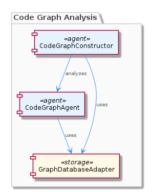
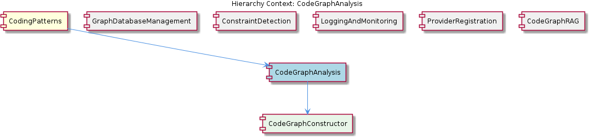

# CodeGraphAnalysis

**Type:** SubComponent

The CodeGraphConstructor in integrations/mcp-server-semantic-analysis/src/agent/code-graph-agent.ts relies on the GraphDatabaseAdapter for constructing and analyzing code graphs.

## What It Is  

**CodeGraphAnalysis** is the sub‑component that lives inside the **CodingPatterns** parent (see the hierarchy note). Its core implementation resides in the file  

```
integrations/mcp-server-semantic-analysis/src/agent/code-graph-agent.ts
```  

where two tightly‑coupled classes – **CodeGraphConstructor** and **CodeGraphAgent** – work together to build a graph representation of a codebase and then extract structural insights from that graph. Both classes depend on the **GraphDatabaseAdapter** (implemented in `storage/graph-database-adapter.ts`) for persisting and querying the graph data. In short, CodeGraphAnalysis is the orchestration layer that turns raw source code into a navigable graph and then analyses that graph to surface relationships, dependencies, and other architectural signals.



---

## Architecture and Design  

The architecture follows a **layered, adapter‑centric** approach. The lowest layer is the **GraphDatabaseAdapter**, an adapter that hides the details of the underlying graph store (Graphology + LevelDB). Above it sits **CodeGraphConstructor**, which is responsible for translating source‑code artefacts into graph nodes and edges. Finally, **CodeGraphAgent** consumes the constructed graph and runs analysis routines that surface insights such as call‑graphs, module dependencies, and inheritance hierarchies.

The observations repeatedly stress that **CodeGraphConstructor** and **CodeGraphAgent** are *tightly coupled*. This coupling is intentional: the constructor creates the graph and immediately hands it to the agent for analysis, minimizing the latency between data creation and consumption. The design therefore leans on **co‑location** of construction and analysis logic to achieve efficiency, rather than a loosely‑coupled, asynchronous pipeline.

The use of the **GraphDatabaseAdapter** is an explicit **Adapter pattern**: the rest of the CodeGraphAnalysis code never talks directly to Graphology or LevelDB; it talks to the adapter’s clean API (`createGraph`, `readGraph`, `updateNode`, etc.). This isolates the graph‑persistence technology from the higher‑level analysis logic, making it easier to swap the storage backend if needed.

Sibling components such as **GraphDatabaseManagement** also rely on the same adapter, reinforcing a shared‑service model within the **CodingPatterns** ecosystem. This shared dependency creates a natural boundary for responsibilities: GraphDatabaseManagement handles generic CRUD and lifecycle concerns, while CodeGraphAnalysis focuses on domain‑specific graph construction and analysis.



---

## Implementation Details  

### CodeGraphConstructor (in `code-graph-agent.ts`)  
- **Responsibility:** Walks the source code (ASTs, file system metadata, etc.) and populates a graph structure via the **GraphDatabaseAdapter**.  
- **Key Interaction:** Calls methods such as `adapter.createNode(...)`, `adapter.createEdge(...)`, and `adapter.commit()` to persist the graph.  
- **Tight Coupling:** Once the graph is persisted, the constructor immediately invokes the **CodeGraphAgent**’s analysis entry point, passing the graph identifier or a direct reference.

### CodeGraphAgent (in `code-graph-agent.ts`)  
- **Responsibility:** Provides a public method (e.g., `analyzeGraph(graphId)`) that retrieves the graph from the adapter and runs a suite of analytical algorithms – traversals, pattern detection, and metric calculations.  
- **Output:** Returns structured insights (JSON, DTOs) that downstream components like **CodeGraphRAG** can consume for retrieval‑augmented generation.

### GraphDatabaseAdapter (in `storage/graph-database-adapter.ts`)  
- **Implementation:** Wraps Graphology’s in‑memory graph model and LevelDB’s on‑disk persistence. Exposes a thin CRUD surface that both **CodeGraphConstructor** and **CodeGraphAgent** rely on.  
- **Design Choice:** Centralizing persistence logic here avoids duplication across siblings (e.g., **GraphDatabaseManagement**) and enforces a single source of truth for graph state.

The flow is therefore: **Source → CodeGraphConstructor → GraphDatabaseAdapter (persist) → CodeGraphAgent (analyze) → Insight payload**.

---

## Integration Points  

1. **GraphDatabaseAdapter** – The sole persistence interface. Any change to the underlying storage (e.g., moving from LevelDB to a cloud graph DB) must be confined to this adapter. Both **CodeGraphAnalysis** and the sibling **GraphDatabaseManagement** component depend on it.  

2. **CodingPatterns (Parent)** – Provides the broader context of code‑pattern detection. CodeGraphAnalysis supplies the graph‑level view that other pattern detectors may query.  

3. **CodeGraphRAG (Sibling)** – Consumes the analysis output to feed a Retrieval‑Augmented Generation pipeline for code‑related queries. The contract is the insight payload emitted by **CodeGraphAgent**.  

4. **ProviderRegistration** – While not directly referenced in the observations, the overall system uses a **ProviderRegistry** to expose the analysis service to other runtime components. The registration likely occurs during application bootstrap, making **CodeGraphAnalysis** discoverable by external callers.  

5. **LoggingAndMonitoring** – The analysis pipeline benefits from async log buffering; any long‑running traversal in **CodeGraphAgent** should emit logs through the shared logging subsystem.

---

## Usage Guidelines  

- **Initialize the GraphDatabaseAdapter first.** All construction and analysis calls assume a ready adapter; attempting to construct a graph before the adapter is opened will raise runtime errors.  

- **Treat CodeGraphConstructor and CodeGraphAgent as a single logical unit.** Because they are tightly coupled, developers should not instantiate one without the other. The recommended entry point is a façade method (e.g., `runFullAnalysis(sourcePath)`) that internally creates the constructor, builds the graph, and then triggers the agent.  

- **Avoid direct GraphDatabaseAdapter calls from outside CodeGraphAnalysis.** The adapter is a shared resource; external mutations can corrupt the graph state expected by the agent. Use the provided high‑level APIs.  

- **Handle large codebases incrementally.** The current implementation persists the graph after each major construction step; for very large repositories, consider batching node/edge creation to stay within LevelDB write limits.  

- **Leverage sibling components for cross‑concern tasks.** For constraint checks, invoke **ConstraintDetection** after the analysis completes. For logging, rely on the **LoggingAndMonitoring** subsystem to capture performance metrics of the analysis run.

---

### Summary of Requested Deliverables  

1. **Architectural patterns identified** – Adapter pattern (GraphDatabaseAdapter), layered construction‑analysis pipeline, tight coupling for performance.  
2. **Design decisions and trade‑offs** – Tight coupling between constructor and agent yields low latency but reduces independent reuse; central GraphDatabaseAdapter isolates storage concerns but creates a single point of failure.  
3. **System structure insights** – CodeGraphAnalysis sits under CodingPatterns, shares the GraphDatabaseAdapter with GraphDatabaseManagement, and feeds downstream components like CodeGraphRAG.  
4. **Scalability considerations** – Persistence via LevelDB is efficient for moderate graph sizes; for massive codebases, batching and potential backend swap (thanks to the adapter) are needed. Tight coupling may limit horizontal scaling; a future decoupled, message‑driven pipeline could improve throughput.  
5. **Maintainability assessment** – Clear separation of persistence (adapter) and domain logic (constructor/agent) aids maintainability. However, the tight coupling increases the surface area for changes; any modification to the graph schema must be coordinated across both classes. Shared usage of the adapter by siblings encourages consistency but also requires careful versioning.


## Hierarchy Context

### Parent
- [CodingPatterns](./CodingPatterns.md) -- [LLM] The CodingPatterns component's architecture is heavily influenced by the GraphDatabaseAdapter class in storage/graph-database-adapter.ts, which provides methods for creating, reading, and manipulating graph data. This class utilizes Graphology and LevelDB for persistence, ensuring efficient data storage and retrieval. The CodeGraphConstructor sub-component, as seen in integrations/mcp-server-semantic-analysis/src/agent/code-graph-agent.ts, relies on the GraphDatabaseAdapter for constructing and analyzing code graphs. This tightly coupled relationship between the GraphDatabaseAdapter and CodeGraphConstructor enables the efficient creation and analysis of code graphs.

### Children
- [CodeGraphConstructor](./CodeGraphConstructor.md) -- The CodeGraphConstructor relies on the GraphDatabaseAdapter, as indicated by its presence in the integrations/mcp-server-semantic-analysis/src/agent/code-graph-agent.ts file, highlighting the importance of database adaptation in code graph analysis.

### Siblings
- [GraphDatabaseManagement](./GraphDatabaseManagement.md) -- GraphDatabaseAdapter in storage/graph-database-adapter.ts utilizes Graphology and LevelDB for persistence, ensuring efficient data storage and retrieval.
- [ConstraintDetection](./ConstraintDetection.md) -- The ConstraintDetection sub-component uses the execute(input, context) pattern for detecting and monitoring constraints.
- [LoggingAndMonitoring](./LoggingAndMonitoring.md) -- The LoggingAndMonitoring sub-component uses async log buffering and flushing for logging and monitoring.
- [ProviderRegistration](./ProviderRegistration.md) -- The ProviderRegistration sub-component uses the ProviderRegistry class for registering new providers.
- [CodeGraphRAG](./CodeGraphRAG.md) -- The CodeGraphRAG sub-component is a graph-based RAG system for any codebases, as seen in integrations/code-graph-rag/README.md.


---

*Generated from 7 observations*
