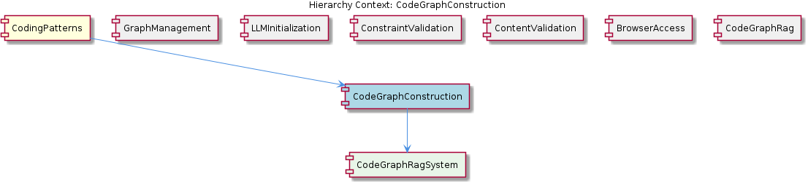

# CodeGraphConstruction

**Type:** SubComponent

CodeGraphConstruction pre-populates ontology metadata fields in integrations/copi/docs/STATUS-LINE-QUICK-REFERENCE.md to prevent redundant LLM re-classification

## What It Is  

**CodeGraphConstruction** is the sub‑component that builds and queries the *code‑knowledge graph* used throughout the KnowledgeManagement suite. The core logic lives in the **integrations/code-graph-rag/** directory – the high‑level overview is in `integrations/code-graph-rag/README.md`, the Claude‑specific setup instructions are in `integrations/code-graph-rag/docs/claude-code-setup.md`, and the contribution guidelines that describe the graph‑based Retrieval‑Augmented Generation (RAG) workflow are in `integrations/code-graph-rag/CONTRIBUTING.md`.  

Within the broader KnowledgeManagement component, CodeGraphConstruction supplies the *graph construction* and *semantic query* capabilities that other siblings (e.g., **OnlineLearning** and **BrowserAccess**) rely on to surface code‑level context. Its child, **CodeGraphRagIntegration**, encapsulates the concrete integration steps defined in the same `code‑graph‑rag` folder, acting as the bridge between the raw source repository and the graph database.

---

## Architecture and Design  

The architecture of CodeGraphConstruction is a **graph‑centric RAG pipeline** that stitches together several well‑defined patterns:

1. **Graph‑Based Retrieval‑Augmented Generation** – The component treats the codebase as a graph of entities (functions, classes, modules) and relationships (calls, imports, inheritance). This model is described in `integrations/code-graph-rag/README.md` and formalised in the contribution guide (`CONTRIBUTING.md`).  

2. **DAG‑Based Execution Model** – Constraint monitoring and semantic validation are orchestrated as a directed acyclic graph (DAG). The topological‑sort algorithm that guarantees correct ordering is documented in `integrations/mcp-constraint-monitor/docs/constraint-configuration.md`.  

3. **Work‑Stealing Concurrency** – Parallel processing of large code repositories is achieved via a shared `nextIndex` counter, a classic work‑stealing technique outlined in `integrations/copi/scripts/README.md`. This allows multiple workers to dynamically claim the next file or AST node to process, keeping CPU cores busy without a central scheduler.  

4. **Ontology Metadata Pre‑Population** – To avoid redundant LLM classification, the system pre‑populates ontology fields (e.g., entity type, language, ownership) as described in `integrations/copi/docs/STATUS-LINE-QUICK-REFERENCE.md`. This caching layer reduces the number of calls to the Claude model and speeds up graph enrichment.  

5. **Lazy LLM Provider Initialization** – Inherited from the parent KnowledgeManagement component, the Claude client is instantiated only when the first code‑analysis request arrives, conserving resources until needed.  

Interaction flow: source files are scanned concurrently (work‑stealing), each file’s AST is enriched with pre‑populated ontology metadata, then the enriched nodes are inserted into the Graphology+LevelDB store (parent’s persistence layer). Constraint monitors consume the DAG‑ordered updates to detect semantic violations (`semantic-constraint-detection.md`). Query requests from siblings such as **OnlineLearning** or **BrowserAccess** traverse the graph, optionally invoking Claude via the setup described in `claude-code-setup.md` for disambiguation or generation of natural‑language explanations.

---

## Implementation Details  

* **Concurrency Engine** – The `README.md` under `integrations/copi/scripts/` explains that a global atomic integer `nextIndex` is shared among worker threads. Each worker atomically increments the counter, fetches the corresponding file path from a pre‑computed list, and processes it. This design eliminates a master‑worker bottleneck and scales linearly with the number of CPU cores.

* **Ontology Pre‑Population** – The quick‑reference document (`STATUS-LINE-QUICK-REFERENCE.md`) lists the mandatory metadata fields (e.g., `entity_id`, `entity_kind`, `language`, `status_line`). When a file is first parsed, these fields are filled using static heuristics (file extension, naming conventions) before any LLM call. The enriched node is then stored, ensuring downstream stages (graph insertion, constraint checks) have immediate access to classification data.

* **Graph Construction** – The `README.md` in `code-graph-rag` defines the high‑level pipeline:  
  1. **Parsing** – Source files are parsed into ASTs.  
  2. **Node Extraction** – Functions, classes, and modules become graph nodes.  
  3. **Edge Derivation** – Call‑graph edges, import edges, and inheritance edges are derived.  
  4. **RAG Indexing** – Textual fragments (docstrings, comments) are indexed for retrieval using Claude embeddings (setup in `claude-code-setup.md`).  

  The contribution guide (`CONTRIBUTING.md`) specifies that new language parsers must expose a `parse(filePath): AST` function and a `extractEntities(ast): Node[]` function, adhering to the same interface used by existing Python and TypeScript parsers.

* **Constraint Monitoring** – The DAG described in `constraint-configuration.md` encodes dependencies between constraint checks (e.g., “no circular imports” must run after “module existence”). The semantic detection logic (`semantic-constraint-detection.md`) runs as a separate pass over the graph, flagging violations and writing them back into the ontology metadata for later reporting.

* **Claude Integration** – The `claude-code-setup.md` file details environment variables (`CLAUDE_API_KEY`, `CLAUDE_ENDPOINT`) and the lazy‑init wrapper class `ClaudeClient`. The client is only instantiated when a node lacks sufficient static metadata, at which point a prompt containing the code snippet and ontology context is sent to Claude, and the returned classification is merged back into the node.

---

## Integration Points  

* **Parent – KnowledgeManagement** – CodeGraphConstruction relies on the parent’s Graphology+LevelDB persistence layer for durable storage of the graph. It also inherits the parent’s *adapter* pattern for database interaction, allowing the same storage code to be reused by other siblings (e.g., **EntityPersistence**).  

* **Sibling – OnlineLearning** – Both OnlineLearning and CodeGraphConstruction read from `integrations/code-graph-rag/README.md`; OnlineLearning uses the constructed graph to feed learning‑to‑action pipelines, while CodeGraphConstruction focuses on the initial build and update cycles.  

* **Sibling – BrowserAccess** – BrowserAccess queries the same graph via a JSON‑export sync feature described in the parent component, enabling UI‑level exploration of code entities.  

* **Child – CodeGraphRagIntegration** – This child component implements the concrete steps outlined in the `code-graph-rag` documentation (parsers, embedding generation, node/edge creation). It exposes a public API `buildGraph(sourceRoot: string): Promise<void>` that CodeGraphConstruction calls during its initialization phase.  

* **Constraint Monitor (MCP‑Constraint‑Monitor)** – The DAG execution model and semantic detection files (`constraint-configuration.md`, `semantic-constraint-detection.md`) are imported as a validation layer. After each graph mutation, CodeGraphConstruction triggers the constraint monitor to ensure the graph remains semantically consistent.  

* **Claude LLM** – The Claude client defined in `claude-code-setup.md` is an external dependency. Its lazy initialization means that any component that needs LLM‑enhanced classification can request it through a shared service locator provided by KnowledgeManagement.

---

## Usage Guidelines  

1. **Initialize the Graph Once** – Call the child integration’s `buildGraph` method at application start‑up. Because the graph is persisted in LevelDB, subsequent runs should invoke the *incremental update* path (`updateGraph(changedFiles: string[])`) rather than rebuilding from scratch.  

2. **Respect the Work‑Stealing Contract** – When adding custom parsers or workers, ensure they read and increment the shared `nextIndex` atomically. Do not introduce separate counters, as this would break the load‑balancing guarantees described in `integrations/copi/scripts/README.md`.  

3. **Populate Ontology Early** – Before invoking Claude, fill all static metadata fields listed in `STATUS-LINE-QUICK-REFERENCE.md`. This reduces LLM traffic and keeps latency low.  

4. **Follow the DAG Ordering** – When extending constraint checks, add new nodes to the DAG definition in `constraint-configuration.md` and declare their dependencies explicitly. The topological sort will enforce correct execution order.  

5. **Handle Claude Failures Gracefully** – The lazy client may raise network or rate‑limit errors. Wrap any call to Claude in a retry‑with‑backoff block and fall back to a “unknown” classification that can be revisited later.  

6. **Version the Graph Schema** – Since the graph schema evolves with new entity types, store a version identifier in the LevelDB metadata bucket. On startup, verify compatibility and run migration scripts if needed.

---

### Architectural Patterns Identified  

1. **Graph‑Based Retrieval‑Augmented Generation (RAG)** – Core knowledge representation and query mechanism.  
2. **Directed Acyclic Graph (DAG) Execution with Topological Sort** – Guarantees deterministic ordering of constraint checks.  
3. **Work‑Stealing Concurrency** – Dynamic load distribution via a shared `nextIndex` counter.  
4. **Metadata Caching / Pre‑Population** – Reduces LLM calls by storing ontology fields up‑front.  
5. **Lazy Initialization (LLM Provider)** – Defers costly client creation until required.  
6. **Adapter Pattern for Persistence** – Abstracts Graphology+LevelDB behind a uniform storage interface.

### Design Decisions and Trade‑offs  

| Decision | Rationale | Trade‑off |
|----------|-----------|-----------|
| Use a single shared `nextIndex` for work stealing | Simple, lock‑free coordination across many workers | Requires atomic operations; potential contention at extreme scale |
| Pre‑populate ontology metadata | Cuts down on expensive Claude calls, improves latency | Increases upfront parsing complexity; static heuristics may misclassify rare cases |
| DAG for constraint monitoring | Guarantees that dependent checks run in correct order | Adds maintenance overhead when new constraints are introduced |
| Lazy Claude client init | Saves resources when graph building does not need LLM assistance | First request incurs initialization latency |
| Graphology + LevelDB persistence | Fast key‑value store with graph‑friendly API | Limited query expressiveness compared to a full graph DB (e.g., Neo4j) |

### System Structure Insights  

* **Layered Organization** – The sub‑component sits between the raw source scanner (work‑stealing workers) and the persistent graph layer (parent adapters). Above it, the KnowledgeManagement component provides cross‑cutting services (LLM provider, storage adapters).  
* **Clear Separation of Concerns** – Parsing, metadata enrichment, graph insertion, and constraint validation are each encapsulated in distinct documentation files and, by implication, separate code modules.  
* **Extensibility via Child Integration** – New language parsers or embedding models can be added by extending **CodeGraphRagIntegration** without touching the concurrency or constraint logic.

### Scalability Considerations  

* **Horizontal Scaling** – Work‑stealing allows the system to add more worker threads (or processes) to handle larger codebases. Because each worker only needs read access to the file list and atomic increment of `nextIndex`, scaling is near‑linear until memory bandwidth becomes a bottleneck.  
* **LLM Load Management** – Pre‑populating ontology fields and lazy client init keep Claude usage proportional to the amount of *ambiguous* code, preventing runaway API costs as the repository grows.  
* **Constraint DAG Parallelism** – Independent sub‑graphs of the DAG can be evaluated concurrently, further improving throughput on multi‑core machines.  

### Maintainability Assessment  

The component is **highly maintainable** due to:  

* **Explicit Documentation** – Every major mechanism (graph construction, concurrency, constraint monitoring, LLM setup) is described in its own README or markdown file, making onboarding straightforward.  
* **Modular Interfaces** – The child **CodeGraphRagIntegration** defines clear entry points (`buildGraph`, `updateGraph`) that hide internal complexity from callers.  
* **Reuse of Parent Patterns** – Leveraging the parent’s adapter and lazy‑init patterns reduces duplicated code and aligns with the overall system’s design language.  
* **Deterministic Constraint Evaluation** – The DAG with topological sort ensures that adding or reordering constraints does not introduce subtle bugs, aiding future extensions.  

Potential maintainability risks include the reliance on atomic counters for work stealing (which may require careful testing on non‑x86 architectures) and the need to keep the ontology metadata schema in sync with any new LLM‑driven classifications. Regular schema version checks and migration scripts mitigate these risks.

## Diagrams

### Relationship

## Architecture Diagrams

## Hierarchy Context

### Parent
- [KnowledgeManagement](./KnowledgeManagement.md) -- The KnowledgeManagement component is responsible for managing the knowledge graph, which includes storing, querying, and updating entities and relationships. It utilizes a Graphology+LevelDB database for persistence and provides a JSON export sync feature. The component's architecture is designed to handle concurrent access and provides an intelligent routing mechanism for storing and retrieving data. Key patterns include the use of adapters for database interactions, lazy initialization of LLM (Large Language Model) providers, and work-stealing concurrency for efficient data processing.

### Children
- [CodeGraphRagIntegration](./CodeGraphRagIntegration.md) -- The integrations/code-graph-rag/README.md file provides an overview of the Graph-Code system, a graph-based RAG system for any codebases, which is utilized by the CodeGraphConstruction sub-component.

### Siblings
- [ManualLearning](./ManualLearning.md) -- ManualLearning uses integrations/copi/README.md to handle logging and tmux integration for manual learning processes
- [OnlineLearning](./OnlineLearning.md) -- OnlineLearning uses integrations/code-graph-rag/README.md to construct and query the code knowledge graph
- [EntityPersistence](./EntityPersistence.md) -- EntityPersistence uses integrations/copi/README.md to handle logging and tmux integration for entity persistence
- [UKBTraceReporting](./UKBTraceReporting.md) -- UKBTraceReporting uses integrations/copi/README.md to handle logging and tmux integration for trace reporting
- [BrowserAccess](./BrowserAccess.md) -- BrowserAccess uses integrations/browser-access/README.md to handle browser access to the knowledge graph

---

*Generated from 7 observations*
