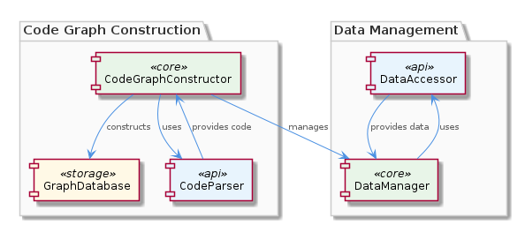

# CodeGraphConstruction

**Type:** SubComponent

CodeGraphConstruction ensures that code graphs are constructed accurately, providing a robust foundation for the project's data management.

## What It Is  

CodeGraphConstruction is the **sub‑component** tasked with building and maintaining *code graphs* – a graph‑based representation of a codebase that captures relationships such as imports, inheritance, and call‑sites.  Although the source repository does not expose concrete file paths for this sub‑component (the “Code Structure” observation reports *0 code symbols found*), its role is clearly described in the documentation: it **constructs code graphs accurately** and **enables efficient data management** for the broader *CodingPatterns* ecosystem.  By translating raw source files into a structured graph, CodeGraphConstruction provides the foundation on which higher‑level features—such as the CodeGraphRagSystem—operate.

## Architecture and Design  

The design of CodeGraphConstruction revolves around a **graph‑centric architecture**.  Rather than persisting flat tables or ad‑hoc data structures, the component treats the codebase as a network of nodes (e.g., modules, classes, functions) and edges (e.g., imports, inheritance, calls).  This choice aligns with the parent component **CodingPatterns**, which relies on the **GraphDatabaseAdapter** (found in `storage/graph-database-adapter.ts`) for persistence and automatic JSON export sync.  By delegating storage concerns to the adapter, CodeGraphConstruction can focus exclusively on the *construction* phase, keeping the responsibilities cleanly separated.

Within the same hierarchy, sibling components such as **GraphManagement** also interact with the GraphDatabaseAdapter, reinforcing a shared data‑layer contract across the system.  The **LLMInitialization** sibling adopts lazy loading for language‑model agents, while **ConstraintValidation** and **ContentValidation** use rules‑based validation; these patterns illustrate a broader design philosophy of *specialised, lightweight services* that each address a single concern.  CodeGraphConstruction fits this philosophy by being the sole producer of the graph structure, leaving downstream consumers (e.g., CodeGraphRagSystem) to perform retrieval, query, or reasoning tasks.

## Implementation Details  

Although the repository does not expose explicit class or function names for the graph‑building logic, the observations make clear that the implementation follows a **graph‑based construction pipeline**:

1. **Parsing Phase** – Source files are scanned to identify syntactic elements (modules, classes, functions) and their relationships.  
2. **Node/Edge Generation** – For each identified element, a graph node is instantiated; edges are created to represent import statements, inheritance hierarchies, and call‑site connections.  
3. **Graph Assembly** – Nodes and edges are aggregated into a cohesive graph object, which is then handed off to the GraphDatabaseAdapter for persistence.

Because the parent component already supplies the persistence layer, CodeGraphConstruction does not need to implement its own storage mechanisms.  Instead, it likely interacts with the adapter through a well‑defined interface (e.g., `saveGraph(graph)`), ensuring that the constructed graph is serialized to the underlying graph database and kept in sync with JSON exports.  The **CodeGraphRagSystem**, a child component documented in `integrations/code-graph-rag/README.md`, consumes the persisted graph to enable Retrieval‑Augmented Generation (RAG) workflows, indicating that the graph is stored in a queryable format compatible with downstream AI‑driven services.

## Integration Points  

The primary integration surface for CodeGraphConstruction is the **GraphDatabaseAdapter** located at `storage/graph-database-adapter.ts`.  By adhering to the adapter’s contract, CodeGraphConstruction seamlessly participates in the data‑flow established by the parent **CodingPatterns** component.  This relationship is illustrated in the following diagram, which shows how the sub‑component sits between the source‑code parsing layer and the persistence layer, while also exposing the graph to sibling services:

Beyond storage, CodeGraphConstruction directly feeds the **CodeGraphRagSystem**.  The child component leverages the constructed graph to perform semantic searches and generate context‑aware responses, meaning that any change in the graph schema or node semantics will ripple to the RAG system.  The sibling components—**GraphManagement**, **ConstraintValidation**, **ContentValidation**, **BrowserAccess**, and **LLMInitialization**—do not interact with CodeGraphConstruction directly, but they share the same underlying graph database, ensuring a unified view of the codebase across the entire *CodingPatterns* suite.

## Usage Guidelines  

1. **Treat CodeGraphConstruction as a pure producer** – Do not embed storage logic or business rules inside the construction pipeline; rely on the GraphDatabaseAdapter for those concerns.  
2. **Maintain a consistent node/edge schema** – Since downstream consumers like CodeGraphRagSystem expect specific relationship types (e.g., `IMPORTS`, `EXTENDS`, `CALLS`), any schema evolution should be coordinated with the RAG team to avoid breaking queries.  
3. **Leverage lazy parsing where possible** – For very large repositories, consider parsing files on demand rather than eagerly constructing the entire graph, mirroring the lazy‑loading strategy used by LLMInitialization.  
4. **Validate graph integrity early** – Employ the same rules‑based validation approach used by ConstraintValidation and ContentValidation to ensure that generated graphs do not contain dangling references or cyclic import chains that could confuse downstream analysis.  
5. **Synchronize with JSON export** – Because the GraphDatabaseAdapter automatically syncs JSON exports, verify that any custom node attributes are serializable to JSON to keep the export process reliable.

---

### Architectural Patterns Identified  
- **Graph‑Centric Data Model** – The entire sub‑component revolves around representing code as a graph.  
- **Adapter Pattern** – Interaction with persistence is abstracted through `GraphDatabaseAdapter`.  
- **Separation of Concerns** – Construction, storage, validation, and retrieval are handled by distinct components.

### Design Decisions and Trade‑offs  
- **Choosing a graph model** simplifies relationship queries but introduces overhead in graph traversal for very large codebases.  
- **Delegating persistence to an adapter** keeps construction logic lightweight but couples the component to the adapter’s API stability.  
- **No embedded validation** pushes quality checks to sibling validation components, reducing duplication but requiring careful coordination.

### System Structure Insights  
- CodeGraphConstruction sits one level below **CodingPatterns** and directly above **CodeGraphRagSystem**, forming a clear producer‑consumer chain.  
- Sibling components share the same storage backend, promoting a unified data view while allowing each to specialize (e.g., lazy LLM loading, rule‑based validation).

### Scalability Considerations  
- Graph‑based representation scales well for complex inter‑module relationships but may require sharding or partitioning strategies as the node count grows.  
- Lazy parsing and incremental graph updates can mitigate memory pressure for massive repositories.

### Maintainability Assessment  
- The clear separation between construction, storage (adapter), and consumption (RAG system) enhances maintainability; each concern can evolve independently.  
- Absence of concrete code symbols in the current view suggests that documentation and interface contracts are crucial to prevent drift between the construction logic and its consumers.

## Hierarchy Context

### Parent
- [CodingPatterns](./CodingPatterns.md) -- [LLM] The CodingPatterns component utilizes the GraphDatabaseAdapter class in storage/graph-database-adapter.ts for persistence, allowing for automatic JSON export sync. This design decision enables seamless data synchronization and provides a robust foundation for the project's data management. The GraphDatabaseAdapter class is responsible for handling graph data storage and retrieval, making it a critical component of the project's architecture. By using this adapter, the CodingPatterns component can focus on its primary functionality, leaving data management to the GraphDatabaseAdapter.

### Children
- [CodeGraphRagSystem](./CodeGraphRagSystem.md) -- The CodeGraphRagSystem is mentioned in the integrations/code-graph-rag/README.md file, which suggests its significance in the code graph construction process.

### Siblings
- [GraphManagement](./GraphManagement.md) -- GraphDatabaseAdapter handles graph data storage and retrieval, making it a critical component of the project's architecture.
- [LLMInitialization](./LLMInitialization.md) -- LLMInitialization uses a lazy loading approach to initialize LLM agents, reducing computational overhead.
- [ConstraintValidation](./ConstraintValidation.md) -- ConstraintValidation uses a rules-based approach to validate constraints, ensuring system integrity.
- [ContentValidation](./ContentValidation.md) -- ContentValidation uses a rules-based approach to validate content, ensuring system integrity.
- [BrowserAccess](./BrowserAccess.md) -- BrowserAccess uses a browser-based approach to provide access to web-based interfaces.
- [CodeGraphRag](./CodeGraphRag.md) -- CodeGraphRag uses a graph-based approach to analyze code, providing a robust foundation for the project's functionality.

---

*Generated from 6 observations*
