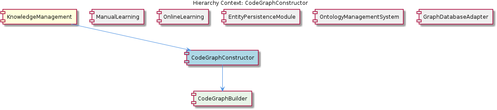

# CodeGraphConstructor

**Type:** SubComponent

The CodeGraphConstructor uses the GraphDatabaseAdapter in storage/graph-database-adapter.js for storing and retrieving code entities and their relationships.

## What It Is  

The **CodeGraphConstructor** lives inside the *SemanticAnalysis* sub‑tree and is the engine that turns a raw codebase into a structured knowledge graph. All of its source lives in the same repository as the other semantic‑analysis agents, but the observations do not list a concrete file path for the constructor itself; the surrounding context makes clear that it is tightly coupled with two concrete modules:

* **GraphDatabaseAdapter** – `storage/graph-database-adapter.js`  
* **LLMService** – `lib/llm/dist/index.js`  

The constructor pulls code entities (functions, classes, modules, etc.), resolves their types and relationships, validates each entity against the shared ontology, and finally persists the resulting graph through the adapter. It also delegates classification work to the **OntologyClassificationAgent** (`integrations/mcp-server-semantic-analysis/src/agents/ontology-classification-agent.ts`). In short, it is the “builder” that creates the **knowledge graph of code entities** for the broader *SemanticAnalysis* component.

---

## Architecture and Design  

### Modular, Agent‑Driven Architecture  
The surrounding *SemanticAnalysis* component is described as a modular system of agents, each responsible for a specific concern (ontology classification, semantic analysis, content validation). The **CodeGraphConstructor** fits this model as the “graph‑building” agent. Its responsibilities are cleanly separated from storage (handled by the **GraphDatabaseAdapter**) and from large‑language‑model operations (handled by **LLMService**). This separation follows a **Separation‑of‑Concerns** pattern and makes the constructor a thin orchestration layer rather than a monolith.

### Adapter Pattern for Persistence  
All interactions with the underlying graph database go through `storage/graph-database-adapter.js`. By abstracting the database behind an adapter, the system can swap the concrete graph store (Neo4j, JanusGraph, etc.) without touching the constructor logic. This is a classic **Adapter** pattern that decouples the business logic (graph construction) from the infrastructure.

### Service / Agent Collaboration  
* **LLMService** (`lib/llm/dist/index.js`) is used for two distinct purposes:  
  1. **Validation** – the constructor asks the LLM to confirm that a discovered code entity conforms to the ontology.  
  2. **Classification** – the **OntologyClassificationAgent** is invoked to map entities to ontology concepts.  

The collaboration is reminiscent of a **Facade** where the constructor presents a higher‑level API that internally coordinates the LLM service and the classification agent. No evidence of event‑driven messaging or micro‑service boundaries is present; the interactions are direct function calls.

### Knowledge‑Graph Construction Workflow  
The observations outline a clear pipeline:

1. **Discovery** – code entities are identified (outside the scope of the observations).  
2. **Type & Relationship Resolution** – the constructor determines each entity’s type and how it links to others.  
3. **Ontology Validation** – the LLM validates entities against the ontology.  
4. **Classification** – the **OntologyClassificationAgent** classifies entities.  
5. **Persistence** – the fully‑formed graph is stored via the **GraphDatabaseAdapter**.

This workflow reflects a **Pipeline** pattern (similar to the sibling *Pipeline* component) but is encapsulated within a single class rather than a series of independent stages.

---

## Implementation Details  

### Core Collaborators  

| Collaborator | Path | Role in CodeGraphConstructor |
|--------------|------|------------------------------|
| **GraphDatabaseAdapter** | `storage/graph-database-adapter.js` | Provides `saveNode`, `saveRelationship`, `query`‑style methods that the constructor calls to persist entities and edges. |
| **LLMService** | `lib/llm/dist/index.js` | Exposes methods such as `validateAgainstOntology(text)` and possibly `generateClassificationPrompt(entity)`. The constructor invokes these to leverage LLM reasoning. |
| **OntologyClassificationAgent** | `integrations/mcp-server-semantic-analysis/src/agents/ontology-classification-agent.ts` | Implements `classify(entity)`; the constructor passes a code entity and receives an ontology label. |

### Mechanism for Resolving Types & Relationships  

While the exact functions are not listed, the observations state that the constructor “implements a mechanism for resolving code entity types and their relationships.” This likely involves:

* **Static analysis** of the AST to extract signatures, inheritance, imports/exports, and call graphs.  
* **Mapping** of raw AST nodes to internal **entity objects** (e.g., `{ id, name, kind, filePath }`).  
* **Relationship creation** where edges such as *CALLS*, *EXTENDS*, *IMPORTS* are generated based on the analysis results.

### Validation & Classification Flow  

1. **Entity → LLM Validation**  
   ```js
   const isValid = LLMService.validateAgainstOntology(entityDescription);
   if (!isValid) { /* handle mismatch */ }
   ```
2. **Entity → OntologyClassificationAgent**  
   ```js
   const ontologyLabel = OntologyClassificationAgent.classify(entity);
   entity.ontology = ontologyLabel;
   ```
3. **Persist**  
   ```js
   GraphDatabaseAdapter.saveNode(entity);
   relationships.forEach(rel => GraphDatabaseAdapter.saveRelationship(rel));
   ```

All three steps are orchestrated inside the constructor’s main method (e.g., `buildGraph(codeBase)`), which loops over discovered entities, performs the above steps, and finally commits the graph.

### Interaction with Siblings  

* The **Pipeline** sibling also uses the same `GraphDatabaseAdapter`, meaning that any schema or transaction conventions defined there are shared.  
* The **Insights** sibling consumes the same `LLMService` for pattern extraction, indicating that the LLM service is a singleton‑like utility across the semantic analysis domain.  
* The **LLMController** provides an HTTP or RPC façade for the LLM service; the constructor likely calls the same underlying library, keeping the call path consistent.

---

## Integration Points  

1. **Parent – SemanticAnalysis**  
   The *SemanticAnalysis* component aggregates several agents, including the **CodeGraphConstructor**. It likely calls a public method such as `semanticAnalysis.run(codeBase)` which internally triggers the graph construction step. The parent supplies the raw codebase and may handle error aggregation across agents.

2. **Sibling – Pipeline**  
   After the graph is stored, the *Pipeline* component can retrieve it via the same `GraphDatabaseAdapter` for downstream processing (e.g., exporting to other services, running analytics). Because both use the same adapter, they share transaction boundaries and data models.

3. **Sibling – Ontology / Insights / LLMController**  
   These components also depend on `LLMService`. Any configuration change (model version, temperature, API keys) applied to the LLM service will affect validation, classification, and insight generation uniformly.

4. **External – Graph Database**  
   The adapter abstracts the concrete graph store. The constructor never talks directly to the database; it only knows the adapter’s API. This makes the constructor testable with a mock adapter.

5. **External – LLM Provider**  
   The LLM service wraps the actual LLM provider (OpenAI, Anthropic, etc.). The constructor’s reliance on `validateAgainstOntology` and classification prompts means that any change in the provider’s response format will require updates only in `lib/llm/dist/index.js`, not in the constructor.

---

## Usage Guidelines  

* **Instantiate via the SemanticAnalysis façade** – Directly creating a `CodeGraphConstructor` is discouraged because the parent component wires the necessary dependencies (adapter, LLM service, classification agent). Use `SemanticAnalysis.run()` or an equivalent entry point.  
* **Provide a fully parsed codebase** – The constructor expects entities that already have enough syntactic information to resolve types. Supplying raw source strings without prior parsing will lead to incomplete graphs.  
* **Handle LLM latency and failures** – Validation and classification call out to the LLM service, which can be slow or rate‑limited. Implement retry logic or a timeout wrapper around the constructor’s public method, especially in CI pipelines.  
* **Maintain ontology consistency** – Because the constructor validates against the ontology, any change in the ontology schema must be reflected in the prompts used by `LLMService`. Keep the ontology version in sync across `OntologyClassificationAgent` and the LLM validation logic.  
* **Transaction safety** – When persisting many nodes/relationships, batch operations through the `GraphDatabaseAdapter` to avoid partial writes. If the adapter supports transactions, wrap the entire `buildGraph` call in a single transaction.  

---

### Summary of Architectural Insights  

| Item | Observation‑Based Insight |
|------|---------------------------|
| **Architectural patterns identified** | Separation‑of‑Concerns, Adapter (GraphDatabaseAdapter), Facade/Service collaboration (LLMService + OntologyClassificationAgent), Pipeline‑style orchestration within the constructor. |
| **Design decisions and trade‑offs** | *Explicit dependency injection* via parent component improves testability but adds wiring complexity. Using a single LLM service for both validation and classification reduces duplication but couples the constructor to LLM latency. The adapter pattern isolates the graph store but requires the adapter to expose a rich enough API for batch writes. |
| **System structure insights** | CodeGraphConstructor is a core agent under *SemanticAnalysis*, sharing persistence (GraphDatabaseAdapter) with *Pipeline* and LLM utilities with *Insights*, *LLMController*, and *Ontology*. This creates a cohesive “semantic layer” where all agents speak the same language (graph entities, ontology concepts, LLM prompts). |
| **Scalability considerations** | Graph construction scales with the size of the codebase; the main bottlenecks are LLM calls and database writes. Batching LLM validation (e.g., multi‑entity prompts) and using bulk insert APIs in the adapter can mitigate these limits. Horizontal scaling is possible by running multiple constructor instances against disjoint code partitions, provided the adapter supports concurrent writes. |
| **Maintainability assessment** | High maintainability thanks to clear module boundaries: the constructor contains orchestration logic only, while heavy lifting (AST parsing, LLM interaction, DB I/O) lives in dedicated modules. Adding new entity types or relationship kinds mainly requires updates in the type‑resolution logic, without touching persistence or LLM code. The main risk is tight coupling to the LLM prompt format; encapsulating prompts inside `LLMService` mitigates this. |

## Diagrams

### Relationship




### Architecture


## Architecture Diagrams


## Hierarchy Context

### Parent
- [SemanticAnalysis](./SemanticAnalysis.md) -- [LLM] The SemanticAnalysis component employs a modular architecture with various agents, each responsible for a specific task, such as ontology classification, semantic analysis, and content validation. The OntologyClassificationAgent, located in integrations/mcp-server-semantic-analysis/src/agents/ontology-classification-agent.ts, is responsible for classifying observations against the ontology system. This agent utilizes the LLMService, found in lib/llm/dist/index.js, for large language model operations, such as text generation and classification. The GraphDatabaseAdapter, located in storage/graph-database-adapter.js, is used for interacting with the graph database, which stores knowledge entities and their relationships.

### Siblings
- [Pipeline](./Pipeline.md) -- The Pipeline uses the GraphDatabaseAdapter in storage/graph-database-adapter.js for storing and retrieving knowledge entities and their relationships.
- [Ontology](./Ontology.md) -- The OntologyClassificationAgent in integrations/mcp-server-semantic-analysis/src/agents/ontology-classification-agent.ts uses the LLMService in lib/llm/dist/index.js for large language model operations.
- [Insights](./Insights.md) -- The Insights sub-component uses the LLMService in lib/llm/dist/index.js for generating insights and pattern catalog extraction.
- [LLMController](./LLMController.md) -- The LLMController uses the LLMService in lib/llm/dist/index.js for large language model operations.
- [GraphDatabaseAdapter](./GraphDatabaseAdapter.md) -- The GraphDatabaseAdapter uses the graph database for storing and retrieving knowledge entities and their relationships.


---

*Generated from 7 observations*
