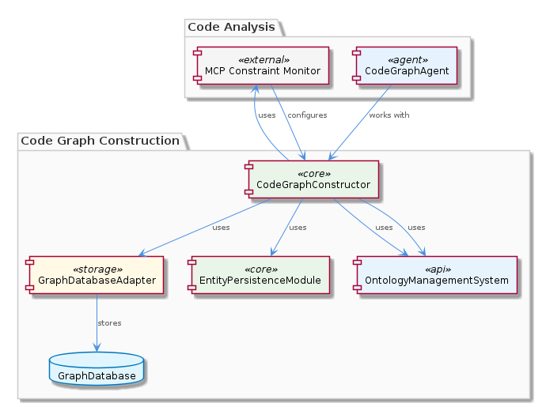

# CodeGraphConstructor

**Type:** SubComponent

CodeGraphConstructor may leverage the automatic JSON export sync feature provided by the GraphDatabaseAdapter to simplify the process of exporting code graph data in JSON format.

## What It Is  

`CodeGraphConstructor` lives inside the **KnowledgeManagement** component and is the core engine that transforms raw code artifacts into a navigable graph representation. The implementation is anchored in the `integrations/code-graph-rag/` directory (e.g., the README and supporting docs such as `claude-code-setup.md`), and its primary public façade is the **CodeGraphBuilder** sub‑component. The constructor does not operate in isolation; it leans on the shared **GraphDatabaseAdapter** (`storage/graph-database-adapter.ts`) for persistence, the **EntityPersistenceModule** for fine‑grained entity handling, and the **OntologyManagementSystem** for semantic classification and inference. Together these pieces enable downstream agents—most notably `integrations/mcp-server-semantic-analysis/src/agents/code‑graph‑agent.ts`—to retrieve and reason over the generated code graph.

The component’s responsibility can be summed up as:  

1. **Parse** source code (or intermediate representations) into nodes and edges.  
2. **Enrich** those nodes using the ontology and classification services.  
3. **Persist** the resulting graph via the GraphDatabaseAdapter, taking advantage of its automatic JSON export sync.  
4. **Expose** the graph for consumption by agents, RAG pipelines, and constraint‑monitoring modules.

---

## Architecture and Design  

`CodeGraphConstructor` follows an **Adapter‑Builder** architectural style. The **GraphDatabaseAdapter** acts as a classic *Adapter* pattern, abstracting the underlying Graphology + LevelDB stack behind a clean API (`saveNode`, `queryEdges`, etc.). This allows the constructor to remain agnostic of storage details while still benefitting from the adapter’s built‑in JSON export synchronization—an explicit design decision highlighted in Observation 3.  

The **Builder** aspect is embodied by the child component **CodeGraphBuilder**, which incrementally assembles the graph. By delegating the step‑wise construction to a dedicated builder, the system isolates parsing logic from persistence concerns, promoting single‑responsibility and easier testing.  

Interaction with siblings such as **EntityPersistenceModule** and **OntologyManagementSystem** follows a *service‑oriented* approach: the constructor calls into these modules via well‑defined interfaces (e.g., `EntityPersistenceModule.persistEntity()` and `OntologyManagementSystem.classifyNode()`). This mirrors the pattern used by the parent **KnowledgeManagement** component, where multiple sub‑systems share the same GraphDatabaseAdapter for consistency across the knowledge graph.

The overall flow can be visualized as a pipeline: source → **CodeGraphBuilder** → enrichment (ontology, entity persistence) → **GraphDatabaseAdapter** → storage & JSON export → consumption by agents (e.g., **CodeGraphAgent**).

---

## Implementation Details  

Although the source tree reports “0 code symbols found,” the surrounding documentation gives a clear picture of the concrete pieces involved.  

* **GraphDatabaseAdapter (`storage/graph-database-adapter.ts`)** – Implements CRUD operations on a Graphology graph backed by LevelDB. It also watches for mutation events and automatically writes a JSON snapshot, which downstream tools (e.g., RAG services) can pull without additional code.  

* **CodeGraphAgent (`integrations/mcp-server-semantic-analysis/src/agents/code-graph-agent.ts`)** – Consumes the persisted graph. It queries the adapter for nodes representing functions, classes, or modules and feeds the results into semantic analysis pipelines.  

* **OntologyManagementSystem** – Provides APIs such as `inferRelations(node)` and `classifyNode(node)`. `CodeGraphConstructor` invokes these during graph enrichment to attach type information, dependency semantics, and higher‑level concepts (e.g., “service”, “utility”).  

* **EntityPersistenceModule** – Handles the lifecycle of individual graph entities. When the builder creates a new node, it hands the raw payload to this module, which may apply validation, versioning, or additional metadata before delegating to the adapter.  

* **Configuration Docs** – The files `integrations/code-graph-rag/docs/claude-code-setup.md` and `integrations/mcp-constraint-monitor/docs/constraint-configuration.md` describe how the constructor is wired into Claude‑based RAG pipelines and constraint‑monitoring workflows. They specify environment variables, JSON schema for constraints, and the entry‑point scripts that instantiate the constructor.  

The constructor’s internal algorithm can be inferred as follows:  

1. **Discovery** – Walk the codebase (Git checkout, LSL session dump, etc.) and emit raw AST nodes.  
2. **Node Creation** – For each AST element, the builder creates a graph node with minimal attributes (name, location).  
3. **Enrichment** – The node is passed to **OntologyManagementSystem** for classification and to **EntityPersistenceModule** for persistence‑ready transformation.  
4. **Edge Wiring** – Relationships (calls, imports, inheritance) are added as edges, possibly enriched with constraint metadata from the constraint‑configuration docs.  
5. **Commit** – The fully built graph is handed to **GraphDatabaseAdapter**, which persists it and triggers the JSON export sync.

---

## Integration Points  

`CodeGraphConstructor` sits at the nexus of several first‑class integrations:  

* **Parent – KnowledgeManagement** – The parent component already orchestrates the GraphDatabaseAdapter for other knowledge domains (manual learning, online learning). `CodeGraphConstructor` reuses the same adapter instance, ensuring a unified graph store across the platform.  

* **Sibling – EntityPersistenceModule & OntologyManagementSystem** – These siblings provide the “persistence” and “semantic” services required during graph construction. Because they expose stable TypeScript interfaces, swapping one for another (e.g., a different ontology engine) would be a low‑risk change.  

* **Child – CodeGraphBuilder** – The builder encapsulates the step‑wise creation logic. External callers (e.g., a CLI command or an automated CI job) instantiate the builder, feed it source files, and then invoke `build()` to produce the final graph.  

* **Agent – CodeGraphAgent** – Once persisted, the graph is consumed by the **CodeGraphAgent**, which runs semantic queries for RAG (Retrieval‑Augmented Generation) or constraint detection. The agent’s reliance on the adapter’s JSON export means that any consumer that can read the exported JSON can also participate, widening the integration surface.  

* **Configuration Docs** – The `claude-code-setup.md` file outlines how Claude‑based LLMs are prompted with the exported JSON, while `constraint-configuration.md` details how semantic constraints are defined and enforced against the graph. These docs act as contract specifications for external teams integrating the constructor into their pipelines.

---

## Usage Guidelines  

1. **Instantiate via the Builder** – Prefer the `CodeGraphBuilder` API rather than interacting directly with the adapter. This guarantees that enrichment steps (ontology, entity persistence) are not bypassed.  

2. **Leverage Automatic JSON Export** – When downstream services need a snapshot, read the JSON file produced by the adapter instead of issuing raw queries. This reduces load on LevelDB and provides a stable, versioned artifact.  

3. **Configure Ontology & Constraints Early** – Populate the ontology (via `OntologyManagementSystem.loadOntology()`) and constraint definitions (as described in `constraint-configuration.md`) before the first build. Missing classifications can lead to incomplete edges and reduced inference quality.  

4. **Mind the Persistence Scope** – Because the GraphDatabaseAdapter is shared across siblings, avoid naming collisions in node identifiers. Follow the naming convention documented in the parent **KnowledgeManagement** component (e.g., prefix code‑graph nodes with `cg:`).  

5. **Testing & Isolation** – When writing unit tests for components that depend on `CodeGraphConstructor`, mock the GraphDatabaseAdapter’s interface rather than the concrete LevelDB implementation. This keeps tests fast and deterministic.  

6. **Performance Tuning** – For large repositories, consider batching node/edge insertions and invoking `adapter.flush()` only after a logical batch completes. The automatic JSON export runs after each flush, so fewer flushes mean fewer export operations.  

---

### Architectural Patterns Identified  
* **Adapter Pattern** – `GraphDatabaseAdapter` abstracts Graphology + LevelDB.  
* **Builder Pattern** – `CodeGraphBuilder` constructs the graph incrementally.  
* **Service‑Oriented Interfaces** – Interaction with `EntityPersistenceModule` and `OntologyManagementSystem`.  

### Design Decisions & Trade‑offs  
* **Shared Adapter** – Centralizes persistence but introduces coupling; careful naming avoids collisions.  
* **Automatic JSON Export** – Simplifies downstream consumption at the cost of additional I/O on each commit.  
* **Separation of Concerns** – Builder handles structure, while enrichment modules handle semantics, improving testability but requiring disciplined orchestration.  

### System Structure Insights  
The component forms a layered pipeline (parsing → building → enrichment → persistence) within the broader KnowledgeManagement graph ecosystem. Its child–parent relationships (builder ↔ constructor ↔ KnowledgeManagement) and sibling collaborations (entity persistence, ontology) create a cohesive graph‑centric architecture.  

### Scalability Considerations  
* **LevelDB** scales well for read‑heavy workloads but may need sharding for massive codebases.  
* **Batching** node/edge writes reduces write amplification and limits JSON export frequency.  
* **Stateless Builder** – Can be run in parallel across multiple repository shards, then merged via the adapter’s merge capabilities.  

### Maintainability Assessment  
The clear separation between construction, enrichment, and storage, combined with well‑documented configuration files, yields high maintainability. The reliance on shared adapters and services means that updates to the underlying graph store propagate automatically, but also require coordinated versioning across siblings. Comprehensive docs (`claude-code-setup.md`, `constraint-configuration.md`) further aid onboarding and reduce accidental misconfiguration.

## Hierarchy Context

### Parent
- [KnowledgeManagement](./KnowledgeManagement.md) -- [LLM] The KnowledgeManagement component's utilization of the GraphDatabaseAdapter for persistence is a notable architectural aspect. This adapter, located in storage/graph-database-adapter.ts, enables the use of Graphology and LevelDB for storing and querying the knowledge graph. The automatic JSON export sync feature provided by this adapter simplifies the process of exporting graph data in JSON format, which can be beneficial for further analysis or integration with other components. For instance, the CodeGraphAgent, found in integrations/mcp-server-semantic-analysis/src/agents/code-graph-agent.ts, can leverage this adapter to store and retrieve code analysis results, thereby facilitating the management of entities and relationships within the knowledge graph.

### Children
- [CodeGraphBuilder](./CodeGraphBuilder.md) -- The presence of integrations/code-graph-rag/README.md suggests a graph-based system, which is likely utilized by the CodeGraphBuilder.

### Siblings
- [ManualLearning](./ManualLearning.md) -- ManualLearning likely utilizes the GraphDatabaseAdapter for persistence, as seen in storage/graph-database-adapter.ts, to store and query the knowledge graph.
- [OnlineLearning](./OnlineLearning.md) -- OnlineLearning likely utilizes the batch analysis pipeline to extract knowledge from various sources, such as git history and LSL sessions.
- [EntityPersistenceModule](./EntityPersistenceModule.md) -- EntityPersistenceModule likely utilizes the GraphDatabaseAdapter to store and query entities and relationships in the graph database.
- [OntologyManagementSystem](./OntologyManagementSystem.md) -- OntologyManagementSystem likely utilizes the GraphDatabaseAdapter to store and query the ontology.
- [GraphDatabaseAdapter](./GraphDatabaseAdapter.md) -- GraphDatabaseAdapter likely utilizes Graphology and LevelDB to store and query the knowledge graph.

---

*Generated from 7 observations*
