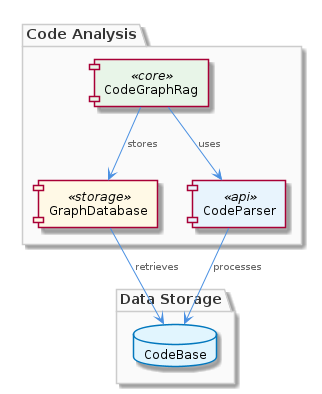
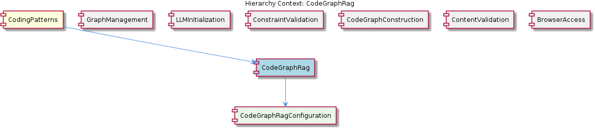

# CodeGraphRag

**Type:** SubComponent

CodeGraphRag ensures that the system can handle complex codebases, providing a robust foundation for the project's functionality.

## What It Is  

CodeGraphRag is the **code‑analysis sub‑component** of the larger **CodingPatterns** module. It lives inside the `integrations/code-graph-rag/` folder (see the README referenced by the child component `CodeGraphRagConfiguration`). Its sole responsibility is to ingest source code, construct a graph representation of that code, and expose that representation for downstream retrieval and reasoning. The observations repeatedly stress that the component “provides a robust foundation for the project’s functionality” and that its **graph‑based approach** “simplifies the analysis process” while enabling the system to “handle complex codebases with ease.”  

The component is tightly coupled with its **parent**, *CodingPatterns*, which already relies on the `storage/graph-database-adapter.ts` class for persisting graph data. CodeGraphRag therefore focuses on the *analysis* side of the pipeline, delegating storage concerns to the shared `GraphDatabaseAdapter`. Its **child**, `CodeGraphRagConfiguration`, supplies runtime configuration such as `CODE_GRAPH_RAG_SSE_PORT` and `CODE_GRAPH_RAG_PORT`, ensuring that the service can be started and communicated with consistently across environments.  

Together with its **siblings**—`GraphManagement`, `LLMInitialization`, `ConstraintValidation`, `CodeGraphConstruction`, `ContentValidation`, and `BrowserAccess`—CodeGraphRag forms a cohesive suite of graph‑centric services. While `GraphManagement` and `CodeGraphConstruction` also manipulate graph structures, CodeGraphRag’s niche is the *semantic* analysis of code, turning raw ASTs or source files into a navigable graph that other components can query.  

  

---

## Architecture and Design  

The architecture of CodeGraphRag is **graph‑centric**. The component adopts a **graph‑based analysis pattern**, where source code is modeled as nodes (e.g., classes, functions, variables) and edges (e.g., calls, imports, inheritance). This pattern is explicitly called out in observations 1, 5, and the sibling description for `CodeGraphConstruction`. By representing code as a graph, the system can perform complex traversals and queries that would be cumbersome with linear text processing.  

Interaction with other parts of the system follows a **layered delegation model**. The parent component, *CodingPatterns*, supplies persistence via `GraphDatabaseAdapter` (found in `storage/graph-database-adapter.ts`). CodeGraphRag does not implement its own storage logic; instead, it hands off the constructed graph to this adapter, leveraging the existing data‑management pipeline. This separation of concerns mirrors the design of the sibling `GraphManagement` component, which also relies on the same adapter for storage and retrieval.  

Configuration is externalized through `CodeGraphRagConfiguration`. By defining ports (`CODE_GRAPH_RAG_SSE_PORT`, `CODE_GRAPH_RAG_PORT`) in a dedicated configuration file, the design enables **environment‑agnostic deployment** and easy integration with orchestration tools. This mirrors the pattern used across siblings, where each sub‑component exposes its own configuration surface while sharing common infrastructure (e.g., the graph database).  

The relationship diagram below clarifies these connections, showing CodeGraphRag’s position relative to its parent, siblings, and child.  

  

---

## Implementation Details  

Although the source symbols for CodeGraphRag are not listed, the surrounding context provides concrete implementation anchors. The **graph construction** logic is likely shared with the `CodeGraphConstruction` sibling, which “uses a graph‑based approach to construct code graphs.” This suggests that CodeGraphRag either invokes a shared library or re‑uses the same algorithms to parse source files into a graph model.  

Once the graph is built, CodeGraphRag hands the data off to the **`GraphDatabaseAdapter`** class (`storage/graph-database-adapter.ts`). This adapter encapsulates all persistence operations—creating vertices, edges, and running queries—so CodeGraphRag does not need to manage low‑level storage concerns. The adapter also supports “automatic JSON export sync,” meaning that any graph updates performed by CodeGraphRag are reflected in a JSON representation that other services (e.g., LLMInitialization) can consume.  

Configuration is sourced from **`CodeGraphRagConfiguration`**, which lives under `integrations/code-graph-rag/README.md`. The README defines two ports: `CODE_GRAPH_RAG_SSE_PORT` for Server‑Sent Events streaming (useful for incremental analysis results) and `CODE_GRAPH_RAG_PORT` for the primary HTTP API. The component likely starts an HTTP server listening on these ports, exposing endpoints such as `/analyze` or `/graph`.  

Error handling and performance considerations are implied by the emphasis on “handling complex codebases.” The graph‑based model scales with the number of symbols rather than the size of raw text, and delegating storage to the `GraphDatabaseAdapter` allows the use of optimized graph databases (e.g., Neo4j) that can index and query large graphs efficiently.  

---

## Integration Points  

CodeGraphRag sits at the **intersection of analysis and persistence**. Its primary integration point upward is the **CodingPatterns** parent, which orchestrates the overall workflow. When a developer submits code for analysis, CodingPatterns routes the request to CodeGraphRag, which then builds the graph and pushes it through the `GraphDatabaseAdapter`. Downstream, components such as **GraphManagement** may retrieve, prune, or visualize the stored graph, while **LLMInitialization** can query the graph to provide context‑aware language model responses.  

The **`GraphDatabaseAdapter`** is the shared contract used by multiple siblings. Because all graph‑related components rely on the same adapter, changes to storage semantics (e.g., switching from an in‑memory store to a distributed graph database) propagate uniformly, preserving compatibility.  

Configuration exposure via `CodeGraphRagConfiguration` means that any service needing to communicate with the analysis API can read the defined ports from a common source, avoiding hard‑coded values. This is especially important for the **BrowserAccess** sibling, which may open a web UI that streams analysis results over the SSE port.  

Finally, the component’s **SSE endpoint** (`CODE_GRAPH_RAG_SSE_PORT`) provides a real‑time feed of analysis progress, enabling UI components or external monitoring tools to react instantly to large code‑base scans without polling.  

---

## Usage Guidelines  

1. **Invoke Through the Parent** – All analysis requests should be routed via the `CodingPatterns` component rather than calling CodeGraphRag directly. This ensures that any pre‑processing (e.g., authentication, request throttling) performed by the parent is respected.  

2. **Respect Configuration** – Use the ports defined in `CodeGraphRagConfiguration` (`CODE_GRAPH_RAG_SSE_PORT` and `CODE_GRAPH_RAG_PORT`). Do not hard‑code alternative values; instead, read them from the configuration file or environment variables that the README documents.  

3. **Leverage SSE for Large Analyses** – For codebases that exceed a few thousand lines, subscribe to the SSE stream to receive incremental analysis updates. This reduces memory pressure on the client and improves perceived responsiveness.  

4. **Do Not Bypass the GraphDatabaseAdapter** – All persistence interactions must go through the `GraphDatabaseAdapter`. Directly writing to the underlying store risks breaking the consistency guarantees that siblings rely on.  

5. **Coordinate with Siblings** – When extending functionality (e.g., adding new validation rules), follow the same pattern used by `ConstraintValidation` and `ContentValidation`: implement a rules‑based module that consumes the graph rather than modifying the core analysis pipeline. This keeps responsibilities clean and preserves maintainability.  

---

### Summary of Key Insights  

| Item | Insight |
|------|---------|
| **Architectural patterns identified** | Graph‑based analysis pattern; layered delegation to `GraphDatabaseAdapter`; externalized configuration via `CodeGraphRagConfiguration`. |
| **Design decisions and trade‑offs** | Delegating storage to a shared adapter reduces duplication but couples all graph‑related components to a single persistence contract; using SSE improves real‑time feedback at the cost of additional connection management. |
| **System structure insights** | CodeGraphRag is the analysis leaf under the `CodingPatterns` parent, sharing storage with `GraphManagement` and graph construction logic with `CodeGraphConstruction`. Its child configuration isolates runtime parameters. |
| **Scalability considerations** | Graph representation scales with symbol count; reliance on a dedicated graph database (via the adapter) enables efficient indexing and querying of large codebases; SSE streaming prevents client‑side bottlenecks. |
| **Maintainability assessment** | High maintainability due to clear separation of concerns (analysis vs. storage vs. configuration). Shared adapters and consistent configuration conventions across siblings simplify updates and onboarding. |

## Hierarchy Context

### Parent
- [CodingPatterns](./CodingPatterns.md) -- [LLM] The CodingPatterns component utilizes the GraphDatabaseAdapter class in storage/graph-database-adapter.ts for persistence, allowing for automatic JSON export sync. This design decision enables seamless data synchronization and provides a robust foundation for the project's data management. The GraphDatabaseAdapter class is responsible for handling graph data storage and retrieval, making it a critical component of the project's architecture. By using this adapter, the CodingPatterns component can focus on its primary functionality, leaving data management to the GraphDatabaseAdapter.

### Children
- [CodeGraphRagConfiguration](./CodeGraphRagConfiguration.md) -- The CODE_GRAPH_RAG_SSE_PORT and CODE_GRAPH_RAG_PORT are defined as part of the CodeGraphRag configuration, as mentioned in the project documentation (integrations/code-graph-rag/README.md).

### Siblings
- [GraphManagement](./GraphManagement.md) -- GraphDatabaseAdapter handles graph data storage and retrieval, making it a critical component of the project's architecture.
- [LLMInitialization](./LLMInitialization.md) -- LLMInitialization uses a lazy loading approach to initialize LLM agents, reducing computational overhead.
- [ConstraintValidation](./ConstraintValidation.md) -- ConstraintValidation uses a rules-based approach to validate constraints, ensuring system integrity.
- [CodeGraphConstruction](./CodeGraphConstruction.md) -- CodeGraphConstruction uses a graph-based approach to construct code graphs, enabling efficient data management.
- [ContentValidation](./ContentValidation.md) -- ContentValidation uses a rules-based approach to validate content, ensuring system integrity.
- [BrowserAccess](./BrowserAccess.md) -- BrowserAccess uses a browser-based approach to provide access to web-based interfaces.

---

*Generated from 5 observations*
