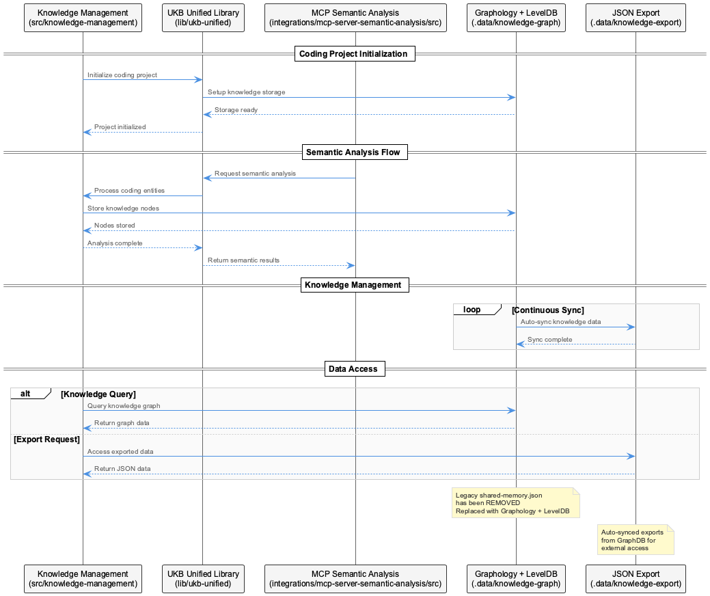
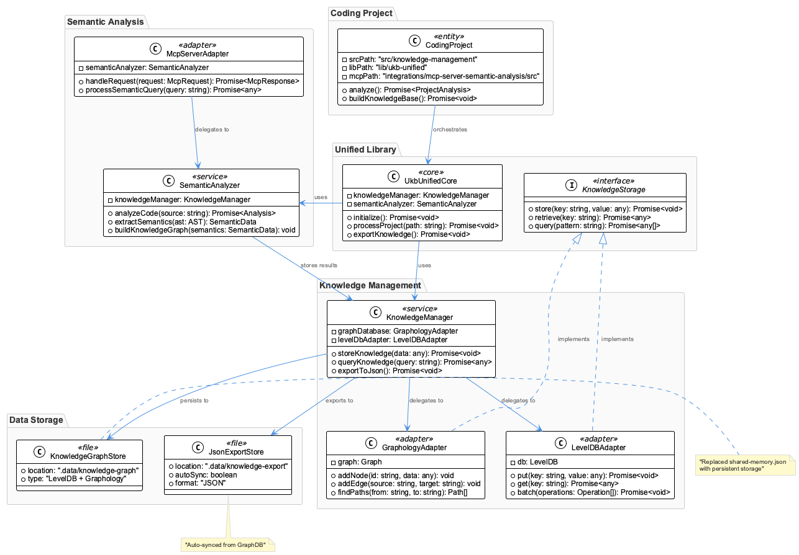
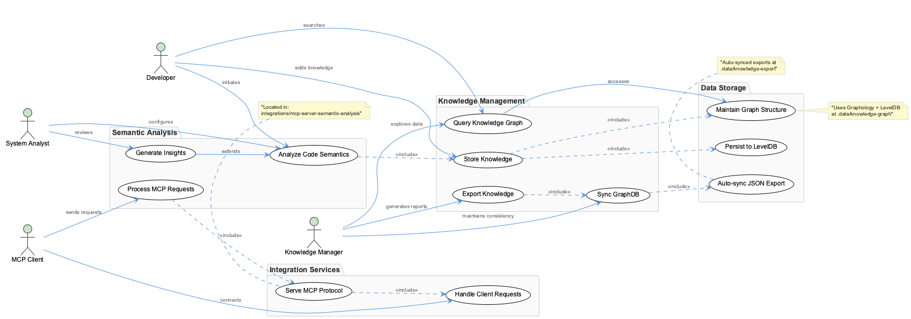

# Coding

**Type:** Project

Core components include GraphDatabaseService for data operations, GraphKnowledgeExporter for data export, GraphDatabaseAdapter for abstraction layer, PersistenceAgent for storage management, and VkbAp...

# Deep Technical Analysis: Knowledge Management Architecture

## System Purpose and Core Problem Domain

This system represents a sophisticated knowledge management platform that addresses the fundamental challenge of organizing, storing, and retrieving interconnected information at scale. The architecture suggests this is designed to handle complex relational data where traditional hierarchical storage would be insufficient. The core problem being solved is the need to maintain rich semantic relationships between disparate pieces of information while providing efficient access patterns for both analytical and operational workloads.

The dual-storage approach with automated synchronization indicates this system serves both real-time operational needs and batch analytical processes, suggesting it's designed for environments where knowledge discovery and relationship mapping are as important as data persistence.

## Architectural Patterns and Design Philosophy

### Hybrid Storage Pattern
The architecture demonstrates a sophisticated hybrid storage pattern combining graph databases with document storage. The primary Graphology + LevelDB combination provides the performance characteristics of an embedded graph database while maintaining the simplicity of key-value storage. The automated JSON export to `.data/knowledge-export` creates a human-readable representation that can serve as both a backup mechanism and an integration point for external systems.

### Command-Query Responsibility Segregation (CQRS)
The separation of concerns is evident in the distinct command interfaces: `vkb` for visualization (query operations), `coding` for development operations (command operations), and `graph-sync` for consistency management. This pattern allows for optimized interfaces tailored to specific use cases while maintaining system coherence.

### Layered Abstraction Architecture
The component hierarchy reveals a well-structured abstraction pattern: GraphDatabaseAdapter provides the interface abstraction, GraphDatabaseService handles the business logic, PersistenceAgent manages the storage concerns, and VkbApiClient handles external communications. This layering enables flexibility in implementation changes without affecting dependent components.

## Implementation Strategy and Technology Choices

### Graph Database Selection Rationale
The choice of Graphology over more heavyweight graph databases like Neo4j or Amazon Neptune suggests prioritization of embedded deployment, reduced operational complexity, and tighter integration with the JavaScript/TypeScript ecosystem. LevelDB as the underlying storage engine provides ACID properties and efficient key-value operations while maintaining a small footprint.

### Semantic Analysis Integration
The integration with `mcp-server-semantic-analysis` indicates this system goes beyond simple graph storage to provide intelligent content analysis. The recent implementation of parallel worker architecture for batch semantic analysis suggests the system handles computationally intensive natural language processing workloads that require horizontal scaling capabilities.

### Migration from Shared Memory to Graph Storage
The architectural evolution away from `shared-memory.json` toward pure graph-based storage represents a maturation from prototype to production-ready system. This change eliminates potential race conditions and provides better consistency guarantees while enabling more sophisticated query capabilities.

## Integration Architecture and System Boundaries

### Multi-Module Coordination
The three-module structure (`src/knowledge-management`, `lib/ukb-unified`, `integrations/mcp-server-semantic-analysis`) represents a clear separation of concerns: core domain logic, shared utilities, and external service integration. This structure enables independent development cycles while maintaining clear dependency management.

### API-First Integration Strategy
The presence of VkbApiClient suggests this system is designed to participate in a larger ecosystem of services. The API abstraction allows for both internal module communication and external system integration without tight coupling to implementation details.

### Event-Driven Synchronization
The `graph-sync` command implies an event-driven or scheduled synchronization pattern rather than real-time consistency. This design choice trades immediate consistency for performance and system resilience, appropriate for knowledge management scenarios where eventual consistency is acceptable.

## Scalability Considerations and Performance Characteristics

### Horizontal Processing Capability
The parallel worker implementation for semantic analysis demonstrates the system's ability to scale computationally intensive operations horizontally. This suggests the architecture can handle increasing content volumes by distributing processing load across multiple workers.

### Storage Scalability Limitations
The embedded LevelDB approach provides excellent performance for moderate data sizes but may face limitations as the knowledge graph grows beyond memory constraints. The JSON export mechanism could serve as a foundation for migration to distributed storage systems as scale requirements evolve.

### Query Performance Optimization
The graph-native storage approach optimizes for relationship traversal queries, which are typically the most expensive operations in knowledge management systems. The architectural choice suggests prioritization of complex analytical queries over simple key-value lookups.

## Maintainability and Operational Excellence

### Clear Component Boundaries
The well-defined component responsibilities and abstraction layers enhance maintainability by enabling focused development and testing. Each component has a single, well-defined purpose, reducing the cognitive load for developers and minimizing the blast radius of changes.

### Observable System Architecture
The separation of visualization (`vkb`), operations (`coding`), and synchronization (`graph-sync`) commands provides clear operational interfaces for monitoring and debugging. This separation enables operational teams to interact with different aspects of the system without requiring deep technical knowledge.

### Evolution-Ready Design
The layered architecture and API abstractions position the system well for future evolution. The GraphDatabaseAdapter pattern, in particular, enables migration to different graph database implementations without requiring changes to business logic components.

The overall architecture demonstrates mature software engineering practices with careful consideration of both current operational needs and future scalability requirements. The design successfully balances performance, maintainability, and flexibility while addressing the complex requirements of modern knowledge management systems.

## Diagrams

### Architecture

### Sequence

### Class

### Use cases

---

*Generated from 5 observations*
