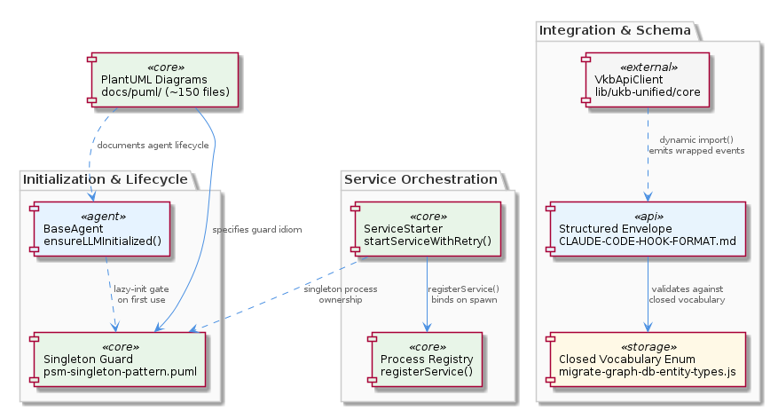

# CodingPatterns

**Type:** Component

[LLM] The project treats PlantUML diagrams in `docs/puml/` as first-class architectural artifacts rather than supplementary documentation, establishing a 'diagram-as-documentation' pattern that is applied consistently across approximately 150 `.puml` files. Two diagrams are especially central to CodingPatterns: `docs/puml/psm-singleton-pattern.puml`, which formally specifies the singleton guard idiom, and `docs/puml/code-pattern-analysis.puml`, which provides a visual specification of the code-pattern analysis workflow itself. The existence of a diagram specifically for the code-pattern analysis workflow is self-referential in a meaningful way — the project uses its own pattern-documentation infrastructure to document how it identifies and records patterns, making the `docs/puml/` directory both the medium and the subject. For new developers, the practical implication is that before implementing any new architectural pattern or making a structural change to an existing one, the corresponding PlantUML diagram should be created or updated first. The diagram is not a post-hoc record of what was built; it is the specification from which implementation proceeds. This also means that code reviewers should check for diagram updates alongside code changes when patterns are modified. The breadth of the `docs/puml/` collection — spanning singletons, agent workflows, integration patterns, and service topologies — means that a new developer can gain a rapid structural orientation to the codebase by reading the diagrams before reading the code, which is an intentional design property of the project's documentation strategy.

# CodingPatterns — Technical Insight Document

## What It Is

CodingPatterns is a component-level catalog of cross-cutting coding conventions and structural idioms that govern how stateful objects, services, agents, dependencies, events, and schemas are implemented across the Coding project. Its canonical references are distributed across the repository: the singleton guard idiom is formally specified in `docs/puml/psm-singleton-pattern.puml`; the agent lifecycle contract is defined by the `BaseAgent` class in `integrations/mcp-server-semantic-analysis/src/agents/base-agent.ts`; the service startup pattern is centralized in `lib/service-starter.js`; the closed-vocabulary enum pattern is enforced by `scripts/migrate-graph-db-entity-types.js`; the deferred dependency idiom is exemplified by the dynamic `import()` of `VkbApiClient` in `lib/ukb-unified/core/VkbApiClient.js`; the structured-envelope event contract is documented in `integrations/mcp-constraint-monitor/docs/CLAUDE-CODE-HOOK-FORMAT.md`; and the diagram-as-documentation discipline is realized in the approximately 150 `.puml` files under `docs/puml/`.

As a child of the root `Coding` component, CodingPatterns sits alongside sibling components such as `LiveLoggingSystem`, `LLMAbstraction`, `DockerizedServices`, `KnowledgeManagement`, `ConstraintSystem`, and `SemanticAnalysis`. Where those siblings are functional subsystems, CodingPatterns is a <COMPANY_NAME_REDACTED>-component: it captures the shared structural rules that those subsystems implement. Its child entities — `AgentLifecyclePattern`, `ServiceStartupPattern`, `ClosedVocabularyPattern`, `StructuredEventEnvelopePattern`, `DeferredDependencyPattern`, `DiagramAsDocumentation`, `MCPConstraintMonitor`, and `MCPServerSemanticAnalysis` — each correspond to a discrete pattern or to an integration module where these patterns are most densely instantiated.

## Architecture and Design

The architectural posture of CodingPatterns is prescriptive rather than descriptive: each pattern is paired with a single canonical implementation file, a mandatory entry point, or an authoritative specification document, and arbitrary alternative implementations are explicitly disallowed. The singleton guard pattern is enforced through a strict guard-and-return idiom: a module-level variable holds the single instance, every access point checks that variable before constructing a new object, and if an instance already exists the existing reference is returned immediately without re-running any constructor or initialization logic. This guards against race conditions in the Node.js event-driven concurrency model used throughout the project, where multiple subsystems can race to instantiate the same stateful manager. The same discipline shows up in the sibling `DockerizedServices` component, where the ProcessStateManager singleton is the spine of process-table consistency across `scripts/api-service.js` and `scripts/dashboard-service.js`.

The agent lifecycle pattern, encoded by `BaseAgent`, combines two distinct ideas: a five-method abstract interface that subclasses must implement (`init()`, `start()`, `stop()`, `pause()`, `resume()`), and a lazy-initialization gate exposed via `ensureLLMInitialized()`. Construction is kept cheap and synchronous, while heavyweight LLM client setup — which may involve network calls, credential validation, or model warm-up — is deferred to first use. This "construct cheap, initialize on first use" idiom is critical because agents are often instantiated at application startup before it is known whether they will actually be invoked. The same pattern of lazy heavy-resource binding recurs in the `DeferredDependencyPattern` child, where `VkbApiClient` is loaded via dynamic `import()` rather than top-level `require()`, so the parse-and-execute cost of its dependencies is deferred until the first API call.

Service startup is centralized through `lib/service-starter.js`, which exposes `startServiceWithRetry()` as the single mandatory entry point for launching any child process that represents a service. The function wraps the underlying process spawn with a configurable retry loop, making resilient startup the default rather than an opt-in behavior. `registerService()` is called immediately after the child process is created — before any health check or readiness signal — which binds process ownership and lifecycle tracking to the retry loop from the very first moment of process existence. This deliberate coupling of registration to the spawn site (rather than to a later readiness event) prioritizes process-table consistency over lazy registration: if a service fails to start on the first attempt, the retry loop already owns the process reference and can cleanly handle cleanup, re-spawn, and back-off without orphaned process handles.

The closed-vocabulary discipline, exemplified by `scripts/migrate-graph-db-entity-types.js`, defines exactly six canonical entity types — including Project, Component, SubComponent, and Pattern — and rejects any migration or insertion that references a type outside this set. The pattern extends to graph relationship types (e.g., `CONTAINS_PACKAGE`, `CONTAINS_FOLDER`, `CONTAINS_FILE`, `CONTAINS_MODULE`, `DEFINES`, `DEFINES_METHOD`, `DEPENDS_ON_EXTERNAL`), confirming that both node and edge types are governed by the same enum-style discipline. This is a deliberate trade-off: flexibility is sacrificed for schema stability and query reliability, directly supporting the integrity guarantees relied upon by the sibling `KnowledgeManagement` component and its Graphology+LevelDB graph database.

## Implementation Details

The singleton guard pattern is the most pervasive idiom in the codebase and operates by module-level state and structural symmetry: the module exports a factory or accessor function that checks an internal variable initialized to null or undefined, and the constructor is never invoked directly from arbitrary call sites. The PlantUML diagram at `docs/puml/psm-singleton-pattern.puml` is authoritative; new managers must be verified against it to ensure the guard logic is structurally consistent with the rest of the project.

The `BaseAgent` class establishes the lifecycle contract through abstract methods that impose a strict ordering convention all concrete subclasses must respect. Internally, `ensureLLMInitialized()` checks an internal flag and, if the LLM client has not yet been set up, performs initialization before allowing the calling method to proceed. The first invocation of any LLM-requiring operation flows through this gate, after which subsequent calls bypass the setup path. The `MCPServerSemanticAnalysis` child entity is the densest site of agents that conform to this pattern, and the sibling `SemanticAnalysis` component references a parallel `BaseAgent<TInput, TOutput>` abstract class at `src/agents/base-agent.ts` that enforces a five-method execution contract — the two are aligned by intent if not by literal class identity.

The structured-envelope pattern wraps every hook event, regardless of domain, in a typed, versioned outer envelope before transmission. The envelope carries an event type discriminator, schema version, timestamp, and source identifier, allowing receivers to validate, route, and process events without out-of-band context. The versioning field is the key evolutionary affordance: new fields can be added to the payload without breaking existing consumers as long as the envelope version is incremented and consumers tolerate unknown fields. This contract is symmetric — producers always wrap, consumers always unwrap and validate before processing — and mirrors the Pipeline sub-component's requirement that every lifecycle stage emit structured events. The `MCPConstraintMonitor` child entity is the principal source of these envelopes in the integration boundary.

The deferred-dependency idiom uses dynamic `import()` to ensure that heavy third-party clients, large data parsers, and optional integration modules are loaded at their first point of use rather than at module definition time. In a codebase listing roughly 1,184 files and 12,241 code references, eager loading would produce unacceptably long cold-start times. Dynamic import also enables conditional loading: if the runtime configuration indicates that an integration is disabled, the import never executes and the dependency is never instantiated.

Finally, the diagram-as-documentation discipline elevates the `.puml` files in `docs/puml/` to first-class architectural artifacts. Two diagrams are especially central to CodingPatterns: `docs/puml/psm-singleton-pattern.puml`, which formally specifies the singleton guard idiom, and `docs/puml/code-pattern-analysis.puml`, which provides a visual specification of the code-pattern analysis workflow itself. The self-referential nature of the latter — the project uses its own pattern-documentation infrastructure to document how it identifies and records patterns — is intentional: the `docs/puml/` directory is both the medium and the subject.

## Integration Points

CodingPatterns is intersected by virtually every other component in the project. The singleton guard pattern is the structural basis for the ProcessStateManager described in the sibling `DockerizedServices` component, which uses the same module-level guard idiom to decouple service identity from process identity across `scripts/api-service.js` and `scripts/dashboard-service.js`. The `ServiceStartupPattern` child is invoked by those same wrapper scripts: their `child_process` spawn calls must be routed through `startServiceWithRetry()` to obtain retry protection and central registration.

The `AgentLifecyclePattern` child integrates directly with the sibling `SemanticAnalysis` component (which has its own `BaseAgent<TInput, TOutput>` abstraction at `src/agents/base-agent.ts`) and with the `LLMAbstraction` sibling, since `ensureLLMInitialized()` is the natural seam where an agent's LLM mode resolution — per-agent override, then `llmState.globalMode`, then legacy `mockLLM` — is consulted. The `ClosedVocabularyPattern` child underpins the integrity guarantees relied upon by the sibling `KnowledgeManagement` component, whose Graphology+LevelDB graph database depends on the entity-type and relationship-type enums enforced by `scripts/migrate-graph-db-entity-types.js`.

The `StructuredEventEnvelopePattern` is the integration contract between the sibling `LiveLoggingSystem`, which normalizes agent transcripts into typed LSL entries, and the sibling `ConstraintSystem`, whose `HookConfigLoader` at `lib/agent-api/hooks/hook-config.js` dispatches handlers in response to envelope events. The `MCPConstraintMonitor` child is the densest implementation of this contract and is also where `integrations/mcp-constraint-monitor/docs/CLAUDE-CODE-HOOK-FORMAT.md` lives. The `MCPServerSemanticAnalysis` child houses the `BaseAgent` implementation and is the integration site where the agent lifecycle and deferred-dependency patterns are jointly realized.

## Usage Guidelines

New stateful managers must always be instantiated through the designated factory or accessor function that enforces the singleton contract; calling `new` directly from arbitrary call sites is prohibited. Before introducing any new singleton-style manager, the implementation must be verified against `docs/puml/psm-singleton-pattern.puml` to ensure structural consistency. New agents must subclass `BaseAgent` from `integrations/mcp-server-semantic-analysis/src/agents/base-agent.ts`, implement all five abstract lifecycle methods, and never bypass `ensureLLMInitialized()` or perform LLM setup in the constructor — doing so would break the performance contract and could cause failures in environments where credentials are not available at construction time.

Any service launched as a child process must go through `startServiceWithRetry()` in `lib/service-starter.js`. Raw `spawn` or `exec` calls outside this function are forbidden because they bypass retry protection, omit registration in the central process registry, and risk leaving orphaned processes if initialization fails. Heavy third-party clients, large data parsers, and optional integration modules must be loaded via dynamic `import()` at their first point of use; introducing a top-level `require()` for such dependencies reintroduces the startup cost and unconditional loading the deferred-dependency pattern exists to avoid.

Additions to the graph database vocabulary — whether new node types or new edge types — must go through `scripts/migrate-graph-db-entity-types.js` and extend the enum explicitly. Informally expanding the vocabulary by inserting unregistered types into the graph is a schema-drift defect and will be rejected by the migration script. At integration boundaries, raw or unstructured event payloads are not acceptable: every hook event must be wrapped in a conforming envelope structure with event type discriminator, schema version, timestamp, and source identifier, per `integrations/mcp-constraint-monitor/docs/CLAUDE-CODE-HOOK-FORMAT.md`.

Finally, the diagram-first discipline is mandatory for architectural change. Before implementing a new pattern or making a structural change to an existing one, the corresponding PlantUML diagram in `docs/puml/` should be created or updated first; the diagram is the specification from which implementation proceeds, not a post-hoc record. Code reviewers should check for diagram updates alongside code changes whenever patterns are modified, and new developers can gain rapid structural orientation by reading the `docs/puml/` diagrams before reading the code.

---

### Architectural Patterns Identified
- **Singleton Guard** (module-level instance variable with guard-and-return access)
- **Lazy-Initialization Gate** (`ensureLLMInitialized()` deferring heavyweight setup to first use)
- **Centralized Resilient Startup** (`startServiceWithRetry()` as single mandatory entry point)
- **Closed-Vocabulary Enum** (canonical entity and relationship type sets)
- **Structured Versioned Envelope** (typed outer wrapper around all inter-component events)
- **Deferred Heavy Dependency** (dynamic `import()` at first point of use)
- **Diagram-as-Specification** (`docs/puml/` files as primary architectural artifacts)

### Design Decisions and Trade-offs
- **Prescriptive over descriptive**: each pattern has a single canonical implementation; alternative paths are disallowed, sacrificing local flexibility for global consistency.
- **Process-table consistency over lazy registration**: `registerService()` is called at spawn time, not at readiness, accepting the risk of registering not-yet-ready processes in exchange for guaranteed cleanup.
- **Schema stability over schema flexibility**: closed vocabularies prevent ad-hoc type proliferation at the cost of requiring formal migration for any new type.
- **Cold-start performance over predictability**: dynamic imports and lazy initialization improve startup latency but defer failure modes (e.g., credential errors) until the first call.
- **Diagram-first discipline**: enforces specification rigor but adds overhead to small structural changes.

### System Structure Insights
The CodingPatterns component is <COMPANY_NAME_REDACTED>-architectural: its children codify the rules that the sibling functional components (`LiveLoggingSystem`, `LLMAbstraction`, `DockerizedServices`, `KnowledgeManagement`, `ConstraintSystem`, `SemanticAnalysis`) implement. The most densely-patterned integration modules — `MCPConstraintMonitor` and `MCPServerSemanticAnalysis` — are explicitly elevated as children of CodingPatterns, signaling that they are the reference sites where multiple patterns co-occur.

### Scalability Considerations
The deferred-dependency and lazy-initialization patterns directly address scaling cold-start costs in a codebase with approximately 1,184 files and 12,241 code references. The structured-envelope pattern enables backward-compatible schema evolution via its version field, supporting growth in event producers and consumers without coordinated lock-step releases. The retry-loop coupling in `startServiceWithRetry()` supports growth in the number of managed services, though the per-service wrapper-script boilerplate (e.g., `scripts/api-service.js`, `scripts/dashboard-service.js`) is a noted maintenance concern as service count grows.

### Maintainability Assessment
Maintainability is high where patterns are codified by a single canonical file or document and enforced structurally (the migration script, `startServiceWithRetry()`, the `BaseAgent` abstract contract). Maintainability is weaker where patterns rely on convention rather than enforcement — most notably the singleton guard idiom, which depends on developers consulting `docs/puml/psm-singleton-pattern.puml` and resisting direct `new` invocations. The diagram-as-documentation discipline materially improves long-term maintainability by giving new developers a structural reading path through the `docs/puml/` directory before reaching the code, and by making pattern changes reviewable as diagram diffs alongside implementation diffs.

## Hierarchy Context

### Parent
- [Coding](./Coding.md) -- Root node of the coding project knowledge hierarchy, encompassing all development infrastructure knowledge. The project consists of 7 major components: LiveLoggingSystem: [LLM] The TranscriptAdapter class in lib/agent-api/transcript-api.js establishes a strict plugin contract for integrating new agent conversation sourc; LLMAbstraction: [LLM] The LLMAbstraction layer implements a three-tier mode resolution hierarchy in `getLLMMode()` within `llm-mock-service.ts` that prioritizes speci; DockerizedServices: [LLM] The ProcessStateManager (PSM) singleton implements a deliberate decoupling between service identity and process identity across both `scripts/ap; KnowledgeManagement: The KnowledgeManagement component provides knowledge graph storage, query, and lifecycle management for the Coding project. It centers on a Graphology; CodingPatterns: [LLM] The project-wide singleton guard pattern is formally codified in `docs/puml/psm-singleton-pattern.puml` and manifests consistently wherever stat; ConstraintSystem: [LLM] The ConstraintSystem implements a two-level configuration hierarchy through `HookConfigLoader` (lib/agent-api/hooks/hook-config.js) that disting; SemanticAnalysis: [LLM] The `BaseAgent<TInput, TOutput>` abstract class defined in `src/agents/base-agent.ts` establishes a rigid, five-method execution contract that e.

### Children
- [AgentLifecyclePattern](./AgentLifecyclePattern.md) -- The BaseAgent class in base-agent.ts defines the lifecycle methods init(), start(), stop(), pause(), and resume()
- [ServiceStartupPattern](./ServiceStartupPattern.md) -- The startServiceWithRetry() function in lib/service-starter.js wraps the service startup with retry logic
- [ClosedVocabularyPattern](./ClosedVocabularyPattern.md) -- The migration scripts in integrations/mcp-constraint-monitor/docs/constraint-configuration.md enforce fixed canonical type sets
- [StructuredEventEnvelopePattern](./StructuredEventEnvelopePattern.md) -- The CLAUDE-CODE-HOOK-FORMAT.md document specifies the structured event envelope format
- [DeferredDependencyPattern](./DeferredDependencyPattern.md) -- The VkbApiClient module in lib/ukb-unified/core/VkbApiClient.js is loaded dynamically using dynamic-import
- [DiagramAsDocumentation](./DiagramAsDocumentation.md) -- The PlantUML diagrams in docs/puml/ capture architectural decisions and provide visual specification
- [MCPConstraintMonitor](./MCPConstraintMonitor.md) -- The MCPConstraintMonitor module in integrations/mcp-constraint-monitor/README.md monitors and enforces constraints
- [MCPServerSemanticAnalysis](./MCPServerSemanticAnalysis.md) -- The MCPServerSemanticAnalysis module in integrations/mcp-server-semantic-analysis/README.md performs semantic analysis

### Siblings
- [LiveLoggingSystem](./LiveLoggingSystem.md) -- [LLM] The TranscriptAdapter class in lib/agent-api/transcript-api.js establishes a strict plugin contract for integrating new agent conversation sources into the LSL pipeline. It requires five abstract methods: getAgentType(), getTranscriptDirectory(), readTranscripts(), convertToLSL(), and getCurrentSession(). This design cleanly separates concerns — the base class owns the lifecycle and dispatch logic, while subclasses own the format-specific parsing. Claude Code transcripts live at ~/.claude/projects/<project>/conversation.jsonl, a JSONL file that grows append-only during a session; the Copilot CLI adapter targets a different directory structure. The convertToLSL() method is the normalization seam, responsible for mapping each agent's native message structure into the unified LSL typed-entry format with types: user, assistant, tool_use, tool_result, system, and error. A new developer adding a third agent integration (e.g., Cursor, Aider) only needs to subclass TranscriptAdapter and implement these five methods — no changes to the core LSL infrastructure are required. The getCurrentSession() method is particularly important: it must return the 'live' session object so the polling loop knows which entries are part of the current conversation versus a historical one, which implies adapters must implement their own session-boundary detection logic appropriate to their agent's format.
- [LLMAbstraction](./LLMAbstraction.md) -- [LLM] The LLMAbstraction layer implements a three-tier mode resolution hierarchy in `getLLMMode()` within `llm-mock-service.ts` that prioritizes specificity over generality: a per-agent override stored in `llmState.perAgentOverrides` takes precedence over the `llmState.globalMode`, which in turn takes precedence over a legacy `mockLLM` boolean field. This design is significant because it allows the system to run mixed-mode configurations in production — for example, running a lightweight code-indexing agent against the local Docker Model Runner while routing a more complex reasoning agent to a cloud API like Anthropic or OpenAI, all within a single workflow execution. The legacy `mockLLM` boolean is retained explicitly for backward compatibility, meaning older configuration files or callers that predate the `llmState` structure continue to function without migration. New developers should be aware that if they observe unexpected behavior when `globalMode` is set but `mockLLM` is also present in a persisted state file, the `mockLLM` boolean is the lowest-priority fallback and will only activate when neither of the higher-priority fields are populated.
- [DockerizedServices](./DockerizedServices.md) -- [LLM] The ProcessStateManager (PSM) singleton implements a deliberate decoupling between service identity and process identity across both `scripts/api-service.js` and `scripts/dashboard-service.js`. Each script follows an identical structural pattern: spawn a child process via Node's `child_process` module, register the resulting process handle with the PSM via `psm.registerService()`, wire up `SIGTERM`/`SIGINT` forwarding so that signals delivered to the wrapper propagate to the child, and call `psm.unregisterService()` in the exit handler. This indirection means that the rest of the system (including `scripts/health-coordinator.js`) can query the PSM registry without holding direct references to OS-level process IDs. The practical consequence for developers is that a service restart — where a new child process replaces the old one — does not require the health coordinator or any consumer of PSM state to be aware of the PID change; only the wrapper scripts update the registry. This pattern also cleanly isolates the restart/retry logic in `lib/service-starter.js` from signal-handling responsibilities, since the wrapper owns the process lifecycle signals while the starter owns the retry policy. A new developer should note that adding a new containerized service almost certainly means creating a new wrapper script that replicates this boilerplate rather than centralizing it, which is a potential maintenance concern as the number of services grows.
- [KnowledgeManagement](./KnowledgeManagement.md) -- The KnowledgeManagement component provides knowledge graph storage, query, and lifecycle management for the Coding project. It centers on a Graphology+LevelDB graph database (GraphDatabaseService) that stores entities as typed nodes with rich metadata, exposed through both a direct-access path and a VKB HTTP API. The component supports multiple entity types (System, Project, Component, SubComponent, Pattern, Detail) with ontology classification, bi-temporal staleness tracking, embedding vectors, and hierarchical parent/child relationships. It integrates with the MCP semantic analysis server via PersistenceAgent and GraphDatabaseAdapter, which route writes through the VKB API when the server is running or fall back to direct LevelDB access to avoid lock conflicts.
- [ConstraintSystem](./ConstraintSystem.md) -- [LLM] The ConstraintSystem implements a two-level configuration hierarchy through `HookConfigLoader` (lib/agent-api/hooks/hook-config.js) that distinguishes between user-wide defaults and project-specific overrides. User-level configuration lives at `~/.coding-tools/hooks.json`, making it available across all Claude Code sessions on the machine, while project-level configuration resides at `{project}/.coding/hooks.json`, enabling per-repository constraint customization. The `mergeConfigs()` method is the critical integration point: it applies project configuration on top of user configuration, meaning any handler, constraint rule, or hook binding defined at the project level supersedes or augments what the user has set globally. This design has a meaningful implication for teams: a repository can enforce stricter or more specific constraints than a developer's personal defaults without requiring them to change their global setup. However, because the merge strategy gives project config full precedence, there is no mechanism for user config to 'lock' a setting that cannot be overridden by a project — a security boundary that new developers should be aware of when assessing whether globally-defined compliance constraints can be bypassed by a malicious or misconfigured `.coding/hooks.json`.
- [SemanticAnalysis](./SemanticAnalysis.md) -- [LLM] The `BaseAgent<TInput, TOutput>` abstract class defined in `src/agents/base-agent.ts` establishes a rigid, five-method execution contract that every agent in the pipeline must implement: `process()`, `calculateConfidence()`, `detectIssues()`, `generateRouting()`, and `applyCorrections()`. This is not a loose interface — each method is called sequentially within a standardized envelope, meaning an agent cannot skip confidence calculation or issue detection even if it has nothing meaningful to report for those phases. The resulting `AgentResponse` envelope carries not just the domain output but also metadata (timestamps, model usage), routing suggestions for downstream agents, and a corrections list for self-healing. For a new developer, this means that implementing a new agent is less about writing a single processing function and more about correctly filling all five lifecycle slots; an agent that returns empty stubs for `detectIssues()` or `generateRouting()` will still compile and run, but the orchestrating pipeline likely depends on those fields being populated to make branching decisions. The generic type parameters `<TInput, TOutput>` allow the base class to be reused across wildly different domains — from raw git commit arrays (SemanticAnalysisAgent) to ontology classification batches (OntologyClassificationAgent) — without sacrificing static type safety on the input/output contracts.

---

*Generated from 7 observations*
