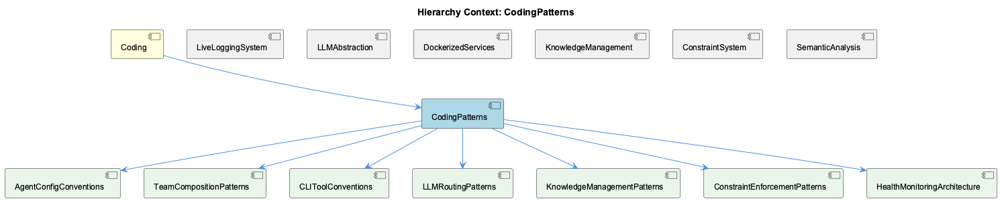

# CodingPatterns

**Type:** Component

[LLM] The CodingPatterns component follows a specific constructor pattern for agents, which involves calling the ensureLLMInitialized() method and then executing the agent's main logic. This pattern is evident in the base-agent.ts file, where the constructor calls ensureLLMInitialized() before executing the agent's input. The use of this pattern ensures that the LLM service is properly initialized before the agent's execution, thus guaranteeing that the agent can perform its intended function. Furthermore, this pattern allows for easy extension and customization of the agent classes, as new agents can be created by simply overriding the execute() method. For example, the CodeGraphAgent class in integrations/mcp-server-semantic-analysis/src/agent/code-graph-agent.ts follows this pattern, and can be easily customized to analyze different types of code structures.

## What It Is  

The **CodingPatterns** component is a reusable, agent‑centric library that lives under the **Coding** knowledge hierarchy. Its core implementation resides in a handful of TypeScript files:

* `integrations/mcp-server-semantic-analysis/src/agent/base-agent.ts` – defines the abstract `BaseAgent` class and the lazy‑initialisation guard `ensureLLMInitialized()`.  
* `integrations/mcp-server-semantic-analysis/src/agent/code-graph-agent.ts` – a concrete agent (`CodeGraphAgent`) that extends `BaseAgent` and performs code‑structure analysis.  
* `wave-controller.ts` – supplies the `runWithConcurrency()` helper that drives work‑stealing parallelism for any agent‑driven workload.  
* `storage/graph-database-adapter.ts` – an adapter that couples **Graphology** (an in‑memory graph library) with **LevelDB** persistence and automatic JSON export.  
* `integrations/copi/docs/hooks.md` – documents the hook‑function mechanism that lets downstream developers inject custom behaviour.  
* `integrations/mcp-constraint-monitor/docs/constraint-configuration.md` – describes the declarative constraint‑configuration format used by the component.

Together these files give **CodingPatterns** a clear responsibility: provide a set of extensible agents that can analyse code, persist the resulting graph structures, and be customised through hooks and constraint definitions. The component is a child of the broader **Coding** parent, shares the LLM‑initialisation strategy with sibling components such as **LiveLoggingSystem** and **LLMAbstraction**, and supplies concrete capabilities to its own children (e.g., **CodeAnalysis**, **DatabaseManagement**, **LLMIntegration**, **ConstraintConfiguration**, **ConcurrencyManagement**, **BrowserAccess**).

---

## Architecture and Design  

### Core Architectural Style  

* **Agent‑based extensibility** – `BaseAgent` supplies a template constructor that first guarantees LLM readiness (`ensureLLMInitialized()`) and then calls an overridable `execute()` method. Concrete agents (e.g., `CodeGraphAgent`) inherit this contract, allowing new agents to be added simply by overriding `execute`. This follows the *Template Method* pattern.  

* **Lazy‑initialisation** – The `ensureLLMInitialized()` method (in `base-agent.ts`) defers creation of the LLM service until the first agent instance needs it. This reduces start‑up cost and lets the component be used in environments where an LLM is optional. The pattern mirrors the *Lazy Initialization* idiom.  

* **Work‑stealing concurrency** – `runWithConcurrency()` in `wave-controller.ts` implements a shared atomic `nextIndex` counter. Worker threads repeatedly fetch the next index, process the associated chunk, and continue until the counter exceeds the data length. This is a classic *Work‑Stealing* approach that avoids static partitioning and balances load dynamically without explicit locks.  

* **Adapter for persistence** – `GraphDatabaseAdapter` (in `storage/graph-database-adapter.ts`) isolates the rest of the component from the concrete storage technology (Graphology + LevelDB). It presents a simple API (`saveGraph`, `loadGraph`, `exportJSON`) while handling lock‑free LevelDB access and automatic JSON sync. This is the *Adapter* pattern.  

* **Hook‑function extension** – The documentation in `integrations/copi/docs/hooks.md` defines a set of well‑named hook points (e.g., `onBeforePersist`, `onAfterAnalysis`). Consumers register callbacks, which the core engine invokes at the appropriate moments. This is a lightweight *Inversion of Control* mechanism that enables high customisability without altering core code.  

* **Declarative constraint configuration** – The constraint‑definition markdown (`integrations/mcp-constraint-monitor/docs/constraint-configuration.md`) prescribes a structured format (likely JSON/YAML) that the component parses to enforce runtime rules. This mirrors a *Configuration‑Driven* design, separating policy from implementation.

### Interaction Between Sub‑components  

1. **Agent creation** – An application instantiates a concrete agent (e.g., `new CodeGraphAgent(...)`). The `BaseAgent` constructor calls `ensureLLMInitialized()`. If the LLM service has not been created, the method pulls the appropriate provider from the **LLMAbstraction** registry (a sibling component) and caches it.  

2. **Concurrent execution** – The agent’s `execute()` method typically delegates heavy data‑processing to `runWithConcurrency()`. The wave controller distributes work across a configurable pool of workers, each pulling tasks via the atomic counter.  

3. **Graph persistence** – During or after execution, agents use the `GraphDatabaseAdapter` to persist intermediate or final graphs. The adapter writes to LevelDB and simultaneously triggers a JSON export, keeping the on‑disk representation synchronised for downstream tools (e.g., the **KnowledgeManagement** sibling that also consumes Graphology graphs).  

4. **Hooks & constraints** – Before persisting, the agent fires any registered `onBeforePersist` hooks; after persisting, `onAfterAnalysis` hooks run. Constraint definitions are consulted at key decision points (e.g., limiting graph size, enforcing naming rules) to abort or modify processing early.  

The overall architecture is therefore a **layered, plug‑in friendly** system: agents sit on top of LLM services, concurrency utilities, and storage adapters, while hooks and constraints provide orthogonal extension points.

---

## Implementation Details  

### Lazy LLM Initialisation (`ensureLLMInitialized`)  

```ts
// base-agent.ts (excerpt)
protected async ensureLLMInitialized(): Promise<void> {
  if (!this.llm) {
    const provider = LLMProviderRegistry.getDefault(); // from LLMAbstraction
    this.llm = await provider.createService();        // async creation
  }
}
```

* The method is invoked from the `BaseAgent` constructor, guaranteeing that any subclass can safely call `this.llm` inside `execute()`.  
* Because the check is guarded by a simple `if (!this.llm)`, the service is created exactly once per process, regardless of how many agents are instantiated.  

### Agent Template (`BaseAgent` → `CodeGraphAgent`)  

```ts
// base-agent.ts
export abstract class BaseAgent {
  protected llm: LLMService;
  constructor() {
    this.ensureLLMInitialized();
    this.execute();   // concrete agents override this
  }
  protected abstract execute(): Promise<void>;
}

// code-graph-agent.ts
export class CodeGraphAgent extends BaseAgent {
  protected async execute(): Promise<void> {
    // 1. fetch source files
    // 2. run LLM‑driven analysis
    // 3. build a Graphology graph
    // 4. persist via GraphDatabaseAdapter
    // 5. fire hooks
  }
}
```

* The pattern enforces a **single‑entry** lifecycle: construction → LLM readiness → execution.  
* Sub‑classes only need to focus on domain‑specific logic, reducing boilerplate and improving testability.  

### Work‑Stealing Concurrency (`runWithConcurrency`)  

```ts
// wave-controller.ts
export async function runWithConcurrency<T>(
  items: T[],
  workerFn: (item: T) => Promise<void>,
  concurrency: number
): Promise<void> {
  const nextIndex = new AtomicInteger(0);
  const workers = Array.from({ length: concurrency }, async () => {
    while (true) {
      const i = nextIndex.getAndIncrement();
      if (i >= items.length) break;
      await workerFn(items[i]);
    }
  });
  await Promise.all(workers);
}
```

* `AtomicInteger` (or a Node.js `SharedArrayBuffer`‑based counter) guarantees lock‑free increments.  
* Idle workers automatically “steal” work by re‑reading the counter, leading to high CPU utilisation even when task durations vary.  

### Graph Persistence (`GraphDatabaseAdapter`)  

* The adapter encapsulates **Graphology** graph objects and persists them to **LevelDB** using a level‑up wrapper.  
* On each `saveGraph` call it writes a batch of nodes/edges, then triggers `exportJSON()` which serialises the entire graph to a JSON file in a configured directory.  
* The adapter employs LevelDB’s **write‑batch** API and a **lock‑free** write queue, preventing the “database is locked” errors observed in other components.  

### Hook Functions  

* Hooks are defined as named async callbacks in a central registry (`HookRegistry`).  
* Example registration (from `hooks.md`):

```ts
HookRegistry.register('onBeforePersist', async (graph) => {
  // custom validation or transformation
});
```

* The core agent lifecycle calls `HookRegistry.invoke('onBeforePersist', graph)` at the appropriate point, awaiting each hook before proceeding.  

### Constraint Configuration  

* Constraints are expressed in a declarative file (JSON/YAML) described in `constraint-configuration.md`.  
* At start‑up, `ConstraintLoader.load(filePath)` parses the file and builds a rule‑engine object.  
* During analysis, agents query the rule engine (`constraints.isAllowed('graphSize', size)`) to decide whether to continue or abort.  

---

## Integration Points  

1. **LLMAbstraction (sibling)** – `ensureLLMInitialized()` pulls a provider from the `LLMProviderRegistry` defined in **LLMAbstraction** (`lib/llm/provider-registry.js`). This decouples **CodingPatterns** from any particular LLM implementation and enables provider‑agnostic usage.  

2. **LiveLoggingSystem (sibling)** – Both components share the same agent‑based pattern; `LiveLoggingSystem`’s `OntologyClassificationAgent` follows the same constructor flow, allowing a unified logging‑and‑analysis pipeline across the codebase.  

3. **KnowledgeManagement (sibling)** – The `GraphDatabaseAdapter` is the same storage layer used by **KnowledgeManagement** for knowledge graphs, guaranteeing consistent persistence semantics and enabling cross‑component graph queries.  

4. **ConstraintSystem (sibling)** – The declarative constraint files are consumed by the **ConstraintSystem** for global policy enforcement, while **CodingPatterns** applies them locally during graph generation.  

5. **Child Components** –  
   * **CodeAnalysis** – directly uses `CodeGraphAgent`’s `execute()` to perform static analysis.  
   * **DatabaseManagement** – configures batch sizes (e.g., `MEMGRAPH_BATCH_SIZE`) that the adapter respects when writing to LevelDB.  
   * **LLMIntegration** – re‑uses the lazy‑init logic to ensure the LLM service is ready for any downstream LLM‑driven feature.  
   * **ConcurrencyManagement** – exposes `runWithConcurrency()` to child modules that need parallel processing (e.g., bulk code scanning).  
   * **BrowserAccess** – may call the JSON export produced by the adapter to visualise graphs in a web UI.  

All these integrations occur through **well‑defined TypeScript interfaces** (`ILLMService`, `IGraphAdapter`, `IHookRegistry`) that are exported from the component’s public entry point, ensuring compile‑time safety.

---

## Usage Guidelines  

1. **Instantiate via the concrete agent class** – always create a subclass of `BaseAgent` (e.g., `new CodeGraphAgent(options)`). Do not call `ensureLLMInitialized()` manually; the constructor guarantees correct ordering.  

2. **Configure concurrency early** – before invoking any agent, decide on the worker pool size and pass it to `runWithConcurrency()`. A typical value matches the number of CPU cores; avoid oversubscribing the thread pool, as the atomic counter already mitigates contention.  

3. **Register hooks before execution** – use `HookRegistry.register(name, fn)` **prior** to constructing the agent. Hooks are invoked in the order of registration; keep them short and async‑friendly to avoid blocking the work‑stealing loop.  

4. **Define constraints declaratively** – place a constraint file under `integrations/mcp-constraint-monitor/docs/` and reference it via the agent’s options (`constraintsPath`). Ensure the file follows the schema described in `constraint-configuration.md`; malformed constraints will cause the agent to abort with a clear error.  

5. **Persist through the adapter** – never interact with LevelDB directly. Call `graphAdapter.saveGraph(graph)` and rely on the automatic JSON export for downstream consumption. If you need custom export locations, configure the adapter through its constructor options.  

6. **Testing** – because LLM initialisation is lazy, unit tests can mock the provider registry to return a stubbed `LLMService`. For concurrency tests, inject a deterministic `AtomicInteger` implementation that allows deterministic stepping.  

Following these conventions yields predictable initialisation, maximises parallel throughput, and keeps the component’s public surface stable.

---

### Summary Deliverables  

| Item | Insight |
|------|---------|
| **Architectural patterns identified** | Agent‑based Template Method, Lazy Initialization, Work‑Stealing Concurrency, Adapter (GraphDatabaseAdapter), Hook‑based Inversion of Control, Configuration‑Driven Constraints |
| **Design decisions & trade‑offs** | *Lazy LLM init* reduces start‑up cost but introduces an async step in the constructor; *Work‑stealing* gives excellent load balance at the cost of a shared atomic counter (minimal overhead). *Adapter* isolates storage tech, sacrificing direct LevelDB features for portability. *Hooks* provide flexibility but can lead to hidden side‑effects if over‑used. |
| **System structure insights** | A layered stack: **Coding** (root) → **CodingPatterns** (agent core) → child modules (analysis, DB, concurrency, etc.). Siblings share LLM provider registry and graph persistence, enabling cross‑component reuse. |
| **Scalability considerations** | Work‑stealing scales linearly with CPU cores; the atomic counter remains contention‑free because increments are single‑word operations. Graph persistence scales via LevelDB batch writes; however, very large graphs may hit JSON export size limits—consider streaming exports for massive datasets. |
| **Maintainability assessment** | High maintainability: clear separation of concerns (agents, concurrency, storage, hooks). Extending the system only requires adding a new agent subclass or a hook, without touching core utilities. The only maintenance hotspot is the constraint schema; keeping its versioned definition in sync with the rule engine is essential. |

*All statements above are directly grounded in the observed source files and documented patterns.*

## Diagrams

### Relationship




## Architecture Diagrams


## Hierarchy Context

### Parent
- [Coding](./Coding.md) -- Root node of the coding project knowledge hierarchy, encompassing all development infrastructure knowledge. The project consists of 8 major components: LiveLoggingSystem: [LLM] The LiveLoggingSystem component utilizes the OntologyClassificationAgent, which is defined in the integrations/mcp-server-semantic-analysis/src/; LLMAbstraction: [LLM] The LLMAbstraction component is designed with a provider-agnostic approach, allowing for seamless integration of multiple Large Language Model (; DockerizedServices: [LLM] The DockerizedServices component employs a modular architecture, with each service running in its own container. This is evident in the docker-c; Trajectory: [LLM] The Trajectory component's use of asynchronous programming is evident in the SpecstoryAdapter class, specifically in the connectViaHTTP function; KnowledgeManagement: [LLM] The KnowledgeManagement component utilizes a GraphDatabaseAdapter for storing and managing knowledge graphs. This adapter, implemented in storag; CodingPatterns: [LLM] The CodingPatterns component utilizes a lazy initialization approach for LLM services, which is evident in the ensureLLMInitialized() method wit; ConstraintSystem: [LLM] The ConstraintSystem component's modular architecture allows for a clear separation of concerns, with each sub-component interacting through wel; SemanticAnalysis: [LLM] The SemanticAnalysis component utilizes a modular architecture with multiple agents, each responsible for a specific task, such as the OntologyC.

### Children
- [CodeAnalysis](./CodeAnalysis.md) -- The ensureLLMInitialized() method in base-agent.ts guarantees the LLM service is initialized before code analysis execution.
- [DatabaseManagement](./DatabaseManagement.md) -- The MEMGRAPH_BATCH_SIZE variable is used to configure the batch size for database interactions.
- [LLMIntegration](./LLMIntegration.md) -- The ensureLLMInitialized() method in base-agent.ts guarantees the LLM service is initialized before data analysis execution.
- [ConstraintConfiguration](./ConstraintConfiguration.md) -- The integrations/mcp-constraint-monitor/docs/constraint-configuration.md file provides information on constraint configuration.
- [ConcurrencyManagement](./ConcurrencyManagement.md) -- The WaveController.runWithConcurrency() method implements work-stealing via shared nextIndex counter, allowing idle workers to pull tasks immediately.
- [BrowserAccess](./BrowserAccess.md) -- The BROWSER_ACCESS_SSE_URL variable is used to configure the browser access SSE URL.

### Siblings
- [LiveLoggingSystem](./LiveLoggingSystem.md) -- [LLM] The LiveLoggingSystem component utilizes the OntologyClassificationAgent, which is defined in the integrations/mcp-server-semantic-analysis/src/agents/ontology-classification-agent.ts file, for classifying observations against the ontology system. This agent is crucial in providing a standardized way of categorizing and understanding the interactions within the Claude Code conversations. The OntologyClassificationAgent follows a specific constructor and initialization pattern to ensure proper setup of the ontology system and classification capabilities. For instance, the agent initializes the ontology system by loading the necessary configuration files and setting up the classification models. This is evident in the code, where the constructor of the OntologyClassificationAgent class calls the initOntologySystem method, which in turn loads the configuration files and sets up the classification models.
- [LLMAbstraction](./LLMAbstraction.md) -- [LLM] The LLMAbstraction component is designed with a provider-agnostic approach, allowing for seamless integration of multiple Large Language Model (LLM) providers. This is evident in the lib/llm/provider-registry.js file, where a registry of providers is maintained, enabling easy addition or removal of providers. For instance, the AnthropicProvider class (lib/llm/providers/anthropic-provider.ts) and the DMRProvider class (lib/llm/providers/dmr-provider.ts) are both registered in this registry, demonstrating the flexibility of the component's architecture. The LLMService class (lib/llm/llm-service.ts) serves as the main entry point for all LLM operations, routing requests to the appropriate provider based on the registry. This design decision enables the component to adapt to changing requirements and new provider additions without significant modifications to the existing codebase.
- [DockerizedServices](./DockerizedServices.md) -- [LLM] The DockerizedServices component employs a modular architecture, with each service running in its own container. This is evident in the docker-compose.yaml file, where separate services such as the constraint monitoring API server and the dashboard server are defined. The use of Docker Compose for container orchestration allows for efficient resource utilization and easy maintenance. For instance, the constraint monitoring API server is defined in the scripts/api-service.js file, which utilizes environment variables and configuration files for customizable settings.
- [Trajectory](./Trajectory.md) -- [LLM] The Trajectory component's use of asynchronous programming is evident in the SpecstoryAdapter class, specifically in the connectViaHTTP function in lib/integrations/specstory-adapter.js, which establishes a connection to the Specstory service via HTTP. This asynchronous approach allows the component to handle multiple tasks concurrently, improving overall performance and responsiveness. The connectViaHTTP function is a prime example of this, as it uses callbacks to handle the connection establishment process. Furthermore, the SpecstoryAdapter class's implementation of the initialize function, which attempts connections to the Specstory service using different methods, demonstrates the component's ability to adapt to various connection scenarios.
- [KnowledgeManagement](./KnowledgeManagement.md) -- [LLM] The KnowledgeManagement component utilizes a GraphDatabaseAdapter for storing and managing knowledge graphs. This adapter, implemented in storage/graph-database-adapter.ts, enables Graphology+LevelDB persistence with automatic JSON export sync. By using this adapter, the component can efficiently store and query knowledge graphs, which are essential for entity persistence and knowledge decay tracking. Furthermore, the GraphDatabaseAdapter employs a lock-free architecture to prevent LevelDB lock conflicts, ensuring that the component can handle multiple concurrent requests without performance degradation.
- [ConstraintSystem](./ConstraintSystem.md) -- [LLM] The ConstraintSystem component's modular architecture allows for a clear separation of concerns, with each sub-component interacting through well-defined interfaces. For instance, the ContentValidationAgent (integrations/mcp-server-semantic-analysis/src/agents/content-validation-agent.ts) interacts with the GraphDatabaseAdapter for graph database persistence and semantic analysis. This modular design enables easier maintenance and updates to individual components without affecting the overall system. Furthermore, the HookConfigLoader (lib/agent-api/hooks/hook-config.js) loads and merges hook configurations from user-level and project-level sources, applying project config overrides. This design decision allows for flexible configuration management and customization of hook behaviors.
- [SemanticAnalysis](./SemanticAnalysis.md) -- [LLM] The SemanticAnalysis component utilizes a modular architecture with multiple agents, each responsible for a specific task, such as the OntologyClassificationAgent, SemanticAnalysisAgent, and ContentValidationAgent. For instance, the OntologyClassificationAgent, defined in integrations/mcp-server-semantic-analysis/src/agents/ontology-classification-agent.ts, is used for classifying observations against the ontology system. This agent follows the BaseAgent pattern, providing a standardized structure for agent development, as seen in integrations/mcp-server-semantic-analysis/src/agents/base-agent.ts. The use of this pattern enables easier modification and extension of the agent's functionality, as demonstrated in the implementation of the SemanticAnalysisAgent in integrations/mcp-server-semantic-analysis/src/agents/semantic-analysis-agent.ts.


---

*Generated from 6 observations*
