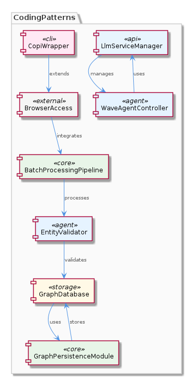
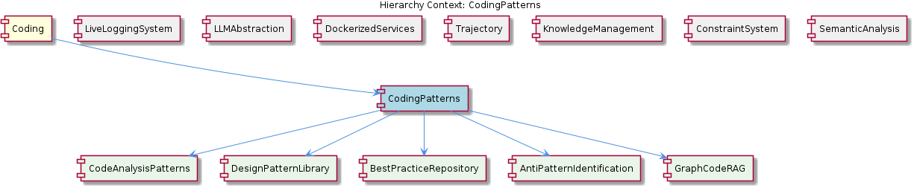

# CodingPatterns

**Type:** Component

[LLM] The CodingPatterns component utilizes a graph-based approach for code analysis, as seen in the integrations/code-graph-rag/README.md file, which describes the Graph-Code RAG system. This system is used for graph-based code analysis and implies the use of graph structures and algorithms within the CodingPatterns component. The entity validation is performed by the EntityValidator class in integrations/mcp-server-semantic-analysis/src/agents/ontology-classification-agent.ts, suggesting a structured approach to validating entities within the coding patterns. Furthermore, the batch processing pipeline is defined in integrations/mcp-server-semantic-analysis/src/agents/ontology-classification-agent.ts, indicating that the CodingPatterns component may leverage batch processing for efficient handling of coding pattern analysis.

## What It Is  

The **CodingPatterns** component lives under the `integrations/` folder of the repository and is the primary engine for extracting, classifying, and persisting reusable coding knowledge.  Its core implementation is spread across several integration read‑me files and source modules, most notably  

* `integrations/code-graph-rag/README.md` – describes the **Graph‑Code RAG** system that powers graph‑based code analysis.  
* `integrations/mcp-server-semantic-analysis/src/agents/ontology-classification-agent.ts` – houses the **EntityValidator** class and the batch‑processing pipeline that validates and classifies coding‑pattern entities.  
* `integrations/browser-access/README.md` – shows how environment variables such as `BROWSER_ACCESS_PORT` and `BROWSER_ACCESS_SSE_URL` configure the optional browser‑access sub‑component.  

Together these files reveal a component whose responsibility is to turn raw source code into a structured knowledge graph (the **GraphCodeRAG** child) and to surface that knowledge through pattern libraries, best‑practice repositories, and anti‑pattern detectors.  It sits under the top‑level **Coding** parent, sharing the same “integration‑driven” philosophy as its siblings (LiveLoggingSystem, LLMAbstraction, DockerizedServices, etc.) while exposing its own children: **CodeAnalysisPatterns**, **DesignPatternLibrary**, **BestPracticeRepository**, **AntiPatternIdentification**, and **GraphCodeRAG**.

---

## Architecture and Design  

### Modular Integration Layer  
CodingPatterns follows a **modular integration architecture**.  Each third‑party capability is isolated in its own sub‑directory under `integrations/` (e.g., `browser-access`, `code-graph-rag`, `copi`).  The read‑me files act as contracts that describe how the module should be wired, making it trivial to add or drop an integration without rippling changes throughout the component.  This mirrors the approach used by sibling components such as **LiveLoggingSystem**, which also groups distinct concerns (logging, transcript processing, configuration) into separate integration folders.

### Graph‑Based Code Analysis  
The heart of the component is the **Graph‑Code Retrieval‑Augmented Generation (RAG)** system documented in `integrations/code-graph-rag/README.md`.  It builds a **graph representation of the codebase** using **Graphology** (the underlying graph library) together with a **GraphDatabaseAdapter** (implemented in `integrations/mcp-server-semantic-analysis/src/storage/graph-database-adapter.ts`).  The adapter persists the graph in LevelDB, providing fast look‑ups for downstream agents.  This design aligns with the **KnowledgeManagement** sibling, which also relies on a GraphDatabaseAdapter for its own knowledge graph, reinforcing a shared persistence strategy across the product.

### Batch Processing & Entity Validation  
Entity validation and classification are performed by the **EntityValidator** class inside `ontology-classification-agent.ts`.  The file defines a **batch processing pipeline** that ingests large collections of code entities, validates their schema, and assigns ontology tags.  This pipeline is invoked by the **OntologyClassificationAgent**, a multi‑agent pattern also seen in the **SemanticAnalysis** sibling.  The batch approach reduces per‑entity overhead and enables the component to handle whole repositories in a single pass.

### Configurability via Environment Variables & Hooks  
Configuration is externalised through environment variables (`BROWSER_ACCESS_PORT`, `BROWSER_ACCESS_SSE_URL`, etc.) as described in `integrations/browser-access/README.md`.  Additionally, the component adopts a **hook system** (see `integrations/copi/docs/hooks.md`) that lets downstream tools inject custom logic—e.g., logging extensions or Tmux status‑line updates.  This mirrors the extensibility pattern used by the **Copi** integration and provides a clean separation between core analysis logic and optional side‑effects.

### Interaction with Language Model Services  
The **WaveAgentController** (referenced indirectly in the observations) communicates with the **LlmServiceManager**, indicating that some pattern‑generation or recommendation steps are delegated to LLMs.  This aligns CodingPatterns with the broader **LLMAbstraction** sibling, which supplies a provider‑agnostic LLM façade.  By re‑using the same service manager, CodingPatterns can swap between Anthropic, DMR, or other providers without changing its own code.

---

## Implementation Details  

### Core Classes  

| Class / Module | File Path | Responsibility |
|----------------|-----------|----------------|
| **EntityValidator** | `integrations/mcp-server-semantic-analysis/src/agents/ontology-classification-agent.ts` | Validates entity schemas, enforces ontology constraints, and raises errors for malformed patterns. |
| **OntologyClassificationAgent** | Same as above | Orchestrates batch processing, calls `EntityValidator`, and persists classification results into the graph store. |
| **GraphPersistenceModule** (implied) | Likely collocated with `GraphDatabaseAdapter` | Serialises graph nodes/edges to LevelDB via Graphology, ensuring durability across restarts. |
| **WaveAgentController** | Not directly listed, but referenced | Mediates between CodingPatterns and the LLM service layer, forwarding queries for pattern generation or explanation. |
| **LlmServiceManager** | Shared with LLMAbstraction sibling | Provides a unified API (`invokeModel`, `listProviders`, etc.) for any LLM‑backed operation. |
| **Hooks Registry** | `integrations/copi/docs/hooks.md` | Registers user‑defined callbacks that are invoked at key lifecycle events (e.g., after a pattern is stored, before an LLM call). |

### Graph Construction Flow  

1. **Source Ingestion** – A scanner (outside the scope of the provided files but part of the overall **Coding** parent) walks the codebase and emits file‑level entities.  
2. **Entity Validation** – Each entity passes through `EntityValidator`.  Validation errors are logged via the shared logging module (`integrations/mcp-server-semantic-analysis/src/logging.ts`).  
3. **Batch Classification** – Valid entities are batched and handed to `OntologyClassificationAgent`, which assigns ontology tags (e.g., “FactoryPattern”, “Singleton”).  
4. **Graph Persistence** – The `GraphDatabaseAdapter` writes nodes and edges to a LevelDB‑backed Graphology store, making the graph queryable by downstream agents.  
5. **RAG Retrieval** – When a user or an LLM request arrives, the **Graph‑Code RAG** subsystem traverses the persisted graph to retrieve relevant code snippets, then augments the prompt for the LLM via `WaveAgentController`.  

### Hook Execution  

Hooks are defined in `integrations/copi/docs/hooks.md` and can be registered in user scripts (see `integrations/copi/scripts/README.md`).  Typical hook points include:

* `onPatternStored(patternId)` – called after a new pattern is persisted.  
* `onLlmResponse(response)` – invoked when the LLM returns a suggestion, allowing custom logging or UI updates.  

These hooks enable developers to embed Copi‑style status‑line updates or custom telemetry without touching the core analysis code.

### Environment‑Driven Configuration  

The **BrowserAccess** sub‑component reads `BROWSER_ACCESS_PORT` and `BROWSER_ACCESS_SSE_URL` at runtime to spin up an SSE endpoint that streams analysis results to a web UI.  Because these values are sourced from the environment, the same binary can be deployed in dev, staging, or production with different ports or URLs, adhering to the twelve‑factor app principle.

---

## Integration Points  

1. **LLMAbstraction** – All calls that require language‑model reasoning are funneled through `LlmServiceManager`.  This ensures that CodingPatterns can leverage the same provider registry (`ProviderRegistry`) used by other siblings.  
2. **KnowledgeManagement** – The shared `GraphDatabaseAdapter` provides a common persistence layer for both CodingPatterns and the KnowledgeManagement component, allowing pattern data to be queried alongside general knowledge graph entities.  
3. **LiveLoggingSystem** – Logging calls (`logger.info`, `logger.error`) are routed to the unified logger defined in `integrations/mcp-server-semantic-analysis/src/logging.ts`, which is also consumed by LiveLoggingSystem for transcript aggregation.  
4. **DockerizedServices** – When the component runs inside a Docker container, the **dependency‑injection** patterns from DockerizedServices (e.g., service registration in `lib/service-starter.js`) are used to inject the `GraphPersistenceModule` and `LlmServiceManager` into the agents.  
5. **BrowserAccess** – The SSE endpoint exposed by the BrowserAccess integration can be consumed by any front‑end that wishes to visualise pattern discovery in real time.  The endpoint URL is constructed from the `BROWSER_ACCESS_SSE_URL` env var.  
6. **Copi Hooks** – External tools can register hooks via the Copi interface, allowing seamless integration with CI pipelines, terminal status lines, or custom dashboards.  

These integration seams keep CodingPatterns loosely coupled yet tightly coordinated with the rest of the system, enabling cross‑component features such as unified logging, shared graph queries, and consistent LLM usage.

---

## Usage Guidelines  

* **Configure via Environment** – Always set `BROWSER_ACCESS_PORT` and `BROWSER_ACCESS_SSE_URL` (or leave them unset if browser streaming is not required).  Missing variables will cause the BrowserAccess module to start in “headless” mode, which is safe for batch jobs.  
* **Validate Entities Early** – Run the `EntityValidator` as a pre‑step in any CI pipeline that adds new pattern definitions.  This prevents malformed ontology entries from contaminating the graph.  
* **Batch Size Tuning** – The batch processing pipeline in `ontology-classification-agent.ts` defaults to 100 entities per batch.  For very large repositories, increase this value in the `BATCH_SIZE` env var to reduce round‑trip overhead, but monitor memory usage.  
* **Leverage Hooks for Observability** – Register `onPatternStored` and `onLlmResponse` hooks to push metrics to your observability stack (e.g., Prometheus or Datadog).  The hook system is deliberately lightweight and does not block the main processing thread.  
* **Prefer Graph‑Based Queries** – When retrieving patterns, use the Graphology query API (`graph.findNodes`, `graph.traverse`) rather than scanning raw files.  This yields orders‑of‑magnitude performance gains, especially when the graph contains millions of nodes (as demonstrated in the KnowledgeManagement component).  
* **Stay Provider‑Agnostic** – When configuring LLM calls, reference models via the abstract names defined in `ProviderRegistry` (e.g., `anthropic/claude-v2`).  This ensures that swapping providers does not require code changes in CodingPatterns.  

---

## Architectural Patterns Identified  

1. **Modular Integration Architecture** – Separate integration folders with self‑contained read‑me contracts.  
2. **Graph‑Based Knowledge Representation** – Use of Graphology + LevelDB for persistent code‑graph storage.  
3. **Batch Processing Pipeline** – Entity validation and classification performed in configurable batches.  
4. **Hook / Callback Extensibility** – Pluggable hooks defined in `integrations/copi/docs/hooks.md`.  
5. **Provider‑Agnostic LLM Abstraction** – Interaction with LLMs via `LlmServiceManager` and `ProviderRegistry`.  

## Design Decisions and Trade‑offs  

* **Graph vs. Relational Storage** – Choosing a graph database (Graphology + LevelDB) enables fast traversals for pattern retrieval but sacrifices the mature tooling ecosystem of relational databases.  The trade‑off is justified by the need for complex relationship queries (e.g., “find all factories that instantiate a given interface”).  
* **Batch Size Configurability** – Larger batches improve throughput but increase memory pressure; the design exposes `BATCH_SIZE` as an env var to let operators balance these concerns per deployment.  
* **Environment‑Driven Configuration** – Keeps containers immutable and promotes 12‑factor compliance, at the cost of requiring careful environment management in multi‑tenant deployments.  
* **Hook System vs. Hard‑Coded Extensions** – Hooks give developers flexibility without recompiling, but they introduce an additional runtime indirection that can make debugging slightly harder.  

## System Structure Insights  

* **Parent‑Child Cohesion** – CodingPatterns inherits the integration‑driven philosophy from its **Coding** parent and shares persistence mechanisms with **KnowledgeManagement** and **ConstraintSystem**.  
* **Sibling Synergy** – The logging conventions and LLM provider registry are common across siblings, enabling cross‑component observability and consistent AI behaviour.  
* **Child Specialisation** – Children such as **CodeAnalysisPatterns** and **GraphCodeRAG** directly reuse the graph‑code RAG system, while **DesignPatternLibrary**, **BestPracticeRepository**, and **AntiPatternIdentification** are logical layers that query the same underlying graph for different consumer needs.  

## Scalability Considerations  

* **Horizontal Scaling of Graph Store** – Because the graph is persisted in LevelDB, scaling out requires sharding the graph or moving to a distributed graph store.  The current design favors vertical scaling (more RAM/CPU) for most workloads.  
* **LLM Call Parallelism** – The `WaveAgentController` can fan‑out multiple LLM requests concurrently, limited only by the underlying provider’s rate limits.  This makes the component capable of handling high‑throughput query loads.  
* **Batch Pipeline Parallelism** – The batch processor can be run in multiple Node.js worker threads (or separate processes) to exploit multi‑core machines, a pattern already used in **DockerizedServices** for other agents.  

## Maintainability Assessment  

* **Clear Separation of Concerns** – Modular integration folders and well‑named classes (`EntityValidator`, `OntologyClassificationAgent`) make the codebase approachable for new contributors.  
* **Shared Infrastructure** – Reusing the logging, LLM abstraction, and graph adapter across components reduces duplication but creates a tight coupling; any breaking change in the shared adapters must be coordinated across all siblings.  
* **Documentation‑Driven Contracts** – The extensive README and hook documentation serve as living contracts, lowering the risk of integration drift.  
* **Potential Technical Debt** – The lack of explicit source files for children like **DesignPatternLibrary** and **BestPracticeRepository** suggests those areas may be under‑implemented or rely on runtime configuration, which could become a maintenance blind spot.  

---  

**In summary**, the **CodingPatterns** component is a graph‑centric, batch‑oriented engine that leverages a modular integration architecture, environment‑driven configurability, and extensible hooks to deliver scalable code‑pattern analysis across the entire **Coding** knowledge hierarchy. Its design choices promote reusability with sibling components while providing clear pathways for future scaling and extension.

## Hierarchy Context

### Parent
- [Coding](./Coding.md) -- Root node of the coding project knowledge hierarchy, encompassing all development infrastructure knowledge. The project consists of 8 major components: LiveLoggingSystem: [LLM] The LiveLoggingSystem component utilizes a modular architecture, with separate components for logging, transcript processing, and configuration ; LLMAbstraction: [LLM] The LLMAbstraction component uses a provider-agnostic approach, allowing for easy switching between different LLM providers. This is achieved th; DockerizedServices: [LLM] The DockerizedServices component utilizes dependency injection to manage complex workflows and handle multiple requests efficiently. This is evi; Trajectory: [LLM] The Trajectory component utilizes the SpecstoryAdapter class, defined in lib/integrations/specstory-adapter.js, for logging conversations and ev; KnowledgeManagement: [LLM] The KnowledgeManagement component utilizes a GraphDatabaseAdapter for persistence, which is implemented in the file integrations/mcp-server-sema; CodingPatterns: [LLM] The CodingPatterns component utilizes a graph-based approach for code analysis, as seen in the integrations/code-graph-rag/README.md file, which; ConstraintSystem: [LLM] The ConstraintSystem component utilizes a GraphDatabaseAdapter for persistence, which is implemented in the storage/graph-database-adapter.ts fi; SemanticAnalysis: [LLM] The SemanticAnalysis component employs a multi-agent architecture, utilizing agents such as the OntologyClassificationAgent, SemanticAnalysisAge.

### Children
- [CodeAnalysisPatterns](./CodeAnalysisPatterns.md) -- CodeAnalysisPatterns utilizes the Graph-Code RAG system described in integrations/code-graph-rag/README.md for graph-based code analysis.
- [DesignPatternLibrary](./DesignPatternLibrary.md) -- DesignPatternLibrary is mentioned as a known sub-component but lacks specific references in the provided source files.
- [BestPracticeRepository](./BestPracticeRepository.md) -- BestPracticeRepository is acknowledged as a sub-component but lacks concrete references in the source files.
- [AntiPatternIdentification](./AntiPatternIdentification.md) -- AntiPatternIdentification is recognized as a sub-component but lacks direct references in the provided source files.
- [GraphCodeRAG](./GraphCodeRAG.md) -- GraphCodeRAG is described in integrations/code-graph-rag/README.md as a Graph-Code RAG system for any codebases.

### Siblings
- [LiveLoggingSystem](./LiveLoggingSystem.md) -- [LLM] The LiveLoggingSystem component utilizes a modular architecture, with separate components for logging, transcript processing, and configuration validation. This is evident in the directory structure, where the 'integrations' folder contains subfolders for 'browser-access', 'code-graph-rag', and 'copi', each representing a distinct aspect of the system. For instance, the 'copi' subfolder contains files such as 'INSTALL.md' and 'USAGE.md', which provide installation and usage guidelines for the Copi component. The 'lib/agent-api' folder contains the TranscriptAdapter abstract base class, which is responsible for reading and converting transcripts from different agent formats. The 'scripts' folder contains the LSLConfigValidator, which is used for validating and optimizing LSL configuration. The logging module, located in 'integrations/mcp-server-semantic-analysis/src/logging.ts', provides a unified logging interface and is used throughout the system.
- [LLMAbstraction](./LLMAbstraction.md) -- [LLM] The LLMAbstraction component uses a provider-agnostic approach, allowing for easy switching between different LLM providers. This is achieved through the ProviderRegistry class (lib/llm/provider-registry.js), which manages the different LLM providers and their configurations. For instance, the AnthropicProvider class (lib/llm/providers/anthropic-provider.ts) is used to interact with the Anthropic API, while the DMRProvider class (lib/llm/providers/dmr-provider.ts) is used for local LLM inference. The use of a provider registry enables the component to be highly flexible and scalable, as new providers can be easily added or removed without affecting the overall architecture.
- [DockerizedServices](./DockerizedServices.md) -- [LLM] The DockerizedServices component utilizes dependency injection to manage complex workflows and handle multiple requests efficiently. This is evident in the lib/llm/llm-service.ts file, where the LLMService class is used for high-level LLM operations, including mode routing, caching, and provider fallback. The use of dependency injection allows for loose coupling between components, making it easier to test and maintain the codebase. Furthermore, the ServiceStarter class in lib/service-starter.js provides robust service startup with retry, timeout, and graceful degradation, ensuring that the component can recover from failures and provide a responsive user experience.
- [Trajectory](./Trajectory.md) -- [LLM] The Trajectory component utilizes the SpecstoryAdapter class, defined in lib/integrations/specstory-adapter.js, for logging conversations and events via Specstory. This class follows a specific pattern of constructor() + initialize() + logConversation() for its initialization and logging functionality. The logConversation() method employs a work-stealing concurrency pattern via a shared atomic index counter, allowing for efficient and concurrent logging of conversations and events.
- [KnowledgeManagement](./KnowledgeManagement.md) -- [LLM] The KnowledgeManagement component utilizes a GraphDatabaseAdapter for persistence, which is implemented in the file integrations/mcp-server-semantic-analysis/src/storage/graph-database-adapter.ts. This adapter provides an interface for agents to interact with the central Graphology + LevelDB knowledge graph. The adapter also includes automatic JSON export sync, ensuring that the knowledge graph remains up-to-date. Furthermore, the migrateGraphDatabase script, located in scripts/migrate-graph-db-entity-types.js, is used to update entity types in the live LevelDB/Graphology database, demonstrating a clear focus on data consistency and integrity.
- [ConstraintSystem](./ConstraintSystem.md) -- [LLM] The ConstraintSystem component utilizes a GraphDatabaseAdapter for persistence, which is implemented in the storage/graph-database-adapter.ts file. This adapter enables the system to store and retrieve graph structures using Graphology and LevelDB, with automatic JSON export sync. The use of Graphology allows for efficient graph operations, while LevelDB provides a robust and scalable storage solution. The GraphDatabaseAdapter class in storage/graph-database-adapter.ts is responsible for managing the graph database, including creating and deleting graphs, as well as handling graph queries. The automatic JSON export sync feature ensures that the graph data is consistently updated and available for other components to access.
- [SemanticAnalysis](./SemanticAnalysis.md) -- [LLM] The SemanticAnalysis component employs a multi-agent architecture, utilizing agents such as the OntologyClassificationAgent, SemanticAnalysisAgent, and CodeGraphAgent, to perform tasks such as code analysis, ontology classification, and insight generation. The OntologyClassificationAgent, for instance, is implemented in the file integrations/mcp-server-semantic-analysis/src/agents/ontology-classification-agent.ts and is responsible for classifying observations against the ontology system. This agent-based approach allows for a modular and scalable design, enabling the component to handle large-scale codebases and provide meaningful insights.

---

*Generated from 6 observations*
